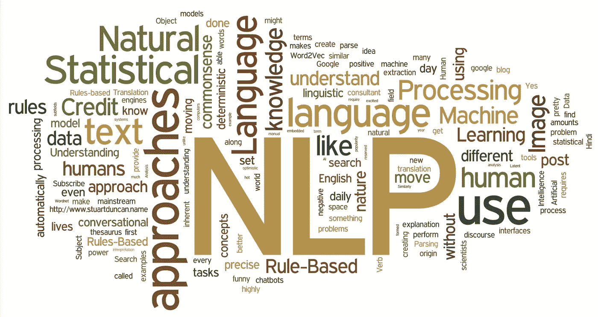

# 看一看 NLP 的深度强化学习

> 原文：<https://medium.com/analytics-vidhya/take-a-peek-at-deep-reinforcement-learning-for-nlp-a8e37fbd7640?source=collection_archive---------2----------------------->

本博客将致力于发展对深度神经网络架构的基本理解，该网络旨在处理以自然语言为特征的状态和动作空间。本博客的实验结果被微软关于 [*用自然语言动作空间*](https://arxiv.org/pdf/1511.04636v5.pdf) *进行深度强化学习的研究工作参考。*

# 什么是强化学习？

因此，一如既往，我的这个博客也将从头开始，我们将从理解什么是强化学习开始。

强化学习是*机器学习*的一个领域，因此也是*人工智能*的一个分支。它允许机器和软件代理自动确定特定上下文中的理想行为，以最大化其性能。简单的奖励反馈是代理学习其行为所必需的，这就是所谓的强化信号。

这只是人类如何开始学习事物，我们如何通过知道什么是对的和什么是错的而进化。以一个刚出生的婴儿为例，他不知道发生了什么？怎么办？随着他的成长，他的父母阻止他做那些不应该做的事情，当他在沙发上撒尿时，他会收到母亲的负面反馈。当他问候客人时，他得到了积极的反馈。这就是强化学习！！

孩子是代理人，他的父母是环境。代理执行一项任务，并获得相应的奖励(无论是负面的还是正面的)。这个想法是训练机器像人类一样思考和行动。

强化学习允许机器或软件代理基于来自环境的反馈来学习其行为。这种行为可以一劳永逸地学会，或者随着时间的推移不断适应。如果仔细地对问题建模，一些强化学习算法可以收敛到全局最优；这是最大化回报的理想行为。

## 强化学习模型:

*   环境状态集:S
*   动作集:A
*   状态之间的转换规则
*   决定状态转换的直接回报的规则
*   描述代理观察内容的规则

## q-学习:

*   它用于学习强化学习的策略。
*   策略:在给定当前状态的情况下，代理选择操作时应遵循的规则。
*   Q-Learning:为决策过程找到最佳策略。
*   方法:学习一个行动值函数，也称为 Q 函数，它计算在训练收敛后采取行动的预期效用。
*   Q-function[Q(s，a)]:返回状态 s 下动作 a 的 Q 值。

## q 值:

在统计假设检验，特别是多重假设检验中，***q*-值**提供了一种控制肯定错误发现率(pFDR)的手段。正如 *p* 值给出了通过拒绝具有等于或小于 *p* 值的任何结果的零假设而获得的预期假阳性率一样， *q* 值给出了通过拒绝具有等于或小于 *q* 值的任何结果的零假设而获得的预期 pFDR。

我敢肯定，你们中的一些人听说过“AlphaGo”游戏，或者肯定听说过一些机器人击败了世界冠军。所有的荣誉都归功于深度 Q 网络。

现在，需要理解的是，当训练学习者玩像 AlphaGo 和象棋这样的游戏时，智能体的动作空间很小，但状态空间很大。例如，在国际象棋游戏中，状态空间是整个 20X20 棋盘，但行动空间很小，就像棋子只能在 1-2 个方向上移动。深度 Q 网络已经被证明是非常有效的。

但是如果我们讨论语言理解的强化学习呢？

# 语言理解的强化学习

## 文本理解的顺序决策问题；

*   例如，对话、任务完成、基于文本的游戏…
*   代理在时间 t 观察作为文本串的状态，例如 state-text s(t)。
*   代理也知道一组可能的动作，每一个都被描述为一个字符串文本，例如，动作文本
*   代理试图理解“状态文本”和所有可能的“行动文本”，并采取正确的行动——正确意味着最大化长期回报。
*   然后，环境状态转换到一个新的状态，代理人立即收到奖励。

## NLP 的 RL 中的无界动作空间；

不仅状态空间很大，动作空间也很大。动作的特征是无限的自然语言描述。例如，如果对模型说“嘿！你过得怎么样？我只是在等神盾局的数据流，但是没电了。好吧，我的这个输入文本是模型的状态空间(相当重)，动作空间是每个可用的文本组合(或者无穷大)。这个问题对于这样一个巨大的行动空间来说，仍然是深 Q 网络中的问题。于是提出了深度强化关联网络。

## 深度强化关联网络(DRRN):

DRRN 的思想是将状态和动作投射到一个连续的空间(作为向量)。q 函数是状态向量和动作向量的相关函数。

图 2 说明了利用内积交互作用函数的学习(DRRN 的应用)。我们使用主成分分析(PCA)将 100 维的最后隐藏层表示(在内积之前)投影到 2-D 平面。向量嵌入以小值开始，并且在 600 集的经验重放训练之后，嵌入非常接近收敛嵌入(4000 集)。最优动作(动作 1)的嵌入向量收敛到与状态嵌入向量的正内积，而动作 2 收敛到负内积。

上图显示了不同模型的学习曲线，其中 DQNs 和 DRRN 中的隐藏层的维数都设置为 100。经过大约 4000 集的经验回放训练后，所有的方法都趋同了。DRRN 比其他三个基线收敛得更快，并获得更高的平均回报。我们假设这是因为 DRRN 架构更善于捕捉状态文本和动作文本之间的相关性。“拯救约翰”的较快收敛可能是由于较小的观测空间和/或其状态转移的确定性。

## 我们讨论的内容:

*   我们讨论了强化学习以及深度 Q 网络(DQN)如何在小行动空间任务(AlphaGo)中表现得非常好。
*   用于 NLP 的深度强化学习(例如基于文本的游戏)为什么以及如何不同于一个动作空间很小的常规游戏。
*   讨论了 NLP 强化学习中的无界动作空间，以及深度强化关联网络(DRRN)如何在两个基于文本的游戏(拯救约翰和死亡机器)上更快地收敛。