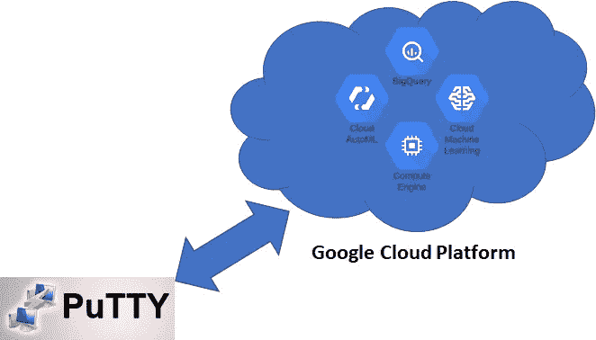
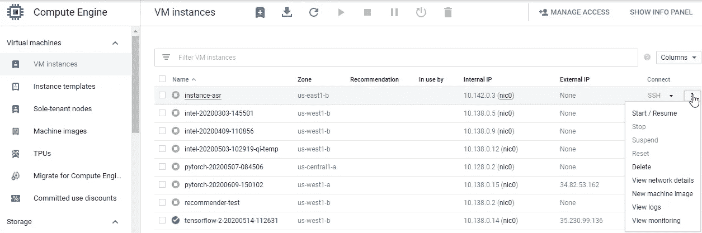
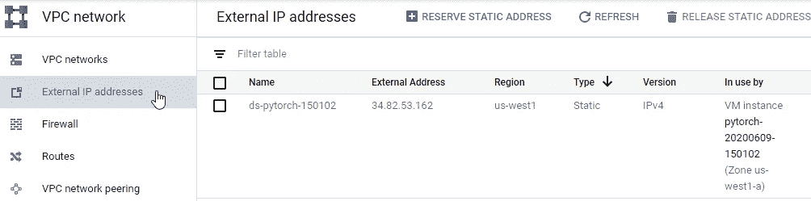
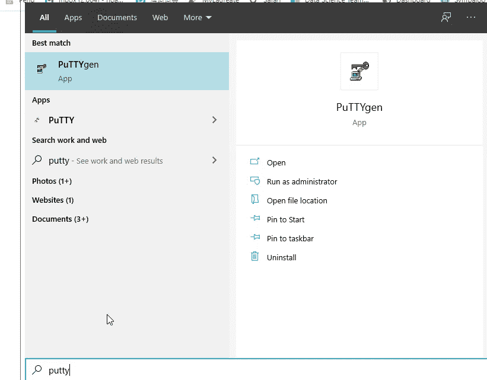
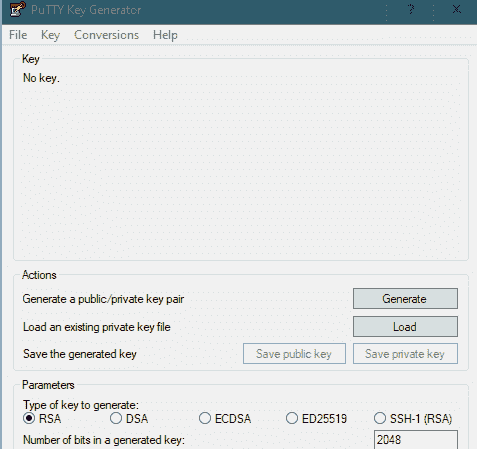
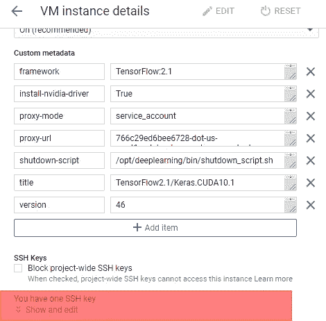
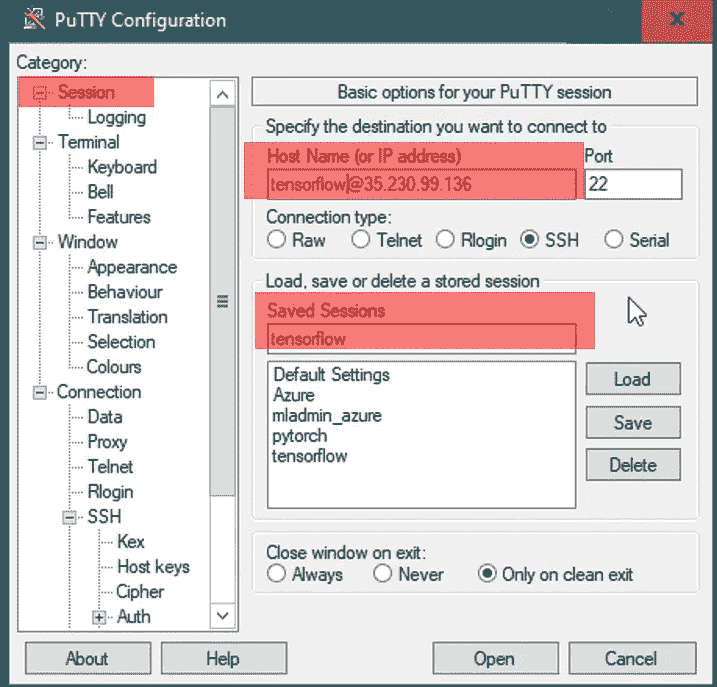
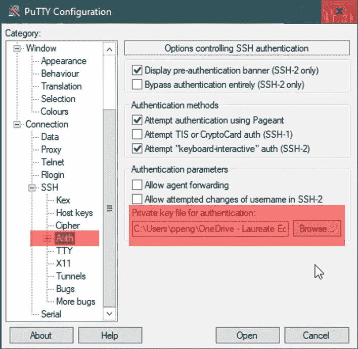
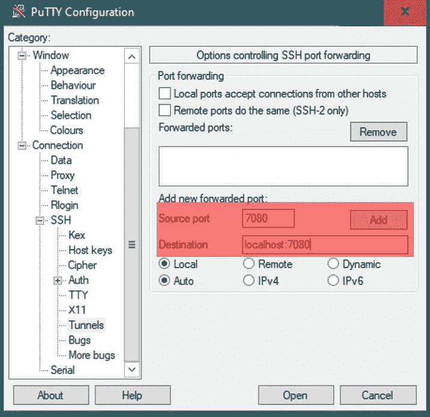
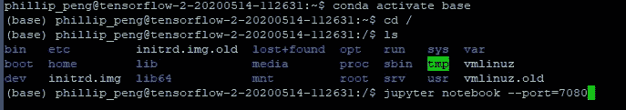

# 通过 Putty 完全控制 GCP 上的 AI 笔记本实例

> 原文：<https://medium.com/analytics-vidhya/take-full-control-of-ai-notebook-instance-on-gcp-via-putty-814ae0e11873?source=collection_archive---------25----------------------->

通过 Putty 访问云计算的 GCP 虚拟机实例



GCP 上的 AI 笔记本实例运行在 VM 实例上。如果我们可以通过 Putty 访问 VM 实例，那么我们就可以通过 Linux 命令完全控制 VM 实例。在这篇文章中，我将介绍如何通过 Putty 在 GCP 上设置对 AI 笔记本实例的访问。

**1。启动虚拟机实例。**

启动人工智能笔记本实例的一种方法是使用 GCP 云控制台。AI 笔记本实例运行在同名的 VM 实例上。另一种方法是使用“gcloud SDK”，我从“Windows 终端”管理它。(我的另一篇文章是关于为什么你应该[使用 windows 终端’](/analytics-vidhya/windows-terminal-a-must-have-productivity-tool-for-windows-programmers-9270d9dc4bfb))。启动虚拟机实例的命令是:

```
gcloud compute instances start INSTANCE-NAME
```

**2。向 GCP 上的虚拟机实例添加一个外部 IP 地址。**

从 GCP 云控制台中的导航菜单，您可以导航至计算引擎(GCE)列表，如下所示:



单击所选 GCE 虚拟机实例最右侧的三点图标，选择“查看网络详细信息”以导航至以下 VPC 网络配置屏幕:



我们将选择“外部 IP 地址”选项卡。有两种可能的类型:静态的和短暂的。对于虚拟机实例，静态外部 IP 地址保持不变，直到它们被删除。每次启动实例时，临时外部 IP 地址都会发生变化。我们将外部 IP 地址设置为“静态”,因为我们将来需要使用相同的信息登录。

**3。将 ssh 密钥添加到 GCP 上的虚拟机实例。**

首先，我们使用 PuTTYgen 生成 ssh 密钥对(公钥和私钥)。



“密钥注释”部分将是用户名，“密钥密码”将作为以后登录的密码。我们将保存公钥和私钥。公钥文件名遵循以“ssh-rsa”开头，以作为用户名的密钥注释结尾的格式。

生成 ssh 密钥对后，我们可以转到控制台中的虚拟机实例详细信息，单击“编辑”按钮，并向下滚动到“SSH 密钥”部分，如下图所示:



(GCE 虚拟机实例的 SSH 密钥)

展开“显示和编辑”选项，将 ssh 公钥添加到虚拟机实例中。

**4。配置 Putty 以连接到 GCP 上的虚拟机实例**

启动程序“PuTTY ”,在面板左侧选择会话类别，如下所示:



在主机名(或 IP 地址)框中，我们使用在步骤 2 中添加到虚拟机实例的静态外部 IP 地址。为了避免每次都键入用户名，我们在 IP 地址前添加了“用户名@”。我们还保存了这些信息，这样我们就可以稍后加载存储的会话，以省去键入配置设置的工作。

接下来，我们转到类别/Connection/SSH/Auth 来加载私钥文件。



最后，我们在“Category/Connection/SSH/Auth/Tunnels”中指定用于 AI 笔记本实例的端口我们知道，本地机器上的 Jupyter 笔记本将使用端口 8888。为了避免端口冲突，我们对 PuTTY 远程连接使用 port=7080(非 8888 端口)。点击“添加”按钮，端口=7080 将显示在“转发端口”框中。我们现在可以返回到会话部分并保存更新的设置。单击“打开”按钮后，我们将导航至 PuTTY 登录屏幕。



**5。从本地主机启动 AI 笔记本。**

一旦我们通过 PuTTY 登录到 VM 实例，我们就可以激活 AI notebook 运行时环境并启动 Jupyter Notebook 或 Jupyterlab。

```
conda activate base
cd /
jupyter notebook --port=7080
```



基础环境是 AI 笔记本实例使用的环境。除了基本环境之外，我们还可以根据需要创建新的环境。命令行“cd /”将我们导航到根目录。当我们开始 Jupyter 笔记本时，记得添加部分“- -port=7080”。

现在，让我们打开浏览器，键入地址“localhost:7080”开始使用 Jupyter 笔记本，或键入“localhost:7080/lab”开始使用 JupyterLab。