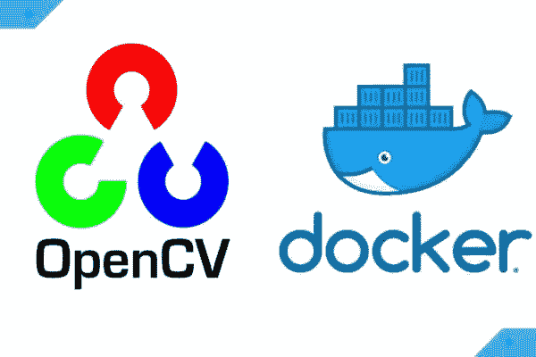

# 在 Docker 容器中拍摄图像

> 原文：<https://medium.com/analytics-vidhya/taking-images-in-docker-container-54ca84ac0d1e?source=collection_archive---------22----------------------->

你有没有尝试过用你的相机在笔记本电脑上点击照片，当然，你有过，但这里有一个转折，我们将在一个 Docker 容器中点击照片，你们中的许多人可能想知道如何才能做到这一点？好吧，让我从这个有趣的事情开始。

首先，以下是您的笔记本电脑应该具备的一些先决条件:

*   Redhat Linux/ CentOS Linux
*   码头工人
*   Python3
*   你应该有 Docker 和 Linux 命令行的基本知识。

还有一些 python 库，我们将在后面讨论。

所以，你激动吗！！我希望你是。让我们开始吧:

在本教程中，我将使用 RHEL (Redhat Enterprise Linux)，这是一个 Linux 发行版。因此，要在 RHEL 系统中使用 docker，我们首先必须通过以下命令安装它:

# ✔第一步:

解释:

1.  第一行用来安装 Docker CE(社区版)。
2.  之后，我们必须启动服务来使用 docker 容器。

# ✔Step 2:

现在，我们进入这项任务的主要部分，即在 RHEL 推出 docker 容器。

Woah，那可是一大行，别怕，我给你分解一下每个关键词:

*   首先，我使用了用于启动新容器的**“docker run”**命令。
*   接下来，我使用了选项 **-i，-t，-p，-v，-特权，-e，-名称:**

`--interactive or -i`

>保持 STDIN 打开，即使没有连接。

`-t or --tty`

>来分配一个伪 TTY。

`--publish , -p`

>向主机发布容器的端口。

*   **"55555:22"** :将容器中的 TCP 端口 22 映射到 Docker 主机上的端口 55555。

`--volume or -v`

>绑定安装一个卷。

*   **"/dev/video 0:/dev/video 0 "**:这是您笔记本电脑的网络摄像头名称，以便您可以访问它。并且，在冒号之后，这将被保存在 docker 容器中。
*   **"/root/Desktop/rhel 7 _ 5 _ extras:/extras "**:导入该图像是因为它有所需的可用工具，在本例中是 Python3，并且它将作为 extras 保存在 docker 容器中。
*   **"/root/Desktop/rhel 7 _ extra _ new _ rpm:/new "**:同样，此映像也包含执行此任务所需的一些工具。
*   **"/root/Desktop/python _ lib:/Python "**:包含了将要进一步安装在 docker 容器中使用的 Python 库。
*   **"/run/media/root/RHEL-7.5 \ server . x86 _ 64:/DVD "**:这是包含所有软件的 RHEL DVD。
*   "/tmp/. X11-UNIX:/tmp/. X11-UNIX:ro ":X server 是用于位图显示的窗口系统，常见于 Linux 操作系统。为了简单地理解这一点，您可以在 docker 容器中使用 GUI。

`--privileged`

>授予此容器扩展权限。

`--env , -e`

>设置环境变量。

*   **" DISPLAY = $ DISPLAY "**:X window 系统中的魔字是 DISPLAY。显示器由(简化的)以下部分组成:

1.  键盘
2.  一只老鼠
3.  和一个屏幕。

显示器由一个服务器程序管理，称为 X 服务器。服务器为连接到它的其他程序提供显示功能。远程服务器通过 DISPLAY 环境变量的定义知道它必须将 X 网络流量重定向到哪里，该变量通常指向位于本地计算机上的 X 显示服务器。

`--name`

给容器指定一个名称。

*   “camera1”:它是 docker 容器的名称。

最后，还有**“centos:latest”**，这是我用来部署 docker 容器的图像。

# ✔第三步:

> /**etc**/**ssh**/**sshd _ config**文件是 **OpenSSH** 的系统级配置文件，它允许您设置修改守护进程操作的选项。该文件包含关键字-值对，每行一个，关键字不区分大小写。

要运行我们用过的图形应用程序，**X11 转发是。**

# ✔第四步:

> D-Bus 是一种软件总线、进程间通信和远程过程调用机制，允许在同一台机器上同时运行的多个进程之间进行通信。
> 
> /**etc**/**machine**-**id**文件包含本地系统的唯一 **machine ID** ，该 ID 是在安装或引导时设置的。

# ✔第五步:

设置环境标志以强制 Qt 正确显示。

> Qt 是一个免费的开源小部件工具包，用于创建图形用户界面以及运行在各种软件和硬件平台(如 Linux、Windows)上的跨平台应用程序。

# ✔第六步:

它用于创建存储库，以便我们可以在以后安装所需的软件。

# ✔第七步:

# ✔第八步:

# ✔第九步:

# ✔第十步:

以根用户身份运行 GUI 应用程序。

# ✔第十一步:

最后，编写一个程序来点击 docker 容器中的照片。

# ✔第十二步:

> 第 1 行用于使 python 文件可执行。
> 
> 第 2 行用于执行代码。

那么，这就是任务的结束，我希望你在这中学到了很多。

快乐学习！😊✌