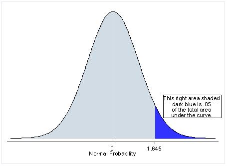
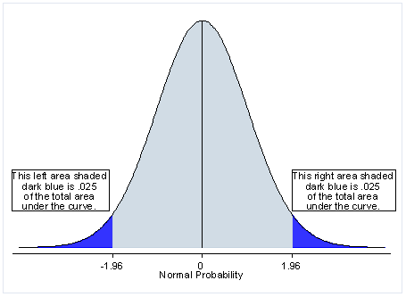

# 用 SciPy 进行 T 测试

> 原文：<https://medium.com/analytics-vidhya/taking-on-t-tests-with-scipy-b05eaaa0ee52?source=collection_archive---------23----------------------->

Ah T 检验，确定统计显著性的许多方法之一。但是它们到底是什么呢？一切到底是如何运作的？

T 检验，也称为学生的 T 检验，是一种简单的方法来比较两组之间的平均值，以评估它们是否彼此不同。当人们不知道真实的总体标准偏差，或者样本量很小时，经常使用它们。这都是假设数据是[正态分布](https://en.wikipedia.org/wiki/Normal_distribution)来完成的。

有两种 T 检验，一种是单尾 T 检验，另一种是双尾 T 检验。

一个**单尾** T 检验用于确定一个组的平均值是比另一个组高得多，还是低得多，这取决于你的选择。*只有一个被选中参加测试。*

另一方面，**双尾** T 检验用于查看一组的平均值是高于还是低于另一组。



单尾(左)和双尾(右)T 检验。来源:[加州大学洛杉矶分校:统计咨询集团](https://stats.idre.ucla.edu/other/mult-pkg/faq/general/faq-what-are-the-differences-between-one-tailed-and-two-tailed-tests/)

一组比另一组高或低。


[一小杯咖啡](https://commons.wikimedia.org/wiki/File:A_small_cup_of_coffee.JPG)

首先，您必须对您的数据有一个基本的了解。一旦你这样做了，你就知道该问什么问题，然后确定你的无效假设和替代假设，分别是𝐻0 和𝐻1。

例如，一家公司正在尝试使用一种酿造咖啡的新方法，这种方法可以降低酸度。这是什么样的测试？

没错，一个单尾 T 检验！因此，假设新咖啡或𝜇(发音为“mew”)的总体平均值为 4.4 ph。我们将使用样本平均值 x̄ (x-bar)来估计这个值。

首先，我们要设定𝐻0 和𝐻1.对于我们的无效假设，我们将假设**酸度没有差异**，对于替代假设，我们将声明**新咖啡的酸度将低于标准咖啡。**

用更数学的术语来说:

𝐻0:𝜇=4.4
𝐻1:𝜇 < 4.4

接下来，我们需要确定阿尔法值，𝑎，以便我们可以将其与产生的 p 值进行比较，并确定我们的结果是否具有统计学意义。

等等，那些是什么鬼东西？！

**alpha** 值是当实验返回假阳性(我们错误地拒绝了零假设)或假阴性(我们错误地未能拒绝零假设)的概率时，我们愿意冒多大的风险。𝑎a 越低，假阳性的机会就越低。然而，如果阿尔法值太低，那么你有得到假阴性的风险！通常，𝑎设定为 0.05 或 0.01，5%或 1%的风险。

*简化为*,**p 值**是看到样本统计量至少与假设𝐻0 为真时观察到的统计量一样极端的概率。

低 P 值表明您从实验中获得的结果不太可能是偶然发生的，而相反，高 P 值表明您的结果很可能是由于自然变化而发生的。

对于咖啡实验，我们将𝑎设置为 0.05。

现在我们可以开始实验了！或者更准确地说，在这种情况下，获取示例实验数据并检查它。我们的咖啡公司用这种新方法只做了 100 杯咖啡，所以这是一个很好的样本量！

请注意，随着样本数𝑛n 变大，最终的平均值分布将达到更明显的钟形曲线形状！无论初始样本或总体分布实际上是什么，这都适用。这叫做中心极限定理，你可以在这里[和这里](https://www.simplypsychology.org/central-limit-theorem.html)阅读更多！

```
#Generating our coffee experiment using NumPy. In this example, the true population mean is 4.8 but we don't know that yet!import numpy as np
np.random.seed(42)
sample = np.random.normal(size = 100, loc = 4.8).round(decimals=2)
```

现在…这到底告诉了我们什么？从平均值来看，我们可以看到，平均来说，这种新咖啡的 PH 值为 4.7，这意味着到目前为止，x̄的平均值高于𝜇.但是我们不能就此止步，是时候继续计算 P 值了！

我们*可以*使用一堆不同的数学公式来计算出 P 值是多少，然而，我们并不需要这样做！科学图书馆有我们需要的一切！

请记住，这些是我们将使用的当前已知值:

𝑎=0.05
𝜇=4.4
x̄=4.7

利用这一点，我们可以使用方便的 stats ttest 特性来查找 P 值。由于我们正在测试一个**单一过程**如何改变咖啡的酸度，我们将使用 SciPy 的 [1 样本 T-Test 函数](https://docs.scipy.org/doc/scipy/reference/generated/scipy.stats.ttest_1samp.html)。由于我们使用的是 SciPy 的`ttest_1samp`函数，它将为我们计算自由度。否则，我们将需要手工操作，此处显示并解释了[和](https://www.statisticshowto.com/probability-and-statistics/hypothesis-testing/degrees-of-freedom/)。

因为这个函数假设我们使用的是双尾 T 检验，所以我们必须将结果除以 2

```
from scipy import statsa = 0.05 # Alpha Value
mu = 4.4 # Population Meant_stat, p_value = stats.ttest_1samp(sample, mu)
print(p_value/2)#returns 0.0007570321424783612
```

我们得出的 P 值是 0.00076！由此，我们可以看到，我们得到的 p 值绝对小于𝑎，这意味着我们可以拒绝我们的零假设！然而，我们没有足够的证据证明新咖啡的酸度较低，所以未来需要做更多的实验。

但是等等，双尾 T 检验呢？嗯，我们会做一些类似的事情！假设这家咖啡公司只是想弄清楚新咖啡的酸度是否只是有所不同。我们的无效假设和替代假设简单来说就是:

𝐻0:𝜇=4.4
𝐻1:𝜇≠4.4

我们的 alpha 值会说同样的话，但是这一次当我们解释结果时，我们会把它一分为二！-分别为 0.025 和 0.025。在解释结果时，我们将查看 P 值，看它是否低于-0.025 或 0.025。如果是的话，那就意味着我们拒绝零假设！对于双尾 T 检验，您不需要将 P 值除以 2，因为默认情况下 SciPy 会计算该值。

SciPy 中还有许多其他类型的 T-Test 函数，我们只使用了单样本 T-Test 函数！请务必[查看文档](https://docs.scipy.org/doc/scipy/reference/stats.html#statistical-tests)看看还有什么！

此外，这只是一个*简短的*回顾和介绍这个主题！如果你对进一步阅读感兴趣，维基百科[可以是一个很好的起点！有大量的资源涵盖了这个主题的不同部分，所以出去探索吧！](https://en.wikipedia.org/wiki/Student%27s_t-test)