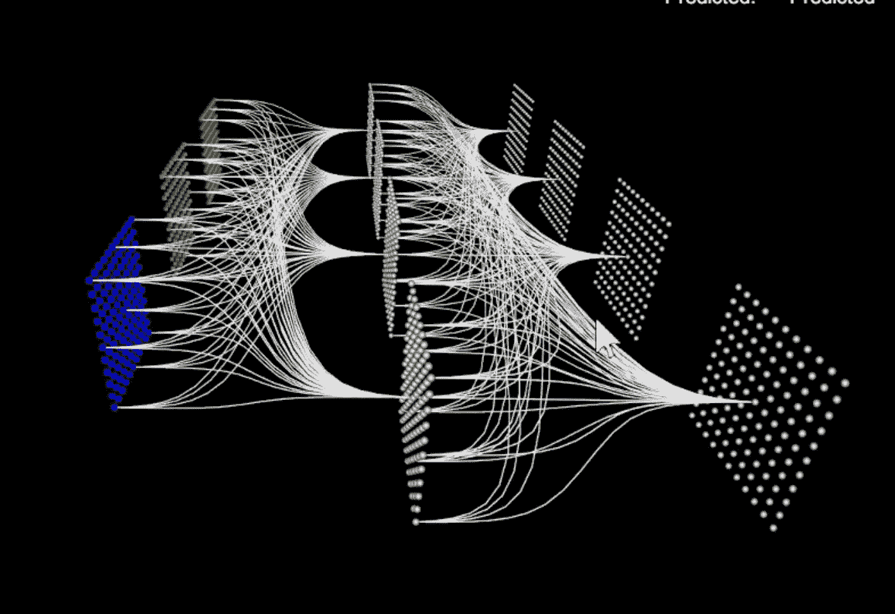
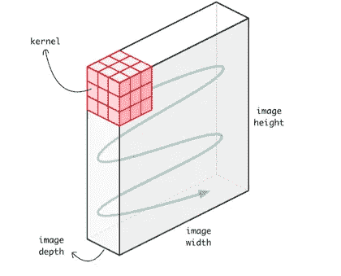
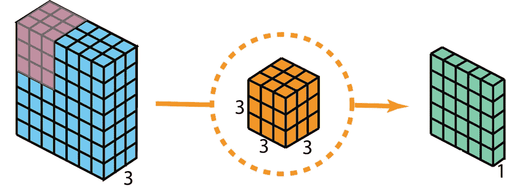
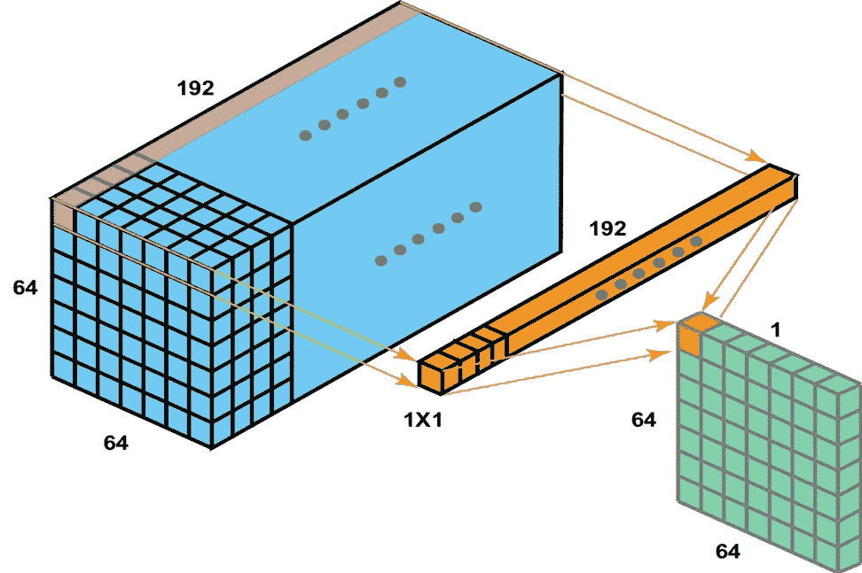
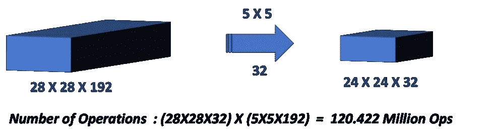
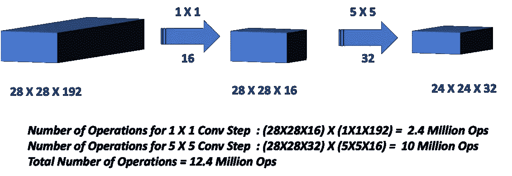
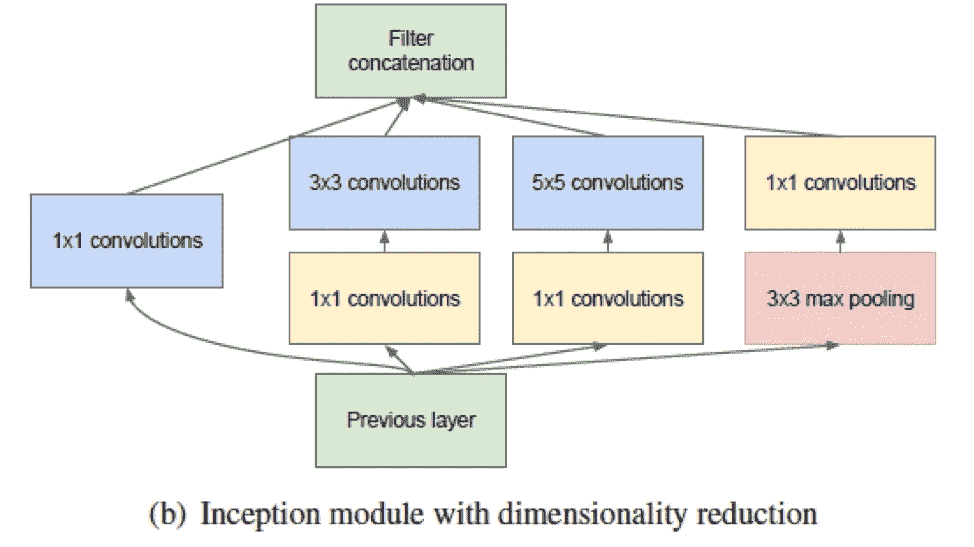
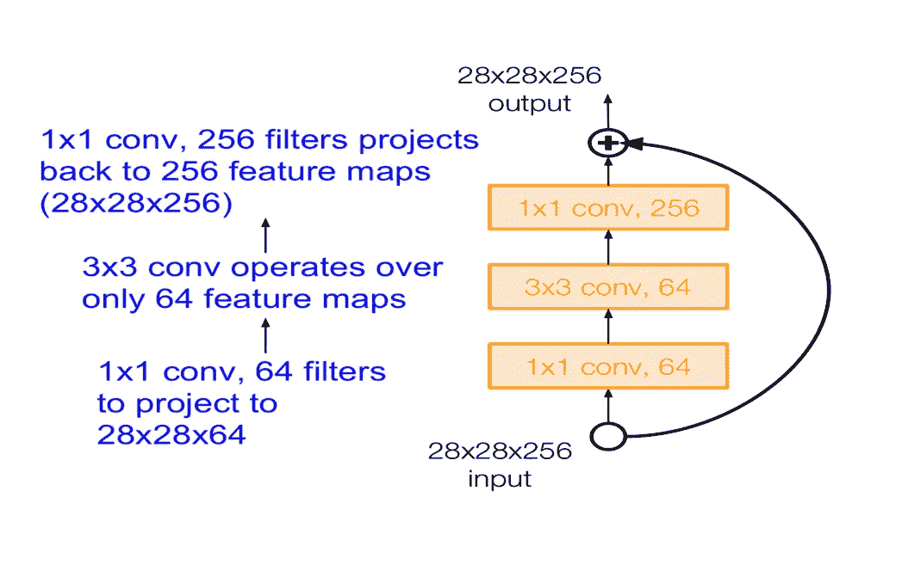
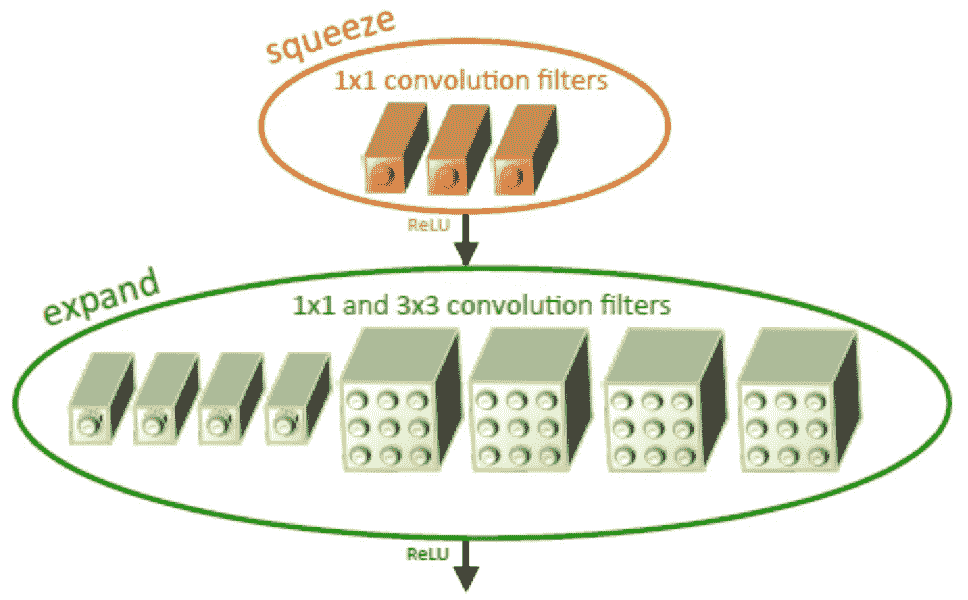

# 天才 1X1 先生:全面看深度学习中的 1X1 卷积

> 原文：<https://medium.com/analytics-vidhya/talented-mr-1x1-comprehensive-look-at-1x1-convolution-in-deep-learning-f6b355825578?source=collection_archive---------1----------------------->

图片取自此[链接](https://vimeo.com/274236414)

W 随着 2012 年 AlexNet 的惊人成功，卷积神经网络(CNN)革命已经开始！深度学习中基于 CNN 的框架，如 GoogleNet、ResNet 以及这些框架的几种变体，已经在计算机视觉中的对象检测和语义分割方面显示出惊人的结果。

当你开始查看大多数成功的现代 CNN 架构时，如 GoogleNet、ResNet 和 SqueezeNet，你会发现 1X1 卷积层起着主要作用。乍一看，使用单个数字与输入图像进行卷积似乎没有意义(毕竟所有更宽的滤波器，如 3X3、5X5，都可以处理图像的一部分，而不是这种情况下的单个像素)。然而，1X1 卷积已被证明是非常有用的工具，如果使用正确，将有助于创建非常深刻的架构。

在本文中，我们将详细了解 1X1 卷积

首先快速回顾一下深度学习中的卷积。有许多好的博客和文章直观地解释了什么是卷积以及卷积的不同类型(参考资料中很少列出)。虽然我们不会在本文中深入研究卷积，但理解几个关键点将使我们更容易理解 1X1 卷积在做什么，最重要的是它是如何做的以及为什么要做。

## ***快速回顾:深度学习中的卷积***

如上所述，本文不会提供卷积的理论和实践的完整处理。然而，我们将重述深度学习中卷积的关键原理。当我们深入研究 1X1 卷积时，这将派上用场。

简而言之，卷积是输入和内核/滤波器元素的逐元素乘法和求和。现在要记住的数据点

**1。** *输入矩阵可以并且在大多数情况下会有不止一个通道*。这有时被称为 ***深度***

a. ***示例*** :图像的 64X64 像素 RGB 输入有 3 个通道，因此输入为 64X64X3

2. ***过滤器与输入*** 具有相同的深度，除了一些特殊情况(例如 3D 卷积重建医学图像)。由于某些未知的原因，这一点在大多数文献中没有明确提及，导致了一些误解(特别是对于卷积、深度学习等的新手)

a. ***例如:***3x 3 的滤波器也有 3 个通道，因此滤波器应该表示为 3X3X3

***3。*** 第三个和临界点， ***卷积步长的输出深度等于我们选择的滤波器数量。***

a. ***示例:***3D 输入(64X64X3)的卷积步骤的输出和我们选择的过滤器(3X3X3)的深度为 1(因为我们只有一个过滤器)

过滤器大小为 3X3X3 的 3D 输入 64X64X3 的卷积步骤将使过滤器沿着输入的宽度和高度“滑动”。

图片取自此[链接](https://towardsdatascience.com/understanding-1d-and-3d-convolution-neural-network-keras-9d8f76e29610)

因此，当我们*用 3D 图像卷积*3D 过滤器时，该操作在 2 个方向(沿着宽度和高度)上移动输入上的过滤器，并且我们在每个位置进行逐元素乘法和加法，以深度为 1 的输出结束。

图片取自此[链接](https://towardsdatascience.com/a-comprehensive-introduction-to-different-types-of-convolutions-in-deep-learning-669281e58215)

有了这些，我们就可以开始 1X1 卷积了

## ***1X1 卷积——是什么？***

在林敏等人的论文中首先介绍了在网络 中的 [***网络，1X1 卷积层用于“跨通道下采样”或跨通道汇集。换句话说，1X1 Conv 用于减少通道数量，同时引入非线性。***](https://arxiv.org/pdf/1312.4400.pdf)

在 1X1 卷积中，简单地说就是滤波器的大小为 1X1(是的，这意味着是一个单一的数字，而不是矩阵形式，比如 3X3 滤波器)。这个 1X1 滤波器将逐个像素地对整个输入图像进行卷积。

继续我们的示例输入 64X64X3，如果我们选择 1X1 滤波器(即 1X1X3)，那么输出将具有与输入相同的高度和重量，但只有一个通道，即 64X64X1

现在考虑具有大量通道的输入，例如 192 个。如果我们想要减少深度，但保持特征图(感受野)的*高度 X 宽度*不变，那么我们可以选择 1X1 滤波器(记住滤波器数量=输出通道)来实现这种效果。这种跨通道下采样的效果被称为“降维”。

图片取自此[链接](https://towardsdatascience.com/a-comprehensive-introduction-to-different-types-of-convolutions-in-deep-learning-669281e58215)

为什么我们会想要这样的东西呢？为此，我们深入研究 1X1 卷积的用法

***用法 1:降维/增维***

ils vrc*(*[*ImageNet 大规模视觉识别竞赛*](http://www.image-net.org/challenges/LSVRC/) ) 2014、[***GoogleNet***](https://arxiv.org/abs/1409.4842)***，使用*** 1X1 卷积层进行*“计算昂贵的 3×3 和 5×5 卷积之前的缩减量”*

*让我们看一个例子来理解降维将如何减少计算量。假设我们需要用 5×5×32 个过滤器卷积 28×28×192 个输入特征图。**这将导致*12042.2 万次操作****

**

*让我们用相同的输入要素地图做一些数学运算，但是在 5 X 5 conv 图层之前使用 1X1 Conv 图层*

**

**通过在 5X5 Conv 之前增加 1X1 Conv 图层，同时保持特征图的高度和宽度，我们将* ***的运算次数减少了 10 倍*** *。这将减少计算需求，从而提高效率。**

*GoogleNet 论文将该模块描述为“ ***盗梦空间模块*** ”(明白了——电影《盗梦空间》中迪卡普里奥的《我们需要更深入》)*

**

## ****用法二:构建更深层次的网络(“瓶颈”层)****

*2015 年 ILSVRC 分类冠军，[***ResNet***](https://arxiv.org/pdf/1512.03385.pdf)***，*** 的错误率最低，并通过使用“残余连接”和“瓶颈层”的非常深的网络横扫对手。*

*在他们的论文中，他等人解释了(第 6 页)瓶颈层如何使用 3 个卷积层的序列来设计 ***，这些卷积层分别具有 1X1、3X3 和 1X1 大小的滤波器，以减少和恢复维度*** 。输入的下采样发生在 1×1 层，从而为 3×3 conv 汇集了更小的特征向量(减少了参数数量)。紧接着，1X1 层恢复尺寸以匹配输入尺寸，因此可以直接使用标识快捷方式。关于身份快捷方式和跳过连接的细节，请看 ResNet 上的一些评论(或者可以等我以后的作品！)*

**

*图片取自此[链接](http://cs231n.stanford.edu/slides/2017/cs231n_2017_lecture9.pdf)*

## ****用法 3:较小但精确的模型(“火模块”层)****

*虽然深度 CNN 模型具有很高的准确性，但它们需要处理数量惊人的参数，这增加了训练时间，最重要的是需要企业级的计算能力。Iandola 等人都提出了一个名为[***SqueezeNet***](https://openreview.net/pdf?id=S1xh5sYgx)*的 CNN 模型，它保留了 AlexNet 级别的精度，而在参数方面却小了 50 倍。**

**较小的模型有许多优势，特别是在需要边缘计算能力的用例上，如自动驾驶。伊恩多拉等人通过堆叠一堆“ ***”火模块*** ”实现了这一点，这些模块包括**

**1.*挤压层*只有 1X1 个 Conv 滤镜**

**2.这为一个混合了 1X1 和 3X3 滤镜的*扩展层*提供了素材**

**3.挤压层中的滤镜数量设置为小于 1X1 滤镜数量+扩展层中的 3X3 滤镜数量**

**到目前为止，*挤压层*中的 1X1 Conv 滤波器的作用是显而易见的——它们通过在输入通道进入*扩展层之前对其进行“下采样”来减少参数数量。***

***扩展层*混合了 1X1 和 3X3 滤镜。如您所知，1X1 滤镜执行交叉通道池，即合并通道，但无法检测空间结构(通过处理单个像素，而不是像较大的滤镜那样处理一片输入)。3×3 卷积检测空间结构。*通过组合这两个不同大小的过滤器，模型在较小的参数下运行时变得更有表现力*。填充的适当使用使得 1X1 和 3X3 卷积的输出具有相同的大小，因此它们可以被堆叠。**

****

## *****结论*****

**在本文中，我们回顾了高级卷积机制，并深入研究了 1X1 卷积，以了解其基础、有效用途和目的。**

**概括地说，1X1 卷积有效地用于**

**1.维数减少/增加**

**2.通过减少参数映射来减少计算量**

**3.向网络添加额外的 ***非线性*****

**4.通过“瓶颈”层创建更深的网络**

**5.创建更小的 CNN 网络，保持更高的精确度**

## *****参考文献*****

*****1。*** ***吴恩达的视频对 1X1 卷积*****

**[***https://www . coursera . org/lecture/convolution-neural-networks/networks-in-networks-and-1x1-convolutions-ZTb8x***](https://www.coursera.org/lecture/convolutional-neural-networks/networks-in-networks-and-1x1-convolutions-ZTb8x)**

*****2。*** [***全面介绍深度学习中不同类型的卷积***](https://towardsdatascience.com/a-comprehensive-introduction-to-different-types-of-convolutions-in-deep-learning-669281e58215)**

*****3。*** [***神经网络架构***](https://towardsdatascience.com/neural-network-architectures-156e5bad51ba)**

*****4。*** [***网络中的网络***](https://arxiv.org/pdf/1312.4400.pdf) ***—林敏等人所有*****

*****5。*******—克里斯蒂安·塞格迪等人******

****6*。*** [***用于图像识别的深度残差学习***](https://arxiv.org/pdf/1512.03385.pdf) ***—何等人所有*****

*****7。***[***SqueezeNet***](https://openreview.net/pdf?id=S1xh5sYgx)***—林依安多拉等人所有*****

*****8。*** [***CNN 架构—第九讲***](http://cs231n.stanford.edu/slides/2017/cs231n_2017_lecture9.pdf) ***(斯坦福) :林等人所有*****

**[***9。深度压缩:通过剪枝、训练量化和霍夫曼编码对深度神经网络进行压缩***](https://arxiv.org/abs/1510.00149) ***宋涵等所有*****