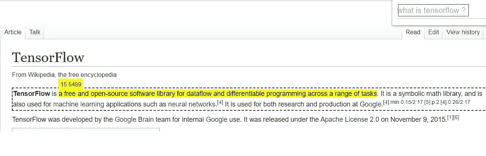
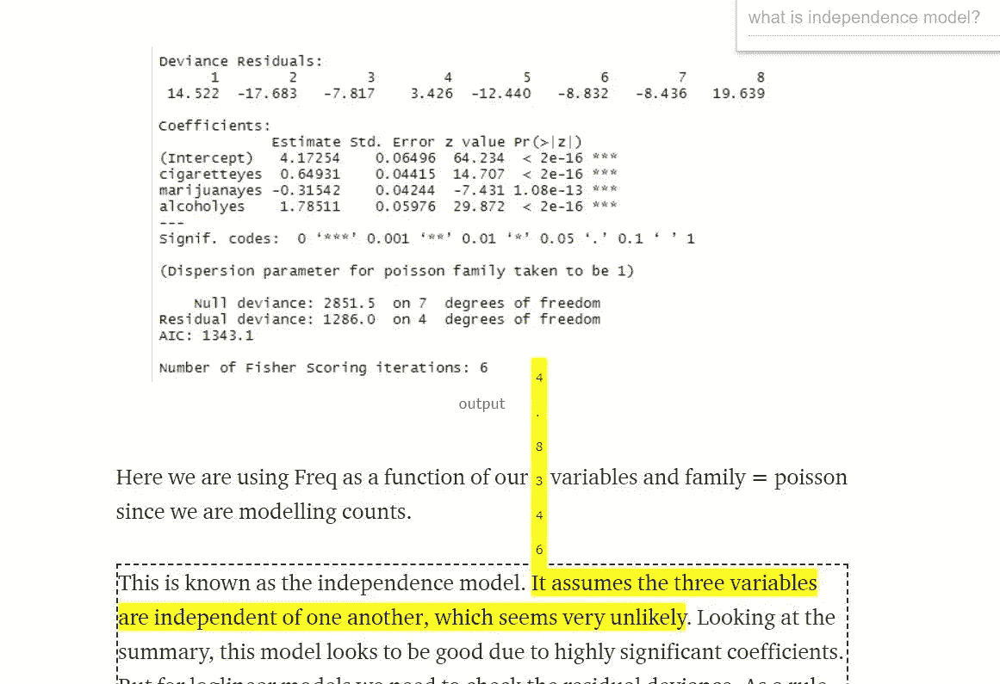

# 使用 NLP 与网页对话

> 原文：<https://medium.com/analytics-vidhya/talk-to-web-pages-using-nlp-f2beb020e880?source=collection_archive---------22----------------------->

在 web 浏览器中进行语义搜索的需求。我们可以利用 NLP 的能力提出有意义的问题，而不是使用关键字进行 Ctrl +F 和搜索。

Model-Zoo 已经开源了一个名为“shift+ctrl+f”的项目，使用它我们可以在维基百科等任何网页中进行语义搜索。它使用 mobileBERT 模型，该模型在 SQuAD 数据集上进行了微调。SQuAD——斯坦福问答数据集是一个阅读理解数据集，由人群工作者就一组维基百科文章提出的问题组成，其中每个问题的答案都是相应阅读文章的一段文字或跨度，或者问题可能无法回答。TensorflowJS 被用来输入和提问问题，并在网页上标记相关的答案。该扩展可以添加到不同的浏览器，如 chrome，edge。

为什么是 mobileBERT？

在许多预训练自我监督模型中，BERT (Devlin 等人，2018 年)显示出显著的准确性改进。然而，作为 NLP 中有史以来最大的模型之一，BERT 具有庞大的模型规模和高延迟，这使得资源有限的移动设备无法在基于移动设备的机器翻译、对话建模等方面部署 BERT 的能力。

为了克服这个问题，开发了一个任务不可知的轻量级预训练模型 mobileBERT。它可以像最初的 BERT 一样，在不同的下游 NLP 任务上进行一般性微调。mobileBERT 被设计为与 BERT LARGE 一样深，而每一层都通过采用瓶颈结构以及在自我关注和前馈网络以及 2530 万个参数之间进行平衡而变得更窄。还有一个叫做 mobileBERT TINY 的微小版本，有 1510 万个参数。

如何在我们自己的浏览器中实现语义搜索？

我们需要安装以下依赖项来创建扩展。

*   结节
*   故事
*   较美丽

节点:可以从[https://nodejs.org/en/download/](https://nodejs.org/en/download/)安装

Yarn: Yarn 是代码的一个包管理器。安装程序可以从 https://classic.yarnpkg.com/en/docs/install#windows-stable[下载](https://classic.yarnpkg.com/en/docs/install#windows-stable)

漂亮:漂亮是一个固执己见的代码格式化程序，支持 Javascript，angular，typescript 等。一旦安装了节点和纱线，就可以使用它们中的任何一个来安装 beauty

每当我们执行搜索选项时，内容脚本将收集页面上的

、

安装完这些依赖项后，执行 make develop 命令。第一次出现错误是因为节点中的 web 服务器包不可用，这些包可以使用“npm install — save-dev”进行安装。成功执行后，它将在我们的源目录中创建一个构建文件夹。我们可以进入我们的 chrome 浏览器，在设置中选择扩展。确保您已经在浏览器中启用了开发人员模式，并从构建文件夹中加载解压缩的扩展。该扩展现在将被添加到浏览器中，并可用于在网页中搜索。

例如，这里的问题是“什么是张量流？”，扩展用黄色突出显示了可能的答案，如下所示。

在下面的例子中，我问了“什么是独立模式”，它在博客中正确地标出了答案。

这里的问题是“如何创建虚拟环境？”

它标记了包含答案的整个区域，并用黄色突出显示了确切的操作以及置信度得分。

声明:modelzoo 的这个扩展是一个实验。像 BERT 这样的深度学习模型非常强大，但可能会返回难以解释的不可预测和/或有偏见的结果。请在分析搜索结果时运用最佳判断。

参考资料:

 [## 模型-zoo/shift-ctrl-f

### 使用自然语言而不是精确的字符串匹配来搜索网页上的可用信息。使用 MobileBERT…

github.com](https://github.com/model-zoo/shift-ctrl-f) 

*   [https://arxiv.org/pdf/2004.02984.pdf](https://arxiv.org/pdf/2004.02984.pdf)