# 移动用户人口统计

> 原文：<https://medium.com/analytics-vidhya/talking-data-mobile-user-demographics-a38ff545df?source=collection_archive---------14----------------------->

# **业务问题:**

没有什么比当你走进街角咖啡馆的门时，你最喜欢的饮料向你打招呼更令人欣慰的了。虽然一个体贴的咖啡师知道你每周三早上 8:15 会喝一杯玛奇朵，但在数字空间里，你喜欢的品牌要个性化你的体验要困难得多。

[中国最大的第三方移动数据平台](https://www.talkingdata.com/)会说话的数据明白，每天的选择和行为描绘了我们是谁，我们重视什么。目前，Talking Data 正在寻求利用中国每天活跃的 5 亿移动设备中超过 70%的行为数据，帮助其客户更好地了解他们的受众并与之互动。

因此，业务问题是使用用户的应用程序使用、地理位置和设备属性来预测用户的人口统计特征。

所以解决这个问题的步骤是:

1.获取数据

2.探索性数据分析

3.系统模型化

4.结果

5.未来的工作

6.参考

## **1。数据:**

数据可以从 [kaggle](https://www.kaggle.com/c/talkingdata-mobile-user-demographics/data) 下载

数据由 7 个 csv 文件组成，包含与设备 id、设备型号、应用程序、事件和应用程序所属类别相关的不同信息。

1 .性别年龄训练:该文件包含属于 75，000 个用户的设备 id 和他们的人口统计细节。我们将使用这些数据来训练模型。

2 .性别年龄测试:该文件包含我们必须预测的设备 id。

3.电话品牌设备型号:该文件包含与设备相关的信息，如品牌和型号。

4.应用程序标签:该文件包含与应用程序相关的信息及其所属的相应类别。

5.事件:该文件包含基于应用程序的使用和事件发生的经纬度以及事件的时间戳的与事件相关的信息。

6.标签类别:该文件包含标签 id 及其对应的类别。

## 绩效指标:

数据根据年龄和性别分为 12 个不同的类别。我们必须预测设备 id 属于每个类别的概率。因此，这是一个多类分类，每个设备 id 只有一个真正的类，我们必须减少它属于其他类的错误。因此，我们使用多类日志损失作为度量。

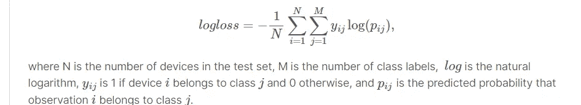

## 2.探索性数据分析:

探索性数据分析是指对数据进行基本分析，以发现数据中的任何模式。这一步帮助我们找到哪些特征有助于预测用户的人口统计细节。

由于存在各种 csv 文件，我们将它们合并以获得最终的数据矩阵。我们合并性别年龄训练并用手机品牌设备模型进行测试。

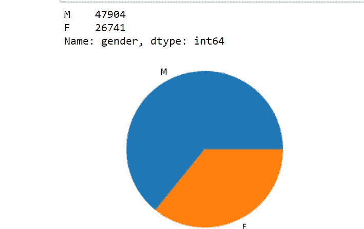

从这个饼图中我们知道，大约 2/3 的数据属于男性用户，1/3 属于女性用户。

我们需要属于每个组的用户数量。

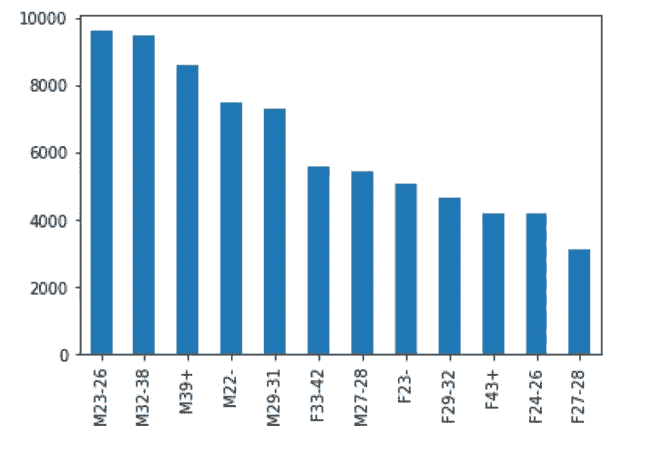

**。**由此我们观察到男性用户比女性用户多。

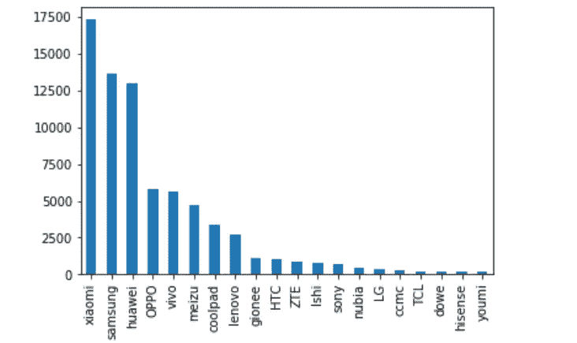

由此我们推断，只有 20 个品牌占据了 90%以上的用户。

从应用程序事件文件中，我们想检查有多少应用程序是活跃的。

**非活动应用 0 19740071 活动应用 1 12732996**

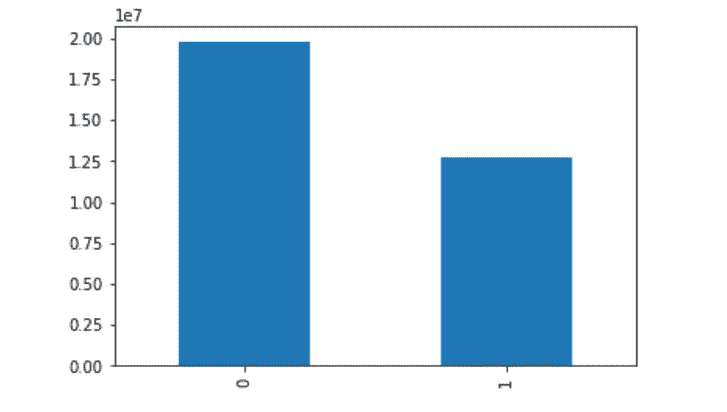

从这个图中，我们知道大多数应用程序是不活动的。

我们将训练带与设备 id 上的事件文件合并，然后与应用程序事件合并。最终的数据矩阵看起来像这样，我们有很多缺失的值。我们用 0 来填充那些缺失的值。

我们绘制了箱线图，以检查在日、小时、年龄、性别和组上是否有使用模式。

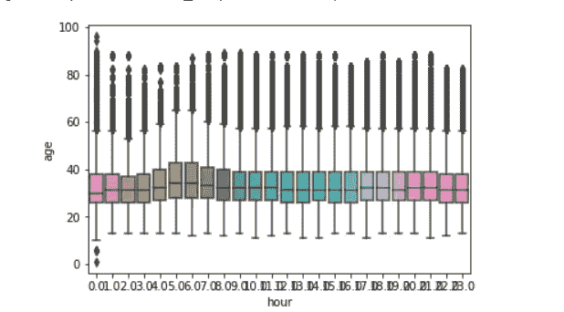

**事件时间和用户年龄之间的关系图**

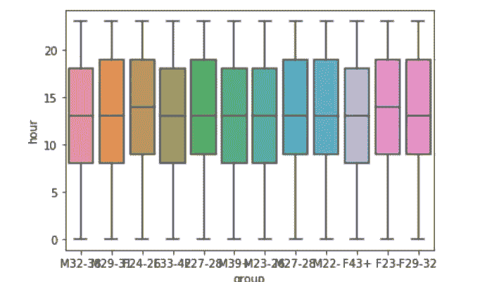

**事件小时和组**之间的图

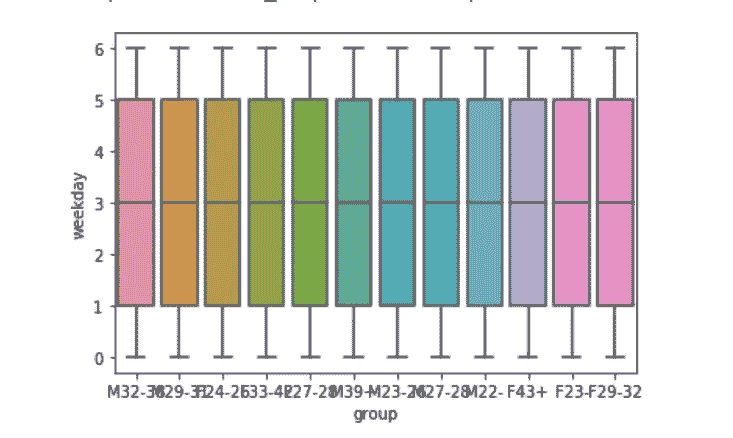

**事件日和组之间的图**

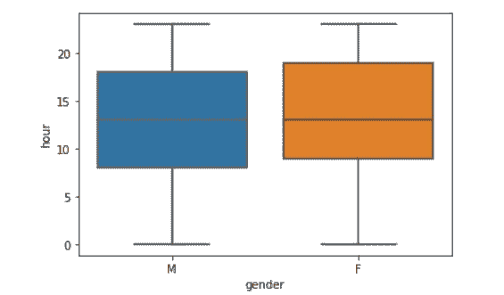

**性别和事件时间图**

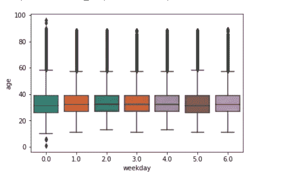

**工作日和年龄之间的图**

从上面的图中，我们没有推断出任何见解，因为大多数数据是重叠的。

## **3。造型:**

从我们通过设备型号、品牌和标签类别的合并和标签编码以及设备 id 上的应用分组所获得的数据中。

在我们得到的数据上，我们随机分割数据并对其应用线性 svc。

超参数调优后，对测试数据进行了最佳值预测，在 kaggle 中提交后得到了 2.42 分。

所有设备 id 不包含应用程序事件信息。所以我们根据有无事件的数据来划分。因为我们有两种类型的数据，所以我们分别对它们进行预测，并将它们连接起来。

## 对于没有事件的设备:

对于没有事件信息的设备，我们仅使用品牌和型号特征，我们获取没有事件的训练数据和测试数据，并找到设备品牌和型号的稀疏矩阵。

我们使用完整的训练数据来训练模型，但是我们只预测没有事件信息的设备。

我们收集了这些品牌和模型的企业社会责任特征，分割数据并对其进行逻辑回归。

在超参数调整之后，对于 c 的最佳值，我们得到训练和验证损失为 2.36 和 2.38。我们尝试了神经网络模型，因为逻辑回归的分数不够好。

我们从 kaggle 的讨论页面中获取了模型的架构。它是一个序列模型，具有密集层，接着是参数 Relu 和批量归一化层

这里的输入形状是指我们将品牌和车型的 csr 特征叠加得到的特征形状。

**model_list** 包含使用不同随机种子对不同版本的 x_tr 数据进行训练的 5 个模型。我使用了 model_list 中的每个模型，并对测试数据(test_1)进行了概率预测，然后取所有预测的平均值。

我们尝试了另一种具有密集层和参数 Relu 和 dropout 的架构。我们使用统一和零初始化和软最大激活和 Adagrad 优化器。

在这里，我们还采用了 5 个模型，这些模型根据使用不同随机种子分割的不同版本的训练数据进行训练，并使用所有模型进行预测，然后取其平均值。

## **带有事件的设备:**

在带有事件信息的设备上，我们使用了设备品牌、型号、设备应用、标签和集群功能的一种热编码。我们在 hours 和 hour bin 上使用了 tfidf 和 count vectoriser。并将 Tfidf vectoriser 用于日应用和活动应用。我们将纬度和经度标准化，并将所有的特征堆叠起来。

然后，我们应用了两个深度学习模型，分别是辍学层、密集层和参数化 Relu 层，并在测试时获取随机种子列表和平均值。我们在第一个模型中使用统一和零初始化以及 Adagrad 优化器，在模型 2 中使用 adadelta。

在这里，我们还对两种架构的 5 个模型进行了训练，训练数据的不同版本使用不同的随机种子进行分割，并使用所有模型进行预测，然后取其平均值。

我们得到模型 1 训练和验证损失为 1.54 和 1.90，模型 2 的训练和验证损失为 1.7068 和 1.9012。

我们应用了 xg-boost 和逻辑回归，但没有得到更好的结果。

在超参数调整和校准分类器后，我使用 c = 0.02 来训练模型和预测概率。

## 神经网络模型的集成；

因此，在 kaggle 中提交时，我们在有事件的设备上使用了 2 个模型的平均值，在没有事件的设备上仅使用了模型 1，得分为 2.23，位于排行榜的前 10%。

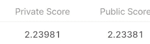

## **4。结果:**

不同模型的最终结果如下所示:

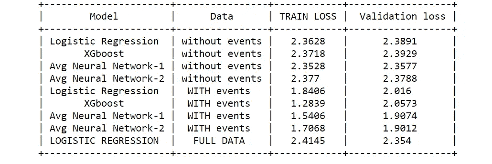

## **5。未来工作:**

1.我们可以尝试新的功能，如聚类功能的 tfidf 矢量化和 hour bin。

2.我们可以尝试不同的重量，而不是取两个模型的平均值。

3.我们可以在深度学习模型中尝试不同的输入单元、层、辍学率、批量归一化。

在[轮廓](https://www.linkedin.com/in/mahendhar-reddy-kethanapally-338121120/)中链接

完整的代码可以在[这里](https://github.com/MahendharReddy16/Talking-data-)找到

## **6。参考文献:**

1.  [https://www . aaai . org/OCS/index . PHP/ICWSM/ICWSM 16/paper/view paper/13047](https://www.aaai.org/ocs/index.php/ICWSM/ICWSM16/paper/viewPaper/13047)
2.  [https://www.appliedaicourse.com/](https://www.appliedaicourse.com/)
3.  [https://www . ka ggle . com/c/talking data-mobile-user-demographics/discussion/23424](https://www.kaggle.com/c/talkingdata-mobile-user-demographics/discussion/23424)