# 对话数据用户人口统计

> 原文：<https://medium.com/analytics-vidhya/talking-data-user-demographics-19e3d15627b5?source=collection_archive---------12----------------------->

## 我的第一个卡格尔问题


弗兰基·查马基在 [Unsplash](https://unsplash.com?utm_source=medium&utm_medium=referral) 上拍摄的照片

# 商业问题

没有什么比当你走进街角咖啡馆的门时，你最喜欢的饮料向你打招呼更令人欣慰的了。虽然一个体贴的咖啡师知道你每周三早上 8:15 会喝一杯卡布奇诺，但在数字空间里，你喜欢的品牌要个性化你的体验要困难得多。

中国最大的第三方移动数据平台 Talking Data 明白，日常的选择和行为描绘了我们是谁，我们重视什么。目前，Talking Data 正在寻求利用中国每天活跃的 5 亿移动设备中超过 70%的行为数据，帮助其客户更好地了解他们的受众并与之互动。

在 kaggle 竞赛中，参赛者被要求建立一个模型，根据他们的应用程序使用情况、地理位置和移动设备属性来预测用户的人口统计特征。这样做将有助于全球数百万开发者和品牌广告商追求数据驱动的营销努力，这些努力与他们的用户相关并迎合他们的偏好。

# **数据概述**

数据可从[竞赛页面](https://www.kaggle.com/c/talkingdata-mobile-user-demographics/data)下载，其中包括:

1.  **gender_age_train.csv，gender _ age _ test . CSV**—这些文件分别包含训练和测试模型的设备的详细信息。
2.  **events.csv，app_events.csv** —当用户使用 TalkingData SDK 时，事件连同其时间戳一起被记录在该数据中。每个事件都有一个事件 id，位置(纬度/经度)，事件对应 app_events 中的一个应用列表。
3.  **app_labels.csv** —包含用户使用的应用及其对应的 label_id。
4.  **label_categories.csv** —由 app_labels.csv 中的应用标签 id 及其类别组成。例如，标签 ID: 4 属于游戏艺术风格类别。
5.  **phone _ brand _ device _ model . CSV**—包含用户使用的设备的设备 id、相应的电话品牌和设备型号。

# **现实世界/业务目标和约束**

1.  没有低延迟要求。
2.  需要数据点属于每个类别的概率。

# **绩效指标**

[](https://www.kaggle.com/c/talkingdata-mobile-user-demographics/overview/evaluation)**:每个设备都被标注了一个真实的类别。对于每个设备，我们必须预测一组预测概率(每个类别一个)。公式是**

**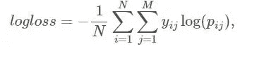**

**来源:[卡格尔](https://www.kaggle.com/c/talkingdata-mobile-user-demographics/overview/evaluation)**

**其中，N 是测试集中设备的数量，M 是类别标签的数量，log 是自然对数，如果设备 I 属于类别 j，yij 是 1，否则是 0，pij 是观察值 ii 属于类别 j 的预测概率。**

# ****数据分析****

**首先让我们导入一些库**

****性别 _ 年龄 _ 车次** **数据****

```
gender_age_train=pd.read_csv('gender_age_train.csv')
gender_age_train.head()
```

**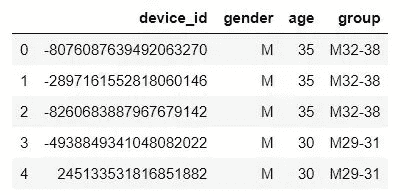**

**这里我们有 4 列:**

*   ****设备 id:** 注册了通话数据的用户设备 id**
*   ****性别:**用户的性别，用 M 或 F 分别表示男性或女性**
*   ****年龄:**用户的年龄**
*   **group: 这是我们问题的目标类，包含我们需要预测的类。第一个字母表示用户的性别，随后是用户所属的年龄组**

**看一下组列的计数图**

**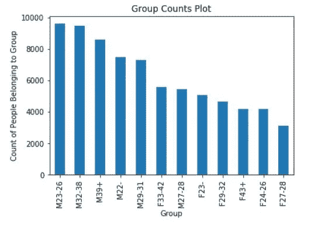**

**从上面的图中我们可以推断出男性用户比女性用户多。这一点在饼状图中表现得更为明显，其中近 65%是男性，35%是女性。**

**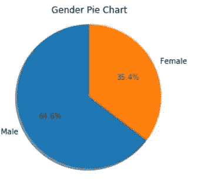**

****性别 _ 年龄 _ 测试数据****

**这是我们需要预测人口统计的测试数据。**

```
gender_age_test=pd.read_csv('gender_age_test.csv')
gender_age_test.columns.values
```

**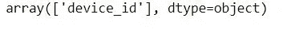**

**所以测试数据只有一列 device_id。**

**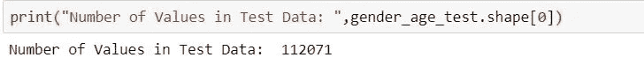**

****手机 _ 品牌 _ 设备 _ 型号数据****

```
phone_data=pd.read_csv('phone_brand_device_model.csv')
phone_data.head()
```

**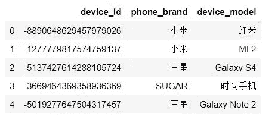**

**我们这里有 device_id、phone_brand、device_model，并且注意到一些 phone_brand 和 device_model 值是中文的。让我们看看是否有重复的。**

```
phone_devices_unique=np.unique(phone_data['device_id'].values)
print("Number of Unique Phone Devices: ",len(phone_devices_unique))
print("Total Number of Devices in Phone Data: ",phone_data.shape[0])
print("Number of Duplicate Devices: ",phone_data.shape[0]-len(phone_devices_unique))
```

**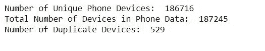**

**所以有一些重复的，他们需要被删除。**

****事件数据****

```
events=pd.read_csv('events.csv')
events.head()
```

**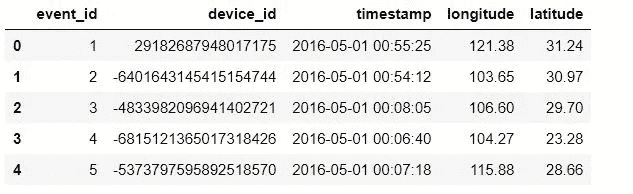**

**让我们看看 id 为 **29182687948017175** 的设备的事件数据**

```
events[events['device_id']==29182687948017175].head(10)
```

**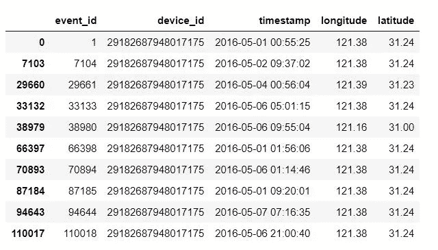**

**这意味着我们为特定设备记录了多个事件。**

**我们有所有事件的时间戳，我们可以查看所有事件的总体开始和结束时间，以了解所有事件的记录时间。**

```
# Event Start and End time across the whole Data
event_times=events['timestamp'].values
print("Event Start: ",np.min(event_times))
print("Event End: ",np.max(event_times))
```

**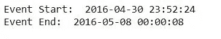**

**因此，我们可用的事件数据记录时间为 8 天，从 2016 年 4 月 30 日午夜到 2016 年 5 月 8 日凌晨 12 点。**

**好的，现在让我们看看在我们的训练和测试数据中有多少设备有事件数据？**

**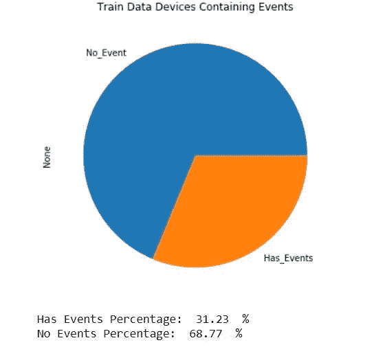****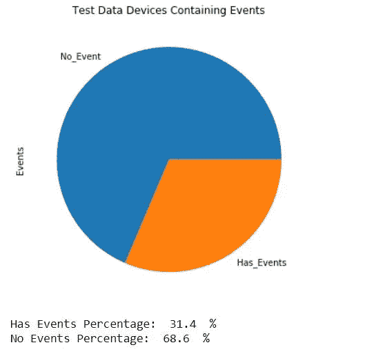**

**这些图表明，几乎 69%的设备没有事件数据，只有 31%的设备有事件数据。**

****app_labels 数据****

```
app_labels=pd.read_csv('app_labels.csv')
app_labels.head()
```

**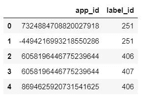**

**让我们看看我们有多少独特的应用程序标签？**

```
unique_app_labels=np.unique(app_labels['label_id'].values)
print("Number of Unique App Labels: ", len(unique_app_labels))
```

**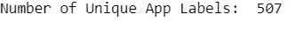**

**现在我们有 507 个唯一的应用程序标签，我们也可以有多个标签 id 与特定的应用程序 id 相关联。让我们考虑一个 id 为 **7324884708820027918** 的应用程序，它有多个标签。**

```
app_labels[app_labels['app_id']==7324884708820027918]
```

**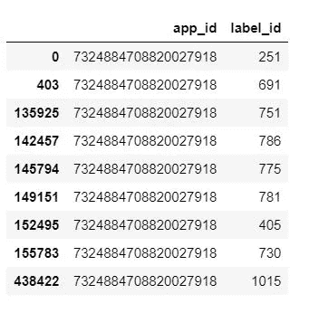**

****app _ 事件数据****

```
app_events=pd.read_csv('app_events.csv')
app_events.head()
```

**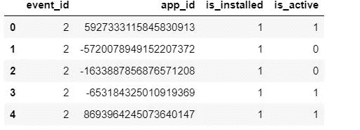**

```
unique_apps_1=np.unique(app_events['app_id'].values)
unique_events_1=np.unique(app_events['event_id'].values)
print("Number of Unique Apps: ",len(unique_apps_1))
print("Number of Unique Events: ",len(unique_events_1))
```

**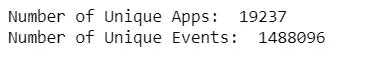**

**让我们看看 is_active 列**

```
plt.figure(figsize=(10,6))
plt.title('Active Events Plot')
app_events['is_active'].map({1:'Active',0:'Inactive'}).value_counts().plot.pie()
plt.show()
print("Active : ",np.round(app_events['is_active'].value_counts()[1]*100/app_events.shape[0],2)," %")
print("Inactive : ",np.round(app_events['is_active'].value_counts()[0]*100/app_events.shape[0],2)," %")
```

**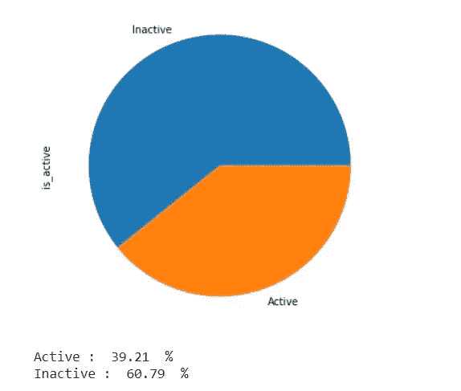**

**因此，当有活动正在进行时，大多数应用程序都是不活动的。几乎 61%的应用程序是不活跃的，39%的应用程序是活跃的。**

****来自数据分析的见解****

1.  **只有 31%的训练和测试数据有事件数据。**
2.  **对于没有事件数据的设备，我们只有可用于预测用户人口统计的电话品牌和设备型号特征。这意味着，对于几乎 69%的设备，我们只有电话数据。**
3.  **对于包含事件数据的设备，我们可以使用其事件相关功能以及其手机品牌和设备型号来预测用户统计数据。**

# ****数据准备****

**现在，我将简要地解释准备我的模型中使用的数据所遵循的步骤**

1.  **因为我们的数据中有两种类型的设备，一种有事件详细信息，另一种没有任何事件详细信息。我分离了设备，并为有事件的设备和无事件的设备创建了数据。**
2.  **对于没有事件数据的设备，我只使用手机品牌和设备型号作为特征。**
3.  **对于具有事件数据的设备，我使用了手机品牌、设备型号以及事件数据功能，如中纬度、中经度、事件发生的时间、事件发生的星期几、应用程序事件数据中的 is_active 功能、设备中使用/安装的所有应用程序列表、按设备 id 分组的所有应用程序标签列表。**

**关于我如何准备数据的更多细节和代码，请随时查看我的 [GitHub 库](https://github.com/AbhishekKarthik/Talking_Data_User_Demographics)。**

# **我的方法**

1.  **由于我们数据中的所有设备都有手机品牌和设备型号的详细信息，所以我使用这两个特征来训练一个逻辑回归和两个不同的神经网络模型。我使用这些模型来预测测试数据中设备的类别概率，这些测试数据不包含我们在前面的步骤中分离的事件数据。**
2.  **对于包含事件细节的设备，我使用我们为这些设备提取的事件相关特征，并且仅使用包含事件细节的设备来训练两个不同的神经网络模型。然后，我使用这些模型来预测包含事件数据的测试数据中设备的分类概率。**
3.  **最后，我将有事件的设备和无事件的设备的测试数据预测连接起来，并创建了整个测试数据预测文件。**

# ****准备特性****

**因为我们有两个独立的数据，一个是有事件的设备，另一个是没有事件的设备，所以我为这些数据分别准备了特性。**

1.  ****无事件的设备:**创建手机品牌、设备型号特征的一次性编码。**
2.  ****带事件的设备:**创建手机品牌、设备型号、属于设备的应用程序、属于设备的应用程序标签、TFIDF 小时编码功能、星期几、应用程序激活、标准化纬度和经度功能的一键编码。让我们称之为**事件特征矩阵。****

# ****造型****

**正如我的方法中提到的，在这一节中，我将带您浏览我的解决方案中使用的模型。这包括两个部分，即，在没有事件细节的设备数据上建模和在包含事件细节的设备数据上建模。让我们先从没有事件细节的设备建模开始。**

****无事件详情的设备****

**在开始建模之前，我将为我的模型创建训练、验证和测试数据。**

```
#using Label Encoder to encode class labels as integers from 0-11
class_encoder=LabelEncoder()
encoded_y=class_encoder.fit_transform(train_data['group'])
train_data['Class']=encoded_y
y_data=train_data['Class'].values
train_1, cv_1, y_train_1, y_cv_1 = train_test_split(X_train_one_hot, y_data,stratify=y_data,test_size=0.15,random_state=18)
test_1=X_test_no_events_one_hot
```

****X_train_one_hot** 是所有设备(有无事件)的列车数据的手机品牌、设备型号特征的一键编码。**X _ test _ no _ events _ one _ hot**是列车数据的手机品牌、设备型号特征的一键编码，仅用于不包含事件详情的设备。原因是，正如我在方法中提到的，手机品牌、设备型号功能适用于所有设备。因此，我针对训练数据中所有可用设备的这些特征来训练模型，并使用模型来预测测试数据中没有事件细节的设备。**

****逻辑回归****

**逻辑回归模型在 train_1 上训练，cv_1 是验证数据，test_1 是我们预测分类概率的测试数据。但首先让我们做一点超参数搜索。**

**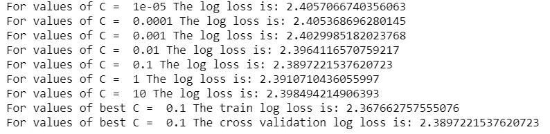**

**因此，我们可以看到，与我们尝试的所有其他值相比，C=0.1 具有最低的对数损失。因此，我们将使用 C=0.1 来训练我们的逻辑回归，并使用它来预测测试数据(test_1)的概率。**

```
best_c=0.1
lr = LogisticRegression(C=best_c, class_weight='balanced', multi_class='multinomial',solver='lbfgs' ,random_state=42)
lr.fit(train_1, y_train_1)
#Using Model Calibration
lr_sig_clf = CalibratedClassifierCV(lr, method="sigmoid")
lr_sig_clf.fit(train_1, y_train_1)lr_no_events_train_prediction=lr_sig_clf.predict_proba(train_1)
lr_no_events_cv_prediction=lr_sig_clf.predict_proba(cv_1)
lr_no_events_test_prediction=lr_sig_clf.predict_proba(test_1)
```

**仅使用电话品牌和设备型号 one-hot 编码作为特征，逻辑回归模型具有 2.38 的 CV 对数损失。**

****神经网络 1****

**从[竞赛讨论页](https://www.kaggle.com/c/talkingdata-mobile-user-demographics/discussion/23424)引用的神经网络架构**

```
def model_1_1(input_shape):
    model = Sequential()
    model.add(Dense(256, input_dim=input_shape))
    model.add(PReLU())
    model.add(BatchNormalization())
    model.add(Dropout(0.5))
    model.add(Dense(64))
    model.add(PReLU())
    model.add(BatchNormalization())
    model.add(Dropout(0.5))
    model.add(Dense(12))
    model.add(Activation('softmax'))
    model.compile(loss='categorical_crossentropy',
              optimizer='adam',
              metrics=['accuracy'])
    return model
```

****input_shape** 这里是 X_train_one_hot 中的特征数。**

**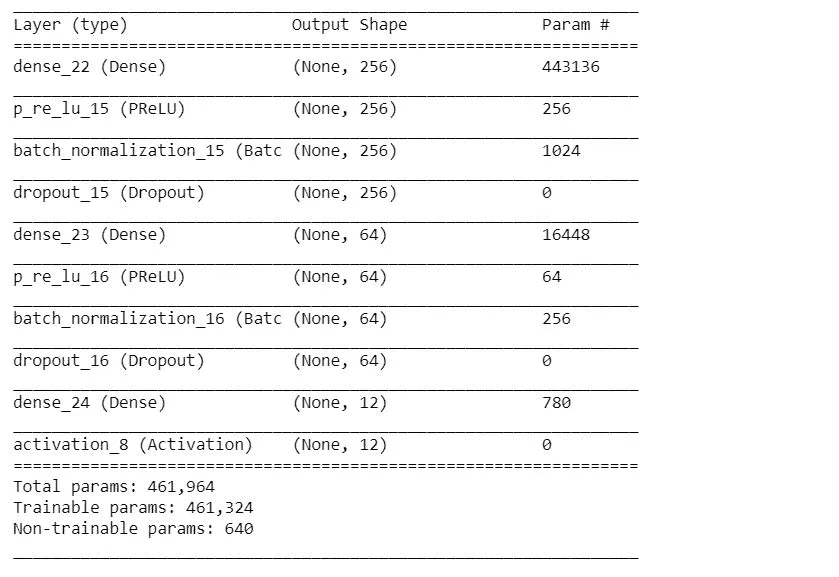**

**我在 X_train_one_hot 数据上使用不同的随机分割 train，CV 训练神经网络 1 模型 5 次，如下所示**

****model_list_1** 包含使用不同随机种子在不同版本的 X_train_one_hot 数据分割上训练的 5 个模型。我使用了 model_list_1 中的每个模型，并对测试数据(test_1)进行了概率预测，然后取所有预测的平均值。**

****神经网络 2****

**参考自[竞赛讨论页](https://www.kaggle.com/c/talkingdata-mobile-user-demographics/discussion/23424)的神经网络架构**

```
def create_model_1_2(input_dim, learRate=0.0025):

    model = Sequential()
    model.add(Dense(500, input_shape=(input_dim,), init='uniform'))
    model.add(PReLU(init='zero'))
    model.add(Dropout(0.82))
    model.add(Dense(12, init='uniform'))
    model.add(Activation('softmax'))
    opt = Adagrad(lr=learRate, epsilon=1e-08)
    model.compile(loss='categorical_crossentropy',
                  optimizer=opt,
                  metrics=['accuracy'])
    return model
```

**这里， **input_dim** 是 X_train_one_hot 中的特征数。**

**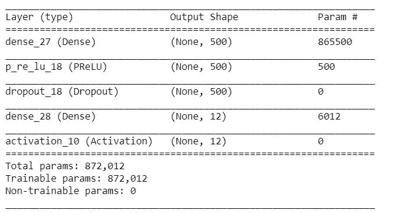**

**我在 train_1 上对神经网络 2 进行了一次 30 个时期的训练，并使用该模型对测试数据(test_1)进行预测。**

****具有事件详情的设备****

**让我们为我的模型创建训练、验证和测试数据，就像我们以前为没有事件数据的设备所做的那样。**

```
y_data_events=events_train_data['Class'].valuestrain_2, cv_2, y_train_2, y_cv_2 = train_test_split(X_train_events_one_hot_1, y_data_events,stratify=y_data_events,test_size=0.2,random_state=9)
test_2=X_test_events_one_hot_1y_train_nn_3=np_utils.to_categorical(y_train_2)
y_cv_nn_3=np_utils.to_categorical(y_cv_2)
```

**这里，X_train_events_one_hot_1 是我们在特征准备步骤中创建的列车数据的**事件特征矩阵**。X_test_events_one_hot_1 是测试数据的类似**事件特征矩阵**。**

****神经网络 3****

**从[竞赛讨论页](https://www.kaggle.com/c/talkingdata-mobile-user-demographics/discussion/23424)引用的神经网络架构**

**输入图层中的差值在此处增加了价值，因为它为预测提供了可变性，因为当我们在输入图层中使用差值时，在每次运行期间，只有一组随机要素被用作模型的输入。**

```
def model_2_1(input_dim):
    model = Sequential()
    model.add(Dropout(0.15, input_shape=(input_dim,)))
    model.add(Dense(240, init='uniform'))
    model.add(PReLU(init='zero'))
    model.add(Dropout(0.8))
    model.add(Dense(240, init='uniform'))
    model.add(PReLU(init='zero', weights=None))
    model.add(Dropout(0.35))
    model.add(Dense(260, init='uniform'))
    model.add(PReLU(init='zero', weights=None))
    model.add(Dropout(0.40))
    model.add(Dense(12, init='uniform'))
    model.add(Activation('softmax'))opt = Adagrad(lr=0.008, epsilon=1e-08)
    model.compile(loss='categorical_crossentropy',
                  optimizer=opt,
                  metrics=['accuracy'])
    return model
```

**这里， **input_dim** 是 X_train_events_one_hot_1 中的特征数。**

**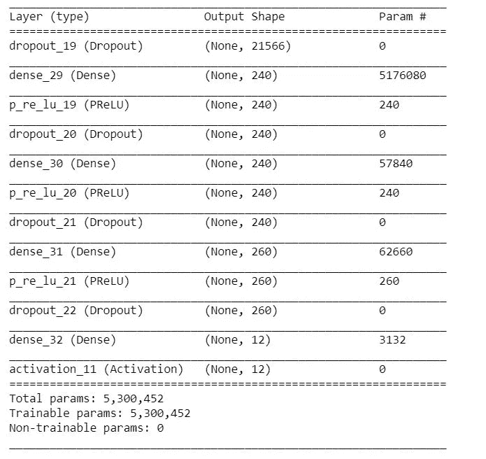**

**我训练神经网络 3 模型 20 次。**

**然后，我使用 model_list_2 中的 20 个模型中的每一个对测试数据(test_2)进行预测，并取预测概率的平均值。**

****神经网络 4****

**该神经网络是神经网络 3 的变体，但是具有 2 个密集层和不同数量的隐藏单元。**

```
def model_2_2(input_dim):
    model = Sequential()
    model.add(Dropout(0.4, input_shape=(input_dim,)))
    model.add(Dense(75))
    model.add(PReLU())
    model.add(Dropout(0.30))
    model.add(Dense(50, init='normal', activation='tanh'))
    model.add(PReLU())
    model.add(Dropout(0.20))
    model.add(Dense(12, init='normal', activation='softmax'))
    model.compile(loss='categorical_crossentropy',     optimizer='adadelta', metrics=['accuracy'])
    return model
```

**这里， **input_dim** 是 X_train_events_one_hot_1 中的特征数。**

**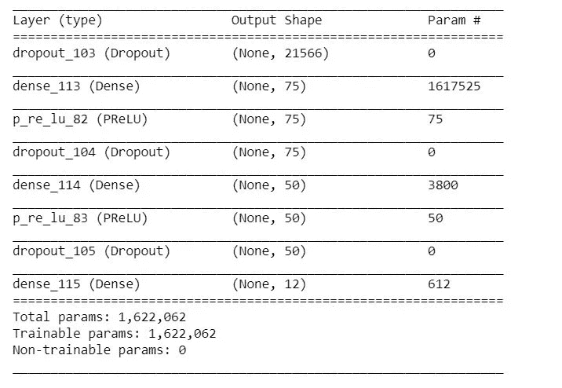**

**类似于我训练神经网络 3 的方法，我训练神经网络 4 模型 20 次。**

**然后，我使用 model_list_3 中的 20 个模型中的每一个对测试数据(test_2)进行预测，并取预测概率的平均值。**

# **模型集成**

1.  ****无事件数据的设备:**取 3 个模型预测值的加权平均值:**

*   **逻辑回归(lr _ no _ events _ test _ prediction)—**(0.15)****
*   **神经网络 1 平均预测值(test _ pred _ avg _ 1 _ 1)—**(0.75)****
*   **神经网络 2 预测(test_pred_1_2) — **(0.1)****

```
w1_1=0.15
w1_2=0.75
w1_3=0.1Test_Prediction_1=(w1_1*lr_no_events_test_prediction)+(w1_2*test_pred_avg_1_1)+(w1_3*test_pred_1_2)
```

****2。有事件数据的设备:**取 2 个模型预测的加权平均值:**

*   **神经网络 3 平均预测值(test _ pred _ avg _ 2 _ 1)—**(0.5)****
*   **神经网络 4 平均预测值(test _ pred _ avg _ 2 _ 2)——**(0.5)****

```
w2_1=0.5
w2_2=0.5Test_Prediction_2=(w2_1*test_pred_avg_2_1)+(w2_2*test_pred_avg_2_2)
```

**最后，我将有事件和无事件设备的这些测试数据预测连接起来，创建了包含 112071 行的整个测试数据预测文件，其中每行包含设备属于 12 个类别中每一个类别的预测概率。**

# **结果**

1.  ****无事件数据:**模型针对所有设备的手机品牌、设备型号的 One_Hot 编码进行训练。**
2.  ****事件数据:**仅针对包含事件细节的设备，在事件特征矩阵上训练模型。**
3.  **模型中的平均值表示模型有多次运行，并且预测是平均的。**

**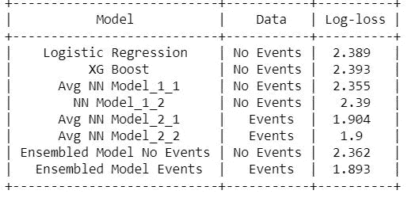**

**提交分数的串联测试预测:**

**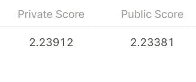**

# ****进一步改进****

1.  **为预测的加权平均值尝试不同的权重，以改善结果。**
2.  **也可以使用具有不同基础模型的模型集合，如随机森林或 XG Boost 或任何其他模型。**

**这是我第一篇关于媒体中的数据科学问题的博客。我希望我能够解释并帮助你理解我解决手头问题的方法。请随意查看我的 [GitHub 资源库](https://github.com/AbhishekKarthik/Talking_Data_User_Demographics)中的完整解决方案，并通过 [LinkedIn](http://www.linkedin.com/in/abhishek-anand9418) 联系我。**

****感谢您的阅读！！****

# ****参考文献****

1.  **[https://www . ka ggle . com/c/talking data-mobile-user-demographics/](https://www.kaggle.com/c/talkingdata-mobile-user-demographics/)**
2.  **[https://www.appliedaicourse.com/](https://www.appliedaicourse.com/)**
3.  **[https://www . ka ggle . com/c/talking data-mobile-user-demographics/discussion/23424](https://www.kaggle.com/c/talkingdata-mobile-user-demographics/discussion/23424)**
4.  **[https://machine learning mastery . com/model-averaging-ensemble-for-deep-learning-neural-networks/](https://machinelearningmastery.com/model-averaging-ensemble-for-deep-learning-neural-networks/)**
5.  **[https://machine learning mastery . com/weighted-average-ensemble-for-deep-learning-neural-networks/](https://machinelearningmastery.com/weighted-average-ensemble-for-deep-learning-neural-networks/)**