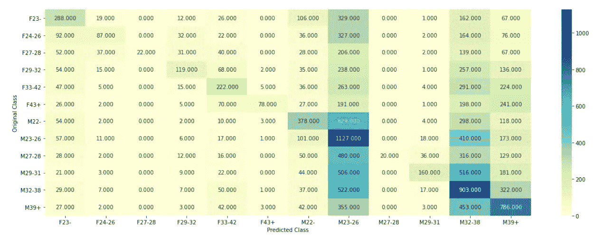

# 对话数据用户人口统计

> 原文：<https://medium.com/analytics-vidhya/talking-data-user-demographics-3fa17702ad9f?source=collection_archive---------8----------------------->

# 目录

1.  介绍
2.  数据概述
3.  估价
4.  探索性数据分析
5.  我的方法
6.  特征抽出
7.  性别分类模型
8.  年龄回归模型
9.  最终分类模型
10.  集成建模
11.  进一步的改进
12.  参考

# 1.介绍

*来源:* [*Kaggle 比赛页面*](https://www.kaggle.com/c/talkingdata-mobile-user-demographics/)

[中国最大的第三方移动数据平台 TalkingData](https://www.talkingdata.com/) 明白，日常的选择和行为描绘了我们是谁，我们重视什么。目前，腾云天下正在寻求利用中国每天活跃的 5 亿移动设备中超过 70%的行为数据，帮助其客户更好地了解他们的受众并与之互动。

在这场比赛中，Kagglers 面临的挑战是建立一个模型，根据用户的应用程序使用、地理位置和移动设备属性来预测用户的人口统计特征。这样做将有助于全球数百万开发者和品牌广告商追求数据驱动的营销努力，这些努力与他们的用户相关并迎合他们的偏好。

# 2.数据概述

*   **gender_age_train.csv，gender_age_test.csv** —训练和测试集
*   **组:**这是您要预测的目标变量
*   **events.csv，app_events.csv** —当用户使用 TalkingData SDK 时，事件被记录在该数据中。每个事件都有一个事件 id，位置(纬度/经度)，事件对应 app_events 中的一个应用列表。
*   **时间戳:**当用户使用带有 TalkingData SDK 的应用时
*   **app_labels.csv** —应用程序及其标签，label_id 可用于连接 label_categories
*   **label_categories.csv** —文本形式的应用程序标签及其类别
*   **phone _ brand _ device _ model . CSV**—设备 id、品牌和型号

# 3.估价

使用多级对数损失对提交的内容进行评估。每个设备都标有一个真实的类别。对于每种设备，你必须提交一套预测概率(每类一套)。公式是，

其中，N 是测试集中设备的数量，M 是类别标签的数量，log 是自然对数，如果设备 I 属于类别 j，yij 是 1，否则是 0，pij 是观测值 I 属于类别 j 的预测概率。

给定设备的提交概率不要求总和为 1，因为它们在评分之前被重新缩放(每行除以行总和)，但它们需要在[0，1]的范围内。

**3.1。将真实世界问题映射到机器学习问题:**

1.  这是一个多类分类问题。
2.  要预测的 12 个类别是:F23-，F24–26，F27–28，F29–32，F33–42，F43+，M22-，M23–26，M27–28，M29–31，M32–38 和 M39+。

**3.2。目标:**

预测每个数据点属于 12 个类别的概率。

**3.3。约束条件:**

*   需要类别概率。
*   没有延迟限制。

# 4.探索性数据分析

首先，让我们检查数据是否平衡。从 gender_age_train.csv 文件中的 group 列可以观察到数据是不平衡的。

组列的计数图

此外，让我们将数据分为两组，即男性和女性，并检查这些组的计数之间的差异。男性的数量比女性多得多。

在训练数据中，有四列指定了用户的设备 id、性别、年龄和组。

训练数据列

在测试数据中，只有一列，即我们必须预测其年龄组的 device_id。

测试数据

现在，我们评估人们使用的手机品牌。因为这个数据是基于中国的人口，所以大部分手机品牌都是中国的。

电话 _ 数据

电话数据由三列组成，即设备 id、电话品牌和设备型号。它指定了特定用户使用的电话品牌和型号。

现在，我们来分析一下手机品牌。

十大手机品牌柱状图

小米、三星和华为这三大品牌占据了总设备的 60%以上。数据中总共有 73 个手机品牌。

现在，我们将检查年龄和手机品牌之间是否存在相关性。

代表年龄和手机品牌相关性的方框图。

红线代表所有用户的年龄特征的中间值。可以观察到，三星、联想、华为等品牌被老年人群使用，Vivo、魅族等品牌被年轻人群使用。

我们接下来要分析的是人们使用的设备型号。总体使用的整个数据中共有 1599 个设备型号。

前 15 个设备型号的条形图

红米 Note、米 3、米 2S、Galaxy Note 3 是用户首选的顶级设备型号。排名前 15 位的设备型号仅占总市场的 25%左右。

现在，让我们检查年龄组和设备型号之间的相关性。

用于查找年龄和设备型号之间相关性的箱线图

从上面的方框图可以观察到，Mate 7、Galaxy Note 3、Galaxy Note 2、Honor Play 4x、Galaxy S3 都是老用户在用。其他设备如 Redmi NOTE，MI 2S 在年轻一代中很受欢迎。

现在，让我们检查一下与其相关的 app_labels 和事件。

前 20 个应用标签的条形图

总共有 473 个应用类别。总应用类别中排名前 10 的应用类别约占总应用的 68.116%。排名靠前的 app 类别有行业标签、自定义标签、腾讯 App、游戏账号、物业行业等。腾讯控股有限公司是一家中国跨国集团控股公司，其子公司在中国和全球专注于各种互联网相关服务和产品、娱乐、人工智能和技术。

现在，让我们看看为特定设备记录的事件。

列车数据中有和没有事件的设备的饼图

测试数据中有和没有事件的设备的饼图

在训练和测试数据中，大约 2/3 的设备没有记录任何事件。这些设备的唯一信息是手机品牌和设备型号。

## 来自数据分析的见解

1.  数据不平衡。
2.  所有的功能工程只在 31%的设备上完成，因为它们有事件记录。对于没有事件的设备，唯一可以使用的功能是电话品牌和设备型号。
3.  手机品牌和设备型号因年龄组而异。
4.  可用于带有事件的设备的其他功能有 app_id、app_labels、事件小时、事件日和应用活动状态。

# 5.我的方法

工艺流程图

首先，我们将从数据中提取所有特征。将要使用的功能有手机品牌、设备型号、应用 id、应用标签、应用活动、活动小时和活动日。一个热编码和 TF-IDF 矢量器用于特征提取。

因为我们有分别指定确切年龄和性别的列，所以我们可以利用这些数据构建单独的模型，首先预测性别和年龄，然后将这些模型的输出作为最终模型的特征。

现在，我们将分别使用手机品牌、设备型号、应用 id、应用标签和活跃应用等特征来预测性别。这个分类模型的输出将给出用户是男性还是女性的概率。该输出将作为最终模型的一个特征。

然后，我们将使用回归模型来预测用户的年龄，使用的功能包括手机品牌、设备型号、应用 id、应用标签和应用活动以及活动时间。由于不同年龄组记录事件的时间不同，因此还将包括“事件时间”功能来预测年龄。

# 6.特征抽出

我们将使用一个热编码来提取手机品牌、设备型号、App_id 和 App_Label 等特征。

## 6.1.什么是热门编码？

在机器学习中，不可能直接处理分类数据。一种热编码将分类特征转换为更适合分类和回归算法的格式。一种热编码是将分类变量转换成一种形式的过程，这种形式可以提供给 ML 算法，以便在预测中做得更好。一种热编码是向量表示，其中向量的所有元素都是 0，只有一个元素的值是 1。

一个热点编码示例源— [Kaggle Page](https://www.kaggle.com/dansbecker/using-categorical-data-with-one-hot-encoding)

对于手机品牌和设备型号，我们可以直接构建一个 CSR 矩阵，其中 1 对应于设备的品牌，其余的 0 和设备型号相同。

但是对于 app_id，对于每台设备，我们都要标注它安装了哪些应用。因此，我们将获得与不同应用程序一样多的功能栏。

应用通过事件链接到设备。因此，要获得一个应用包，其中有一个 1 对应于设备中安装的所有应用，其余应用有零，我们可以遵循以下步骤:

1.  合并事件和 app_events 中的设备 id。
2.  按设备 id 和应用程序对结果数据帧进行分组并聚合。
3.  合并训练行和测试行列，以了解将每个器件放在特性矩阵的哪一行。

合并后，我们将得到这样的数据帧:

然后，我们可以构建一个 CSR 矩阵，其中 1 对应于设备中安装的应用程序，0 对应于未安装的应用程序。

app_labels 的特征提取以类似的方式完成。

现在，对于 apps_active、events hour 和 events day，我们将使用 TF-IDF 矢量器进行特征提取。

## 6.2.什么是 TF-IDF 矢量器？

TF-IDF 是术语 Frequency-Inverse Document Frequency 的缩写，是将文本转换为有意义的数字表示的一种非常常见的算法。该技术被广泛用于在各种 NLP 应用中提取特征。

**TF-IDF** 是词频和逆文档频的乘积。它可以表示为:

**Tf-idf(字)** = **tf(字)*idf(字)**其中

**TF(word)**= document . count(word)/文档中的总字数和

**idf(word)** = log(文档总数/包含 word 的文档数)(Source- [Page](https://www.commonlounge.com/discussion/99e86c9c15bb4d23a30b111b23e7b7b1) )

首先，我们将提取记录特定事件的时间和日期。然后，我们将结合每个设备记录事件的所有时间，并对其使用 TF-IDF 矢量器。对于事件发生的日子，我们将遵循类似的方法。

对于 apps_active，我们首先获得每个应用程序的活动状态字符串(作为布尔值),当一个事件被记录为特定设备的所有事件时。然后我们使用 TF-IDF 矢量器进行特征提取。

# 7.性别分类模型

首先，我们将把我们用来预测性别的 5 个特征叠加在一起。目标变量是 train_data.gender，我们必须首先使用 LabelEncoder 对其进行编码。

用于性别分类模型的特征

性别分类模型的目标变量

现在，我们建立一个逻辑回归模型。让我们先做一些超参数调优。

逻辑回归模型的超参数调整

我们从这个模型中得到 0.59394 的验证对数损失。让我们构建一个混淆矩阵，以可视化最佳 alpha(即 0.001)的性能

正确分类的女性人数为 963 人，正确分类的男性人数为 9183 人。

让我们尝试建立一个神经网络，看看我们是否可以改善这些结果。

神经网络综述

使用该神经网络，我们得到 0.58815 的验证对数损失。让我们使用混淆矩阵来可视化结果。

预测性别的神经网络模型的混淆矩阵

我们可以看到，虽然男性的正确预测数量有所减少，但女性的正确预测数量却显著增加。

因此，我们可以使用这个神经网络的结果作为最终分类模型的特征。

# 8.年龄回归模型

现在，我们将用于回归模型的 6 个特征堆叠在一起。将要使用的目标变量是 train_data.age。

用于回归的特征

回归模型的目标变量

利用这些特征，现在我们建立一个线性回归模型。该模型的输出使用最小最大缩放器进行预处理，并用作最终分类模型的特征。

## 8.1.什么是 MinMaxScaler？

最小最大缩放器重新缩放数据集，使得所有特征值都在范围[0，1]内。最小-最大缩放通常通过以下等式完成:

# 9.最终分类模型

我们将建立两个神经网络来预测群体，然后在集成建模中结合这些神经网络的结果。**集合模型**集合每个基础模型的预测，并对未知数据产生一次最终预测。

首先，我们将迄今为止设计的所有特性进行堆叠。来自数据和两个模型的预测的 7 个特征。因此，我们总共有 9 个特征，目标变量是 train_data.group。

用于最终分类模型的特征

最终分类模型的目标变量

## 9.1.神经网络 1

这个神经网络来自 [Kaggle 讨论页面](https://www.kaggle.com/c/talkingdata-mobile-user-demographics/discussion/23424)

神经网络代码

神经网络 1 摘要

通过在 sklearn 的 train_test_split()中使用不同的随机种子对训练数据进行多次拆分，我们使用多个模型进行训练，得到的平均验证损失为 2.23947。

验证预测可以使用以下混淆矩阵进行可视化:

使用神经网络 1 进行验证预测的混淆矩阵

我们可以观察到，正确预测数量最多的是 M23–26 类，其次是 M32–38、M39+等。

## 9.2.神经网络 2

这个架构也是从 [Kaggle 讨论页面](https://www.kaggle.com/c/talkingdata-mobile-user-demographics/discussion/23424)中引用的。

神经网络 2 架构

神经网络 2 摘要

像神经网络 1 一样，我们将训练数据分成几个训练和验证集，得到平均验证损失为 2.24441。

让我们设想一下神经网络 2 的验证预测。

该模型的正确预测数量减少。

# 10.集成建模

集成建模是运行两个或更多相关但不同的分析模型，然后将结果合成为单个分数或分布，以提高预测分析的准确性的过程。

在预测建模和其他类型的数据分析中，基于一个数据样本的单一模型可能会有偏差、高度可变性或完全不准确，从而影响其分析结果的可靠性。(来源— [页面](https://searchbusinessanalytics.techtarget.com/definition/Ensemble-modeling))

通过实验，我们可以找到正确的权重，以找到神经网络 1 和神经网络 2 的预测的加权平均值。

测试数据的最佳得分是当神经网络 1 被赋予 0.1 的权重而神经网络 2 被赋予 0.9 的权重时

预测的加权平均值

最后的预测是

最终预测数据框架

提交完 submissions_final.csv 文件后，我得到了以下分数。

KAggle 分数

# 11.进一步的改进

1.  这是我尝试过的一种方法，通过它我得到了很好的结果。我也尝试了其他方法，但无法获得良好的效果。另一个可以尝试的方法来自这个 [Kaggle 讨论页面](https://www.kaggle.com/c/talkingdata-mobile-user-demographics/discussion/22367)。
2.  我还上传了 Jupyter 笔记本，上面记录了我试图在我的 [Github 库](https://github.com/yashmarathe21/TalkingDataUserDemographics)中寻找解决方案的不同方法。请随意尝试改进这些方法。
3.  不同的神经网络结构可用于进一步降低测井曲线损失。
4.  在集合模拟中使用权重的实验。

这是我第一篇关于数据科学问题的中型文章。对于这个难题，已经有很多解决方案了。我尝试使用一种新的方法，这种方法在 Kaggle 讨论或 Github 解决方案中没有提到。你可以在我的 [Github 知识库](https://github.com/yashmarathe21/TalkingDataUserDemographics)中找到我的完整解决方案，如果你有任何建议，请评论或通过 [LinkedIn](https://www.linkedin.com/in/yash-marathe-a3658917b/) 联系我

感谢您的阅读！！

# 12.参考

1.  [https://medium . com/analytics-vid hya/talking-data-user-demographics-19e 3d 15627 b5](/analytics-vidhya/talking-data-user-demographics-19e3d15627b5)
2.  [https://github . com/abhishekand 18/Talking _ Data _ User _ Demographics](https://github.com/AbhishekAnand18/Talking_Data_User_Demographics)
3.  [https://www . ka ggle . com/c/talking data-mobile-user-demographics/discussion/23424](https://www.kaggle.com/c/talkingdata-mobile-user-demographics/discussion/23424)
4.  [https://github . com/Yiqing yang 75/ka ggle-talking data-Mobile-User-Demographics](https://github.com/yiqingyang75/kaggle-TalkingData-Mobile-User-Demographics)
5.  [https://github.com/jonasca/TalkingData](https://github.com/jonasca/TalkingData)