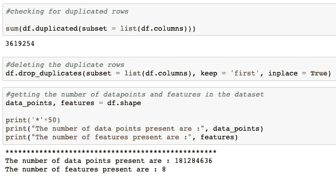

# TalkingData AdTracking 欺诈检测

> 原文：<https://medium.com/analytics-vidhya/talkingdata-adtracking-fraud-detection-71581e788d06?source=collection_archive---------6----------------------->

照片由[启动按钮](https://unsplash.com/@launchpresso?utm_source=medium&utm_medium=referral)在[上打开](https://unsplash.com?utm_source=medium&utm_medium=referral)

# 描述

欺诈风险无处不在，但对于在网上做广告的公司来说，点击欺诈可能会大量发生，导致误导性的点击数据和金钱浪费。广告渠道可以通过大规模点击广告来推高成本。每月有超过 10 亿台智能移动设备在使用，中国是世界上最大的移动市场，因此遭受着大量的欺诈流量。

[TalkingData](https://www.talkingdata.com/) ，中国最大的独立大数据服务平台，覆盖全国 70%以上的活跃移动设备。他们每天处理 30 亿次点击，其中 90%是潜在的欺诈。他们目前为应用程序开发人员防止点击欺诈的方法是测量用户点击其产品组合的旅程，并标记产生大量点击但从未最终安装应用程序的 IP 地址。根据这些信息，他们建立了一个 IP 黑名单和设备黑名单。

**目标:**建立一个机器学习模型，预测用户点击移动应用添加后是否会下载应用。

## 先决条件

本文假设读者熟悉机器学习的基本概念，如逻辑回归、决策树、随机森林、梯度提升决策树、K-Fold 交叉验证、超参数调整、数据编码、过度拟合、离群值、一键编码、混淆矩阵、Python 语法、数据结构、冷启动问题等。

## 数据集概述

每行包含一个点击记录，具有以下特征。

*   `ip`:点击的 ip 地址。
*   `app`:营销用 app id。
*   `device`:用户手机的设备类型 id(如 iphone 6 plus、iphone 7、华为 mate 7 等。)
*   `os`:用户手机的 os 版本 id
*   `channel`:移动广告发布商的渠道 id
*   `click_time`:点击时间戳(UTC)
*   `attributed_time`:如果用户点击广告后下载应用，这是应用下载的时间
*   `is_attributed`:要预测的目标，表示 app 已下载

特征(`ip`、`app`、`device`、`os`和`channel)`被编码。

## 现实世界/业务目标和约束

*   错误分类的成本很高。
*   没有严格的延迟要求。
*   需要数据点属于每个类(0，1)的概率。
*   可解释性很重要。

## 性能指标

来源:[https://www . ka ggle . com/c/talking data-ad tracking-fraud-detection/overview/evaluation](https://www.kaggle.com/c/talkingdata-adtracking-fraud-detection/overview/evaluation)

*   AUC ROC
*   二元混淆矩阵

## 读取数据

首先，我们需要导入我们将使用的导入库。

图 0:导入重要的包

我们将使用 Pandas 来加载数据集。

图 1:数据集的前五行

我们可以观察到属性时间有一个值。对于在点击应用广告之后没有下载应用的用户，特征 attributed_time 将是 NaN(is _ attributed = 0)，而对于在点击应用广告之后下载了应用的用户，attribute_time 将具有类似于 click_time 的时间值(is_attribute = 1)。

## 探索性数据分析

探索性数据分析是指对数据进行初步调查的关键过程，以便发现模式，发现异常，测试假设，并借助汇总统计数据和图表检查假设。

*   首先，我们将删除数据集中所有重复的行，因为这将影响我们模型的结果。

图 2:删除重复的数据点

我们可以看到，在我们的数据集中总共有 3619254 个重复数据点，在我们的数据集中总共有 181284636 个(大约 18 亿)数据点。

*   让我们检查基于类别标签的数据分布，即属于类别 0 和类别 1 的点的百分比。

图 3:类别标签的分布

我们可以看到数据集是高度不平衡的。这是机器学习中常见的问题之一。请通过[这篇](https://towardsdatascience.com/methods-for-dealing-with-imbalanced-data-5b761be45a18)(博客)了解更多。

*   让我们检查一下每个要素有多少个唯一值。

图 4:特性的唯一值

*   检查除 attribute_time 之外的给定要素的缺失值。

图 5:检查缺失值

使用上面的代码，我们还可以检查其他特性的缺失值，结果发现不存在缺失值。

*   现在，让我们检查是否有点击后总是下载应用程序的 ip 和点击后从不下载应用程序的 ip。这可能是非常有用的信息。

图 6:总是下载和从不下载

我们可以对其他功能(应用程序、操作系统、渠道、设备)进行同样的检查。

*   我们还应该每小时检查一次点击的分布情况。它会告诉我们，一天中什么时候点击量高，什么时候点击量低。有了这些信息，我们可以创建基于时间的功能，如时间间隔。

图 7:点击次数与小时数

我们可以观察到每天的点击数和每小时的点击数几乎是一样的。

*   我们可以检查 attributed_time 功能中的数据异常，这可以通过创建一个新的功能 difference_time 来完成，该功能将具有用户在单击广告后下载应用程序所用的时间(以分钟为单位)。现在，根据常识，这个特性的值不能是负的，因为属性 time 是用户点击广告的时间(click_time)。因此，删除负值。此外，在下载应用程序之前，人们会阅读应用程序的评论，或查看应用程序的内容。因此，他最多需要 15 分钟来点击下载，因为一些游戏应用程序可能有视频，一个人可能希望看到它并决定他是否要下载它。因此，差异属性不应大于 15 分钟。这里我们将负值和大于 15 的值视为异常值。

图 8:移除异常值

## 数据的采样和分割

让我们取一个小的数据样本，因为 18000 万对计算来说太多了，我们取了 30 万个随机采样的数据点，两个类都有 1.5 万个数据点。

图 9:采样数据

我们在该数据中使用了基于时间的分割。对于训练，我们有整个数据集的 80%，对于交叉验证，我们有训练数据集的 20%，对于测试，我们有整个数据集的 20%。

图 10:分割数据

## 特征工程

特征工程是使用数据的领域知识来创建使机器学习算法工作的特征的过程。

在这种情况下，我们也可以创建新功能，如果我们将 ip 视为区域(位置)，我们可以说，拥有特定设备的特定区域的用户不会使用特定的应用程序，即使在单击广告后也不会下载它。在这里，我们可以结合 ip +设备来创建新功能。这样，我们可以创建功能(ip、应用程序、设备、操作系统、通道)的电源集，并通过检查是否有仅对应于 0 类和 1 类的 ip 和设备组合来检查这些新创建的功能有多好。

图 11:新特性

同样，我们可以做其他组合，检查结果。如果我们观察上述结果，几乎有 70%的唯一 ip_device 对应于类别 1 和大约。对应于类别 0 的唯一 ip 设备的 23%。因此，我们可以说这个特性非常有用，因为它具有唯一的值，可以将我们的类标签彼此分开。

在我们的例子中，发现包含 ip 的特征组合比不包含 ip 的特征组合具有更高的可分性。

下面我们借助 click_attribute 特性介绍一些基本特性。我们可以引入一天中的几个小时作为该功能，因为一些小时可能会有更多的欺诈点击，因为欺诈者可能在那个时间很活跃。引入星期几没有用，因为数据集中的星期是星期一、星期二、星期三和星期四，它们是工作日。我们可以引入一个时间间隔特征，即[0–3]，[4–7]，[8–11]…[20–23]。

图 12:小时和时间间隔

## 冷启动问题

冷启动是基于计算机的信息系统中的一个潜在问题，它涉及一定程度的自动化数据建模。具体而言，它涉及这样的问题，即系统不能对其尚未收集足够信息的用户或项目做出任何推断，即如果我们的模型在训练时间内没有看到类似的数据，则我们的模型将不能对数据点是否属于哪个类别标签进行分类。当我们在测试数据集中拥有全新的数据点时，就会出现这种情况。

因此，为了检查我们的模型在测试期间可能会面临多大的冷启动问题。我们检查我们的训练数据与我们的 cv 数据有多大的不同。我们担心冷启动问题，因为随着时间的推移，趋势会发生变化，即在我们部署模型后可能会引入新的应用程序，而我们的模型可能没有足够的信息将其分类到特定的类别标签。

为了克服这个问题，我们必须在一段时间间隔后用新数据训练我们的模型，以保持其预测正确类别标签的性能。

图 13.1:冷启动问题

图 13.2:冷启动问题

我们可以看到，与 ip 相关的特征具有更高的可分性机会，但是由于它具有冷启动问题，所以它可能会影响我们的模型。因此，我们可以使用不同的特征训练不同的模型，看看哪一个表现最好。

**Feature_Set 1:它将包含所有基本功能+添加了欺诈和下载百分比> 90 +时间功能的新功能。**

**Feature_Set 2:将包含所有基本功能+添加了欺诈的新功能和下载百分比> 90 +冷启动问题少于 10%的功能+时间功能。**

**特征集 3:将包含所有基本特征+冷启动问题少于 10%的新特征+时间特征。**

**Feature_Set 4:将包含所有基础特性 app、os、渠道特性+时间特性的组合。**

**Feature_Set 5:将包含所有基础特性 app、os、渠道、设备特性+时间特性的组合。**

## 数据特征化

在我们建模之前，我们必须始终特征化我们的数据。这里我们的特征是分类的，所以我们可以选择一次性编码。因为每个特征有太多的类别，我们可能最终会有非常高维的数据。所以我们会做响应编码。从给定的图中可以粗略估计出响应编码实际上是什么。

图 14 响应编码(参考:[https://www.appliedaicourse.com/](https://www.appliedaicourse.com/)

在响应编码中，给定一个特征，我们将其转换成“ **k** ”(类别标签的数量)特征。在上面的例子中，我们只有 2 个类(0 和 1 ),我们得到了两个特征状态的特征。

state_[i]的每个值表示属于类[i]的值的概率，该概率由类中出现次数/总出现次数给出。这里[i]属于 0 和 1。

我们可以用同样的方式为所有特性实现响应编码。

图 15.1:响应编码功能定义

图 15.2:响应编码功能调用

我们使用 pickle 保存响应编码向量，并在需要训练模型时使用它们。

## 建模

我们应该为每个特性集创建模型，并决定哪个模型是最好的。

该模型的代码如下:

图 16.1 列车/测试响应编码

这里我们使用 np.hstack 来添加所有的响应编码特性。上图只显示了两个特征。类似地，可以对所有需要的特征进行这种处理，我们可以获得最终的训练和测试响应编码。

**混淆矩阵**:混淆矩阵是一个表格，通常用来描述一个分类模型(或者“分类器”)在一组真实值已知的测试数据上的性能。它允许算法性能的可视化。要了解更多信息，请点击[这个](https://towardsdatascience.com/understanding-confusion-matrix-a9ad42dcfd62)。

图 16.2:混淆矩阵函数定义

**具有超参数调整的 GBDT 模型:**

图 16.3:型号代码

图 16.4:模型结果

# 结论

我们发现，具有特征集 4 的 GBDT 模型表现最好，对于测试数据集的 AUC 为 98.18%。98.18%的 AUC 表示，对于一个数据点，如果我们的模型预测类别标签为 0，那么我们的数据点有 98.18%的机会被正确分类。

我希望我已经让你很好地理解了手头的问题以及我是如何解决它的。这是我第一次尝试写博客，所以我希望读者能慷慨一点，忽略我可能犯的小错误。如果你认为他们可以改善这个博客，请随时提供意见/批评，我一定会努力做出必要的改变。

***感谢阅读！***

***领英:***【https://www.linkedin.com/in/mohit-angrish-873026130/】T4

# 参考资料:

*   [https://www . ka ggle . com/c/talking data-ad tracking-fraud-detection](https://www.kaggle.com/c/talkingdata-adtracking-fraud-detection)
*   [https://www.appliedaicourse.com/](https://www.appliedaicourse.com/)
*   [https://stackoverflow.com/](https://stackoverflow.com/)