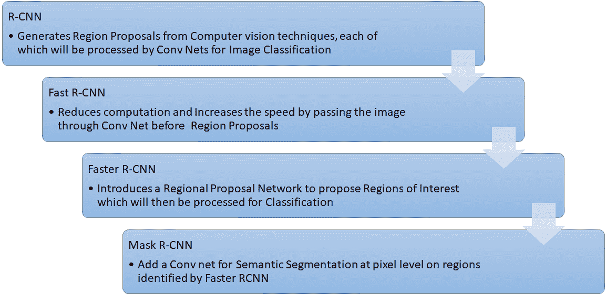
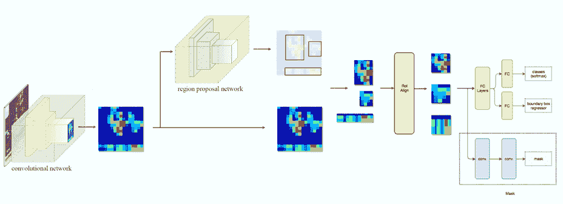
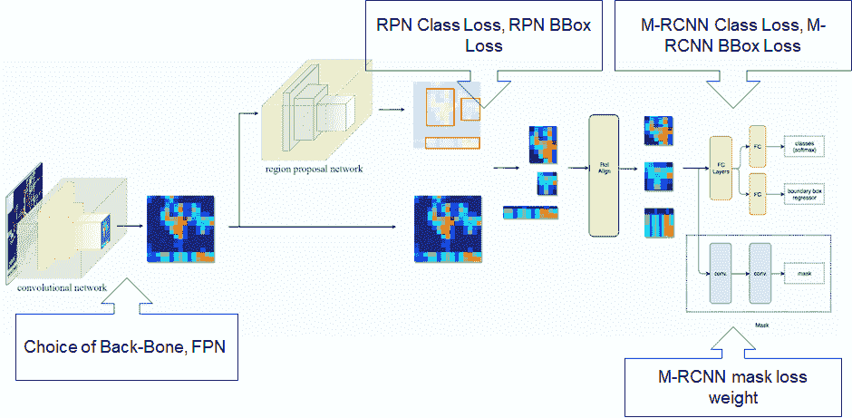

# 驯服掩模 RCNN 的超参数

> 原文：<https://medium.com/analytics-vidhya/taming-the-hyper-parameters-of-mask-rcnn-3742cb3f0e1b?source=collection_archive---------3----------------------->

本文简要介绍了 Mask R-CNN 的发展，并解释了所使用的不同超参数。它还强调了不同的技术，这将有助于调整口罩 R-CNN 模型的超参数。

本文描述了 Anisha Alluru、Elizabeth Reid Heath、Manas Rai、Ravikiran Bobba、Vishal Ramachandran 建造的项目的经验。跟随这个 [GitHub 库](https://github.com/RavikiranBobba/iMat-Fashion)获取我们关于实现 Mask RCNN 的完整代码，用于 2019 的【this 唯物主义时尚挑战赛的实例分割。

简介:

mask-RCNN 是基于区域的 CNN 家族的最新成员之一，由人工智能研究中心(FAIR)的何和团队于 2018 年 1 月推出。这里有一个[链接](https://arxiv.org/pdf/1703.06870.pdf)到该团队发表的官方论文。Mask R-CNN 在 Coco 分割挑战赛中具有最高的准确性，并在推出后被广泛用于不同的实例分割比赛。掩模 R-CNN 是更快的 R-CNN 的扩展，它为检测到的每个对象创建像素级别的掩模。这在工业中有多种应用，用于计数不同的物体，为使用机器人操纵器的操作精确地评估物体的位置等等。mask-RCNN 由 Matterport 为不同的项目实现，并在其 Github 库中使用 R-CNN 开源了他们的大量工作。除了这种增强的性能之外，Mask R-CNN 还涉及几个超参数，这些参数需要根据应用进行仔细调整。由于最近才出现，关于这些超参数的文献非常有限，本文旨在概述掩模 RCNN 中涉及的特殊超参数。

掩模 R-CNN 的发展；

Mask R-CNN 是一种应用于快速 RCNN 的元算法，用于实例分割。本文[“计算机视觉——从 CNN 到 Mask R-CNN 和 YOLO 之旅——部分”](https://towardsdatascience.com/computer-vision-a-journey-from-cnn-to-mask-r-cnn-and-yolo-1d141eba6e04)详细解释了 Mask RCNN 的发展历程。对这一演变的概述对于理解超参数非常重要，因为它们是基于这些架构的。下面是这一发展的简要概述。

掩模 R-CNN 的发展综述

屏蔽 R-CNN 架构:

屏蔽 R-CNN 架构

上面的框图代表了 Mask R-CNN 架构。每个步骤的简要描述如下:

1.  图像通过卷积网络。
2.  第一 conv 网络的输出被传递到区域提议网络(RPN ),该网络基于要检测的任何对象的存在来创建不同的阿克尔盒(感兴趣区域)。
3.  锚定框被发送到 ROI 对准阶段(用于保护空间方向的掩模 RCNN 的关键特征之一)，该阶段将 ROI 转换为进一步处理所需的相同尺寸
4.  该输出被发送到完全连接的层，该层将生成该特定区域中的对象的类的结果以及该对象的边界框的位置
5.  ROI 对准级的输出被并行发送到 Conv 网，以便生成对象像素的掩模

有关屏蔽 R-CNN 步骤的详细说明，请参考本文。

超参数:

以下是屏蔽 R-CNN 特有的几个超参数

*   脊柱
*   火车 _ ROIs _ Per _ Image
*   最大实例数
*   检测 _ 最小 _ 置信度
*   图像最小尺寸和图像最大尺寸
*   损失权重:rpn_class_loss
*   损失权重:rpn_bbox_loss
*   损失权重:mrcnn_class_loss
*   损失权重:mrcnn_bbox_loss
*   损失权重:mrcnn_mask_loss

背骨:

主干是将在屏蔽 R-CNN 的第一步中使用的 Conv 网络架构。主干网的可用选项包括 ResNet50、ResNet101 和 ResNext 101。这种选择应该基于训练时间和准确性之间的权衡。ResNet50 将花费相对较少的时间比后来的，并有几个开源的预先训练的权重为庞大的数据集，如可可，这可以大大减少不同的实例分割项目的训练时间。ResNet 101 和 ResNext 101 将花费更多的时间进行训练(由于层数的原因)，但是如果不涉及预先训练的权重并且诸如学习速率和时期数之类的基本参数被很好地调整，则它们往往更准确。

理想的方法是从预先训练好的权重开始，如带有 ResNet 50 的 coco，并评估模型的性能。这将在涉及在 coco 数据集中训练的真实世界对象的检测的模型上更快更好地工作。如果精度至关重要，并且有高计算能力，则可以考虑 ResNet101 和 ResNeXt 101 选项。

火车 _ ROIs _ Per _ Image

这是区域建议网络将为图像生成的 ROI 的最大数量，将在下一阶段对其进行进一步处理以进行分类和屏蔽。如果映像中的实例数量未知，理想的方法是从默认值开始。如果实例数有限，可以减少实例数以减少训练时间。

最大实例数:

这是一幅图像中可以检测到的最大实例数。如果映像中的实例数量有限，可以将其设置为映像中可以出现的最大实例数量。这有助于减少误报并减少训练时间。

检测 _ 最小 _ 置信度:

这是置信水平阈值，超过该阈值将对实例进行分类。初始化可以是缺省的，并根据在模型中检测到的实例数量而减少或增加。如果检测一切都很重要，并且误报是可以的，那么降低阈值以识别每个可能的实例。如果检测的准确性很重要，则通过保证模型只预测可信度非常高的实例，来增加阈值以确保假阳性最小。

图像最小尺寸和图像最大尺寸:

图像大小由这些设置控制。默认设置将图像调整为 1024x1024 大小的正方形。可以使用较小的图像(512x512 ),以减少内存需求和训练时间。理想的方法是在较小的图像尺寸上训练所有的初始模型，以便更快地更新权重，并且在最终阶段使用较大的尺寸来微调最终的模型参数。

损失权重:

掩模 RCNN 使用复杂的损失函数，其被计算为在模型的每个状态下不同损失的加权和。减重超参数对应于模型应该分配给其每个阶段的重量。

*   Rpn_class_loss:这对应于由区域提议网络分配给锚箱的不正确分类(任何对象的存在/不存在)的损失。当模型在最终输出中没有检测到多个对象时，该值应该增加。增加这一点可确保区域提案网络能够捕捉到它。
*   Rpn_bbox_loss:这对应于 Rpn 的定位精度。这是在检测到对象但边界框应该被校正的情况下要调整的权重
*   Mrcnn_class_loss:这对应于分配给区域建议中存在的对象的不正确分类的损失。如果从图像中检测到对象，但是分类错误，则该值将增加
*   Mrcnn_bbox_loss:这是在所识别的类的边界框的定位上分配的损失，如果完成了对象的正确分类，它将增加，但是定位不精确
*   Mrcnn_mask_loss:这对应于在被识别对象上创建的遮罩，如果像素级的识别很重要，则该权重将被增加

上述超参数显示在下图的框图中。

具有超参数的掩模 R-CNN 结构

用于调整掩模 R-CNN 的损失权重的理想方法是从基本模型开始，其中每个模型的默认权重为 1，并且通过可视化不同图像上的模型性能并查看检测到的对象的数量、分类的对象的准确性、识别的对象的定位以及掩模的定位来评估模型在验证集上的性能。那么应该基于模型性能来调整相应的参数。

结论:

总之，Mask R-CNN 对于实例分割是一个很好的架构。然而，超参数的适当调整对于实现其潜力是重要的。像交叉验证的 GridSearch 这样的方法在 CNN 的情况下可能没有用，因为对模型有巨大的计算需求，因此理解超参数及其对整体预测的影响是重要的。本文解释了 Mask R-CNN 特有的最重要的超参数，以及如何对它们进行调整。

如果您有任何意见或建议，请告诉我们。我们希望这篇文章能帮助你理解超参数，并对你的项目有所帮助。

我们要感谢我们的教授 Joydeep Ghosh 博士，他激励我们在博客中分享我们的学习成果。