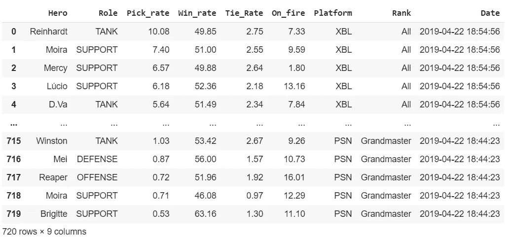
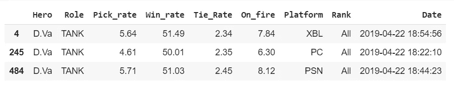
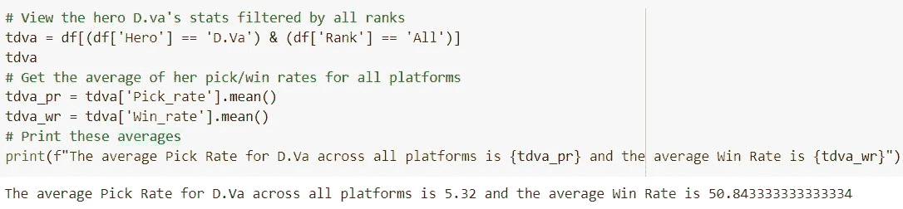
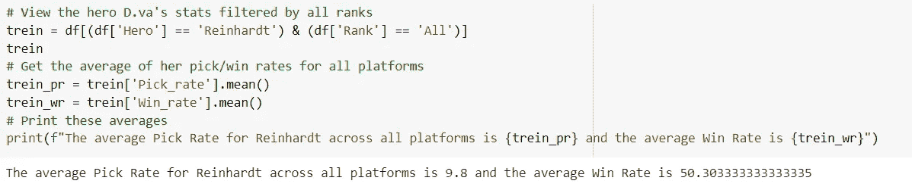
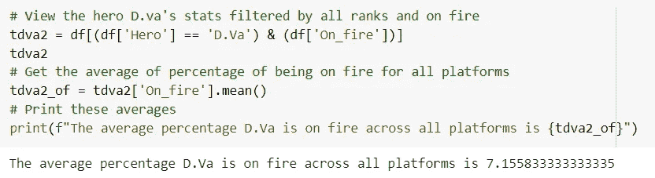
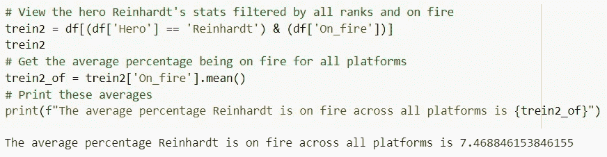
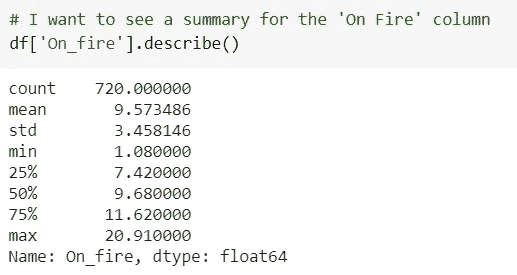
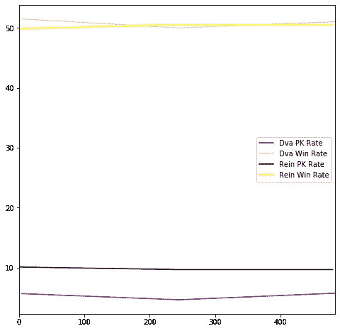
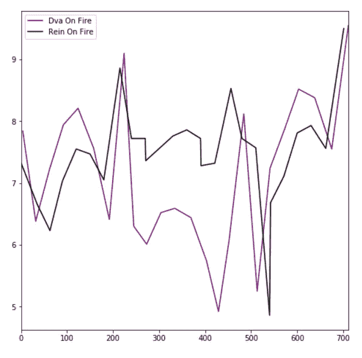

# 坦克对比:Dva 与 Rein

> 原文：<https://medium.com/analytics-vidhya/tank-comparison-dva-vs-rein-4714aa45c605?source=collection_archive---------17----------------------->

作为一个超级粉丝，我想用这个项目来研究我最喜欢的游戏中的一些数据。我一直把 Dva 作为我的主要题材，我忍不住喜欢她的角色。
我希望我的第一个项目有趣，并且是我喜欢的主题。
我也希望能够从最基础的英雄那里获得有见地的信息。

我要问的问题是“Dva 和 Reinhardt 在选择率、胜率和英雄燃烧多长时间方面相比如何”。
很多玩家都是根据自己的队伍构成甚至敌方队伍构成来选择这些坦克英雄的。这就是为什么我在没有任何这些变量的情况下，用最基本的方式来看这些数据及其比较。

首先，我想把数据作为一个整体来看，看看我在处理什么。
我需要看到全局，这样我才能知道我需要如何正确地过滤它，从中获得我需要的东西。

监视数据帧

我想做的下一件事是通过 Dva 过滤，并包括所有的等级。
我希望能够看到每个等级的平均收视率，以便更清楚地了解她的整个玩家群。

Dva 的过滤数据

这是我最喜欢的部分。我计算了她在每台游戏机上的选赢率的平均值。再说一次，我希望看到这些数字的全貌。我本可以说得更详细一些，比如把它分解到各个平台，但我决定不这么做。

我计算和显示她的平均值的代码

所以现在我们可以看到她的平均挑率是 5.32。这似乎有点低，特别是考虑到莱因哈特的 9.8，但这里的伟大之处是看她的胜率。即使选择率这么低，她仍然有 50.84%的胜率。太神奇了。

莱因哈特平均值

与 Dva 相比，Reinhardt 的平均得分似乎并不令人印象深刻。没关系，我们仍然爱他和他的盾！
现在我想看看他们都着火的平均百分比，这样我就可以比较他们了。

Dva 的火灾平均数

2Reinhardt 的火灾平均数

因此，我们现在可以看到，Dva 在游戏中花费的平均时间是 7.15%，Reinhardt 花费了大约 7.46%的时间。这很有趣，因为即使莱因哈特可能有较高的选择率和较低的胜率，他仍然有较高的命中率。这两个英雄的数字相对较低，因为所有平台和等级的所有英雄的平均数字是 9.57%。

着火摘要

我想包括的最后一件事是两张图表，这样你就可以看到所有这些数字是如何并列在一起的。这些图表并不代表平均值，而是这些比率的总数。

比较挑库/成功率

这个图表使我们更容易直观地看到 Dva 和 Reinhardt 的选择率之间的差异。这是一个相当不错的差距。
你还可以看到，仅仅比较他们的提货率并没有多大差别，但是，你可以看到提货率与胜率之间的明显差距。

比较火灾百分比

你可以看到他们着火的程度各不相同。这可能是由于等级等变量。

所以，总之，能够深入研究这样的数据并比较英雄是非常棒的。我从这个项目和随之而来的一切中获得了很多乐趣。探索数据和写这篇博客是我最喜欢的部分。

这里是我的笔记本，任何人都可以在这里查看我的作品。