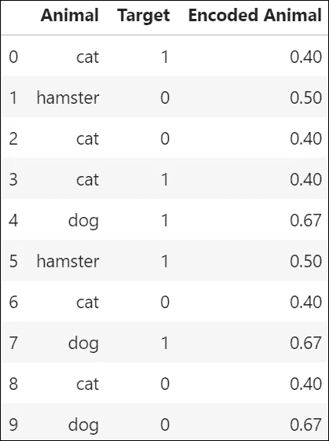
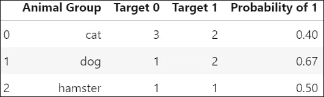
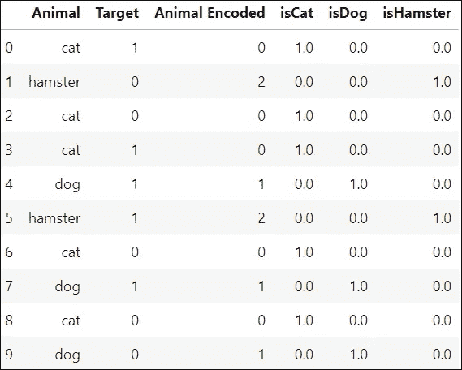

# 目标编码与一键编码的简单示例

> 原文：<https://medium.com/analytics-vidhya/target-encoding-vs-one-hot-encoding-with-simple-examples-276a7e7b3e64?source=collection_archive---------0----------------------->

对于机器学习算法来说，分类数据可能非常有用。然而，在它的原始形式下，大多数模型都无法识别它。为了解决这个问题，我们可以使用不同的“编码”技术来使我们的分类数据清晰易读。

在本帖中，我们将介绍数据科学模型中使用的两种常见编码技术— [目标编码](https://contrib.scikit-learn.org/categorical-encoding/targetencoder.html)和[一键编码](https://contrib.scikit-learn.org/categorical-encoding/onehot.html)。

# 目标编码

根据上面链接的文档，目标编码被定义为

> “用给定特定分类值的目标的后验概率和目标在所有训练数据上的先验概率的混合来替换特征。”

## 示例—目标编码



表 1:具有目标编码动物值的数据帧

为了更好地理解这意味着什么，让我们看一个例子。在表 1 中，我们在“动物”列中有分类数据，在“目标”列中有二元目标。在最后一列，我们有编码的动物值。那么我们是如何到达那里的呢？

1.  按每个类别对数据进行分组，并统计每个目标的出现次数(表 2)。
2.  接下来，计算给定每个特定“动物群体”的目标 1 出现的概率当我们这样做时，我们在表 2 中得到以下值:



表 2:显示目标编码如何计算概率的简化表格

3.最后，在新列中加回，它给出了每个动物组的概率值。这显示在第一个数据帧中(表 1)。现在你有了一个代表‘动物’特征的数值，可以被机器学习算法识别。

请注意，当您在 sklearn 中进行目标编码时，您的值可能会与使用上述方法获得的值略有不同。这是因为我们到目前为止只考虑了后验概率。Sklearn 还查看先验概率，在这种情况下是目标为 1 的概率。在这种情况下，这个概率是 0.5，因为我们有一半的时间目标等于 1。然后，Sklearn 使用该度量来帮助平滑编码值，以便不会给依赖于目标的目标编码特征太多权重。

## 这在代码中是什么样子的

在下面的代码中,‘category _ encoders’库用于快速完成目标编码(如上所述，不是手动完成的)。

1.  导入库

```
import pandas as pd
from category_encoders import TargetEncoder
```

2.目标编码和清理数据帧

```
encoder = TargetEncoder()
df['Animal Encoded'] = encoder.fit_transform(df['Animal'], df['Target'])
```

这将输出表 1 中的数据帧。这在多个分类特征中也是可重复的。

## 目标编码的好处

目标编码是一种简单快速的编码方法，不会增加数据集的维数。因此，它可以作为一个良好的首次尝试编码方法。

## 目标编码的局限性

目标编码依赖于目标的分布，这意味着目标编码需要仔细验证，因为它可能容易过度拟合。这种方法也是特定于数据集的，只会在某些时候显示出显著的改进。

# 一键编码

一键编码在概念上更容易理解。这种类型的编码只是“每个类别产生一个特征，每个二进制。”或者对于上面的例子，为猫、狗和仓鼠创建一个新特征。例如，在 cat 一栏中，我们表明一只猫以 1 存在，而它不以 0 存在。让我们看同一个例子来更好地理解这一点:

## 示例—一键编码

使用与上面相同的数据，当我们一次性编码时，我们的数据看起来像:



表 3:独热编码数据帧

请注意，现在我们有三个新列:“isCat”、“isDog”和“isHamster”每个“1”表示该特征包含特征标题中的动物。如果有一个 0，那么我们没有那个动物。再一次，我们现在有了机器学习算法可以解释的新特征。

让我们看看到达这里的步骤。

1.  导入包

```
import pandas as pd
from sklearn.preprocessing import OneHotEncoder 
from sklearn.preprocessing import LabelEncoder
```

1.  标签编码(给每个类别一个数值，即 cat = 0) —显示在表 3 的“动物编码”栏中。

```
le = LabelEncoder()
df['Animal Encoded'] = le.fit_transform(df.Animal)
```

1.  一键编码和清理数据帧

```
encoder = OneHotEncoder(categories = 'auto')X = encoder.fit_transform(
    df['Animal Encoded'].values.reshape(-1,1)).toarray()dfonehot = pd.DataFrame(X)
df = pd.concat([df, dfonehot], axis =1)
df.columns = ['Animal','Target','Animal Encoded',
                     'isCat','isDog','isHamster']
```

这将输出表 3 所示的完整数据帧。现在你有了 3 个机器学习算法可以理解的新特征。

## 一键编码的优势

One-hot 编码适用于名义数据，并消除了任何影响数据的较高分类值的问题，因为我们是以二进制 1 或 0 创建每一列的。

## 一键编码的局限性

根据您拥有的分类特征数量和每个特征的类别数量，一键编码可以创建非常高的维数。这不仅在较小的数据集中会成为问题，在较大的数据集中也可能成为问题。在运行模型时，将 PCA 与一键编码相结合有助于降低维数。在基于树的模型中，一键编码也是有问题的。进一步讨论见[此处](https://roamanalytics.com/2016/10/28/are-categorical-variables-getting-lost-in-your-random-forests/)。

# 结论

有许多不同类型的编码。我建议在深入研究特定数据集时探索其他选项。也就是说，这两种方法可以帮助您利用数据集中存在的分类特征。

你可以在我的 [GitHub](https://github.com/svideloc/EncodingBlogPost) 上访问我在这篇博客中使用的代码。