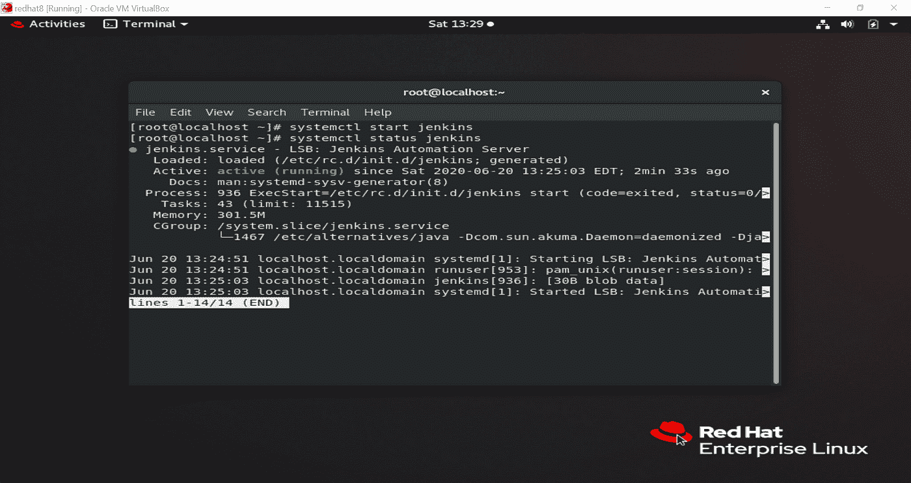
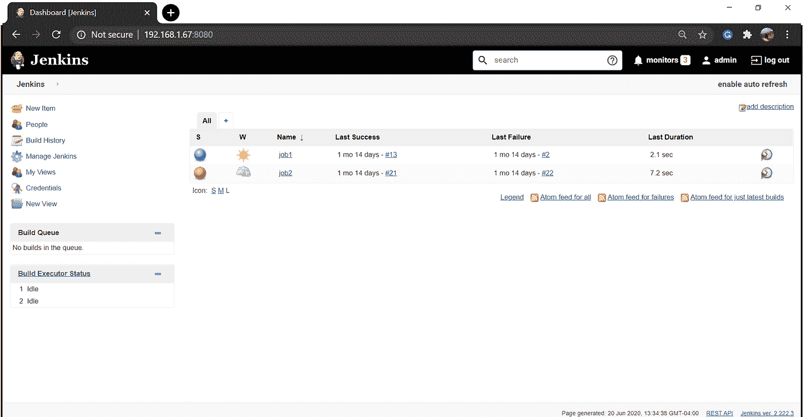
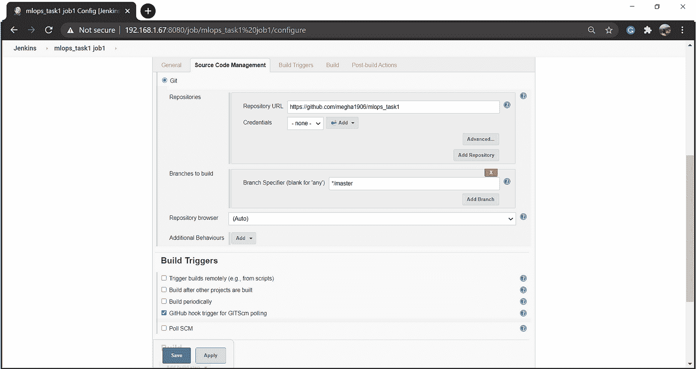
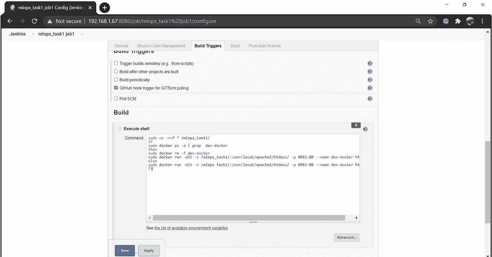
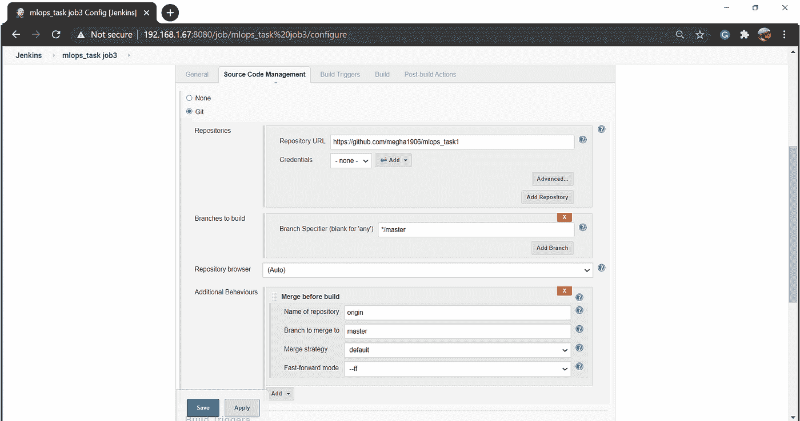
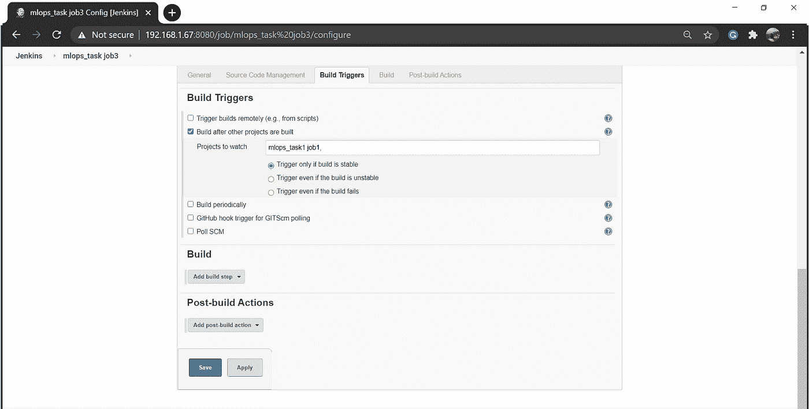
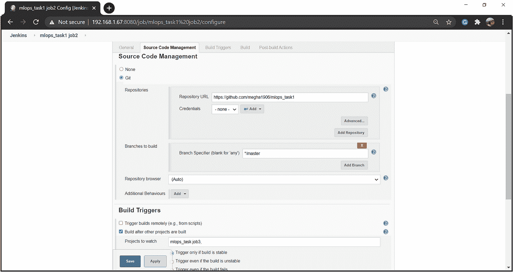
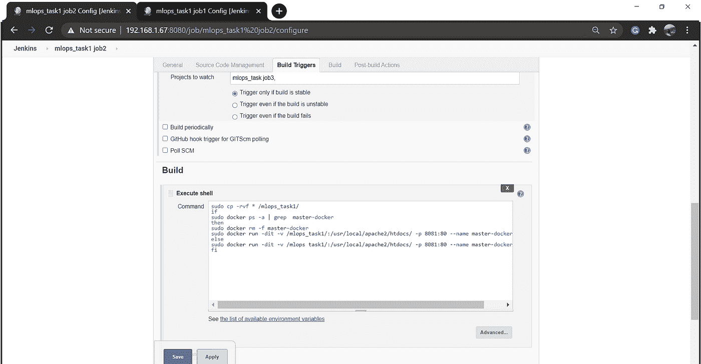
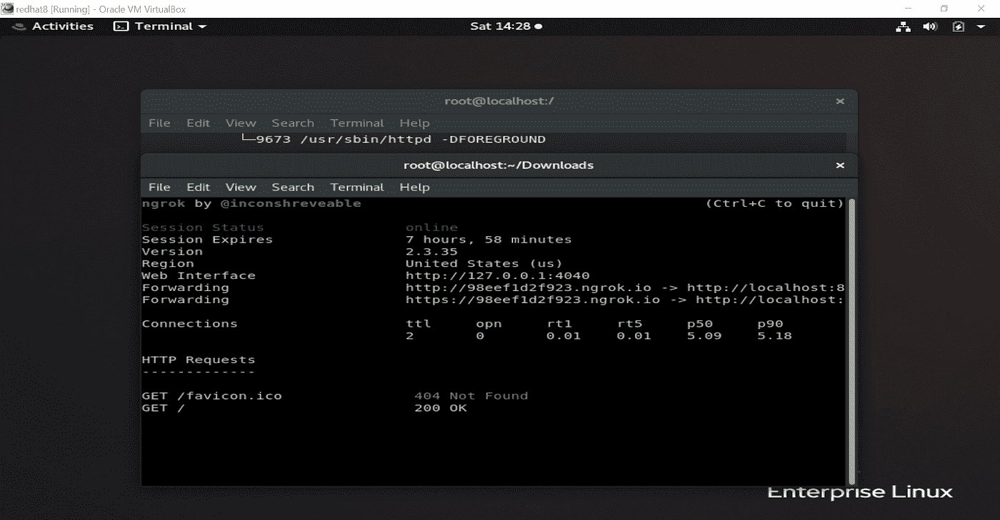
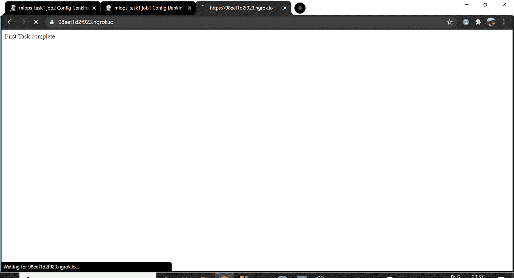

# GitHub、Jenkins 和 Docker 集成

> 原文：<https://medium.com/analytics-vidhya/task-1-github-jenkins-and-docker-integration-d3b7c1d60bb6?source=collection_archive---------20----------------------->

*   这个行业正朝着自动化的方向发展。这篇文章介绍了如何将我们的 **GitHub** 资源库与 **Jenkins** 整合，并使用容器( **Docker** )来部署网页(使用 httpd 映像)
*   我们必须在 GitHub 的一个新存储库中创建一个主分支和一个开发者分支。
*   然后，我们必须在詹金斯创造 3 个就业机会:

> **工单 1:**

如果开发者推至开发者分支，则 Jenkins 将从开发者分支获取并在开发者-docker 环境中部署网站(**测试环境)**

> **工作 2:**

如果开发人员推送到主分支，那么 Jenkins 将从主分支获取并部署在主对接环境(**生产环境**)上，并使用 ngrok(隧道)连接到世界。

> **工单 3:**

这是由**质量保证团队**管理的工作。如果该网站是正确的，并符合要求，这项工作将被执行。它将转到 GitHub，将开发者分支与主分支合并，并触发 JOB 2。

> **先决条件:**

*   **Linux**
*   **饭桶痛击**
*   **GitHub**
*   **Docker — CE**
*   詹金斯
*   **浏览器**

> **步骤:**

1)在本地创建一个包含两个分支- **Master** 和 **Developer** 的存储库，并添加了网站内容。

2) Jenkins 已经安装在我们的 Redhat8 系统中。我们必须开始它的服务。

Jenkins 为我们提供了一个易于使用的 UI，可以使用 RedHat 系统的 IP 地址从浏览器访问该 UI。

**3)工单 1:**

该作业将从 redhat 中的 GitHhub 下载文件并复制到指定的文件夹中，并将启动 docker OS。

为启动 docker 操作系统而编写的代码:

**4)工单 3:**

QAT(质量保证团队)将检查代码，如果它没有通过需求，那么它将不会与主分支合并。否则，它将被合并并触发 job2

**5)工单 2:**

如果开发人员推送到主分支，那么 Jenkins 将从主分支获取并部署到生产环境中。(测试和生产环境都在不同的 docker 容器中)

为启动 docker env 编写的代码:

最后，我们使用。/n 确定并访问我们部署的网页

如有任何疑问，请通过 Linkedln 与我联系。

# 发布者

*最初发表于*[*【https://www.linkedin.com】*](https://www.linkedin.com/pulse/task-1-github-jenkins-docker-integration-megha-bansal/)*。*