# 基于 Holt 冬季预测的时间序列数据的出租车需求预测(损失 0.02)

> 原文：<https://medium.com/analytics-vidhya/taxi-demand-prediction-on-time-series-data-with-holt-winter-forecasting-loss-0-02-2bcdeec48499?source=collection_archive---------4----------------------->


# 介绍

今天我们要了解一个有趣的案例，纽约出租车需求预测。简而言之，司机在城市的任何角落等待乘客，我们可以预测未来 10 分钟这些特定区域的接客数量。所以司机会知道 10 分钟后会有多少人来接他。在这种情况下，我将 **MAPE** (平均绝对百分比误差)降低到了 **0.02** 。我使用了**三重指数平滑**、，这是处理时间序列数据时非常有效的特性。

在这个案例研究中，我们借用了纽约出租车和豪华轿车委员会的数据。实际数据可以在[这里](https://www1.nyc.gov/site/tlc/about/tlc-trip-record-data.page)找到。纽约出租车和豪华轿车已经收集了如此多的数据，所有的出租车乘坐的城市。

您可以在这里找到这个案例研究[的源代码。](https://github.com/pranaysawant/New-York-Taxi-Demand-Prediction)

# 1.出租车信息:

**黄色出租车:黄色牌照出租车**

这些是著名的纽约市黄色出租车，专门通过街边招呼站提供运输服务。出租车的数量受到 TLC 颁发的牌照数量的限制。你站在街上，用手招呼一辆出租车，就可以使用这种交通方式。皮卡不是预先安排好的。

**对于出租车辆(fhv)**

FHV 交通是通过与调度员或豪华轿车公司预先安排。这些 fhv 不允许通过街边呼叫搭载乘客，因为这些乘坐不被视为预先安排。

**绿色出租车:街道出租汽车(SHL)**

SHL 计划将允许车辆所有者许可并为他们的车辆配备绿区出租车品牌、计价器、信用卡机，最终除了预先安排的乘坐之外，还有权接受街头招呼。

鸣谢:Quora

对于本案例研究，我只考虑 2015 年 1 月至 3 月和 2016 年 1 月至 3 月期间的黄色出租车

# 2.业务/现实世界问题概述

这种情况的最终目标是预测在十分钟的时间间隔内在给定位置的拾取数量。我们需要将整个纽约市分成几个小区域，并预测这些区域的接客数量。

# 3.映射到 ML 问题:

很明显是时间序列数据上的回归问题。我们面临以下挑战:

1.  如何将纽约分成几个区域？
2.  纽约市的每个地区都必须分成 10 分钟的间隔。

# 4.性能指标

1.  平均绝对百分比误差。
2.  均方差。

# 5.数据信息

我们应该花更多的时间来理解这些数据。了解数据可以给我们一个清晰的思路来解决问题。

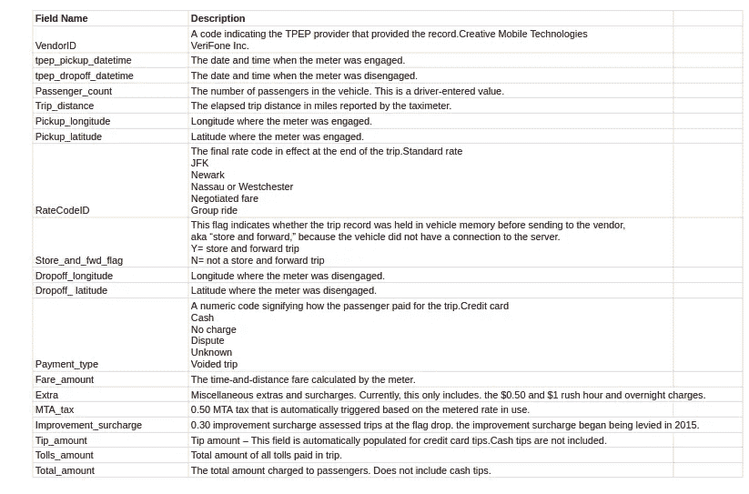

图 01 .数据集中有 19 个要素。数据集中的每一行都是纽约的一次出行

我们可以看到，在图 01 中有 19 个不同的特征，如下降经度、下降纬度、拾取日期时间、拾取纬度经度等。注意数据集中的每一行都是一次旅行。

# 5.1 数据清理

数据清洗是 ML 中最重要的步骤。很明显，数据可能有异常值和误差。我们将进行单边分析。

## 5.1.1.收件纬度和收件经度

在本案例研究中，我们将只考虑纽约市，纽约的边界是位置坐标(纬度，经度)— (40.5774，-74.15) & (40.9176，-73.7004)，因此这些坐标之外的任何坐标都将被丢弃。我们只关心来自纽约的皮卡。源代码这里是[这里是](https://github.com/pranaysawant/New-York-Taxi-Demand-Prediction)。

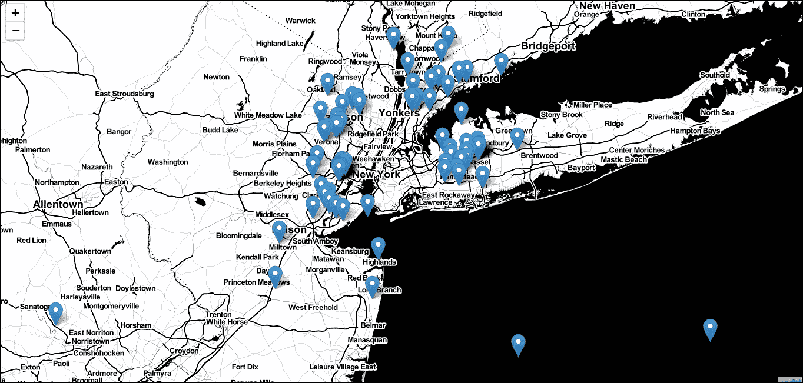

我们可以注意到，有一些点，这些点指向海洋中的出租车搭载位置，这显然是异常点，所以我将删除这些点。我只考虑坐标(lat，long)——(40.5774，-74.15)，(40.9176，-73.7004)。

## 5.1.2.衰减纬度和衰减经度

类似于拾取 lat，long，我们需要过滤不在我们定义的边界内的数据点，如果我们发现任何数据点，我将简单地丢弃它。源代码是[这里的](https://github.com/pranaysawant/New-York-Taxi-Demand-Prediction)。

## 5.1.3.行程持续时间

在我们的数据集中发现一些点是负的，很明显行程持续时间应该是正的。而有些点显示 50k 分钟行程。使用 **box cox** 图，我们可以可视化出行持续时间特征的异常值并将其移除。源代码这里是[这里是](https://github.com/pranaysawant/New-York-Taxi-Demand-Prediction)。

## 5.1.4.速度

类似地，我们使用 box cox 图进行数据可视化。某个点有 192857142 英里/小时的速度，这显然是错误的点。我会删除这些点。纽约速度中的平均速度是 12.45 英里/小时，源代码是[这里是](https://github.com/pranaysawant/New-York-Taxi-Demand-Prediction)。

## 5.1.5.出行距离

同样，使用百分位数显示的最大行程距离是 258.9 英里。我们可以说这是一个离群点。所以会去掉这样的点。源代码这里是[这里是](https://github.com/pranaysawant/New-York-Taxi-Demand-Prediction)。

## 5.1.6.总票价

同样，这里也显示最高总票价为 3950612 美元，这实际上是不可能的值，所以我将删除这些点。

移除所有异常值和错误点后，过滤数据大小如下:

```
Removing outliers in the month of Jan-2015
----
Number of pickup records =  12748986
Number of outlier coordinates lying outside NY boundaries: 293919
Number of outliers from trip times analysis: 23889
Number of outliers from trip distance analysis: 92597
Number of outliers from speed analysis: 24473
Number of outliers from fare analysis: 5275
Total outliers removed 377910
---
fraction of data points that remain after removing outliers in % 97.03576425607495
```

# 6.数据准备

在去除异常值和错误点后，我们的下一个任务是将整个纽约分成几个部分，并将整个时间跨度分成 10 分钟的时间段。

## 6.1 聚类/细分

这里我将使用 K-Means 算法将一个城市分成几个区域。Kmeans 算法有一个特性，它将创建相同大小的簇。在分段时，我们需要注意簇的大小不能太小或太大。所以有两个条件可以帮助我们，它们是:

1.  两个集群之间的集群间最大距离应该为<2 miles
2.  Inter cluster minimum distance between two cluster should > 0.5 英里

另一件事是我们需要担心，我们需要找到 Kmean 算法中最佳的 K 数。显然，我们必须进行超参数调整，并找到最佳的最小 K 值。这里的[是](https://github.com/pranaysawant/New-York-Taxi-Demand-Prediction)的源代码。

```
*#trying different cluster sizes to choose the right K in K-means*
coords = frame_with_durations_outliers_removed[['pickup_latitude', 'pickup_longitude']].values
neighbours=[]

**def** find_min_distance(cluster_centers, cluster_len):
    nice_points = 0
    wrong_points = 0
    less2 = []
    more2 = []
    min_dist=1000
    **for** i **in** range(0, cluster_len):
        nice_points = 0
        wrong_points = 0
        **for** j **in** range(0, cluster_len):
            **if** j!=i:
                distance = gpxpy.geo.haversine_distance(cluster_centers[i][0], cluster_centers[i][1],cluster_centers[j][0], cluster_centers[j][1])
                min_dist = min(min_dist,distance/(1.60934*1000))
                **if** (distance/(1.60934*1000)) <= 2:
                    nice_points +=1
                **else**:
                    wrong_points += 1
        less2.append(nice_points)
        more2.append(wrong_points)
    neighbours.append(less2)
    print ("On choosing a cluster size of ",cluster_len,"**\n**Avg. Number of Clusters within the vicinity (i.e. intercluster-distance < 2):",
           np.ceil(sum(less2)/len(less2)), "**\n**Avg. Number of Clusters outside the vicinity (i.e. intercluster-distance > 2):", np.ceil(sum(more2)/len(more2)),
           "**\n**Min inter-cluster distance = ",min_dist,"**\n**---")

**def** find_clusters(increment):
    kmeans = MiniBatchKMeans(n_clusters=increment, batch_size=10000,random_state=42).fit(coords)
    frame_with_durations_outliers_removed['pickup_cluster'] = kmeans.predict(frame_with_durations_outliers_removed[['pickup_latitude', 'pickup_longitude']])
    cluster_centers = kmeans.cluster_centers_
    cluster_len = len(cluster_centers)
    **return** cluster_centers, cluster_len

*# we need to choose number of clusters so that, there are more number of cluster regions* 
*#that are close to any cluster center*
*# and make sure that the minimum inter cluster should not be very less*
**for** increment **in** range(10, 100, 10):
    cluster_centers, cluster_len = find_clusters(increment)
    find_min_distance(cluster_centers, cluster_len)
```

上面的代码从(10 到 100)中寻找超参数，运行后我们可以看到 K = 40 效果更好。所以我们会选择 K =40。所以简单来说，我们可以把 NYC 分成 40 个区域。所以我们可以有 40 个质心。在纽约图上画出这些质心。

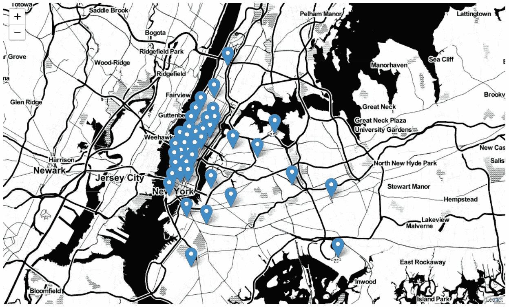

我们可以看到，大部分质心分布在曼哈顿地区，而纽约市和其他地区的拥挤区域是稀疏的。

## 6.2 时间-宁滨

我们已经分割了区域，现在我们需要将时间分割成“时间仓”。我们知道，我们将时间分割成 10 分钟的时间间隔。10 分钟= 600 秒。我们将把所有日期时间格式转换成 [Unix](https://www.unixtimestamp.com/) 时间戳格式。然后除以 600。所以如果考虑 2016 年 1 月，有 24 小时 31 天 60 秒(24 * 31 * 60/10 = 4464 bin)。类似地，2015 年 2 月= 4176 箱( *24*29*60/10* )。

因此，根据 2016 年 1 月的数据，现在我们有两个部分，40 个集群和 4464 个箱。对于二月，40 个簇和 4176 个箱。对于三月，40 个集群和 4464 个箱。源代码这里是[这里是](https://github.com/pranaysawant/New-York-Taxi-Demand-Prediction)。

# **7。平滑**

有一些垃圾桶没有拾音器。在午夜时间，几乎所有的时间仓都将显示零拾取。不是必须的，但是大部分拾音器将预测 0 值。这个 0 在我们做计算部分的时候会很头疼，它可能会产生被零除的误差。相反，我们可以用相邻的值来解决所有的零值。假设 t，t1，t2 是时间仓。t=50 次拾取，t1=0 次拾取，t2 = 100 次拾取，因此我们将平滑为(100+50+0)/3=50，因此 t=50，t1=50，t2=50。源代码这里是[这里是](https://github.com/pranaysawant/New-York-Taxi-Demand-Prediction)。

现在，我们有 4464 个时间箱，每 40 个区域中有多个拾音器。我们把所有的时间仓放在一个队列中。然后我们必须处理边界以下的情况，

```
*Case 1: When we have the last/last few values are found to be missing,hence we have no right-limit here
Case 2: When we have the missing values between two known values
Case 3: When we have the first/first few values are found to be missing,hence we have no left-limit here.*
```

情况 1:考虑 4 个时间元，t1、t2、t3、t4，其中拾取值为 10，2，0，0。**右值缺失**。即在 t1、t2 有 10.2 次拾音，而在 t3、t4 零次拾音。所以我们取平均值(10+2+0+0)/4=3，平滑拾音后(3，3，3，3)。

情况 2:相似的 t1、t2、t3、t4 时间仓，其中拾取值为 10，0，0，2。**中间值缺失**。即 t1=10，t2=0，3=0，t4=2 个拾音器。类似地，平滑数据后，我们可以得到(3，3，3，3)。

情况 3:相同的 t1，t2，t3，t4 时间跨度和 0，0，2，10。**左值缺失**。类似地，平滑数据后，我们可以得到(3，3，3，3)。

> **因此，我们对 2015 年 1 月的数据进行了平滑处理，因为它充当了我们的训练数据，并且我们用零填充了 2016 年 1 月数据的缺失值。**

# **8。时间序列和傅立叶变换**

到目前为止，我们一直在讨论数据是时间序列，让我们将数据绘制在图表上，其中 X 轴是时间轴，Y 轴是拾音器的振幅。

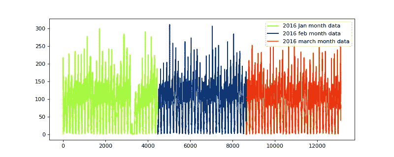

图 02

如果你对傅立叶变换一无所知，那么请查看这里的。但是换句话说，傅立叶变换可以用来分解波形/信号。从现在起，我将交替使用波、波形和信号词。看上面重复的自然波形，它实际上是由多个不同频率和振幅的波组成的。假设正弦波 s1 具有一定的振幅和频率，正弦波 s2 具有一定的振幅和频率，而 s3 波也具有一定的振幅和频率，那么将组合所有的 s1、s2 和 s3，这将由正弦波或所有 3 个波的相加组成。姑且称之为‘S’。

当我们在“S”波上应用傅立叶变换时，它将被分解，我们可以得到 s1、s2 和 s3。合成 s1、s2 和 s3 将在“频域”中。**在时间序列问题中傅立叶变换可以返回最有价值的特征**。记住，在“频域”中，我们可以非常有效地分析信号。我们对信号进行了傅立叶变换。

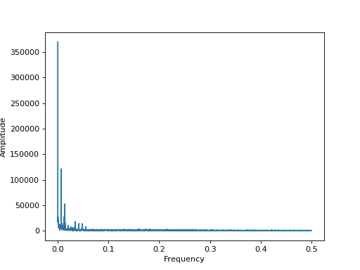

图 03。傅里叶变换

我们可以在图 02 中观察到，我们有一个重复的时间序列数据。一天中，我们有 1440 分钟。(24 小时*60 分钟=1440 分钟)。我们把它分成 10 分钟的间隔，所以图 02 波重复 144 个单位后。(1440 分钟/10 分钟= 144 分钟)。图 03 是 24 小时数据的傅立叶变换。

图 03 中。第一个最高的峰值是傅立叶变换的 DC 分量。我们将忽略**的 DC 成分**。第二个峰值是 1/144，代表 24 小时，第三个峰值是 1/72，代表一天中的 12 小时。第四个峰值是 1/36，代表一天中的 6 个小时。诸如此类。

# 9.基线模型

对于基线模型，我们有两种策略。

1.  比率特征
2.  先前值特征

假设现在是 2016 年 1 月 15 日，下午 5:40，就说是当前时间戳，我想预测接下来 10 分钟的出租车需求。那么 2016 年 1 月 15 日**，下午 5:40 我们就称之为 **P_t 2016** 。**

**同时 **P_t 2015** 不过是 2015 年 1 月 15 日**下午 5 点 40 分。从现在起我将使用相同的符号。****

**另外，注意 P_t 或 R_t 代表**电流**值。**

**P_t-1 或 R_t-1 代表**过去的**值。**

**P_t+1 或 R_t+1 代表**未来**值。**

**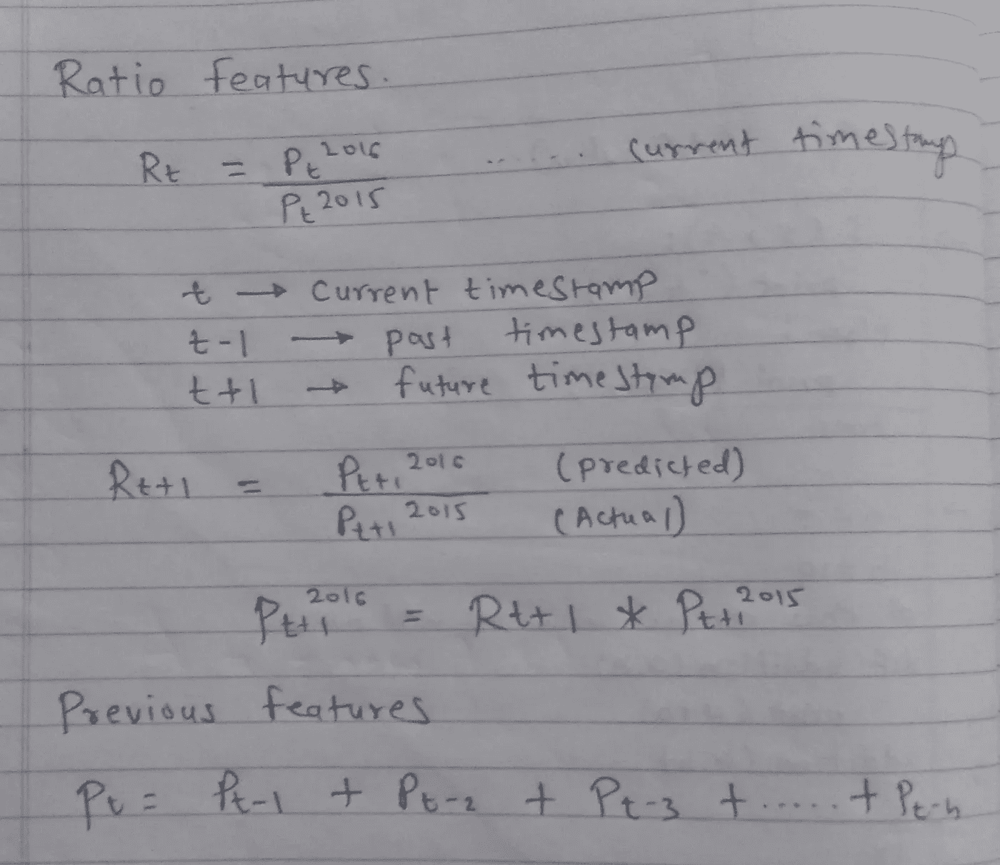**

**我们可以看到公式，对于**比率特征**，假设当前时间戳为 t，那么 R_t= P_t 2016 / P_t 2015。说未来时间戳是 t+1，公式变化如下，R_t+1 = P_t+1 2016/ P_t +1 2015。其中 P_t+1 2016 为(预测值)，P_t+1 2015 为实际值/可用值。**

**P_t+1 2016 = R_t+1 * P_t+1 2015。其中 P_t+1 2015 将被知道。**

****以前的特性**它最简单的方法，它会考虑过去的时间戳值。假设当前时间戳是 t，那么它将使用 t-1，t-2，t-3，…数据。**

## **9.1.1.简单移动平均线**

**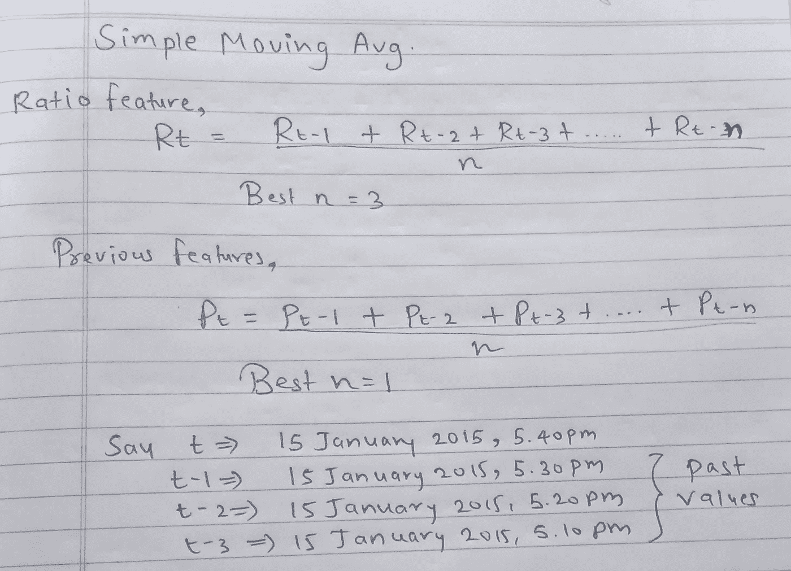**

**简单移动平均线**

**真的很简单的公式化，就是“比率特征”的前 n 个值的简单平均。n 的最佳值是“3”。我对 n 值做了一些超参数调整，我发现‘3’是我们情况下的最佳值。源代码这里是[这里是](https://github.com/pranaysawant/New-York-Taxi-Demand-Prediction)。**

**同样，对于“前一个值特性”，我们取前 n 个值的平均值，在调整参数后，我发现 n =1 的性能更好。**

****注**在简单移动平均线中，我们给 t-1、t-2、t-3 等权重，是否可以尝试不同的权重方案？**

## **9.1.2.加权移动平均**

**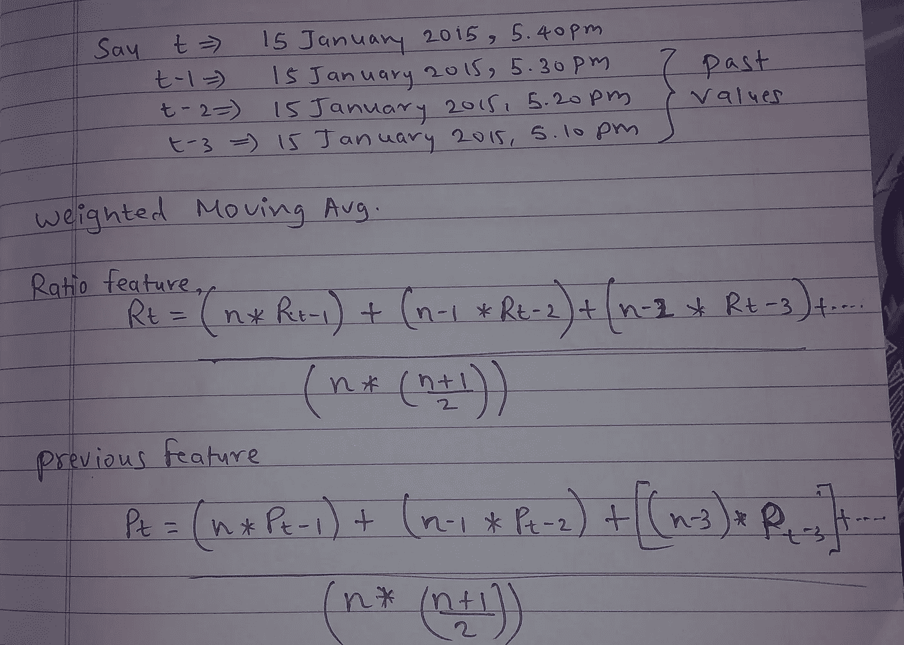**

**图 05 加权移动平均线**

**“比例特征”，我们可以在图 05 中观察到公式。最近的时间戳具有较高的权重，较旧的时间戳具有较低的权重。它非常类似于简单移动平均线，除了在简单移动平均线中，我们给所有阶段相同的权重，这里分配不同的权重。源代码这里是[这里是](https://github.com/pranaysawant/New-York-Taxi-Demand-Prediction)。**

## **9.1.3.指数加权移动平均**

**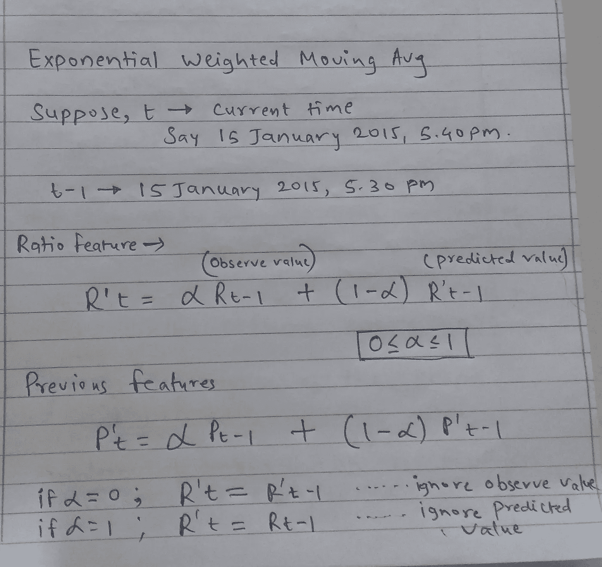**

**图 06 指数加权移动平均线**

**假设我想预测当前时间戳的 R'_t 值和 R_t-1(过去的实际值)和 R'_t-1(过去的预测值)。所以我可以用这两个值来预测未来。在上述公式(图 06)中，我们观察到了α值。**

**假设α= = 0，那么 R'_t = R'_t-1…(我们忽略实际值)**

**假设α= = 1，那么 R'_t = R_t-1…(我们忽略预测值)**

**这里我们必须考虑“实际”和“预测”值，所以我们需要很好地调整“alpha 值”并相应地使用。源代码是[这里的](https://github.com/pranaysawant/New-York-Taxi-Demand-Prediction)。**

**假设α= 0.8，**

****R′t =α∫R′_ t1+(1α)∫R _ t-1****

**R′t =(0.8∫R′_ t1)+(0.2∫R _ t-1)**

# **10。基础模型结果**

**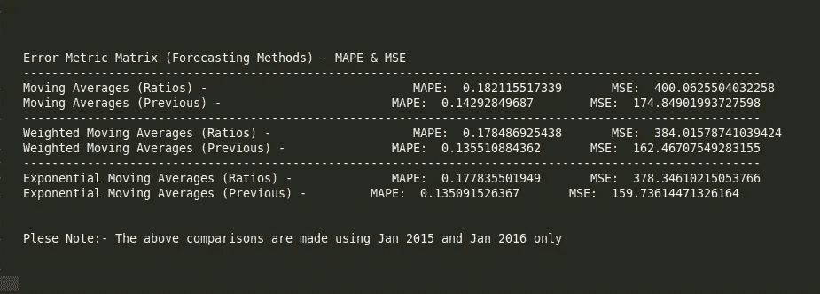**

**我们可以清楚地看到以前的值功能工作得更好。**

# **11.应用 ML 回归模型**

**到目前为止，我们使用一个简单的基线模型，现在是时候应用回归模型了。我们将使用线性回归、随机森林回归和 XGboost 回归模型。**

## **11.1.数据准备**

**我们将把数据分成 70-30 份。70%的数据用于训练，30%用于测试。我们有首字母**

```
*# Now we computed 18 features for every data point 

# 1\. cluster center latitude*
*# 2\. cluster center longitude*
*# 3\. day of the week* 
*# 4\. f_t_1: number of pickups that are occurred previous t-1th 10min interval*
*# 5\. f_t_2: number of pickups that are occurred previous t-2th 10min interval*
*# 6\. f_t_3: number of pickups that are occurred previous t-3th 10min interval*
*# 7\. f_t_4: number of pickups that are occurred previous t-4th 10min interval*
*# 8\. f_t_5: number of pickups that are occurred previous t-5th 10min interval
# 9\. Exponential Weighted Moving Avg**# --------------------Fourier Features --------------------------**# 10\. a_1 : amplitude corresponding to 1st highest fourier transform value
# 11\. f_2 : frequency corresponding to 2nd highest fourier transform value
# 12\. a_2 : amplitude corresponding to 2nd highest fourier transform value
# 13\. f_3 : frequency corresponding to 3rd highest fourier transform value
# 14\. a_3 : amplitude corresponding to 3rd highest fourier transform value
# 15\. f_4 : frequency corresponding to 4th highest fourier transform value
# 16\. a_4 : amplitude corresponding to 4th highest fourier transform value
# 17\. f_5 : frequency corresponding to 5th highest fourier transform value
# 18\. a_5 : amplitude corresponding to 5th highest fourier transform value*
```

****注**:上述**第 8 节**中提到的傅立叶特征。此外，请注意，我们忽略了 f1 分量，这是傅里叶变换中的 DC 分量，如前面第 8 节所述。**

# ****12。结果****

**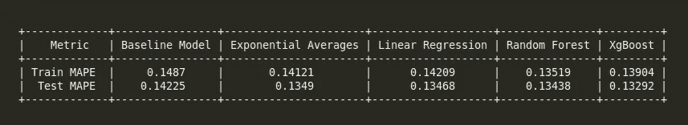**

**我们可以观察到，像“指数 WMA”这样简单模型比随机森林和 XGboost 这样的复杂模型工作得更好。我们希望 MAPE 值尽可能小。**

# **13.霍尔特冬季预报**

**从上面的分析可以很清楚地看出，“前值”特征是简单且最有效的特征，如果数据是时间序列，那么我们应该尝试霍尔特冬季预测，这可能会改善我们的结果。**

**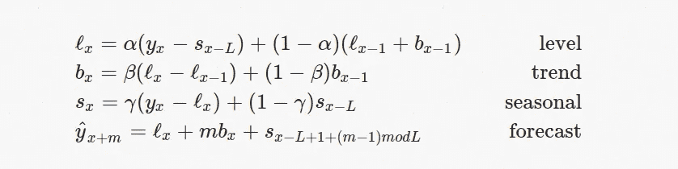**

**图 07。三重指数移动平均值**

**在上述公式中，**水平**可以表示为期望值或预测值。**趋势可以说**，假设有 XY 图，X 相对于 y 的变化率称为*趋势*。可以是上升趋势，也可以是下降趋势。序列中递增或递减的值。如果价值增加，则呈上升趋势，价值减少，则呈下降趋势。季节性的如果时间序列在固定的时间间隔内重复出现，那么我们可以说数据是季节性的。**

**三重指数平滑背后的思想是，除了水平和趋势之外，还将指数平滑应用于季节性成分。平滑跨季节应用，例如，进入季节的第三点的季节分量将与来自上个季节的第三点、两个季节前的第三点的分量指数平滑，等等。**

**以下代码用于霍尔特冬季预测(三重指数加权移动平均)。**

```
**def** initial_trend(series, slen):
    sum = 0.0
    **for** i **in** range(slen):
        sum += float(series[i+slen] - series[i]) / slen
    **return** sum / slen

**def** initial_seasonal_components(series, slen):
    seasonals = {}
    season_averages = []
    n_seasons = int(len(series)/slen)
    *# compute season averages*
    **for** j **in** range(n_seasons):
        season_averages.append(sum(series[slen*j:slen*j+slen])/float(slen))
    *# compute initial values*
    **for** i **in** range(slen):
        sum_of_vals_over_avg = 0.0
        **for** j **in** range(n_seasons):
            sum_of_vals_over_avg += series[slen*j+i]-season_averages[j]
        seasonals[i] = sum_of_vals_over_avg/n_seasons
    **return** seasonals

**def** triple_exponential_smoothing(series, slen, alpha, beta, gamma, n_preds):
    result = []
    seasonals = initial_seasonal_components(series, slen)
    **for** i **in** range(len(series)+n_preds):
        **if** i == 0: *# initial values*
            smooth = series[0]
            trend = initial_trend(series, slen)
            result.append(series[0])
            **continue**
        **if** i >= len(series): *# we are forecasting*
            m = i - len(series) + 1
            result.append((smooth + m*trend) + seasonals[i%slen])
        **else**:
            val = series[i]
            last_smooth, smooth = smooth, alpha*(val-seasonals[i%slen]) + (1-alpha)*(smooth+trend)
            trend = beta * (smooth-last_smooth) + (1-beta)*trend
            seasonals[i%slen] = gamma*(val-smooth) + (1-gamma)*seasonals[i%slen]
            result.append(smooth+trend+seasonals[i%slen])
    **return** result
```

****改善结果的关键部分是微调 alpha、beta 和 gamma 值**。我有微调阿尔法，贝塔和伽马值在下面的规模。**

```
alpha = [0.1,0.2,0.3,0.4]
beta = [0.1,0.15,0.20,0.25]
gamma = [0.1,0.3,0.4,0.5,0.65,0.75,0.85,0.95]Best value I found for our problems is :alpha=0.1
beta=0.1
gamma = 0.95
```

**使用上面的值，我在列表中增加了一个特性。我添加了“第 19 个特征”作为命名的“三重指数”特征。然后将“19 特征”模型应用于**随机森林**和 **XGboost。****

# **14.决赛成绩**

```
+-------------+---------------+---------+
|    Metric   | Random Forest | XgBoost |
+-------------+---------------+---------+
| Train MAPE  |    0.04707    | 0.03034 |
|  Test MAPE  |    0.04657    | 0.02932 |
+-------------+---------------+---------+
```

**这太棒了。我们在很大程度上提高了模型性能。我们预计损失为 0.12，我们将损失减少到 0.02，这很棒。**

**到目前为止，我们最好的模型是 XGboost 回归器，测试 MAPE: 0.02932**

# **15.结论**

**在时间序列数据中，最好使用“移动平均”、“加权移动平均”、“指数 WMA”、“三重 EWMA”作为特征。“傅立叶变换”也可以给出更好的特征，但是在我们的例子中，它没有像预期的那样工作。**

****微调是提高模型性能的关键部分。****

**此案例研究的源代码可以在[这里](https://github.com/pranaysawant/New-York-Taxi-Demand-Prediction/blob/master/NYC_Final.ipynb)找到。**

# **16.参考**

1.  **[https://grisha . org/blog/2016/02/17/三重指数平滑-预测-第三部分/](https://grisha.org/blog/2016/02/17/triple-exponential-smoothing-forecasting-part-iii/)**
2.  **[https://sci kit-learn . org/stable/modules/generated/sk learn . cluster . minibatchkmeans . html](https://scikit-learn.org/stable/modules/generated/sklearn.cluster.MiniBatchKMeans.html)**
3.  **[https://www.youtube.com/watch?v=DUyZl-abnNM](https://www.youtube.com/watch?v=DUyZl-abnNM)**
4.  **[https://xgboost.readthedocs.io/en/latest/](https://xgboost.readthedocs.io/en/latest/)**
5.  **[https://www.appliedaicourse.com/](https://www.appliedaicourse.com/)**

**你可以在这里查看类似的有趣博客:**

**[利用深度学习的模因检测 App](/@pranaysawant22/memes-detection-android-app-using-deep-learning-d2c65347e6f3)。**

**[佐马托率预测博客](/@pranaysawant22/zomato-restaurant-rate-prediction-2093cb685430)。**