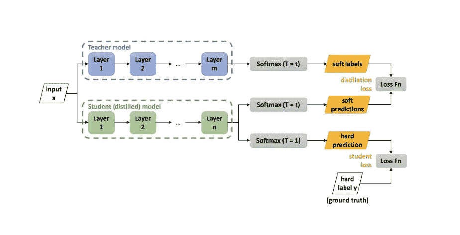

# 教师课堂网络:一种神经网络压缩机制

> 原文：<https://medium.com/analytics-vidhya/teacher-class-network-512b4ecf1df?source=collection_archive---------18----------------------->

大量训练数据的可用性与非常强大的图形处理单元和一系列先进的深度神经网络架构相结合，使深度学习领域能够不断提高其准确性。然而，这些现有技术的网络具有大量的参数并且是资源密集型的，因此在诸如移动电话的资源不足的设备上部署这样的网络几乎是不切实际的。例如，VGG-16 的一次向前传递需要超过 528MB 的存储器和超过 16 GFLOPs。随后，非常需要具有相当精度的紧凑深度模型。

知识提取也称为师生网络，是神经网络压缩领域中最流行的技术之一，知识提取最初由 Geoffrey Hinton、Oriol Vinyals、Jeff Dean 提出，使用大型预训练网络(教师)来训练小型模型(学生)。假设学生将能够学习教师所学的基本概念和知识，否则学生将无法学习，因为它的架构更简单，参数数量更少。这种知识转移是通过最小化教师和学生产生的软标签(在较高温度下由 softmax 产生的概率)之间的损失来实现的。由于这些软标签仅包含关于将输入分类到各个类别的知识，学习这些软目标将学生网络限制为解决单个特定问题，使其依赖于问题。



Geoffrey Hinton、Oriol Vinyals 和 Jeff Dean 提出的知识升华。提取神经网络中的知识。arXiv 预印本 arXiv:1503.02531，2015。来源:[https://medium . com/neural machine/knowledge-distillation-DC 241 d7c 2322](/neuralmachine/knowledge-distillation-dc241d7c2322)

# 概观

在这篇博客中，我们将一步一步地指导你实现教师级网络，这是一种新颖的神经网络压缩机制。当与现有的教师-学生压缩技术相比较时，这种架构具有两个关键区别，(I)这种架构不是只有一个学生，而是使用多个学生来学习相互排斥的知识块，以及(ii)这种架构不是在教师的软标签(由 Geoffrey Hinton 等人提出的 softmax 在更高温度下产生的概率)上训练学生，而是试图学习密集的特征表示，从而使解决问题独立。每个学生需要学习的组块的大小取决于学生的数量。在所有的学生都被独立训练后，每个学生所学的知识被合并，输出层被应用。这些层可以从教师网络借用预先训练的权重，也可以进行微调，以进一步改善向学生传授知识时发生的损失。


过程概述:教师网学习的稠密特征表示 **d** 被分成组块 d₁，d₂… dₙ.然后，每个组块由单个学生学习，最后，来自所有学生的知识被合并并馈送到输出层以供最终决策。

# 第一步

## 从教师提取密集表示

神经网络通常会产生密集的特征表示 **d** ，在分类的情况下，这些特征表示会被输入到名为 logits 的特定于类的神经元中，我们希望从教师网络中提取这些表示。一个为我们想要解决的特定问题而训练有素的大型先进网络被视为一个教师，我们从这个教师网络创建一个新网络，为了创建这个新网络，我们将删除第一个密集层之后的所有问题特定层，因此简单地说，这个新网络将为我们通过的每个输入示例输出一个密集向量，而不是我们之前获得的概率向量(在分类的情况下)。


样本教师网络

一旦我们有了这个网络，我们就需要给这个网络提供完整的训练数据，这样我们就可以得到每个训练样本的密集表示。让我们假设我们正在为时尚 MNIST 数据集训练一个*教师级*网络，该数据集总共有 60，000 个形状(28，28，1)的示例，并且我们使用的教师网络产生大小为 256 的密集表示。通过来自我们的新网络的这 60，000 个例子，我们获得了我们的形状转移数据集(60000，256)。

```
*#Collect the dense vector from the previous layer and store 
#it in a different model*
WO_Softmax=Model(teacher.input, teacher.get_layer('dense_1').output)
*#Extracting dense representation from the teacher network*
train_dense = WO_Softmax.predict(X_train)
test_dense = WO_Softmax.predict(X_val)
```


用于获得学生转移集的改进的教师网络

因此，我们将知识转移的目标重新定义为训练一个小的学生模型，以模仿一个大型的预先训练的教师网络的密集特征。换句话说，目标是最小化教师网络的密集特征向量和学生网络产生的密集特征向量之间的重构误差，如下所示:


其中 m 是训练样本总数， **d** 和 **d-hat** 分别是教师和学生网络的密集特征表示。一旦学生学会了重构密集要素制图表达，就可以引入输出图层(针对多类分类问题的特定于类的 logit 和 softmax)来获得所需的输出。该输出层可以简单地是具有预训练权重的教师输出层。同样的策略可以扩展到多个学生网络，其中密集特征表示 **d** 可以被分成多个组块，每个组块可以由独立的学生模型学习，如下面的部分所讨论的。

# 第二步

## 使用 *n* 个学生学习密集表示

密集特征向量 **d** 通过将密集向量分割成 *n* 等份而被分割成组块(因为我们有 *n* 个学生网络)。因此，我们简单地将 **d** 向量分成 *n* 部分，如**d**=【d₁，d₂，…，dₙ】，其中所有的 dₖ可以连接起来重新生成密集向量 **d** ，并且每个 dₖ将由 kᵗʰ学生独立学习。在我们创建了 *n* 个学生之后，我们在从教师网络中提取的密集表示的 *1/n* 的完整输入数据集上独立地训练每个学生。


将从老师那里提取的密集表示拆分到“n”个学生中

```
*#Splitting the training dense vector 
#among N students(in this case 4)*
s1Train=train_dense[:,:64]
s2Train=train_dense[:,64:128]
s3Train=train_dense[:,128:192]
s4Train=train_dense[:,192:]
*#Splitting the test dense vector 
#among N students(in this case 4)*
s1Test=test_dense[:,:64]
s2Test=test_dense[:,64:128]
s3Test=test_dense[:,128:192]
s4Test=test_dense[:,192:]
```

让我们，假设我们有一组学生 Sⁿ，Sₖ是该组中的 kᵗʰ学生。从数学上来说，将知识从老师传递给 n 个学生可以定义为:


其中， **d-hatₖ** 是 kᵗʰ学生提炼出来的知识。请注意，每个学生基本上都试图学习密集表示 **dₖ** 的一部分，这是一个实值向量。每个学生通过最小化均方误差来学习其知识块，如下所示:


其中，Lₖ是生成密集表示的 kᵗʰ学生的损失**d-hatₖ**,‘m’是训练实例的总数， **dₖ** 是学生 Sₖ必须学习的从教师网络获得的密集向量的组块。

# 第三步

## 结合学到的知识

在所有的 *n* 个学生被独立训练后，学习到的知识块或密集向量块 **dₖ** 被串联在一起，以估计所有的 *n* 个学生学习到的知识 **d-hat** ，并被定义为:


```
*#Combining learned chunks of knowledge*
model_input = Input(shape=(28,28,1))
o1=student1.output
o2=student2.output
o3=student3.output
o4=student4.output
output=concatenate([o1,o2,o3,o4])
#Applying problem/output specific layers
output2=Dropout(0.5)(output) *# For reguralization*
output3=Dense(10)(output2)
output4=Activation('softmax')(output3)
multi_model=Model([student1.input,student2.input,student3.input,student4.input],output4)

multi_model.summary()
```

其中[…]是连接，X 是输入数据，如图像或文本。理想情况下，向量 **d-hat** 应该类似于从教师网络中提取的密集表示 **d** ，并且可以用于解决教师正在解决的问题。在组合了知识块之后，我们需要添加我们从原始教师网络中移除的层，以创建密集向量生成教师网络，因为本质上，学生现在已经集体学习了教师的密集表示，并且在馈送到教师网络的输出层时，理论上应该给出与教师网络相同的结果。因此，在分类的情况下，softmax 可以如下生成概率向量:


其中，函数“g”是应用于来自所有预训练学生的输出的连接的输出层(特定于类的 logit 和 softmax ),并且 **θg** 是其权重，其也可以是从教师网络获得的预训练权重。老师 **d** 和 n 个学生 **d-hat** 所学的知识可能会有微小的错误。为了补偿这种误差并提高学生的整体准确性，可以在保持学生不可训练的同时对该输出层进行微调。因此，在分类的情况下，只有最后一个输出层可以使用交叉熵损失函数来优化，如下:


将问题/输出特定层应用于组合知识

> *相关的 python 代码可以在我的 GitHub 资源库中找到*:[https://github.com/shaiqmalik/Teacher-Class.git](https://github.com/shaiqmalik/Teacher-Class.git)

> 这篇博文遵循了论文[“教师课堂网络:一种神经网络压缩机制”](https://arxiv.org/abs/2004.03281)中提出的机制

## *参考文献*

[*提取神经网络中的知识*](https://arxiv.org/abs/1503.02531v1)