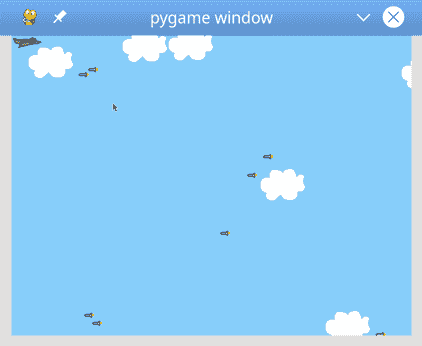
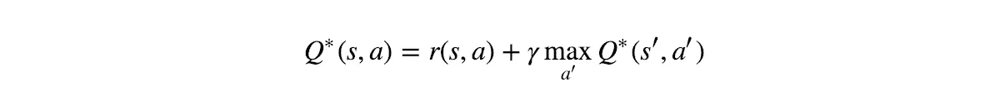
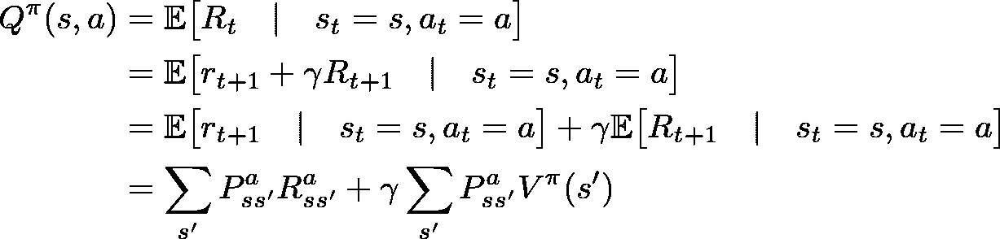
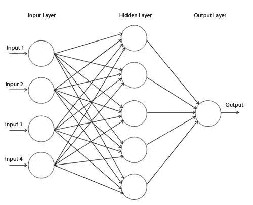
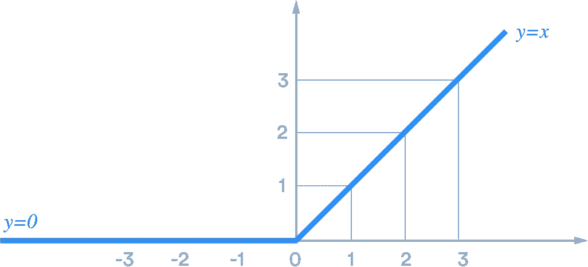

# 人工智能视频游戏教学——深度 Q 网络

> 原文：<https://medium.com/analytics-vidhya/teaching-ai-to-play-games-deep-q-networks-572df36edc9a?source=collection_archive---------18----------------------->

卡尔·劳在 [Unsplash](https://unsplash.com?utm_source=medium&utm_medium=referral) 上的照片

在今天的文章中，我将向您介绍深度 Q 网络的热门话题及其工作原理。我将回顾我的模型，并解释构建强化学习算法的关键概念。

## 创建游戏

在这个游戏中，我们将扮演一架喷气式飞机，它可以采取 4 种行动——向上、向下、向前、向后——并需要躲避尽可能多的导弹。目标是通过存活最长时间来获得尽可能高的回报。

为了创建这个游戏，我使用了 pygame，这是一个为编写视频游戏而设计的跨平台 Python 模块集。

对于这个特定的游戏，你不需要太多的模块/库，只需要 pygame 和内置的模块，比如 time 和 random。

我们使用精灵设置了 3 个类；敌人、玩家和云(可选)。完整代码请查看我的 Github 知识库，了解更多关于 pygame 的信息请查看本教程:【https://realpython.com/pygame-a-primer/

## 它是如何工作的？

当谈到强化学习时，它只是一个代理应该如何在一个环境中采取行动，以最大化回报(得分)。Markov 决策过程(MDPs)是一个用于建模主体决策的框架。MDP 是强化学习的核心概念。要了解基础知识或者什么 RL 和 dqn 先看这个:[***我是如何构建一个算法来搞垮雅达利游戏的！***](/analytics-vidhya/how-i-built-an-algorithm-to-takedown-atari-games-a13d3b3def69)

## 马尔可夫决策过程

马尔可夫决策过程几乎用于每一个强化学习问题。为了掌握 MDPs 的概念，我们需要研究**马尔可夫性质**和**马尔可夫过程**。

> ***马氏地产***

马尔可夫性质声明:“给定现在，未来独立于过去”

正式的定义是:

P[St+1|St]=P[St+1|S1，…，St]

本质上，这告诉我们先前的状态和事件不需要知道未来的状态——当前的状态捕获了所有必要的信息。了解了这一点，我们就能理解价值观并做出决策。

> ***马氏奖励流程***

一个 MRP 就是一个元组( ***S*** ， ***P*** ， ***R*** ， **𝛾** )其中 ***S*** 是一个有限状态空间， ***P*** 是状态转移概率， ***R*** 是一个奖励函数其中

***r****s*= 𝔼[***r****t+1*|***s****t*=*s*，

它表示我们期望在此刻从状态 *S* 得到多少即时回报，而 **𝛾** 【伽马】是贴现因子，它告诉我们的代理应该关心未来回报多少。比如 gamma 为 0 或者接近于 0，我们的代理人就会只关心当前的奖励，变得短视。如果 gamma 更接近 1，我们的代理人会关心未来的回报，并最大化它能生存多久，即使这意味着牺牲短期回报。

> ***马氏决策过程***

一个 ***马尔可夫决策过程*** 是一个马尔可夫回报过程的扩展，因为它包含了一个代理必须做出的决策。环境中的所有状态都是马尔可夫的。

一个马尔可夫决策过程由一个元组( ***S*** ， ***A*** ， ***P*** ， ***R*** ， **𝛾** )组成

其中:

*   ***S*** 是一组状态(有限的)
*   ***一个*** 是一组动作(有限的)
*   ***P*** 是一个状态转移的概率(一个新状态将发生的可能性有多大)
*   ***R*** 是奖励功能(基于动作和状态的积极或消极奖励)
*   **𝛾** 是一个贴现因子(短视回报对未来回报)

> ***贝尔曼方程***

现在我们有了 MDP，我们可以用贝尔曼方程来确定每个状态和动作的值。贝尔曼是在给定状态下采取正确行动的一个关键概念。

> 价值函数:V(s) = maxa(R(s,a)+𝛾V(s')

上面的等式告诉我们，给定状态 **s** 的值等于 **(s，a)** 中最大行动的回报加上状态**s’**的贴现值。其中**s’**是如果我们采取行动 **a.** 我们最终会达到的状态

这个等式告诉我们一个状态-动作对的 Q 值。上面的等式只适用于没有不确定性的环境。如果是一个随机环境，上面的等式就不成立。为了说明随机性，我们稍微修改了一下方程，加入了下一个状态的转移概率和预期回报。

***注:*** *对于包括我们这个游戏在内的很多强化问题来说，算出每个状态的值是不可伸缩的——一次发生的事情太多了，会占用大量的计算能力。因此，我们必须使用神经网络来逼近 Q 值和状态值。通过计算 TD 误差来更新神经网络。*

## 强化学习和政策

在强化学习中，我们有两个主要组件:环境(我们的游戏)和代理(喷气机)。每当代理执行一个动作时，环境使用 **MRP** 给代理一个**奖励**，奖励可以是积极的，也可以是消极的，这取决于该动作在特定状态下有多好。代理的目标是在给定每一种可能状态的情况下，学习什么样的行为能使奖励最大化。对于这个特定的游戏，我们不会给代理任何负面的奖励，相反，当喷气式飞机与导弹相撞时，这一集就结束了。代理人每存活一个**时间步**就会获得+1 奖励。在这个过程中，智能体会选择特定的策略和特定的行为方式，这被称为智能体的**策略**。

## 建筑

我的模型的神经网络由 3 个完全连接的层和 256 个神经元组成。该模型不需要 CNN 或任何预处理，因为我们可以在不需要图像检测的情况下获得所有东西的状态和位置。此外，我们在每一层之后应用一个 **ReLU activation** 函数，该函数使 0 以下的所有值变平，并对 0 以上的所有值保持线性。由于 ReLU 非常简单，它允许更快的计算，因此，更少的训练时间。

ReLU 激活功能

我们还堆叠了 **4 帧**，这样模型就可以检测到运动的变化。没有堆叠帧，模型将无法准确预测未来事件。例如，想象一幅两辆车面对面的画面。只有一帧，你无法判断汽车是在移动还是停着。因此，你无法预测汽车是否会发生碰撞。但是，如果给你 4 帧画面，你可以很容易地识别运动，并预测将要发生什么。

**如果你喜欢读这篇文章，请关注我，关注我未来的文章。此外，请随意与他人分享这篇文章！**

在 Medium 和 [LinkedIn](https://www.linkedin.com/in/sumeet-pathania-93b052194/) 上关注我，了解我在人工智能方面的最新进展。

如果你想知道我目前在做什么，以及我在人工智能和类似项目上的经历，请免费订阅我的时事通讯！[http://eepurl.com/gFbCFX](http://eepurl.com/gFbCFX)