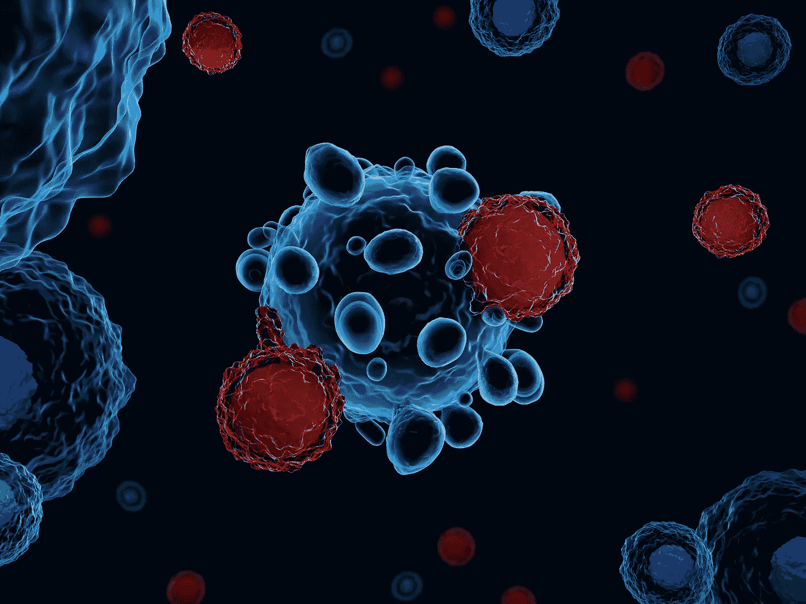
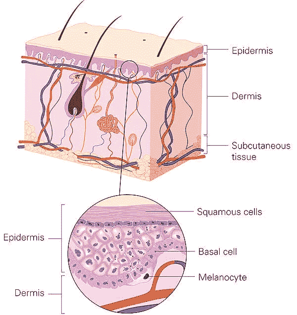
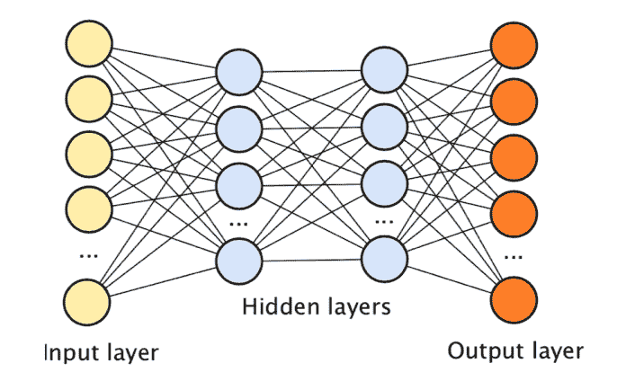
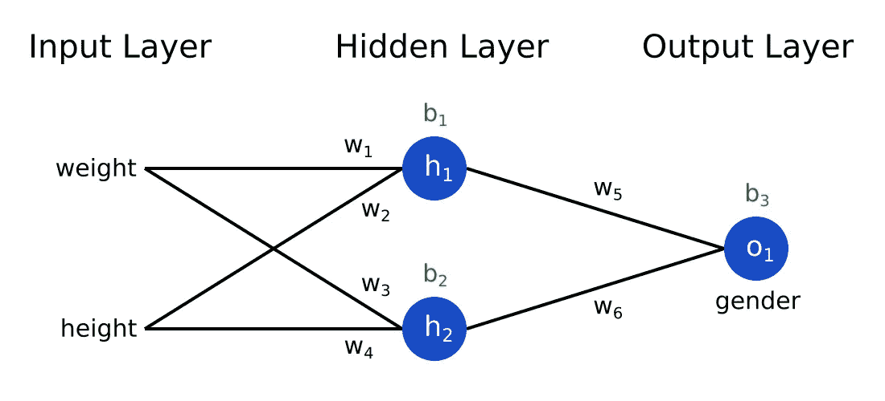
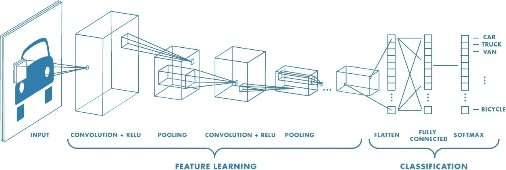
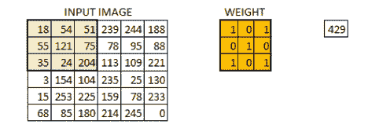
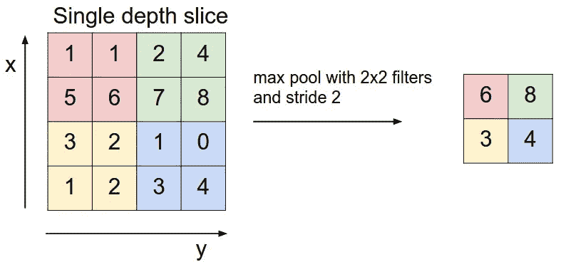

# 教机器检测皮肤癌

> 原文：<https://medium.com/analytics-vidhya/teaching-machines-to-detect-skin-cancer-bd165566f0fe?source=collection_archive---------6----------------------->

## 利用人工智能对医学图像进行分类，如痣的图像、CT 扫描、MRI 扫描等。作为诊断工具。



癌症患者的诊断过程大概是这样的:

1.  拜访您的家庭医生，以确定是否需要进一步检查(约 3 天时间安排预约)
2.  如果需要进一步测试，通常会进行皮肤活检(约 3 周预约)
3.  如果被诊断患有皮肤癌，可能会建议进行进一步的检测，以提供更多的细节，如癌症的分期(大约额外 2 周)

如果幸运的话，整个诊断过程大约需要 1.5 个月。我听说过一些恐怖的故事，人们在急诊室等上几个小时去看医生，等上几个月去看专家，这样的例子不胜枚举。

我意识到的一件有趣的事情是，我们并没有真正完全认识到误诊是一个关键问题。这是一个隐藏的问题，也是一个不经常讨论的问题。**癌症误诊率徘徊在 20%左右。**也就是说*每 5 个病人中就有 1 个*也就是说每年有**340 万例**！根据一项研究，28%的误诊病例会危及生命。

如果我告诉你**人工智能可以检测皮肤癌和潜在的任何类型的疾病，准确率远高于人类，时间也远少于人类，会怎么样？在皮肤癌的情况下，你需要做的就是给机器输入一张痣的图片，然后机器就会立刻给你一个诊断。事实上，我编写了一个算法来实现这一点！**

# 了解数据集:MNIST 火腿 10000

为了训练机器学习模型，我使用了数据集[*MNIST 火腿 10000*](https://www.kaggle.com/kmader/skin-cancer-mnist-ham10000) 。总共有 **10 015 张皮肤病变的皮镜图像**标有各自的皮肤癌类型。

数据集中的图像分为以下七种皮肤癌:

*   光化性角化病被认为是一种非癌性(良性)皮肤癌。然而，如果不治疗，它通常会发展成鳞状细胞癌(这是一种癌症)。
*   与光化性角化病不同，**基底细胞癌**是一种发生在位于表皮下部的基底细胞层的癌性皮肤病损。这是最常见的皮肤癌类型，占所有病例的 80%。
*   **良性角化病**是一种非癌性且生长缓慢的皮肤癌。因为它们通常是无害的，所以可以不进行处理。
*   **皮肤纤维瘤**也是非癌性的，通常无害，因此不需要治疗。它通常是粉红色的，看起来像一个圆形肿块。
*   **黑色素瘤**是一种恶性皮肤癌，起源于黑色素细胞，这种细胞负责皮肤的色素。
*   **黑色素细胞痣**是一种良性黑色素细胞肿瘤。患有黑色素细胞痣的患者被认为患黑色素瘤的风险较高。
*   **血管病变**由多种皮肤病变组成，包括樱桃血管瘤、血管角化瘤和化脓性肉芽肿。它们同样具有红色或紫色的特征，并且通常表现为凸起的肿块。



基底细胞位于皮肤表皮层的下部。黑素细胞位于基底细胞之下。

对于我的模型，我应用了卷积神经网络(CNN)，这是一种深度学习算法来训练我的数据。**CNN 特别建立在图像分类领域。**

## 但是等等，什么是深度学习？

**深度学习是机器学习的一个子类，受大脑神经连接的启发。**



与大脑的架构类似，深度学习使得每一层中不同的节点/神经元(图中的圆圈)可以 ***连接*** 到连续的层。

深度学习中有 3 种主要类型的层:

1.  **输入层**:输入数据馈入模型的地方
2.  **隐藏层**:负责发现数据的含义
3.  **输出层**:返回预测答案/标签

解释数据涉及两个变量，**权重，**和**偏差。**



权重用符号 w 表示，偏差用符号 b 表示。

在上面的场景中，体重和身高是模型的两个输入。深度神经网络然后将输入乘以权重，并添加偏差。为了产生输出，答案通过激活函数传递。简单来说，**激活函数负责在给定输入的情况下计算节点的输出。**

训练数据不仅需要算法，在深度神经网络的情况下，还需要定义一个**损失函数。**损失函数允许模型了解其 ***预测误差*。**

损失函数表示为:**(实际输出-预测输出)** 2**

> 我们通过模型 ***将每次迭代后最小化错误率***的**过程称为“学习”。**

在每次迭代之后，**以最小化模型错误率的方式更新权重和偏差。**训练模型时，目标是最大限度地减少损失，从而随着模型出错越来越少而提高准确性。等等，但是权重和偏差到底是怎么提炼出来的？

对于由损失函数计算的每个损失数据点，**通过利用反向传播算法计算平均梯度(代表函数导数的向量)。**梯度告诉我们每个*参数对输出的影响程度。*

梯度下降算法使用反向传播算法来改进权重。基本上，**梯度下降的目标是找到损失函数的最小值，即模型损失最接近 0 的点。**


成本函数也称为损失函数。用梯度下降法求最小值(图中标为赢家)。

当模型到达*输出层时，*一个激活函数被用于标准化这些值，使它们对应于一个百分比。 **sigmoid 函数**是常用的激活函数，用于**将所有值转换为 0 到 1 之间的数字，代表每个输出的概率。**概率最高的输出值是模型的预测值。

综上所述，**深度学习是机器学习的一个子集，属于一类叫做神经网络的算法。**神经网络的架构**模仿了我们大脑中神经元之间的连接方式。**

# 模型:利用卷积神经网络

类似于神经网络，CNN 有输入层、输出层，由节点组成。但是等等，卷积神经网络有什么不同？

普通神经网络(又名多层感知器)将一个向量作为输入。对于形状为 100 像素乘 100 像素的图像，常规的多层感知器必须为第二层中的每个节点计算 10，000 个权重。如果你有一个 10 节点层，这个数字会很快增加到 100，000 个权重！

利用 CNN 的架构，所需的参数数量可以大大减少。这是因为 CNN 使用由权重向量组成的**滤波器作为其可学习参数。**这意味着图像的大小不一定影响*“可学习的”*参数的数量。*

CNN 可以将图像的多个通道作为输入。图像通常由三层组成，因为它们由三原色组成:红色、蓝色和绿色。三层中的每一层中的每个像素构成一个从 0 到 255 的数字，该数字代表颜色的强度。



除了输入和输出层，就像其他神经网络一样，卷积神经网络包括多个隐藏层。在卷积神经网络中发现有三种主要类型的隐藏层:

1.  卷积层
2.  池层
3.  完全连接的层

(与完全连接的神经网络不同，如香草神经网络(也称为多层感知器)，CNN 不是按结构连接的。)

**卷积层**负责执行输入和滤波器之间的点积。 ***所有的计算工作*** 都发生在这些层。过滤器是模型的“可学习”参数，因为它们用于检测特定特征，如图像中对象的**边缘；**这个过程也被称为 ***特征提取。*** 类似于在多层感知器中，权重在每次迭代后被细化， ***包含权重的过滤器*** (在 CNN 的上下文中)是在每次训练迭代后被细化的 ***参数。*** 对于 CNN，最常用的激活函数称为 ReLU(校正线性单位)函数，表示为 max(0，x)。这意味着对于任何小于 0 的值，输出将是 0，对于所有大于 0 的值，输出将是 x(输入)。ReLU 函数只输出正值，因此限制了范围。



卷积层发挥作用的一个例子。在权重的矩阵和与权重形状相同的输入图像的矩阵之间执行点乘。生成的产品显示在最左侧的矩阵中。

**池层**通过减少数据的维度来缩小数据的大小。对于我的模型，我使用了一个名为 max pooling 的特定池层。Max pooling 通过比较不同层的神经元来工作，然后只提取最高值作为输出，因此降低了数据的维度。



最大池功能

**全连接层**类似于多层感知器中看到的隐藏层，其中一层的节点与相应层中的节点全连接。这一层负责传达最终输出。

# 本质(也就是源代码)

继续有趣的东西，当然还有所有的代码！

我没有下载 3GB 的图像，然后上传到 google collaboratory 上，这可能很繁琐，而是使用了 Kaggle API。

```
#-------------------------Kaggle API Setup---------------------#Install kaggle library
!pip install kaggle#Make a directory called .kaggle which makes it invisible
!mkdir .kaggle import json
token = {"username":"ENTER YOUR USENAME","key":"ENTER YOUR KEY"}
with open('/content/.kaggle/kaggle.json', 'w') as file:
    json.dump(token, file)

!cp /content/.kaggle/kaggle.json ~/.kaggle/kaggle.json
!kaggle config set -n path -v{/content}
!chmod 600 /root/.kaggle/kaggle.json
```

设置好 Kaggle API 之后，下载 MNIST HAM 10000 数据集并解压文件。

```
#---------------Downloading and unzipping the files--------------#Data directory: where the files will unzip to(destination folder) 
!mkdir data
!kaggle datasets download kmader/skin-cancer-mnist-ham10000 -p data!apt install unzip!mkdir HAM10000_images_part_1 
!mkdir HAM10000_images_part_2!unzip /content/data/skin-cancer-mnist-ham10000.zip -d /content# Unzip the whole zipfile into /content/data
!unzip /content/data/HAM10000_images_part_1.zip -d HAM10000_images_part_1 
!unzip /content/data/HAM10000_images_part_2.zip -d HAM10000_images_part_2
#Ouputs me how many files I unzipped
!echo files in /content/data: `ls data | wc -l`
```

为训练数据集和验证数据集创建不同的目录。在培训和验证目录中为七个不同的标签创建了七个子文件夹。

```
#-------------------Make directories for the data-------------------import os 
import errnobase_dir = 'base_dir'image_class = ['nv','mel','bkl','bcc','akiec','vasc','df']#3 folders are made: base_dir, train_dir and val_dirtry:
    os.mkdir(base_dir)

except OSError as exc:
    if exc.errno != errno.EEXIST:
        raise
    passtrain_dir = os.path.join(base_dir, 'train_dir')
try:
  os.mkdir(train_dir)
except OSError as exc:
    if exc.errno != errno.EEXIST:
        raise
    pass
val_dir = os.path.join(base_dir, 'val_dir')
try: 
  os.mkdir(val_dir)

except OSError as exc:
    if exc.errno != errno.EEXIST:
        raise
    pass#make sub directories for the labels
for x in image_class:
      os.mkdir(train_dir+'/'+x)
for x in image_class:
      os.mkdir(val_dir+'/'+x)
```

为了对数据进行预处理，将数据以 9:1 的比例分为训练数据和测试数据。然后，数据会相应地移动到与其标签对应的文件夹中。

```
#-----------------splitting data/transfering data-------------------#import libraries 
import pandas as pd
import shutildf = pd.read_csv('/content/data/HAM10000_metadata.csv')# Set y as the labels
y = df['dx']#split data
from sklearn.model_selection import train_test_split
df_train, df_val = train_test_split(df, test_size=0.1, random_state=101, stratify=y)# Transfer the images into folders, Set the image id as the index
image_index = df.set_index('image_id', inplace=True)# Get a list of images in each of the two folders
folder_1 = os.listdir('HAM10000_images_part_1')
folder_2 = os.listdir('HAM10000_images_part_2')# Get a list of train and val images
train_list = list(df_train['image_id'])
val_list = list(df_val['image_id'])# Transfer the training images
for image in train_list:fname = image + '.jpg'if fname in folder_1:
        #the source path
        src = os.path.join('HAM10000_images_part_1', fname)

        #the destination path
        dst = os.path.join(train_dir+'/'+df['dx'][image], fname)
        print(dst)

        shutil.copyfile(src, dst)if fname in folder_2:
        #the source path
        src = os.path.join('HAM10000_images_part_2', fname) #the destination path
        dst = os.path.join(train_dir, fname)

        shutil.copyfile(src, dst)# Transfer the validation images
for image in val_list:fname = image + '.jpg'if fname in folder_1:
        #the source path
        src = os.path.join('HAM10000_images_part_1', fname) #the destination path
        dst = os.path.join(val_dir+'/'+df['dx'][image], fname)

        shutil.copyfile(src, dst)

    if fname in folder_2:
        #the source path
        src = os.path.join('HAM10000_images_part_2', fname) # destination path to image
        dst = os.path.join(val_dir, fname)
        # copy the image from the source to the destination
        shutil.copyfile(src, dst)
        y_valid.append(df['dx'][image])# Check how many training images are in train_dir
print(len(os.listdir('base_dir/train_dir')))
print(len(os.listdir('base_dir/val_dir')))# Check how many validation images are in val_dir
print(len(os.listdir('data/HAM10000_images_part_1')))
print(len(os.listdir('data/HAM10000_images_part_2')))
```

我使用图像生成器对我的图像进行随机变换。此外，使用图像生成器的一个很好的特性是，它会自动将数据调整到参数 target_size 中给定的尺寸。

```
#--------------image generator---------------
from keras.preprocessing.image import ImageDataGenerator
import keras 
print(df.head())
image_class = ['nv','mel','bkl','bcc','akiec','vasc','df']train_path = 'base_dir/train_dir/'
valid_path = 'base_dir/val_dir/'
print(os.listdir('base_dir/train_dir'))
print(len(os.listdir('base_dir/val_dir')))image_shape = 224train_datagen  = ImageDataGenerator(rescale=1./255)
val_datagen  = ImageDataGenerator(rescale=1./255)#declares data generator for train and val batches
train_batches = train_datagen.flow_from_directory(train_path, 
                                                        target_size = (image_shape,image_shape),
                                                        classes = image_class,
                                                        batch_size = 64
                                                        )valid_batches = val_datagen.flow_from_directory(valid_path, 
                                                        target_size = (image_shape,image_shape),
                                                        classes = image_class,
                                                        batch_size = 64                                                      )
```

我们都认为最难的部分是对模型进行编码，但实际上是上面的所有事情(也就是预处理数据)。

我没有使用卷积神经网络，而是利用了一种叫做**移动网络的架构。**它是一个 ***预训练模型*** ，在数据集 **ImageNet** 上进行训练，该数据集拥有超过 1400 万张图片。为了检测皮肤癌，我在移动网络上构建了几个层，然后在 MNIST: HAM 10000 数据集上对其进行训练。

我使用移动网络而不是常规卷积神经网络的主要原因是由于所需的*最小计算能力*，因为它减少了可学习参数的数量，并且被设计为“移动”友好的。

```
#-------------------------------model------------------------------
from keras.models import Sequential
from keras.layers import Dense, Activation
from keras.layers import Conv2D, MaxPool2D, Dropout, Flatten 
from keras.callbacks import ReduceLROnPlateau
from keras.models import Modelmobile = keras.applications.mobilenet.MobileNet()
x = mobile.layers[-6].output# Add a dropout and dense layer for predictions
x = Dropout(0.25)(x)
predictions = Dense(7, activation='softmax')(x)
print(mobile.input)
net = Model(inputs=mobile.input, outputs=predictions)mobile.summary()
for layer in net.layers[:-23]:
  layer.trainable = Falsenet.compile(optimizer='adam',
  loss='categorical_crossentropy',
  metrics=['accuracy'])learning_rate_reduction = ReduceLROnPlateau(monitor='val_acc', patience=3, verbose=1, factor=0.5, min_lr=0.00001)history = net.fit_generator(train_batches, epochs=10)
```

在训练模型之后，当在测试批次上执行时，获得了 70%的准确度**。对于更大的数据集，可以很容易地提高精确度。人工智能有如此大的潜力来颠覆医疗保健行业。想象一下，让人工智能诊断几乎任何疾病都比人类更好更快，**这太疯狂了！****

这不是科幻小说，人工智能的可能性是无限的！人工智能已经彻底改变了中国的医疗保健。中国一家医院推出了一项名为 AI-Force 的计划，该计划利用人工智能机器，能够以 97%的准确率检测 30 种慢性疾病！

# 关键要点

*   深度学习的灵感来自大脑的神经连接，因为每一层中的每个节点都与下一层相连
*   卷积神经网络有 3 种主要类型的隐藏层:卷积层、池层和全连接层
*   过滤器(用于 CNN)用于从数据中提取特征

## 不要忘记:

*   如果你喜欢这篇文章，请鼓掌
*   在 [LinkedIn](https://ca.linkedin.com/in/joey-mach-6293b1175) 上与我联系