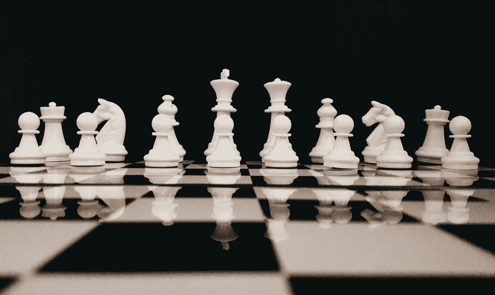
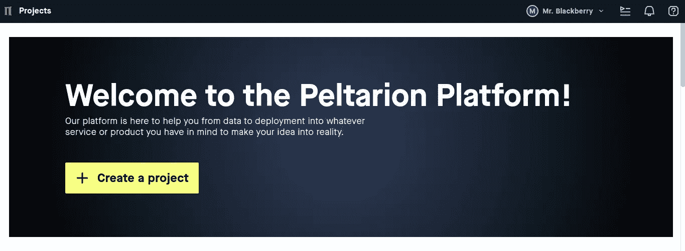
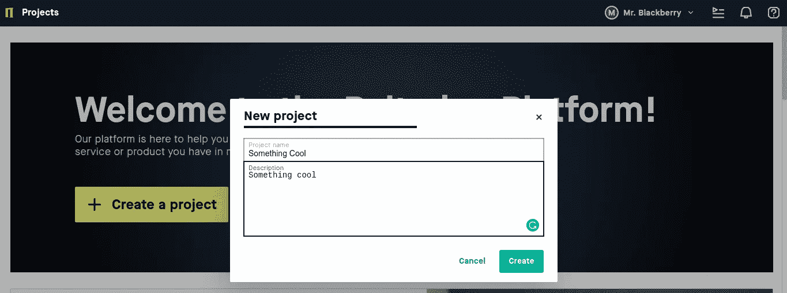

# 示教机器—第 1 部分

> 原文：<https://medium.com/analytics-vidhya/teaching-the-machine-part-1-3d8089424f4f?source=collection_archive---------31----------------------->

## 人工智能

## 了解 AI 和 ML 是怎么一回事，开始构建 ML 模型而无需代码！



[sk](https://unsplash.com/@rollelflex_graphy726?utm_source=unsplash&utm_medium=referral&utm_content=creditCopyText) 在 [Unsplash](https://unsplash.com/s/photos/intelligence?utm_source=unsplash&utm_medium=referral&utm_content=creditCopyText) 上拍照

我想给这本书取一个很酷的标题，但是我能想到的只有“机器学习 101-第一部分”,这听起来有点老了，也很时髦，所以我想到了“教机器”,在我的脑海中听起来不错。我可能会后悔吗？

好吧！我的想法够多了，我们走吧。

**那么，** **什么是机器学习或者 AI** ？
这很简单，让机器变得智能，我指的机器不仅仅是机器人，它甚至可以是软件。如果你想用一种更新奇的方式来表达，那么“这是一门展示人类智慧的让机器变得聪明的科学”。


[https://xkcd.com/](https://xkcd.com/)

“深度思维计算机啊，”他说，“我们为你设计的任务是这样的。我们希望你告诉我们……”他停顿了一下，“答案。”

*——道格拉斯·亚当斯，银河系漫游指南*

**机器能做什么的例子？** 范围从语言翻译、物体检测、语音/声音检测、预测等。你可以在这里查看更多的实例和使用案例—[https://experiments.withgoogle.com/collection/ai](https://experiments.withgoogle.com/collection/ai)

**如何让机器变得智能？这个问题的答案很简单——教他们！**

**教如何？我们不会用特定的规则来教他们，而是通过例子来教他们识别模式，就像我们人类教蹒跚学步的孩子一样。机器学习主要是预测事物。我们将数据(也称为示例)通过一些预定义的算法输入计算机，计算机学习识别模式，一旦学会识别模式，它就可以预测任何给定的新数据。在过去夜晚寒冷的日子里，程序员不得不为他们想要识别的每一个对象编写硬代码，例如热狗 VS，而不是热狗。这是不可扩展且低效的。**

**传统编程**:

```
if text contains Bonjour:
        english = "Good Morning"
        filipino = "magandang umaga"if text contains ....
if text contains ....
```

**机器学习程序**:

```
try to translate texts
change self to reduce errors
repeat
```

**例子或数据？** 通过例子，我指的是数据。不管是幸运还是不幸，它随处可见，你需要做的就是去寻找它！


[https://xkcd.com/](https://xkcd.com/)

## 人工智能或人工智能进展如何？

*“我们只能看到前方不远的地方，但我们可以看到那里有很多需要做的事情。”—艾伦·图灵*

**想尝试这种很酷的东西，但又不想让编程之类的东西弄脏你的手？** 你怎么了？编程很有趣，但无论如何，这是可能的。有一个叫 AutoML 的东西，根据维基百科的意思是“自动化机器学习是将机器学习应用于现实世界问题的自动化过程。”

**那又如何？** 嗯，谷歌、AWS 和所有其他服务都有可用的工具，我将使用 [Peltarion](https://peltarion.com/) 给出一个例子，它可以免费使用，不需要任何信用卡，不像谷歌。

1.  创建一个帐户，你会看到这个屏幕。



[https://peltarion.com/](https://peltarion.com/)

2.创建新项目



给它起个很酷的名字！

创建完成后，将显示导入数据的选项。


[https://peltarion.com/](https://peltarion.com/)

3.选择您的数据集或从数据库中选择一个。我将从数据库中选择一个。


我选杂草数据集

一旦你选择了，这个屏幕就会出现。


[https://peltarion.com/](https://peltarion.com/)

在这里，我们可以设置用于培训和验证的数据百分比，默认设置为 80–20，使用它并探索，完成后单击保存版本。


[https://peltarion.com/](https://peltarion.com/)

现在点击在新的实验中使用。


[https://peltarion.com/](https://peltarion.com/)

会弹出一个弹出！保持默认设置，然后按下一步。

如果您想探索，那么尝试尝试一下，看看哪一个更适合您的数据。


尝试选择不同的片段。

这里的片段只是预先训练好的模型。


[https://peltarion.com/](https://peltarion.com/)

忽略一切，现在，只需点击运行。

这将通过一种算法来运行数据，通过这种算法，机器学习图像的模式来对它们进行分类。

注意:这需要一些时间，抓起一杯冰淇淋，什么都不管。


[https://peltarion.com/](https://peltarion.com/)

一旦你忽略了，机器已经完成了训练，你可以看到这个模型大约有 92%的准确率，这是一个好的开始。

使用 AutoML，你可以训练一台机器在一个小时左右的时间内对 8 种不同种类的杂草进行分类。如果这还不令人兴奋，我不知道什么才是！

您可以在“实验”选项卡中尝试不同的参数，然后重新运行以获得良好的准确度分数。


[https://peltarion.com/](https://peltarion.com/)

每当您对分数满意时，您只需点击一下就可以立即部署它，或者下载模型并在您的平台上使用它。

注意:不要以满分为目标！在下一部分中会有更多的介绍。

这就是现在关于机器学习的内容，或者我想我会称之为教机器。

在下一部分中，我们将进入编码，在几行代码中，我们将学习创建一个 ML 模型来对东西进行分类。

想知道更多关于 ML 和 AI 的信息，请参考这些。

杰森·梅斯— [机器学习 101](https://docs.google.com/presentation/d/1kSuQyW5DTnkVaZEjGYCkfOxvzCqGEFzWBy4e9Uedd9k/edit#slide=id.g1e301fae90_1_568) 。

英伟达关于 [AI，ML，DL](https://blogs.nvidia.com/blog/2016/07/29/whats-difference-artificial-intelligence-machine-learning-deep-learning-ai/) 的博客。

我关于[深度学习](https://www.dckap.com/blog/an-introduction-to-deep-learning/)的博客。