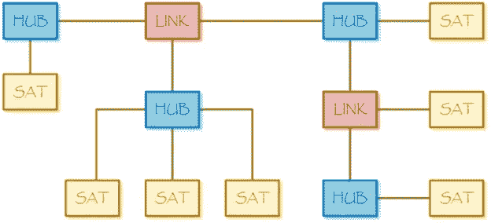
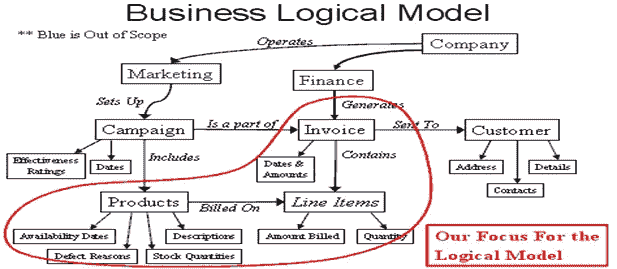
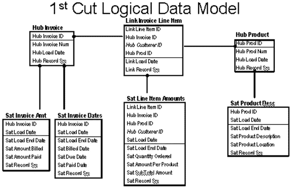

# 成功的 BI/数据仓库/辅助智能和机器学习的团队结构。

> 原文：<https://medium.com/analytics-vidhya/team-structure-for-successful-bi-data-warehouse-assisted-intelligence-and-machine-learning-bd245a5e2858?source=collection_archive---------8----------------------->

了解业务中数据的连续性和机器学习的价值的企业应该做些什么。

ID 51836680 Mopic | Dreamstime.com

第一个问题是需要可用的数据，以便企业可以使用这些数据。从具有结构化数据的所有交易系统中收集数据的方式多种多样，并且有许多其他数据来源，如流式交互日志、呼叫中心内容、网站交互、其他非结构化数据(如市场情绪)以及可能对业务产生影响的数据(如整体经济因素、商品和指数价格、业务和一般新闻信息)。

人工智能专家、Splice Machine 首席执行官兼联合创始人蒙特·兹韦本(Monte Zweben)表示，一个人工智能项目的平衡团队将包括三个关键人物。

首先，一名数据工程师可以将公司收集的信息转化为人工智能和人工智能系统可以接受的数据，或者一个团队准备了一个有组织、可用的企业通用数据平台。该团队还可能拥有数据准备、数据库设计和支持，以及具有数据移动专业知识的报告和可视化资源。此外，还可能存在整合内容管理的业务需求，如文档光学字符识别、数据移动步骤的自动化处理，而不是通过接口、API 或数据管道，如提取、转换和加载。

第二，拥有领域专业知识的数据科学家知道，比如说，天气会影响交付计划，或者特定的机械问题会影响维护计划。数据科学家还需要能够测试不同的算法，看看哪种算法性能最好，然后根据需要调整它们，以获得有价值的预测。

最后，需要一个能够将所有这些整合到实际应用程序中的软件开发人员。

“这些是我们正在寻找的技能组合，”兹韦本说。

对于许多组织来说，人工智能的成功更多的是这三个关键领域的平衡因素，而不是被雇佣的博士数量。

“充实”团队的其他资源不一定是全职的，将包括业务分析师、具有组织技术基础架构专业知识的 DevOps 专家、质量控制、安全保证和内部流程审计控制。

技术 DevOps 资源用于确保与版本控制的一致性和使用，并持续部署到开发、测试、QA 和生产环境中，如果组织具有定义良好的基础架构，并在使用中进行了足够的培训，以确保团队中的代表具有足够的技能水平，则可能没有必要。

对于测试和质量保证角色，设计思维方法的一部分包括测试驱动开发(TDD ),以确保在每一个发布中都满足由业务部门设定并与团队达成一致的目标。同样，如果有一些架构公共资产被完全理解，这不需要是一个单独的人。

团队或迭代负责项目管理监督，并处理各种“管理”事务，如会议日程的预订，确保流程和项目文档由适当的团队成员在敏捷管理平台(如 Atlassian 吉拉、Confluence 等)上完成。和任何必要的时间记录到资本或间接费用活动完成。

应该存在一个直线管理结构，也许更多的是矩阵型而不是等级型，将资源与高级顾问和角色导师和经理联系起来，这些顾问和经理可以与每个团队成员达成个人目标，并拥有所管理领域的专业知识和技能，以鼓励员工发展和有意义的绩效评估。

企业安全、安全驱动的编程开发技术和在成为生产解决方案之前验证系统的安全性，以及满足任何内部审计控制和管理要求，可以作为迭代和敏捷过程的一部分引入，专家参与初始和展示事件，以及诸如在任何面向外部的应用程序的生产发布之前进行渗透测试的活动。

业务分析师角色不需要团队中的独特技能，除非这三个关键角色缺乏业务领域知识。他们可能会兼任迭代领导或团队领导。

然后，必须解决业务和 IT 的 5 个长期问题，尤其是当它涉及到认识到数据是企业的主要资产之一时。

**问题#1:唯一不变的是变化:**

商业世界总是在变化，如果总是努力寻求创新和效率，内部组织将会成功，因此内部结构将会变化，外部环境随着供应的变化、消费者选择的变化、本地和全球经济因素的变化、季节的变化以及全球疫情等意外影响而改变世界。因此，数据仓库或中央数据平台的创建从未完成，因为需要反映新的机会，不同的洞察力焦点以及用新数据和最新趋势更新任何模型的需求使得基于分析的概念(如滚动平均)不够充分。

**问题 2:真正的大数据:**

组织收集的信息量会随着时间的推移而增长，但也会呈指数级增长，因为其他数据源显示出相关性，因此需要进行跟踪。因此，一些收集和保存数据以供使用的技术和方法不再可行，或者在支持和专业知识方面有很大的开销，许多“云”技术提供了额外的好处，并降低了这些物理数据资产的总拥有成本。

问题#3:复杂性！

不再只有销售交易作为业务信息的总基础，而且指导数据外观的纯层次关系也越来越少。供应链正变得越来越一体化，在消费者或纯粹的商业关系中，客户互动的方式有许多方面。更容易理解的是，很少有行动是孤立于其他行动而产生的，因此客户 B 从供应商 A 处购买产品或服务的动机不仅仅是因为已经建立了销售关系，供应商 A 已经了解了客户 B 的所有需求。如何将所有这些数据关联起来并形成一致和准确的画面，或者用作分析和建模(如分类、PCA 或趋势映射)的试验信息集也不简单。FiveTran 等工具使移动数据变得更加容易，但在标记、编目、分析和清理所有必需的数据方面仍然存在挑战，这应该始终是 Data Domain 从业者的主要关注点。

**问题#4:业务领域——数据需要符合业务需求**

技术要求和软件特性对商业用户来说无关紧要。因此，以前花费在 BD-50 风格的业务设计要求上的时间只涉及到作为业务分析师的初级资源通常可以确定和记录的细节，而不是采用设计思维的行为驱动开发(BDD)方法作为绘制业务旅程、关键价值主张和价值链的加速方式，以确定如果该解决方案做得正确，对业务的重要性和潜在回报。

潜在的概念仍然是映射当前过程和未来过程，但更全面地从用户的角度出发，而不是在内部严格地遵循一些邪教式的惯例，如业务过程映射符号(BPMN)，这可能有助于也可能没有助于计算机辅助软件工程。这无疑是为了使数据和技术流程适应业务需求而过度设计的一种尝试。

**问题#5:缺乏灵活性——数据源需要持续关注**

随着时间的推移，数据源会发生变化，会添加新的数据源，有些数据源将不再可用，因此需要持续关注。由于一些数据源可能不在组织的直接控制范围内，因此它们必须适应数据不可用或由于多种原因访问被禁用的情况，以及许多“自我修复”方法来最大限度地减少中断，例如重试几次 API 连接，或者在请求在某些参数范围内被拒绝时多次访问数据源。我工作过的第一个机器人流程自动化解决方案之一是，如果另一个用户想要使用组织的单一凭据，则必须处理对市场指数数据源的访问被断开，这样，在打开的 Excel 工作簿上运行的自动化脚本就会出错，因为与数据源的连接已被重置，否则需要手动干预。

因此，在如何组织数据方面，商业智能中有 4 种主要方法来保存数据

完全规范化的数据库(比尔·恩门出版的原始方法。)

具有可选雪花和 OLAP 立方体的反规格化星形模式(来自 Ralph Kimball 等人的更新方法。)

来自 Hadoop 大数据运动的 NoSQL 密钥对柱状数据

Dan Linsdedt 推出混合“中枢和链接”数据库

坦率地说，对 Inmon 的关系型 3NF 和 Kimball 的星型模式策略的依赖不再适用。Map-Reduce 和 Hadoop 的复杂性已经在很大程度上从数据湖的主要“大数据”存储库中移除，例如来自亚马逊 Web 服务或雪花的 Redshift。在机器学习中，重点应该放在特征工程上，而不一定反映在视图中，这些视图是“明星”,具有组织起来的数据子集，以支持正在建模的主题。

完全规范化的数据库有利于存储优化，因此，如果使用带有复制备份的单个存储节点进行设计，速度会更快。处理分布式节点和高可用性有点麻烦，但 Oracle 和 DB2 等 RDBMS 具有复杂的组件，这使处理变得容易得多，尽管如果这仍然是“内部”的，仍然需要专门的专家资源来管理。它开始失败的地方是，需要不断地查看数据表连接或物化视图的刷新，以反映业务实际上是如何看待数据的，因为有些维度。一个商人经常会说，我需要“按周、按地区、按产品组”查看这个销售数字，这开始看起来非常像一个星形模式或 OLAP 立方体。

数据保险库如何成为最佳折衷方案—数据保险库看起来像什么？

Data Vault 方法使用集线器组件的概念，集线器组件是围绕一个主题的主要细节，链接显示与许多集线器相关的内容。Satellite 更像是 Hub 主题的附加属性，可能会随着时间的推移而改变，例如频繁改变维度值，以便可以显示历史视图，同时不会影响维度的结构或需要额外的编码来解决。类似于 OLAP 立方体的视图可以很容易地组合起来。

**HUB** (蓝色):包含具有自己的代理键的唯一业务键列表。描述业务关键字或记录“源”来源的元数据也被存储，以跟踪数据的来源和时间。

**LNK** (红色):在业务键之间建立关系(链接)(通常是枢纽，但链接可以链接到其他链接)；本质上描述了多对多关系。链接通常用于处理数据粒度的变化，减少向链接中心添加新业务键的影响。

**SAT** (黄色):持有可随时间变化的描述性属性(卫星)(类似于金博尔 II 型缓变维度)。在中枢和链路形成数据模型结构的情况下，卫星包含时间和描述性属性，包括将它们链接到其父中枢或链接表的元数据。包含记录生效日期和过期日期的附属表中的元数据属性提供了强大的历史功能，支持可以“及时返回”的查询。

Data Vault 方法有几个主要优点:

-简化数据接收流程

-删除星型模式的清理要求

-立即为 HIPPA 提供可审计性。数据隐私和保护以及其他法规。

-将重点放在真正的问题上，而不是围绕它进行编程

-轻松允许添加新数据源，而不中断现有模式

简而言之，数据仓库既是一种数据建模技术，也是一种容纳历史数据、审计和数据跟踪的方法。

-它适应不断变化的商业环境

-它支持非常大的数据集

-它简化了 EDW/商业智能设计的复杂性

-它增加了业务用户的可用性，因为它是按照业务领域建模的

-它允许在不影响现有设计的情况下添加新的数据源

举个例子，设计思考会议将制定出“发票”主题中要考虑的关键业务组件和关系，其中业务需求是准确记录销售，并有一种管理现金流和客户信用风险的方法，这是需要解决的主要业务问题。

在 BDD 关系和价值链主张与业务 SME 和利益相关方就以下主题达成一致的情况下，应该确定一个在公共数据平台中表示数据的结构。

适用于发票领域的 Data Vault 逻辑模型示例如下所示:

图来自 Dan Linstedt 的博客文章:发票领域的初始逻辑数据模型

如果组织的这个组件存在并且是一个关注点，则可以为生产、制造或仓储关注点确定一组完全不同的数据库对象，其中重新使用被分类为中心的一些公共项目，例如产品中心，但是扩展到位置和分配模式、保存期限、产品成本和资产。

可以组装另一组数据库对象，以指示定价和营销效果方面的问题和关注，以及用于识别新市场或巩固现有位置的客户分析和地理趋势。

这与敏捷框架完美地结合在一起，因为短的和可定义的工作块可以被计划和显示为有效的和增加价值的，与在更传统的星型模式方法中试图使所有数据一致并解析为解决方案集形成对比。在敏捷框架中，一个主题应该很容易在典型的 2 周 sprint 中完成，有合适的角色和团队能力，包括数据工程师和专家，以确保数据是正确的和可用的。