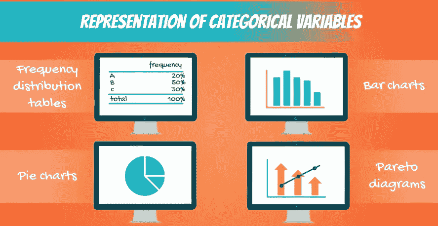
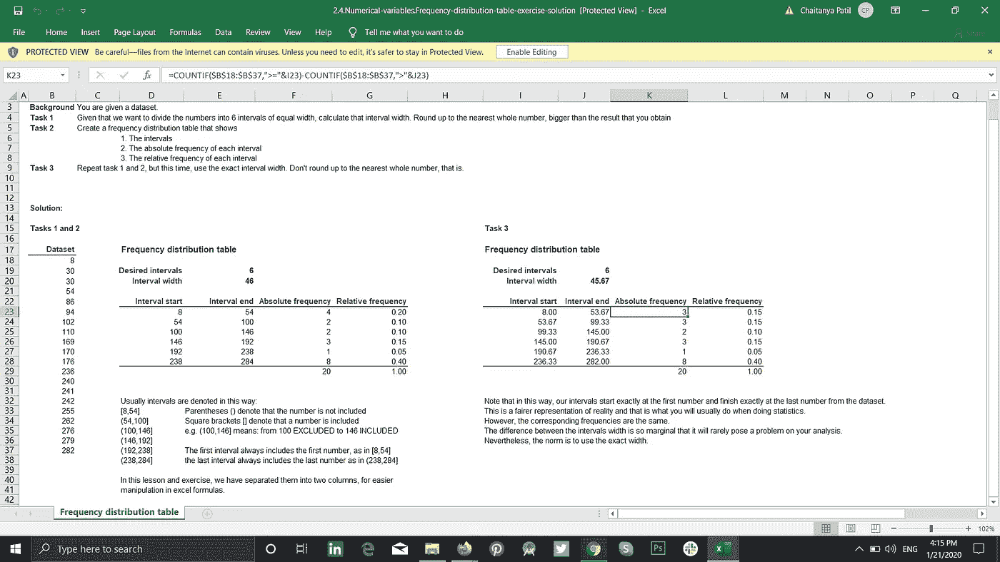
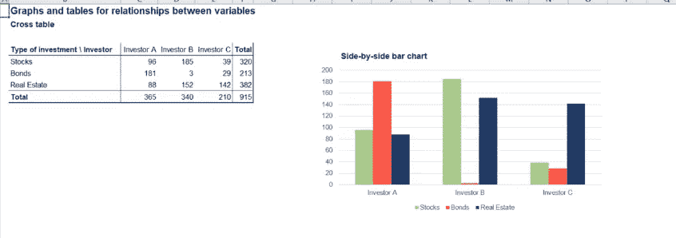

# 各种类型变量的技巧。统计数据

> 原文：<https://medium.com/analytics-vidhya/techniques-for-various-types-of-variable-statistics-30aeebc2620a?source=collection_archive---------28----------------------->

1.  **分类变量的表示**

分类数据的表示

1.**频率分布表:**
在这个表中我们的频率分布表有两栏，第一栏列出了项目，第二栏根据项目列出了金额/数量。

频数分布表

上图是德国汽车商店的图片，显示了在德国商店销售的汽车类型。它显示奥迪汽车卖得更多。
频率:在这种情况下，频率是售出的单位数。

我们可以比较不同的品牌。

2.**条形图**

条形图

在上面的柱状图中，很容易理解奥迪是销量最高的品牌。在这里，在柱状图的左侧指定了频率。

3.**饼状图**

圆形分格统计图表

在上面的图表中，百分比是根据项目的销售情况指定的。它被称为相对频率。

相对频率:相对频率是每个类别占总频率的百分比。

相对频率

在这里，我们可以看到项目的份额。比如市场份额。

4 **。排列图**

帕累托图是一种特殊类型的条形图，其中类别按频率降序显示。

累积频率是相对频率的总和。

帕累托图结合了条形图和饼图的优势。

帕累托原则

2.数字变量。使用频率分布表。

描述数字数据最常用的方法是直方图。

在柱状图中它们是相互连接的，它们表明它们是连续的，它们主要表明这是特定的组。

例如:人群的年龄组**。**

**我们如何表示两个变量之间的关系？**

我们将关注交叉表(内容表)和散点图。

用交叉表表示分类变量的常用方法。

并排条形图是条形图的变体。

一旦确定了要处理的数据类型，所有的图表都很容易创建和阅读。

**散点图**

每一点都给了我们关于某个学生表现的信息。

散点图代表大量的观察结果。在散点图中，统计师对寻找单个或特定的学生/项目不感兴趣。他想识别学生类型的数量，或者他只想知道数据是如何分布的。

从上面的散点图我们可以做很多预测。

箭头:简学生是一个异数

***离群值:离群值是违背整个数据集逻辑的数据点。***