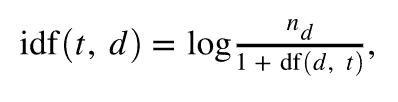

# NLP 中的技术将提升你的模型。

> 原文：<https://medium.com/analytics-vidhya/techniques-in-nlp-which-will-boost-your-model-1add5b57d73a?source=collection_archive---------24----------------------->


在我的上一篇文章中，我展示了标记化、词干化和词汇化如何帮助以我们人类所说的自然语言的形式提供特性。

[](/swlh/a-glance-to-natural-language-processing-nlp-e196065ec8e) [## 自然语言处理一瞥

### 自然语言处理及其初级技术简介。

medium.com](/swlh/a-glance-to-natural-language-processing-nlp-e196065ec8e) 

但是这不是最好的方法。

2 更多的方法在优化中非常有用，使模型高效准确。它们是:

1.  一袋单词
2.  TF-IDF

# **袋字**

在简单的英语中，单词包将记录最常用单词的总出现次数。这些单词将被视为**特征**，并可以提供给算法。它为文本中出现的所有单词创建了一个字典。

这是我们得到的文本:

```
Sentence 1: He is a good boy
Sentence 2: She is a good girl
Sentence 3: The Boy and the Girl are good.
```

该任务中有两个步骤，分别是**收集停用词**和**降低句子的大小写**。因此，执行后，句子会像…

```
Sentence 1: good boy
Sentence 2: good girl
Sentence 3: boy girl good
```


单词包实现。

这就是句子中的单词如何被**转换成向量**的方式，其中 f1、f2 和 f3 是独立的特征。
正如我们在之前的博客中看到的，有特定的方法调用来执行诸如词干化和词汇化之类的任务。包话有一点 d **不同的方法**。

首先，为了从文本中获取独特的单词，我们将进行词干化或词汇化，之后，我们将在此基础上实现一个单词包。
Scikit Learn 有一个名为计数矢量器的类，它使我们的工作变得更容易，称为计数矢量器。

```
from sklearn.feature_extraction.text import CountVectorizer
cv=CountVectorizer()
x=cv.fit_transform(corpus).toarray()
```

这段 Python 代码将把句子转换成向量。这里的文本将在“语料库”变量中作为一个列表。

这种方法可以用于情感分析，我们只需要预测句子是正面情感还是负面情感。

# 术语频率—反向文档频率(TF-IDF)

术语频率—逆文档频率，也称为 TF-IDF，是一种统计方法，它将对文档中的每个单词进行排名。

这是通过将两个度量相乘来实现的:一个单词在一个文档中出现的次数，以及该单词在一组文档中的逆文档频率。


词频(TF)=句子中重复单词的数量/句子中单词的数量



逆文档频率(IDF) = log(句子数量/包含单词的句子数量)


TF-IDF = tf * idf

从数学上讲，这就是单词在文档中出现的顺序。

在我们的示例中，TF-IDF 矢量化的实现如下:


TF-IDF 实施

所有这些条件都将通过编写一个小代码来完成，该代码将使用 Scikit Learn 的 TF-IDF 矢量器。

```
from sklearn.feature_extraction.text import TfidfVectorizer
vect = TfidfVectorizer()
x = vect.fit_transform(corpus).toarray()
```

我们将创建一个 TfidfVectorizer 类的对象，该对象将被提供一个经过词条化或词干化的句子语料库。

特别感谢 [Aayush Jain](https://medium.com/u/ebd39ffce733?source=post_page-----1add5b57d73a--------------------------------) 对本文的帮助。这里有一个[链接](/@jainaayush99.aj/spam-classifier-a-natural-language-processing-project-3dcd177b4534)到一个 NLP 项目，它可以帮助你用现实生活中的数据来尝试。