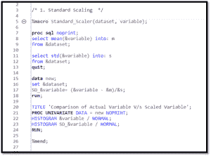

# 使用 SAS 定制宏的特征缩放技术可以提高预测机器学习模型的准确性和性能

> 原文：<https://medium.com/analytics-vidhya/techniques-of-feature-scaling-with-sas-custom-macro-that-can-increase-the-accuracy-and-performance-23571c317ce2?source=collection_archive---------21----------------------->

第一部分

## 什么是特征缩放？

**特征缩放**是用于归一化数据的过程，它是数据预处理中最重要的步骤之一。在将数据输入机器学习、深度学习和统计算法/模型之前，先进行特征缩放。在大多数情况下，已经注意到，当缩放要素时，模型的性能会提高，尤其是在基于欧几里德距离的模型中。**规范化**和**标准化**是**特征缩放**的两个主要技术。我将定义并解释我们如何通过使用 SAS 宏工具在 SAS Studio 或 Base SAS 中实现不同的功能扩展技术。

## 什么是正常化？

归一化是要素缩放的过程，其中数据值被重新缩放或绑定为两个值，通常在(0，1)或(-1，1)之间。Min_MaxScaler 和 Mean_Normalization 是非常常见的规范化示例。

1.Min_MaxScaler

它在 0 和 1 之间调整/重新调整数据值，数学公式在这里。

1.1 如何在 SAS 中使用 Min_MaxScaler？

Github 上的代码如下:[https://Github . com/Suraj-617/Blogs/blob/master/Techniques % 20 of % 20 feature % 20 scaling % 20 with % 20 SAS % 20 custom % 20 macro-% 20a . SAS](https://github.com/Suraj-617/Blogs/blob/master/Techniques%20of%20Feature%20Scaling%20with%20SAS%20Custom%20Macro-%20A.sas)

1.2 Min_MaxScaler SAS 自定义宏定义

Min _ MaxScaler SAS 宏在幕后做什么？

Min_MaxScaler 获取您想要缩放的变量，并使用缩放后的值创建一个新变量“MMVariableName”。它还创建了一个单变量报告，您可以在其中看到实际变量和新缩放变量的直方图。

2.均值归一化

它重新调整(-1，1)之间的数据值，数学公式在这里。

2.1 如何在 SAS 中使用 Mean_Normalization

2.2 Mean_Normalization SAS 自定义宏定义

2.3 Mean _ Normalization SAS 宏在幕后做什么？

Mean_Normalization 获取要缩放的变量，并使用缩放后的值创建一个新变量“MNVariableName”。它还创建了一个单变量报告，您可以在其中看到实际变量和新缩放变量的直方图。

## 什么是标准化？

标准化是一种要素缩放技术，其中数据值以平均值为中心，标准差为 1，这意味着标准化后，数据的平均值为零，方差为 1。

> [*如何在 Python 中使用 StandardScaler 和 MinMaxScaler 变换*](https://machinelearningmastery.com/standardscaler-and-minmaxscaler-transforms-in-python/)

3.标准缩放器

它重新调整数据值的分布，使观察值的平均值为 0，标准差等于 1，数学公式如下。

*“标准化假设你的观察值符合一个具有良好均值和标准差的* [*高斯分布*](https://machinelearningmastery.com/continuous-probability-distributions-for-machine-learning/) *(钟形曲线)。如果没有达到这一预期，您仍然可以标准化您的数据，但您可能不会得到可靠的结果。”*3.1 SAS 中的标准缩放器

3.2 Standard_Scaler SAS 自定义宏定义

3.3 Standard _ Scaler SAS 自定义宏在幕后做什么？

Standard_Scaler 获取您想要缩放的变量，并使用缩放后的值创建一个新变量“SDVariableName”。它还创建了一个单变量报告，您可以在其中看到实际变量和新缩放变量的直方图。

## 4.鲁棒缩放器

Robust_Scaler 转换数据值。首先，减去数据值的中值，然后除以 IQR，这是四分位数之间的范围(3 分位数-1 分位数)，这意味着它将中值集中在零，这是异常值的非常稳健的方法。数学公式在这里。

4.1 如何在 SAS 中使用 Robust_Scaler？

4.2 Robust_Scaler SAS 自定义宏定义

4.3 Robust _ Scaler SAS 自定义宏在幕后做什么？

Robust_Scaler 获取您想要缩放的变量，并使用缩放后的值创建一个新变量“RSVariableName”。在工作库中，它将创建一个 STAT 表，您可以在其中找到中值、分位数 1 和分位数 3 的值来验证您的结果。它还创建了一个单变量报告，您可以在其中看到实际变量和新缩放变量的直方图。

*原载于 2020 年 12 月 18 日 https://seleritysas.com***。**

*代码可在 Github 页面获得:[https://Github . com/Suraj-617/Blogs/blob/master/Techniques % 20 of % 20 feature % 20 scaling % 20 with % 20 SAS % 20 custom % 20 macro-% 20a . SAS](https://github.com/Suraj-617/Blogs/blob/master/Techniques%20of%20Feature%20Scaling%20with%20SAS%20Custom%20Macro-%20A.sas)*