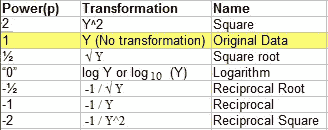

# 改变数据分布的技术！！！

> 原文：<https://medium.com/analytics-vidhya/techniques-to-transform-data-distribution-565a4d0f2da?source=collection_archive---------3----------------------->


在机器学习中，大多数算法都是基于数据正态分布的假设而工作的。
然而，并非所有的机器学习算法都做出这样的假设，即事先知道它将处理的数据分布类型，而是直接从用于训练的数据中学习。

# 内容:

1.  高斯分布的必要性和重要性是什么？
    →什么是高斯分布？
    →需要正态分布吗？
    →常态在机器学习中的重要性！
2.  需要数据转换！！
3.  数据分布转换的重要性。
4.  变换分布的不同方法。
    →权力的阶梯。
    → Box-Cox 变换法。
    → Yeo-Johnson 变换法。

> 让我们来看看正态性的重要性以及转换数据分布的方法。

# 高斯分布的必要性和重要性是什么？

## 什么是高斯分布？

*   高斯分布又名“**正态分布**”，是一种关于平均值对称的概率分布，表明接近平均值的数据比远离平均值的数据出现得更频繁。
    →所有值的 68.2%存在于平均值±1 标准偏差之间。
    →所有值的 95.5%存在于平均值±2 个标准偏差之间。
    →所有值的 99.7%存在于平均值 3 标准偏差之间


*   高斯(正态)分布是概率钟形曲线的专有名词。
*   在高斯(正态)分布中，平均值为零，标准差为 1。它的偏斜度为零，峰度为 3。
*   高斯(正态)分布是对称的，但并非所有对称分布都是正态的。

## 需要高斯(正态)分布吗？


*   正态分布模型基于[中心极限定理](https://en.wikipedia.org/wiki/Central_limit_theorem)。当[独立随机变量](https://en.wikipedia.org/wiki/Statistical_independence)相加时，它们的适当归一化和趋向于[正态分布](https://en.wikipedia.org/wiki/Normal_distribution)(非正式的*钟形曲线*)，即使原始变量本身不是正态分布。
*   这种分布的性质通常会导致极其高效的计算。
*   因为它让数学变得更简单。
    正态分布的概率密度函数是二次型的指数。取对数(正如你经常做的那样，因为你想最大化对数似然性)得到二次方。对此求微分(求最大值)得到一组线性方程，很容易解析求解。

## 常态在机器学习中的重要性！

1.  高斯分布无处不在，因为只要允许具有独立特征概率的数据集在大小上增长，具有有限方差的数据集就会变成高斯分布。
2.  具有高斯分布的数据集适用于参数统计中的各种方法。
    诸如[不确定性传播](https://en.wikipedia.org/wiki/Propagation_of_uncertainty)和[最小二乘](https://en.wikipedia.org/wiki/Least_squares)参数拟合等方法使数据科学家的生活变得轻松，这些方法仅适用于具有正态或类正态分布的数据集。
3.  由于高斯(正态)分布很容易解释，所以测试的结论和总结背后的直觉很容易传达给没有多少统计知识的人。
4.  整个分布由两个数字描述，均值和方差。
5.  与许多其他在变换时改变其性质的分布不同，高斯分布倾向于保持高斯分布。
    *两个高斯的乘积是一个高斯
    *两个独立的高斯随机变量之和是一个高斯
    *高斯与另一个高斯的卷积是一个高斯
    *高斯的傅立叶变换是一个高斯

# 需要数据转换！！

*   为了更接近具有良好统计特性的理论分布
*   使数据分布更加均匀——使数据分布更加对称
*   为了使变量之间的关系更加线性
*   使数据具有更恒定的方差(同方差)

# 数据分布转换的重要性

*   当数字数据呈正态分布时，机器学习算法会提供更好的结果(预测)。
*   以使成本函数更好地最小化预测误差。

# 变换分布的不同方法

## →权力的阶梯

数据变换通常是幂变换，x'=xθ(其中 x '是变换后的 x)。



*   如果 ***数据右偏*** (聚集在较低值)向下移动幂阶梯(即，尝试平方根、立方根、对数等。转换)。


*   如果 ***数据是左偏的*** (聚集在更高的值)，则向上移动幂的阶梯(立方、方形等)。


## Box-Cox 变换方法

*   Box-Cox 方法是一种数据变换方法，可以执行一系列幂变换，包括对数和平方根。这种方法是以乔治·博克斯和大卫·考克斯的名字命名的。
*   它可以配置为自动评估一组转换，并选择最适合的转换。
*   所得到的数据样本可能更加线性，并且将更好地表示潜在的非幂分布，包括高斯分布。

***在 SciPy:***

[boxcox() SciPy 函数](https://docs.scipy.org/doc/scipy/reference/generated/scipy.stats.boxcox.html)实现了 Box-Cox 方法。它需要一个名为 lambda 的参数来控制要执行的转换类型。

*   **λ=-1**。是一种互易变换。
*   **λ=-0.5**是倒数平方根变换。
*   **λ= 0.0**是对数变换。
*   **λ= 0.5**是平方根变换。
*   **λ= 1.0**是无变换。

```
from scipy.stats import boxcoxy,fitted_lambda= boxcox(y,lmbda=None)
```

***在 sklearn:***

```
from sklearn.preprocessing import PowerTransformer
pt = PowerTransformer(method='box-cox')data = pt.fit_transform(data)
```

> Box-Cox 变换的局限性在于它假设数据样本中的所有值都是正的。

## 约-约翰逊变换法

*   与 Box-Cox 变换不同，它不要求每个输入变量的值严格为正。
*   它支持零值和负值。这意味着我们可以将它应用到我们的数据集，而无需先对其进行缩放。

***在 SciPy:***

```
from scipy.stats import yeojohnsony,fitted_lambda = yeojohnson(y,lmbda=None)
```

***在 Sklearn:***

我们可以通过定义一个 *PowerTransform* 对象并将“*方法*”参数设置为“ *yeo-johnson* ”来应用转换

```
from sklearn.preprocessing import PowerTransformer
pt = PowerTransformer(method='yeo-johnson')data = pt.fit_transform(data)
```

喜欢我的文章？请为我鼓掌并分享它，因为这将增强我的信心。此外，我每周日都会发布新文章，所以请保持联系，以了解数据科学和机器学习基础系列的未来文章。

此外，请务必通过 LinkedIn 与我联系。


由[马库斯·斯皮斯克](https://unsplash.com/@markusspiske?utm_source=medium&utm_medium=referral)在 [Unsplash](https://unsplash.com?utm_source=medium&utm_medium=referral) 上拍摄的照片