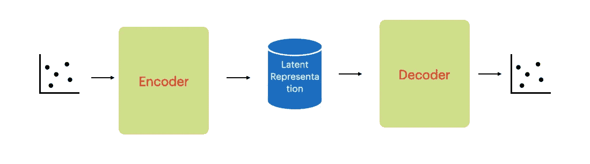

# 处理不平衡数据时你需要知道的技巧

> 原文：<https://medium.com/analytics-vidhya/techniques-you-need-to-know-while-handling-imbalanced-data-d48a586c848d?source=collection_archive---------20----------------------->

> “我们的目标是将数据转化为信息，将信息转化为洞察力。”
> 
> —卡莉·菲奥莉娜

我们在处理真实世界数据集时遇到的一个主要挑战是不平衡的数据比例。欺诈检测是这类数据的最佳例子。

在本文中，我们将使用来自 [kaggle](https://www.kaggle.com/mlg-ulb/creditcardfraud) 的信用卡欺诈检测数据集。


欺诈事件在整个数据中不到 1%。这种来自特定类的实例非常少的数据称为不平衡数据。

# 取样技术

## 过采样


来自少数类(数据集中实例较少的类)的数据被复制以增加少数类的比例。这种技术的一个主要问题是过度拟合。

```
from imblearn.over_sampling import RandomOverSampleroversample = RandomOverSampler(sampling_strategy='minority')X_over, y_over = oversample.fit_resample(X_train, y_train)
```

## 欠采样


对多数类(数据集中实例较多的类)中的数据进行采样，以降低多数类的比例。这种技术的一个主要问题是信息的丢失。

```
from imblearn.over_sampling import RandomUnderSamplerundersample = RandomUnderSampler(sampling_strategy='majority')X_over, y_over = oversample.fit_resample(X_train, y_train)
```

## 合成少数过采样技术(SMOTE)

我们将通过这种过采样技术产生样本，而不是盲目复制。SMOTE 按照以下步骤生成数据。

1.  对于少数类中的每个样本 x，选择 k 个最近邻来形成 Q{y0，y1 …k 值}(k 的默认值是 5)。
2.  新样本 x '是从少数样本的线性插值中获得的，公式如下:


击打前的 t-sne 图

```
**from** imblearn.over_sampling **import** SMOTEsm **=** SMOTE(random_state **=** 2)X_train_res, y_train_res **=** sm.fit_sample(X_train, y_train)
```


击打后的 t-sne 图

SMOTE 和欠采样的组合用于获得更好的结果。

# 集成学习技术

据信，集成学习技术在不平衡数据上表现良好。集成技术将多个分类器的结果结合起来，以提高单个分类器的性能。集成技术的目标是减少分类器的多样性。

## 随机森林


集成学习

随机森林是一种集成学习技术，旨在减少决策树分类器的多样性。随机森林从基于采样数据构建的多个决策树中获得最佳解决方案。

```
from sklearn.ensemble import RandomForestClassifiermodel = RandomForestClassifier(n_estimators=100, 
                               bootstrap = True,
                               max_features = 'sqrt')
model.fit(X_train,y_train)y_pred2= model.predict(X_test)
```

我们发现了 72 起欺诈/总共 98 起欺诈。因此，发现欺诈的概率是 0.734。


随机森林的混淆矩阵

## XGBoost


助推

随机森林并行构建树。在 boosting 技术中，通过纠正先前训练的树的错误来训练树。

```
import xgboost as xgbalg = xgb.XGBClassifier(learning_rate=0.1, n_estimators=140, max_depth=5,min_child_weight=3, gamma=0.2, subsample=0.6, colsample_bytree=1.0,objective='binary:logistic', nthread=4, scale_pos_weight=1, seed=27)alg.fit(X_train, y_train, eval_metric='auc')y_pred = alg.predict(X_test)
y_score = alg.predict_proba(X_test)[:,1]
```

我们发现了 74 起欺诈/总共 98 起欺诈。因此，发现欺诈的概率是 0.755。


XGBoost 的混淆矩阵

## 轻型 GBM

轻型 GBM 提高了 XGBoost 的性能。

XGBoost 允许逐级增长。但是轻的 GBM 允许叶向生长。这使得轻量级 GBM 内存高效，并兼容大型数据集。

```
import lightgbm as lgbmlgbm_clf = lgbm.LGBMClassifier(boosting_type='gbdt',
        class_weight=None,
        colsample_bytree=0.5112837457460335,importance_type='split',
        learning_rate=0.02, max_depth=7, metric='None',
        min_child_samples=195, min_child_weight=0.01,
        min_split_gain=0.0,
        n_estimators=3000, n_jobs=4, num_leaves=44, objective=None,
        random_state=42, reg_alpha=2, reg_lambda=10, silent=True,
        subsample=0.8137506311449016, subsample_for_bin=200000,
        subsample_freq=0)lgbm_clf.fit(X_train, y_train)y_pred1 = lgbm_clf.predict(X_test)
y_score1 = lgbm_clf.predict_proba(X_test)[:,1]
```

我们发现了 76 起欺诈/总共 98 起欺诈。因此，发现欺诈的概率是 0.775。


光 GBM 的混淆矩阵

# 深度学习技术

## 自动编码器



自动编码器

自动编码器试图重建给定的输入。自动编码器用于降维和深度异常检测。

这些深度学习技术也可以应用于图像和视频。

我们将训练我们的公平或正常交易的自动编码器。每当遇到欺诈检测时，自动编码器无法重建它。这导致欺诈交易的更多重构误差。


```
autoencoder = tf.keras.models.Sequential([

    tf.keras.layers.Dense(input_dim, activation='relu', input_shape=(input_dim, )), 

    tf.keras.layers.GaussianNoise(),

    tf.keras.layers.Dense(latent_dim, activation='relu'),

    tf.keras.layers.Dense(input_dim, activation='relu')

]) autoencoder.compile(optimizer='adam', 
                    loss='mse',
                    metrics=['acc']) autoencoder.summary()#output
_________________________________________________________________
Layer (type)                 Output Shape              Param #   
=================================================================
dense (Dense)                (None, 29)                870       
_________________________________________________________________
gaussian_noise (Gaussian Noise (None, 29)                0         
_________________________________________________________________
dense_1 (Dense)              (None, 2)                 60        
_________________________________________________________________
dense_2 (Dense)              (None, 29)                87        
=================================================================
Total params: 1,017
Trainable params: 1,017
Non-trainable params: 0
_________________________________________________________________
```

现在，我们将训练自动编码器，并观察公平交易和欺诈交易的重构误差。

```
X_test_transformed = pipeline.transform(X_test)reconstructions = autoencoder.predict(X_test_transformed)mse = np.mean(np.power(X_test - reconstructions, 2), axis=1)
```


标签-0 是公平的，标签-1 是欺诈

欺诈交易重构误差相当高。现在我们需要设置阈值来区分欺诈和公平交易。

对于好精度值，我们可以使用高阈值，对于好的召回，我们需要降低它。


使用 MAD 阈值— 3


使用 MAD 阈值-5

## 偏差网络

偏差网络(DevNet)定义了高斯先验和基于 Z 分数的偏差损失，以便能够利用端到端神经异常分数学习器直接优化异常分数。


发展网

该网络中使用的损失函数为:

l􏰁φ(x；θ)=(1y)| dev(x)|+y max(􏰁0,a−dev(x))

dev(x)=φ(x；θ)μR/σR

其中 a 是 Z 得分置信区间。

> **中心极限定理**陈述了如果你有一个均值为μ，标准差为σ的总体，并且从替换的总体中取足够大的随机样本，那么样本均值的分布将近似为正态分布。

从中心极限定理可以得出结论，高斯分布符合从网络中获得的异常分数数据。我们将在实验中设置μ = 0 和σ = 1，这有助于 DevNet 在不同数据集上实现稳定的检测性能。

对于所有公平交易(y=0):

l􏰁φ(x；θ)=(1 0)| dev(x)| = | dev(x)|

对于所有欺诈交易(y=1):

l􏰁φ(x；θ)= 1(最大(􏰁0,a−dev(x))) =最大(􏰁0,a−dev(x))

因此，偏差损失相当于将所有异常的异常分数与正常对象的异常分数进行统计上显著的偏差。

网络的代码是:

```
def dev_network(input_shape):   
    x_input = Input(shape=input_shape)    intermediate = Dense(1000
                ,activation='relu',              
                 kernel_regularizer=regularizers.l2(0.01), name =     
                 'hl1')(x_input)    
    intermediate = Dense(250, activation='relu',             
                    kernel_regularizer=regularizers.l2(0.01), name =   
                    'hl2')(intermediate)    
    intermediate = Dense(20, activation='relu',                
                    kernel_regularizer=regularizers.l2(0.01), name = 
                    'hl3')(intermediate)    
    intermediate = Dense(1, activation='linear', name = 'score')  
                      (intermediate)    
   return Model(x_input, intermediate)
```

偏差损失的代码是:

```
def deviation_loss(y_true, y_pred):  
    confidence_margin = 5\.         
    ref = K.variable(np.random.normal(loc = 0., scale= 1.0, size = 
                     5000) , dtype='float32')    
    dev = (y_pred - K.mean(ref)) / K.std(ref)    
    inlier_loss = K.abs(dev)     
    outlier_loss = K.abs(K.maximum(confidence_margin - dev, 0.))       
    return K.mean((1 - y_true) * inlier_loss + 
                                 y_true * outlier_loss)model = dev_network_d(input_shape)model.compile(loss=deviation_loss, optimizer=rms)
```

# 韵律学

对于不平衡的数据，准确性不是一个好的衡量标准。相反，我们可以考虑回忆和 F1 分数。

我们也可以从 ROC 曲线转移到精确回忆曲线。

ROC 曲线介于真阳性率(召回率)和假阳性率之间。

Precision 对不平衡数据的变化更敏感，因为负样本的数量相当高。

FPR = FP/(FP+TN)

精度= TP/(TP+FP)

TN(正确识别的非欺诈交易)总是相当高。所以，FPR 对 FP 的变化不敏感(被错误地认定为欺诈)。但是精度变化很大。

# 什么时候去学深度学习技术？

1.  为了从图像或视频相关数据中检测异常，深度学习是优选的。
2.  与集成方法相比，深度学习中需要调整的参数更多。因此，理解模型对于深度学习中的调优起着关键作用。

# 外卖

*   不平衡数据的抽样技术。
*   不平衡数据的集成学习技术。
*   深度异常检测网络。
*   什么时候去深度学习？

感谢阅读:)

# 参考

[](https://www.kdd.org/kdd2019/accepted-papers/view/deep-anomaly-detection-with-deviation-networks) [## KDD 2019 |偏差网络深度异常检测

### Guansong Pang(阿德莱德大学)；沈春华(阿德莱德大学)；安东·范·登·亨格尔

www.kdd.org](https://www.kdd.org/kdd2019/accepted-papers/view/deep-anomaly-detection-with-deviation-networks) 

[https://www . geeks forgeeks . org/ml-handling-unbalanced-data-with-smote-and-near-miss-algorithm-in-python/](https://www.geeksforgeeks.org/ml-handling-imbalanced-data-with-smote-and-near-miss-algorithm-in-python/)

[http://SPH web . bumc . bu . edu/otlt/MPH-Modules/BS/BS 704 _ Probability/BS 704 _ Probability 12 . html](http://sphweb.bumc.bu.edu/otlt/MPH-Modules/BS/BS704_Probability/BS704_Probability12.html)