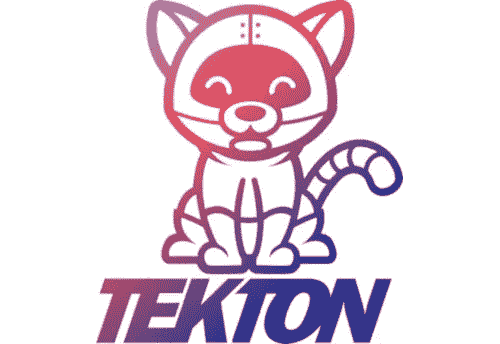

# tek ton:Kubernetes 本地 CI/CD 解决方案和我自己使用它的最佳实践。

> 原文：<https://medium.com/analytics-vidhya/tekton-a-kubernetes-native-ci-cd-solution-and-my-own-best-practices-to-use-it-81b7d456bf64?source=collection_archive---------12----------------------->

2020 年 5 月 28 日
*(原载于*[【https://ish-ar.io/tekton-best-practices/】*)*](https://ish-ar.io/tekton-best-practices/)



*(原发布于*[*https://ish-ar . io*](https://ish-ar.io/tekton_best_practices/)*)*

几个月前，我开始研究一个相对较新的项目，名为[‘tek ton’](https://tekton.dev)。

当我开始实现 Tekton 时，我已经意识到(以积极的方式)离典型的行业标准有多远。作为 Kubernetes 本地 CI/CD 解决方案，它具有革命性。

然而，它也带来了早期项目经常会遇到的问题。例如:

*   尽管文档写得很好，但缺乏案例研究、经验、论坛上的问答等。对新用户来说很难。
*   审计，授权，日志，这一切都有点混乱，但我相信它会随着时间的推移。

在今天的文章中，我将展示一些我为自己定义的最佳实践，并解释一些我刚开始时不清楚的概念。

**注意**:如果你对 Tekton 一无所知或者你从未尝试过，你可能想先阅读一下网上的[‘文档’](https://tekton.dev/docs/)。但这完全取决于你。

# 我一路走来学到的一些概念和最佳实践。

# 可重用性

引起我注意的一个方面是可重用管道的概念。Tekton 通过定义多个*任务*来工作，这些任务将被用作构建模块来创建*管道*。管道和任务都是蓝图，它们实际上不做任何事情，也不应该包含任何执行上下文。

事实上，**一个任务应该尽可能“标准”**。

一些任务示例可以是*构建-停靠-映像、推送-停靠-映像、运行-应用-测试、下载-jar* 等。

# 一切都是 Kubernetes 的对象

如前所述，Tekton 是一个“Kubernetes 本地”应用程序。因此，当您安装它时，您的集群上将有一些新的 API 对象可用。

资源任务、资源、管道、TaskRun、PipelineRun 等。，都是可以通过 kubectl 查询的 API 对象，这在我看来，让用户体验超级！

提示:如果你正在进行故障诊断，记住一个 Tekton 任务对应一个 Pod 是很有用的，每个任务都有步骤，代表 Pod 中的容器。

正如我们在上一段中讨论的，任务和管道是“蓝图”,实际的执行是由任务运行和管道运行触发的。

在我的小型 Tekton 实现中，我当时只使用 TaskRuns 来测试单个任务，而不是每次都触发整个管道。

理想情况下，您希望您的管道由来自 CVS 的 webhooks 触发。在某些情况下，您可能需要手动运行它们，如果是这种情况，您只需通过 CLI 或 Dashboard/UI 创建 PipelineRun 对象。

# TriggerTemplate:目前为止最好的方法！

“完整”Tekton 安装还包括一个名为 Tekton Trigger 的组件。

正如 GitHub 中所写的:" *Tekton Triggers 是一个 Kubernetes 自定义资源定义(CRD)控制器，它允许您从事件有效负载(一个“触发器”)中提取信息来创建 Kubernetes 资源。*

Tekton Trigger 附带 3 个主要资源:TriggerTemplate、TriggerBinding 和 EventListener。

要运行任务和管道，您需要 TaskRun 和 PipelineRun 对象，但是如果您希望从 webhook 或某种 HTTP/s 请求触发它们，该怎么办呢？

在这种情况下，应该使用 TriggerTemplate。使用 TriggerTemplate，您可以定义一个 PipelineRun 或 TaskRun 对象，并将其附加到一个事件侦听器，该事件侦听器将接收传入的 HTTP/s 请求，对它们进行处理并触发正确的 PipelineRun 或 TaskRun。

下面是 EventListener 和 TriggerTemplate YAML 定义的示例。

**事件监听器:**

```
apiVersion: triggers.tekton.dev/v1alpha1
kind: EventListener
metadata:
  name: tekton-demo-el
  namespace: tekton-demo
spec:
  serviceAccountName: tekton-triggers-1590086083
  triggers:
    - bindings:
      - name: tekton-demo-app-ci
      template:
        name: tekton-demo-app-ci
```

**模板触发器:**

```
apiVersion: triggers.tekton.dev/v1alpha1
kind: TriggerTemplate
metadata:
  name: tekton-demo-app-ci
  namespace: tekton-demo
spec:
  resourcetemplates:
  - apiVersion: tekton.dev/v1beta1
    kind: PipelineRun
    metadata:
      generateName: app-ci-run-
    spec:
      serviceAccountName: tekton-demo
      pipelineRef:
        name: ci
      resources:
      ....
```

# 赛尔截击机。

在上面的例子中，事件侦听器与管道有 1:1 的映射，当它接收到传入的请求时，它将总是运行那个特定的管道。

这种设置不理想；如果您希望为另一个存储库创建不同的管道，您必须创建第二个事件侦听器。

你能想象 100 个不同的存储库和管道，100 个不同的事件监听器(也就是 web 服务器)吗？？一个字:神经病。

我准备的实验室利用了一个名为 CEL interceptor 的“组件”,它允许您在事件侦听器中定义一些逻辑。

使用 CEL 拦截器，您可以这样做:“如果存储库名称是 X，动作是 PUSH 然后运行管道 y。”

这里有一个例子:

```
apiVersion: triggers.tekton.dev/v1alpha1
kind: EventListener
metadata:
  name: tekton-demo-el
  namespace: tekton-demo
spec:
  serviceAccountName: tekton-triggers-1590086083
  triggers:
    - name: triggers-cd
      interceptors:
        - cel:
            filter: >-
              (header.match('X-GitHub-Event', 'push') &&
               body.repository.full_name == 'tekton/triggers') &&
               body.ref.startsWith('refs/heads/master')
      bindings:
        - name: triggers-cd-binding
      template:
        name: triggers-cd-template
    - name: dashboard-cd
      interceptors:
        - cel:
            filter: >-
              (header.match('X-GitHub-Event', 'push') &&
               body.repository.full_name == 'tekton/dashboard') &&
               body.ref.startsWith('refs/heads/master')
      bindings:
        - name: dashboard-cd-binding
      template:
        name: dashboard-cd-template
```

# 简单:有保证，但不是立即！

由于 Tekton 不是一个你可以执行的 JAR，点击/点击，魔术，它工作(不涉及任何东西，啊:D)，它要求管理员有一些关于 Kubernetes 的知识，并且至少能自如地查看 K8s API 对象。

最坏的情况:你必须查看一些 Go 代码来理解 Tekton 控制器/组件在做什么。我做到了；源代码做得很好，可读性很强。所以如果真的发生了，也不用太担心。

然而，在最初的疲劳之后，你会感到舒适，并且希望你会看到建立新的工作流程和管理它们是多么容易。

# 下一步是什么？

我准备写一篇关于泰克顿的小编文章。下一个主题是:“Tekton & Prometheus 的管道度量和监控”。

请继续关注，如果您有任何问题，请在 Twitter 上提问！