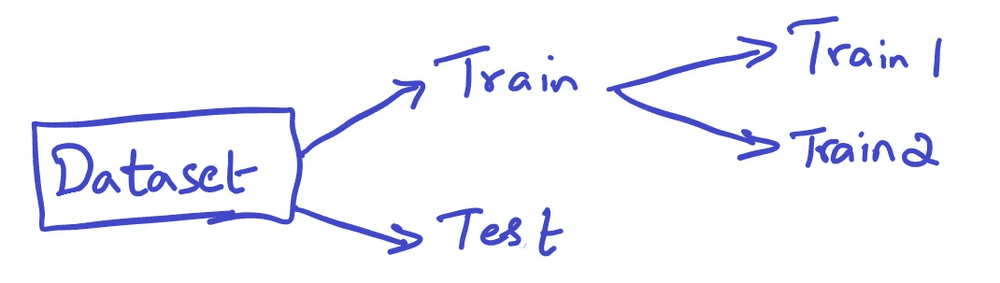
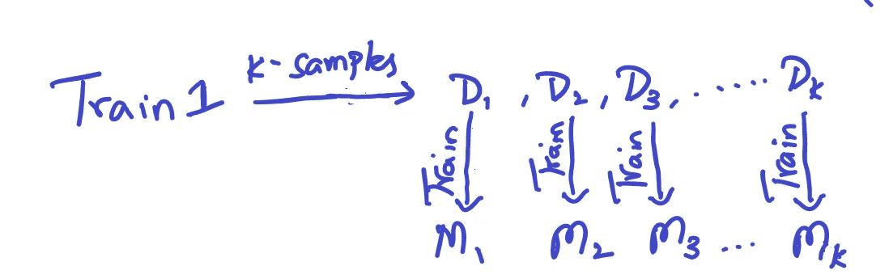
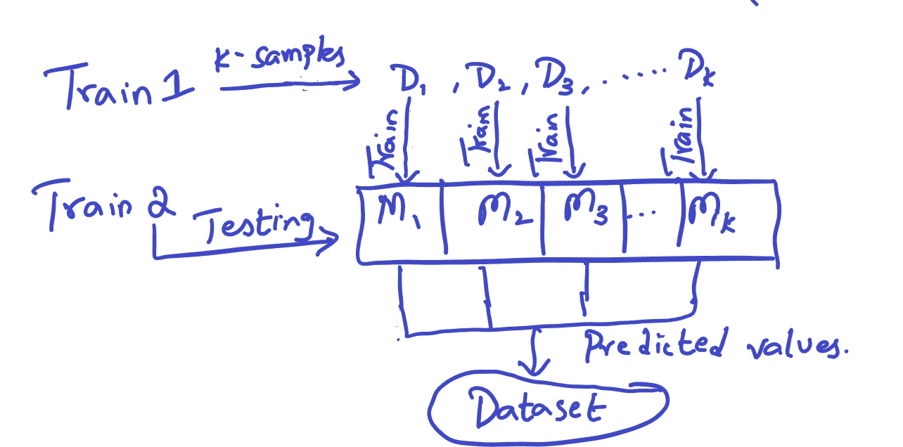
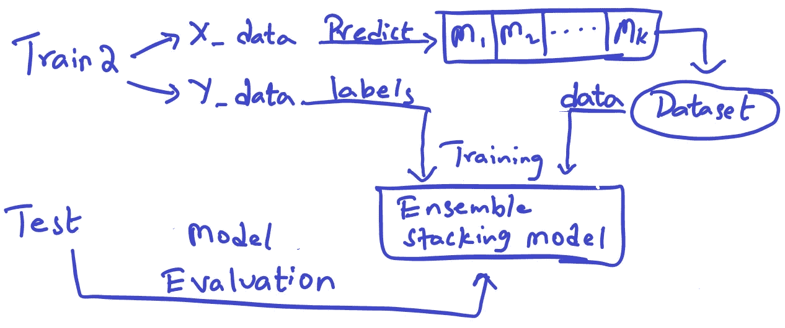

# 电信流失预测

> 原文：<https://medium.com/analytics-vidhya/telecom-churn-prediction-9ce72c24e961?source=collection_archive---------3----------------------->

**1。商业问题**

**1.1 问题描述**

客户流失意味着从一个服务提供商转向其市场竞争对手。客户流失是任何行业最大的恐惧之一，尤其是电信行业。随着南亚电信服务提供商数量的增加，竞争程度相当高。虽然客户流失的原因很多，但一些主要原因是服务不满意、昂贵的订阅和更好的替代方案。电信服务提供商非常努力地在这场竞争中生存。因此，为了维持这种竞争，他们往往试图留住自己的客户，而不是获得新客户，因为事实证明这样做的成本要高得多。因此，预测电信行业的客户流失非常重要。为了减少客户流失，电信公司需要预测哪些客户具有高流失风险。

照片由 [Jorge Salvador](https://unsplash.com/@jsshotz?utm_source=medium&utm_medium=referral) 在 [Unsplash](https://unsplash.com?utm_source=medium&utm_medium=referral) 拍摄

你能从这个博客中学到什么？

*   实现基于系综的叠加模型
*   处理高维数据集中的大量缺失值

**1.2 问题陈述**

给定客户三个月的电话数据，我们需要预测客户下个月是否会翻盘。

**1.3 现实世界/业务目标和约束**

1.  错误分类的代价可能非常高
2.  没有严格的延迟问题。
3.  可解释性很重要

**2。机器学习问题**

**2.1 数据概述**

这个问题的数据取自 Kaggle。使用这个[链接](https://www.kaggle.com/vijaysrikanth/telecom-churn-data-set-for-the-south-asian-market) **可以找到。**所有这些数据都与客户的电话数据相关。这是一个高度不平衡的数据集。没有明确给出流失标签。我们必须从数据集中推导出。

数据将保存在文件 Telecom_churn_data.csv 中

*   该文件包含 226 列
*   csv 文件的大小— 76MB
*   csv 文件中的行数= 99，999
*   它包含许多缺失的值

2.2 将现实世界的问题映射到一个最大似然问题

**2.2.1 机器学习问题类型**

这是一个两级分类问题。

**2.2.2 绩效指标**

指标:

*   Auc 分数
*   二元混淆矩阵

**2.3 训练和测试结构**

我们将通过以 70:30 的比例随机分割来构建训练和测试数据，因为我们有足够的点来处理。

**3。探索性数据分析**

在本案例研究中，我们正在处理一个高维数据集。因此，数据分析对于确定哪些特征是重要的至关重要。该数据集由大约 10 万个数据点和 226 列组成。这许多点足以训练任何类型的机器学习模型。问题在于列的数量。列的数量很大，我们需要找到减少它们的方法。

从每一列的唯一值开始，我们发现 16 列只有一个唯一值。所以我们移除了所有这样的柱子。后来我们观察到，通过电话拨打的电话分为电话、移动电话和各种其他电话。因此，我们将所有这些数据分别归纳为四栏，即 3 个月的本地收入、本地支出和性病收入、性病支出，并删除了其他栏。在删除所有这些列之后，我们从 9 月的列数据中导出了客户流失标签。如果一个用户在 9 月份既不打电话也不使用互联网数据，我们就把他/她归类为“不良用户”。搅动顾客的标签被标记为 1，而未搅动的顾客被标记为 0。删除所有这些列后，我们现在剩下 126 列，这意味着我们现在已经减少了 100 列。然后，我们对所有列执行异常值删除。

异常值去除代码

因为很难绘制所有 121 列的值，所以我们考虑了最重要的特征，并进行详细的数据分析。对于所有这些特征，我们绘制了对比 3 个月数据趋势的配对图。必要时，我们使用箱线图和分布图。一些特征是每用户平均收入(ARPU)、在线和离线价值、去电呼叫、来电呼叫、2g 数据、3g 数据等。

**3.1.1 来自 ARPU 的观测特征**

pair 图中的直方图显示，第 8 个月中被搅动的客户产生的收入大多接近于零

●箱线图和分布图也表明了同样的事情

●通过箱线图，我们可以注意到第 8 个月的数值分布是明显的。但其他月份的情况并非如此。

●6、7 个月的数值有很大的重叠

3 . 1 . 2 onnet 和 offnet 特征的观察

●客户流失和非客户流失的数值在任何月份都不会有很大变化

●在第 8 个月，onnet 和 offnet 的流失客户的平均值都较低，但这一差异并不是很大

●分布图也显示了很多重叠

●6、7 月和 7、8 月之间有一定的相关性，但 onnet 和 offnet 之间没有相关性

**3.1.3 使用功能的外出记录观察**

●呼出电话大部分是市话。性病和 ISD 的电话很少

●包含第 8 个月本地通话的配对图可以稍微区分客户流失

●正如在前面的特征中观察到的，6.7 个月和 7.8 个月之间存在相关性。

●本地、性病和 ISD 之间没有相关性

**3.1.4 对总充值次数和充值金额特征的观察**

●在任何一个月里，为不满意的客户和不满意的客户充值的次数没有太大的区别

●但是在充电量上可以注意到一些差异。这种差异在第 8 个月时最高。

●被搅动的客户在第 8 个月进行了非常低的充值

●总充电次数功能可能没那么有用 3.1.5 根据总使用分钟数功能得出的观察结果

●有许多在第 8 个月价值接近于零的客户

●与非搅动顾客相比，搅动顾客打出的电话很少

●只有在第 8 个月，而不是在任何其他月份，才能观察到客户流失的低价值

●这意味着，第 8 个月呼出电话数量的突然下降意味着客户流失的可能性很高

**3.1.6 互联网功能平均收入观察**

●与通话用户相比，互联网用户非常少

●大多数用户倾向于使用 2g 互联网，而不是 3g

●我们可以看到 2g 和 3g 数据之间的高度相关性

●不满意和不满意的顾客使用互联网的情况几乎相同。所以这个特性可能没那么有用

**3.2 处理缺失值**

在缺失值列中，有三种类型:

1.  布尔列:必须用 1 或 0 填充。具有布尔值的列是 night_pack、fb_user。缺少的布尔值由最常出现的值填充。
2.  日期栏:必须按日期填写。有日期的列是最后一次充值的日期，缺少的日期列在每个月的第一天填写
3.  数字列:必须用数字填充。剩余所有缺少的值列

为了填充缺失的数字列，我们遵循以下策略:

●对于缺失值 85%的特性，删除这些列。

●对于具有 5-25%缺失值的特征，我们使用中位数或众数或适当的方法估算缺失值。

●现在，对于缺失值在 25%-90%之间的特征，我们使用基于模型的插补技术。对于基于模型的插补，我们使用非缺失列来预测缺失值。

后来，我们使用标准差和 kde 图检查了在插补后 ad 前的值是否具有几乎相同的分布。

**4。建模**

在所有的数据分析和数据清理之后，我们剩下 94000 个数据点。有了这些点，我们以 70:30 的比例将数据集分成训练和测试。我们尝试了各种模型，如逻辑回归、随机森林、xgboost、决策树等，并进行适当的超参数调整。我们通过使用 smote 平衡数据以及使用 PCA 技术降低维度来尝试这些模型。但是使用完整的数据会给我们更好的结果。其中，xgboost 给了我们更好的 auc 分数，但是召回值不好。也就是说，这个模型预测了被搅动的顾客和没有被搅动的顾客。就回忆而言，逻辑回归给了我们更好的结果，但它在精确度方面较差。随机森林模型在 auc、召回率和精确度上给了我们很好的分数。

**4.1 基于集合的堆叠模型**

在这个模型中，我们首先以 70:30 的比例将数据集分为训练和测试数据。然后，我们以 1:1 的比例将训练数据分成训练 1 和训练 2。

现在，我们必须从训练 1 中获取 k 个样本，并在每个样本上训练一个决策树模型。

在训练决策树之后，我们必须预测 train2 的值，并将这些预测值形成一个数据集。例如，如果我们从 25 个样本中训练 25 个决策树，我们的数据集将包含 25 行。

现在，有了这些预测值及其实际标签的数据集，我们就可以在此基础上训练另一个模型。我们尝试使用 xgboost 和密集神经网络作为模型。现在我们可以用测试数据来评估这个模型。

**4.1.1 代码片段**

**4.2 车型对比**

| Model | Auc score |
|————————————————|
|决策树| 0.9 |
| Logistic 回归| 0.899 |
|随机森林| 0.933 |
| Xgboost | 0.932 |
| Logistic 回归+ SMOTE | 0.88 |
| PCA + Logistic 回归| 0.896 |
。 0.92 |
|决策树(40) + xgboost | 0.942 |
|决策树(50) + xgboost | 0.945 |

尽管集合模型提供了最好的 auc 分数，但是由于 xgboost 被用作元模型，所以召回值较低，使得在预测搅动的客户为非搅动的客户时出现更多错误。所以我们使用随机森林作为这个问题的最终模型。这些集成模型可以在其他分类问题中提供高精度值。

**5。未来工作**

这些集合模型可以用随机森林和密集神经网络进行试验。此外，基础学习者的数量可以扩展。

**6。参考文献**

数据来源:[https://www . ka ggle . com/vijaysrikanth/telecom-churn-data-set-for-the-south-Asian-market](https://www.kaggle.com/vijaysrikanth/telecom-churn-data-set-for-the-south-asian-market)

研究论文:

*   [https://arxiv.org/ftp/arxiv/papers/1512/1512.06430.pdf](https://arxiv.org/ftp/arxiv/papers/1512/1512.06430.pdf)
*   https://ieeexplore.ieee.org/document/8706988?denied=
*   [https://journal oig data . springer open . com/articles/10.1186/s 40537-0190191-6](https://journaloigdata.springeropen.com/articles/10.1186/s40537-0190191-6)

基于系综的叠加:

[基于集成分类器的元学习研究](https://pdfs.semanticscholar.org/449e/7116d7e2cff37b4d3b1357a23953231b4709.pdf)

特别感谢

*   [https://www.appliedaicourse.com/](https://www.appliedaicourse.com/)

您可以在这里找到这个案例研究[的源代码](https://github.com/praneethsvp/Telecom-churn-prediction/blob/master/Telecom_churn_prediction5.ipynb)

## 最后，如果你觉得我的博客有用，鼓掌将是令人鼓舞的

你可以在这里找到我的简介:[https://www.linkedin.com/in/praneethsv/](https://www.linkedin.com/in/praneethsv/)