# 电信流失预测

> 原文：<https://medium.com/analytics-vidhya/telecom-churn-prediction-model-aa5c71ef944c?source=collection_archive---------3----------------------->


图片来源:Superoffice.com

客户是任何公司或企业最重要的资源。如果这些客户由于高收费、更好的竞争对手报价、糟糕的客户服务或其他未知原因而离开公司，该怎么办？因此，**客户流失率**是公司评价其业绩的重要指标之一。

客户流失率是了解离职客户的一个 KPI。流失率代表公司在间隔开始时失去的客户占所有客户的百分比。

例如，如果公司在月初有 400 个客户，而在月底只有 360 个，这意味着公司的流失率是 10%，因为公司失去了 10%的客户群。公司总是试图将流失率降至接近 0%。

# 目录

## 1)简介

*   数据集、特征和目标值
*   问题描述

## 2)描述性分析和 EDA(探索性数据分析)

*   特征之间的流失率和相关性
*   流失客户与现有客户的概况
*   任期和每月费用分配

## 3)聚类分析

*   流失聚类检测
*   流失客户聚类分析——按人口统计、账户类型和服务使用情况

## 4)客户流失预测模型

*   预测模型过程
*   模型评估

## 5)保留计划

# 源代码—笔记本

链接— [Github](https://github.com/ShivaliPatel/Data-science-projects/blob/master/Telco_customer_churn/Notebooks/Telecom%20Churn%20Prediction-v2.ipynb)

# 1.介绍

## 数据集、特征和目标值

来源:https://www.kaggle.com/blastchar/telco-customer-churn(IBM 样本数据集)

在这里，IBM 为电信行业提供了客户数据，以根据人口统计、使用和基于帐户的信息来预测客户流失。这里的主要目标是分析流失客户的行为，并制定增加客户保留率的策略。

假设—这里，数据源没有提供任何与时间相关的信息；所以我假设所有的记录都是特定月份的。

数据集包含以下相关信息:

**人口统计:**

*   性别—男性/女性
*   年龄范围——根据伴侣、受抚养人和老年人

**服务:**

*   电话服务—如果客户有电话服务，则是与电话相关的服务，如多线电话服务
*   互联网服务-如果客户有互联网服务，则提供与互联网相关的服务，如在线安全、在线备份、设备保护、技术支持、流媒体电视、流媒体电影

**账户类型:**

*   任期——客户在公司工作多长时间？
*   合同类型——他们与公司有什么样的合同？就像每月的基础上，持续的基础上，如果持续的基础上，那么一个月的合同或两年的合同
*   无纸化账单—客户是否拥有无纸化十亿选项？
*   付款方式—客户有哪种付款方式？邮寄支票、电子支票、信用卡(自动)、银行转账(自动)

**用法:**

*   每月费用
*   总费用

**目标:**

*   客户流失——客户是离开了公司还是仍然留在公司？

# 问题描述

## 顾客为什么离开公司？

客户离开公司的原因可能是

*   高收费
*   竞争对手的更好报价
*   糟糕的客户服务
*   一些未知的原因

## 如何检测流失客户？

*   监控使用情况
*   分析投诉
*   分析竞争对手的报价

## 如何防止客户离开一家公司？

一旦你发现高风险客户，申请

*   保留计划
*   改善客户服务

# 2.描述性分析和 EDA(探索性数据分析)

## 计算流失率

> 流失率=客户流失率/客户总数

```
Churn_rate = df_cal['Churn'].value_counts() / df_cal.shape[0]
Generate_bar_graph(Churn_rate.index.map({0:'Existing',1:"Churn"})
                   , Churn_rate.values
                   , 'Customers'
                   , 'Percentage'
                   , 'Customer Distribution')print(Churn_rate)
```

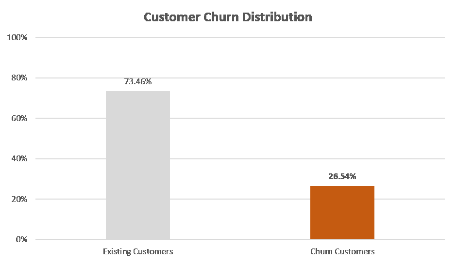

分析显示， ***电信公司的流失率在 26%左右。***

## 特征之间的相关性

```
**def** Generate_heatmap_graph(corr, chart_title, mask_uppertri=**False** ):
    *""" Based on features , generate correlation matrix """*
    mask = np.zeros_like(corr)
    mask[np.triu_indices_from(mask)] = mask_uppertri fig,ax = plt.subplots(figsize=(12,12))
    sns.heatmap(corr
                , mask = mask
                , square = **True**
                , annot = **True**
                , annot_kws={'size': 10.5, 'weight' : 'bold'}
                , cmap=plt.get_cmap("YlOrBr")
                , linewidths=.1)
    plt.title(chart_title, fontsize=14)
    plt.show()var_corr = round(df_cal.corr(),2)
Generate_heatmap_graph(var_corr
                       ,chart_title = 'Correlation Heatmap'
                       ,mask_uppertri = **True**)
```

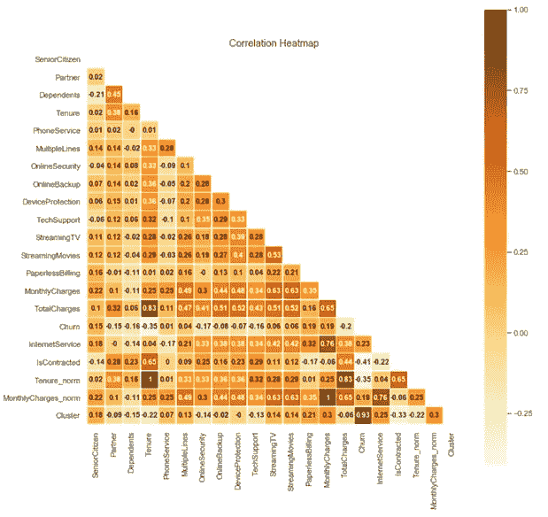

从关联矩阵来看，租期、月费和总费用等功能与多电话线服务和互联网服务(如在线安全、在线备份、设备保护、技术支持、流媒体电视和流媒体电影服务)高度相关。

## 按目标分类和二元变量的分布(流失与非流失)

```
**def** Create_data_label(ax):
    *""" Display data label for given axis """*
    **for** bar **in** ax.patches:
            ax.text(bar.get_x() + bar.get_width()/ 2
                    , bar.get_height() + 0.01
                    , str(round(100 * bar.get_height(),2)) + '%'
                    , ha = 'center'
                    , fontsize = 13)

**def** Categorical_var_churn_dist(data, cols, distribution_col):
    *""" Distribution of categorical variable based on target variable """*

    **for** i,feature **in** enumerate(cols):

        feature_summary = data[feature].value_counts(normalize=**True**).reset_index(name='Percentage')

        plt_cat = sns.catplot(x=feature
                , y='Percentage'
                , data = feature_summary
                , col=distribution_col
                , kind='bar'
                , aspect = 0.8
                , palette = plotColor
                , alpha = 0.6)

        **if** feature == 'PaymentMethod':
            plt_cat.set_xticklabels(rotation= 65, horizontalalignment = 'right')

        **for** ax1, ax2 **in** plt_cat.axes:
            Create_data_label(ax1)
            Create_data_label(ax2)

        plt.ylim(top=1)
        plt.subplots_adjust(top = 0.9)
        plt.gcf().suptitle(feature+" distribution",fontsize=14)
    plt.show()churn_summary = df_cal.groupby('Churn')
Categorical_var_churn_dist(churn_summary, cat_cols,'Churn') 
```

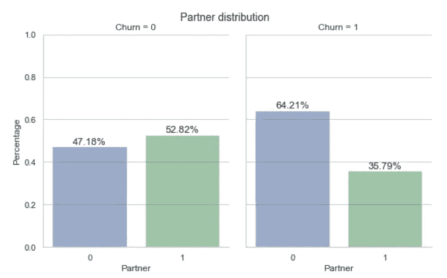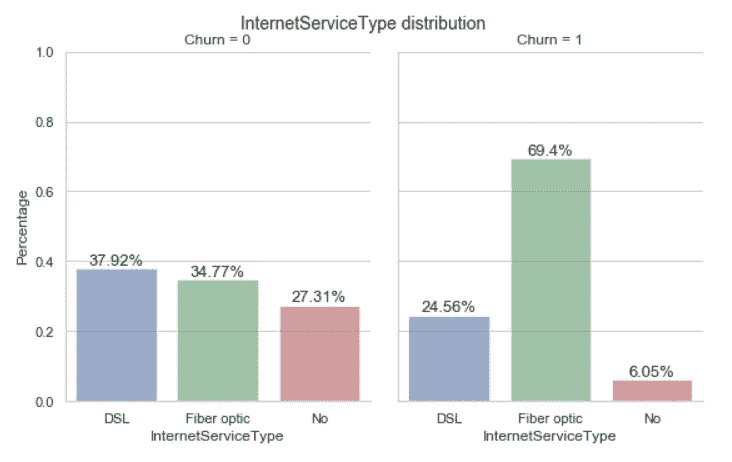

## 基于上述分析的流失客户与现有客户的概况

流失客户很可能

*   *没有伴侣和家眷；意思是可能单身。*
*   *有互联网服务，特别是光纤*
*   *没有在线安全服务、在线备份服务、设备保护服务、技术支持服务*
*   *拥有流媒体电视和流媒体电影服务*
*   *根据月度计划*
*   *拥有无纸化计费服务*
*   *有电子支票支付方式*

## 租期、月费和总费用的分配

```
*# Mean summary of customers (Churn vs Non churn)*
print(churn_summary['Tenure','MonthlyCharges','TotalCharges'].mean())Tenure  MonthlyCharges  TotalCharges
Churn                                         
0      37.569965       61.265124   2549.911442
1      17.979133       74.441332   1531.796094
```

结果显示，与现有客户相比，流失客户的月费用 ***要多*** 。此外，流失客户与现有客户的**任期**和**总费用**也存在巨大差异。

让我们用目标变量来检查每个特性的分布。

```
**def** Numerical_distribution(df_cal,feature):
    *""" Distribution of numerical variable based on target variable"""*
    fig = plt.figure(figsize=(15,10))

    plt.subplot(2,1,1)
    ax = sns.kdeplot(df_cal[feature]
                     , color = 'g'
                     , shade = **True**)

    title_str = "Original " +feature + " Distribution"
    plt.title(title_str)

    plt.subplot(2,1,2)
    ax = sns.kdeplot(df_cal.loc[(df_cal['Churn']==1),feature]
                     , color = 'g'
                     , shade = **True**
                     , label='Chrun') ax = sns.kdeplot(df_cal.loc[(df_cal['Churn']==0) ,feature]
                     , color = 'b'
                     , shade = **True**
                     , label='No chrun')

    title_str = feature + " Distribution: Churn vs No churn"
    plt.title(title_str)
    plt.show()
```

**任期与流失分布**

```
Numerical_distribution(df_cal,'Tenure')
```

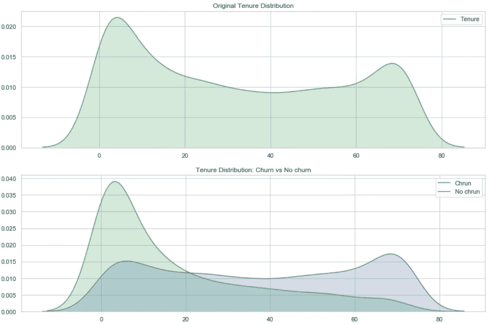

**月度费用与流失分布**

```
Numerical_distribution(df_cal,'MonthlyCharges')
```

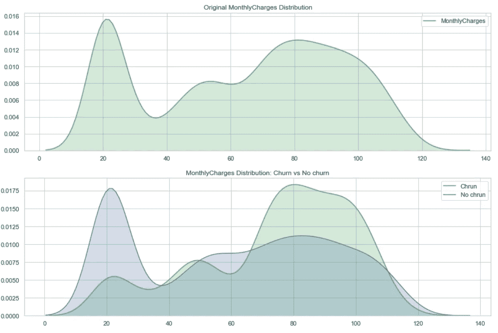

从分布来看，流失用户是

*   *任期不到一年的人更容易离开公司*
*   *更有可能每月收费超过 65 美元*

# 3.聚类分析

让我们看看任期和月费之间是否有任何关系。

```
sns.lmplot(x='Tenure'
           ,y='MonthlyCharges'
           ,data=df_cal
           ,hue='Churn'
            ,fit_reg=**False**
            ,markers=["o", "x"]
            ,palette= plotColor)
plt.show()
```

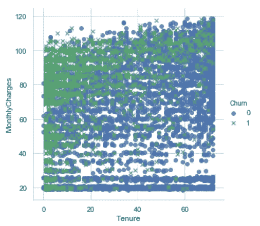

从分析来看，有一些基于任期和月收费的集群。

让我们应用 K-means 聚类算法来查看聚类。在将数据传递给 K-means 算法之前，需要标准化任期和月费。

```
**def** Normalize_feature(feature):
    *""" Return normalized features """*
    **return** prepro.StandardScaler().fit_transform(feature)*# normalized tenure and monthlycharges*df_cal['Tenure_norm'] = Normalize_feature(df_cal[['Tenure']])
df_cal['MonthlyCharges_norm'] = Normalize_feature(df_cal[['MonthlyCharges']])**def** Create_elbow_curve(data):
    *""" Display elbow curve for K-means algo for given data """*
    df_kmeans_data = data k = range(1,10)
    kmeans = [KMeans(n_clusters=i) **for** i **in** k] score = [kmeans[i].fit(df_kmeans_data).score(df_kmeans_data)  **for** i **in** range(len(kmeans))] plt.figure(figsize=(10,6))
    plt.plot(k,score)
    plt.xlabel("Clusters")
    plt.ylabel("Score")
    plt.title("Elbow curve",fontsize=15)
    plt.show()*# checking number of clusters*

Create_elbow_curve(df_cal[df_cal.Churn==1][['Tenure_norm','MonthlyCharges_norm']])
```

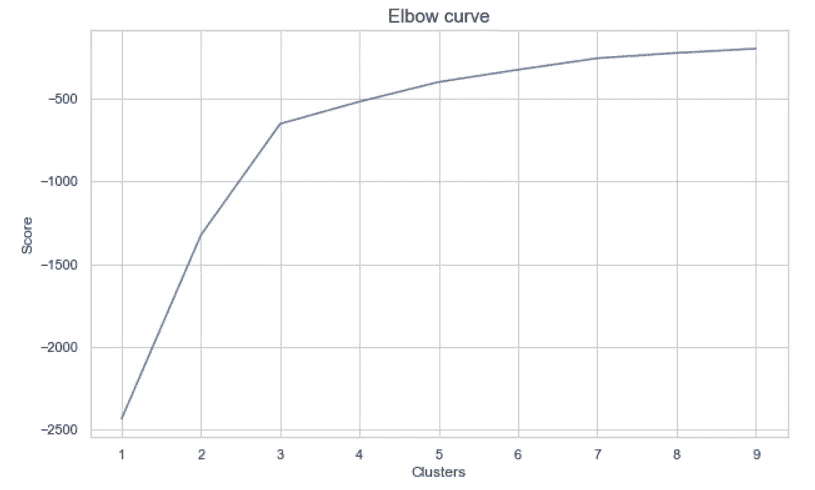

从肘部曲线来看，3 似乎最有效。

```
**def** Create_kmeans_cluster_graph(df_cal, data, n_clusters, x_title, y_title, chart_title):
    *""" Display K-means cluster based on data """*

    kmeans = KMeans(n_clusters=n_clusters *# No of cluster in data*
                    , random_state = random_state *# Selecting same training data*
                   ) 

    kmeans.fit(data)
    kmean_colors = [plotColor[c] **for** c **in** kmeans.labels_]

    fig = plt.figure(figsize=(12,8))
    plt.scatter(x= x_title + '_norm'
                , y= y_title + '_norm'
                , data=data 
                , color=kmean_colors *# color of data points*
                , alpha=0.25 *# transparancy of data points*
               )

    plt.xlabel(x_title)
    plt.ylabel(y_title)

    plt.scatter(x=kmeans.cluster_centers_[:,0]
                , y=kmeans.cluster_centers_[:,1]
                , color='black'
                , marker='X' *# Marker sign for data points*
                , s=100 *# marker size*
               )

    plt.title(chart_title,fontsize=15)
    plt.show()

    **return** kmeans.fit_predict(df_cal[df_cal.Churn==1][[x_title+'_norm', y_title +'_norm']]) df_cal['Cluster'] = -1 *# by default set Cluster to -1*
df_cal.loc[(df_cal.Churn==1),'Cluster'] = Create_kmeans_cluster_graph(df_cal
                            ,df_cal[df_cal.Churn==1][['Tenure_norm','MonthlyCharges_norm']]
                            ,3
                           ,'Tenure'
                           ,'MonthlyCharges'
                           ,"Tenure vs Monthlycharges : Churn customer cluster")

df_cal['Cluster'].unique()
```

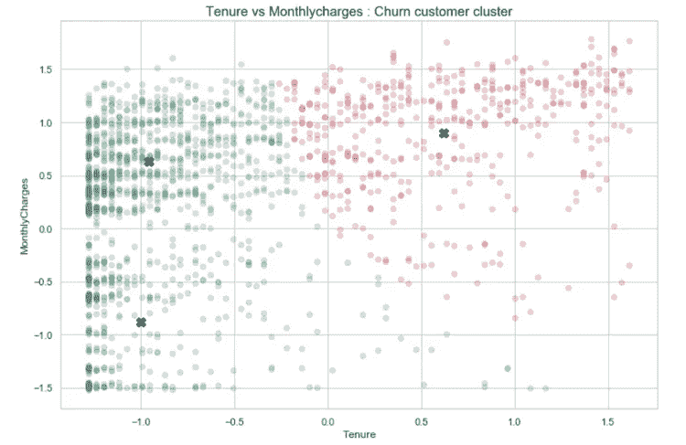

根据月费和租期，有三种类型的集群。

*   低租期和低月费(蓝色)
*   低租期和高月费(绿色)
*   高任期和高月费(红色)

```
*# Distribution of clusters*
churn_distribution =  df_cal[df_cal['Churn']==1].Cluster.value_counts(normalize=**True**).sort_index()Generate_bar_graph( x= churn_distribution.index
                   , y = churn_distribution.values
                   , x_title = 'Clusters'
                   , y_title = 'Percentage'
                   , chart_title = 'Cluster distribution'
                  , color = plotColor)
```

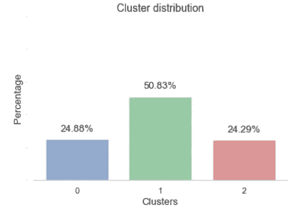

大约 50%的流失客户属于低租期和高月费客户。

当我深入到每一组时，我发现了一些有趣的发现。

基于**人口统计信息**，

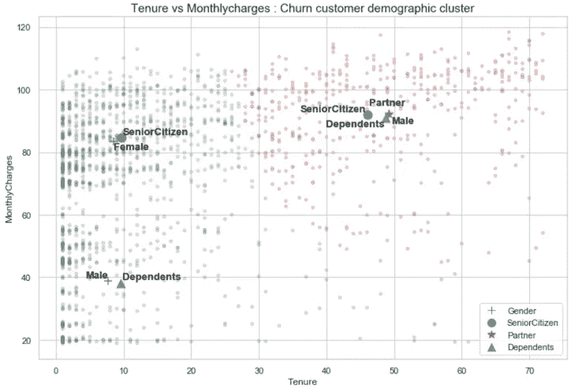

低租期和低月费的客户

*   *男，家眷*

租期短、月费高的客户

*   *老年公民，女性*

高租期和高月费的客户

*   *男性、伴侣、家属和老人*

基于**账户信息**，

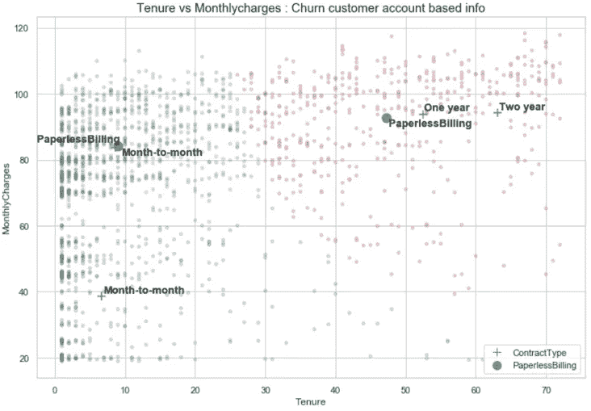

低租期和低月费的客户

*   *逐月合同计划*

租期短、月费高的客户

*   *无纸化计费，逐月合同计划*

高租期和高月费的客户

*   *无纸化计费，一年/两年合同类型*

基于**使用信息**，

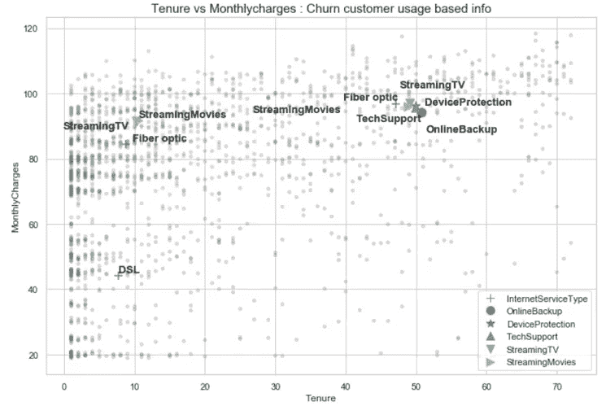

低租期和低月费的客户

*   *有 DSL 互联网服务*

租期短、月费高的客户

*   *拥有流媒体电视/流媒体电影、光纤互联网服务*

高租期和高月费的客户

*   *在线服务，如在线备份、设备保护和技术支持、光纤互联网服务、流媒体电视/流媒体电影*

# 4.流失客户预测模型

## **数据预处理**

*   将数据集分为两组—培训和测试

```
**def** Train_test_df(feature, target, test_size):
    *""" Spliting data to train and test"""*
    **return** train_test_split(feature
                     ,target
                     ,test_size= test_size
                     ,random_state= random_state)x_train, x_test, y_train, y_test = Train_test_df(df_model_feature
                                                 , df_model_target
                                                 , test_size = 0.2)----------------------------
Original features shape,  (7043, 28)
Original target shape,  (7043,)
x train shape,  (5634, 28)
y train shape,  (5634,)
x test shape,  (1409, 28)
y test shape,  (1409,)
----------------------------
```

*   现有客户和流失客户分布不平等导致的阶层失衡问题

```
*# Upsampling using SMOTE*
sm = SMOTE(random_state = random_state
           , ratio = 1.0)
x_train_sm , y_train_sm = sm.fit_sample(x_train,y_train)print("----------------------------")
print("Original x train shape, ", x_train.shape)
print("Resample x train shape, ", x_train_sm.shape)
print("----------------------------")
```

## **超参数调谐**

*   使用 GridSearchCV()方法，为相应的模型找出最佳参数

```
**def** Parameter_tunning(x, y, models, clsModelsNm, parameters, score):

    tuned_params = {}
    **for** i,model **in** enumerate(models):
        print(clsModelsNm[i])
        grid = GridSearchCV(estimator = model 
                            , cv = 5
                            , param_grid = parameters[clsModelsNm[i]]
                            , scoring = score
                            , n_jobs = 3)
        grid.fit(x,y)
        print(grid.best_score_)
        print(grid.best_params_)
        tuned_params[clsModelsNm[i]] = {'params':grid.best_params_}

    **return** tuned_params
```

## **型号对比**

*   使用 corss_val_score()方法比较逻辑回归、随机森林和梯度增强等模型
*   测量准确度、精确度、召回率和 F1 指标等分数

```
*# Graph of precision & recall against threshold*
**def** plot_precision_recall_vs_thresold(precisions, recalls, thresholds):
    plt.plot(thresholds,precisions[:-1],label="Precision")
    plt.plot(thresholds,recalls[:-1],label="Recall")
    plt.plot(thresholds,2 * (precisions[:-1] * recalls[:-1]) / (precisions[:-1]+recalls[:-1]) ,label="F1")
    plt.title("Precision, recall & F1 vs thresold")
    plt.xlabel("Thresold")
    plt.legend(loc='lower right')
    plt.show()**def** Cross_validation_score(clsModels, clsModelsNm, clsSample, scoreMatrix):
    *""" Cross validation using cross_val_score method """*
    **for** i,model **in** enumerate(clsModels):
        print("===============================================")
        print(clsModelsNm[i])

        **for** j, sample **in** enumerate(clsSample):
            print("************************************************")
            print(sample[2])

            **for** score **in** scoreMatrix:
                scores = cross_val_score(model, sample[0], sample[1], cv=5 , scoring = score)
                print(score, " score:", scores.mean())

            y_scores = cross_val_predict(model, sample[0], sample[1], cv=5, method="predict_proba") 

            precisions, recalls, thresholds = metrics.precision_recall_curve(sample[1], y_scores[:][:,1]) 
            plot_precision_recall_vs_thresold(precisions, recalls, thresholds)
            score_matrix = pd.DataFrame({'Precisions': precisions[:-1]
                                ,'Recalls': recalls[:-1]
                                ,'F1': 2 * (precisions[:-1] * recalls[:-1]) / (precisions[:-1]+recalls[:-1])
                                ,'Threshold': thresholds
                               })
            *#print("When percision and recall are same \n" , score_matrix[ score_matrix['Precisions'] == score_matrix['Recalls']] )*
            print("When F1 score is max **\n**" , score_matrix[ score_matrix['F1'] == max(score_matrix['F1'])] )
```

## **模型评估**

*   使用分类报告和日志损失分数，为我们的数据计算最佳模型

```
**def** Cus_log_loss(target, predicted):
    **if** len(predicted) != len(target):
        print("Data object initiated")
        **return**

    target = [float(x) **for** x **in** target] *# converting target into float*
    predicted = [min([max([x,1e-15]), 1-1e-15]) **for** x **in** predicted]

    **return** -1.0 / len(target) *  sum([ target[i] * math.log(predicted[i]) + (1.0 - target[i]) * math.log(1.0 - predicted[i]) 
                                      **for** i **in** range(len(predicted))])**def** Model_evaluation(models, clsModelsNm, x_train, y_train, x_test, y_test,  threshold ):

    predicted_val = {}
    **for** i, model **in** enumerate(clsModelsNm):
        models[i].fit(x_train,y_train)
        predicted_proba = models[i].predict_proba(x_test)

        predicted = predicted_proba[:,1].copy()
        predicted[predicted >=threshold[i]] = 1
        predicted[predicted < threshold[i]] = 0

        confusion_matrix_matrix = metrics.confusion_matrix(y_true = y_test
                                                   ,y_pred = predicted
                                                   *#,normalize = 'true'* 
                                                   )

        print("***********",clsModelsNm[i], "*************")
        print(metrics.classification_report(y_test, predicted))
        print("*******************************************")
        *#print("Log loss score", round(metrics.log_loss(y_test,models[i].predict_proba(x_test)[:,1]),2))*
        print("Log loss score", round(Cus_log_loss(y_test,predicted_proba[:,1]),2))
        print("*******************************************")
        print("Confusion matrix")
        sns.heatmap(confusion_matrix_matrix
                    , annot=**True**
                    , fmt="d"
                   )
        plt.xlabel("Predicted label")
        plt.ylabel("Actual label")
        plt.show()
        print("*******************************************")

        predicted_val[model] = predicted
```

## **模型结论**

基于模型比较和评估过程，上采样数据在训练过程中工作得更好，但是对于看不见的数据(基于测井损失分数)则不行。原因之一可能是 cross_val_score 步骤中的数据泄漏。

然而，原始数据集测井损失分数与训练数据集和测试数据集保持相同。

从上面的分析来看，使用原始数据集的梯度提升具有稳定和最好的分数。所以，我用它来预测过程。

梯度推进模型显示了如下重要特征

*   总费用、期限、月费、合同类型、付款方式、互联网服务类型、无纸化计费

其中大多数，我们已经在 EDA 过程中分析过了。

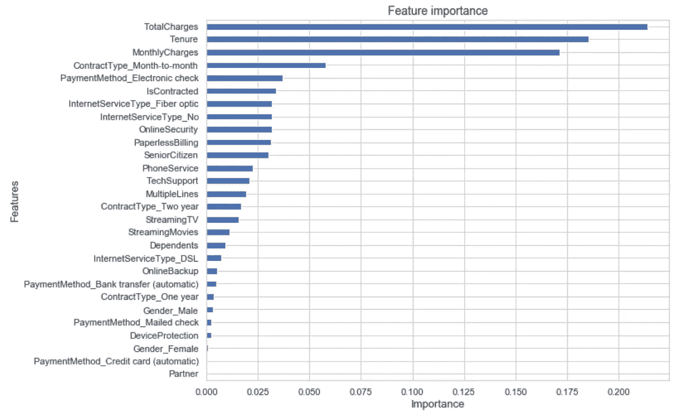

# 5.保留计划

因为我们基于客户流失和现有客户生成了一个模型，这有助于对他们进行分类。现在，我们可以对现有客户使用相同的模型来找出客户流失的可能性。

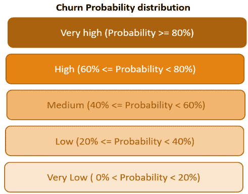

```
existing_customer_churn_prob = clsGB.predict_proba(existing_cust_feature) existing_cust.loc[existing_cust['Churn_proba'] >= 0.8 , 'Risk_type'] = 'Very high'
existing_cust.loc[(existing_cust['Churn_proba'] >= 0.6) & (existing_cust['Churn_proba'] < 0.8)  , 'Risk_type'] = 'High'
existing_cust.loc[(existing_cust['Churn_proba'] >= 0.4) & (existing_cust['Churn_proba'] < 0.6) , 'Risk_type'] = 'Medium'
existing_cust.loc[(existing_cust['Churn_proba'] >= 0.2) & (existing_cust['Churn_proba'] < 0.4) , 'Risk_type'] = 'Low'
existing_cust.loc[(existing_cust['Churn_proba'] > 0.0) & (existing_cust['Churn_proba'] < 0.2) , 'Risk_type'] = 'Very low'
```

## 按风险类型划分的现有客户分布

```
existing_cust['Risk_type'].value_counts().plot(kind = 'barh')
plt.title("Existing customer risk type distribution", fontsize=14)
plt.ylabel("Risk type", fontsize = 13)
plt.xlabel("Customers", fontsize = 13)
```

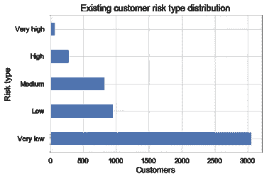

一旦我们确定了非常高/高流失率的客户，我们就可以应用适当的保留计划。

# 结论

在这个项目中，我试图将客户流失预测问题分为探索、剖析、聚类、模型选择和评估以及保留计划等步骤。基于这种分析，我们可以帮助保留团队在高风险客户离开公司之前分析他们。

此外，我们可以聚合不同的数据源，如客户查询、销售的季节性、更多的人口统计信息，以使我们的预测更加准确。