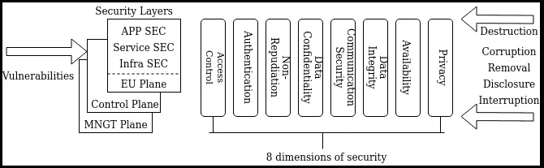
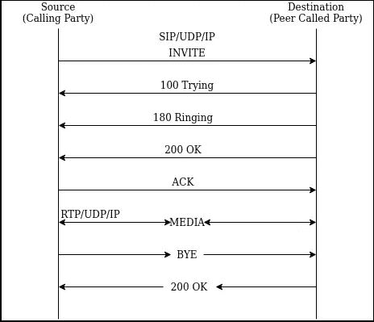
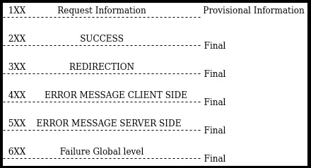
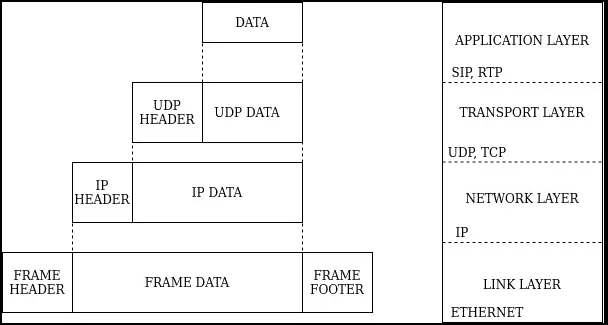
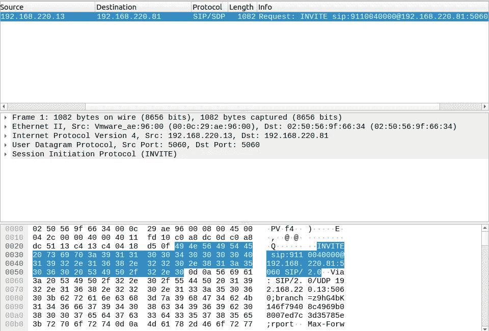
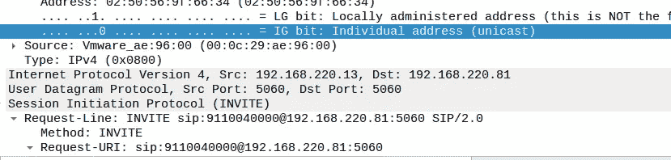
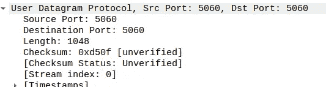
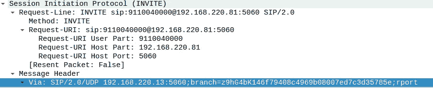
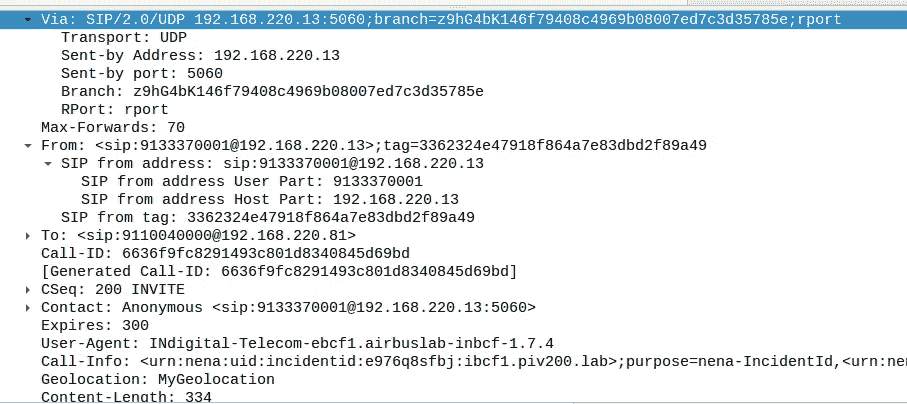
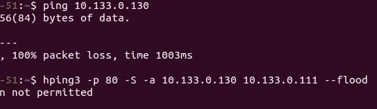

# 电信网络安全:对数据盗窃和隐私的最大报复埋伏的庇护。

> 原文：<https://medium.com/analytics-vidhya/telecom-network-security-an-aegis-towards-most-vengeance-ambush-of-data-theft-and-privacy-522e644216a3?source=collection_archive---------11----------------------->

> 网络就像是一群为社会发展而分享知识的人，知识既可以用来受益，也可以用来破坏，因此对它的保护就是安全，但总有一群人想要利益和收益，并准备造成破坏，这种强度的伏击可以产生对一切破坏的报复。甚至就物理学而言:宇宙中没有什么是安全的，甚至宇宙在某个时刻也会走到尽头(脆弱)——但总有办法降低脆弱的强度。

国际电信联盟(ITU-T)定义了一些国际标准。让我们简单地看一下，并理解它实际上是什么。

ITU-T X.805 推荐的安全体系结构

导致电信安全漏洞的类型

**用户认证黑客攻击和 SIP 长途电话欺诈黑客攻击**

VOIP(网络电话)在电信网络中得到了广泛的应用。大多数办公室在其内部通信中使用 VOIP PBX(专用小交换机)。VOIP 实际上通过各种协议运行。这些协议是 IP(互联网协议)、UDP(用户数据报协议)和 SIP(会话发起协议)。

VOIP 呼叫

100 TRYING 表示正在处理请求。2xx 消息用于表示成功。可以在钢丝鲨痕迹中看到。这里，INVITE 消息意味着源 A 想要呼叫目的地 B，并发送 INVITE 以发起呼叫。

消息代码及其携带的信息

IP 数据包中总是存在封装，因为数据是通过将一个上层协议嵌套在另一个下层协议中来处理的。

OSI 模型各层中数据包的封装和结构

a)互联网协议(IP):-该协议仅将数据包从源主机发送到目的主机。IPV4 和 IPV6 是该协议两个版本。IPV4 是 32 位，由 0-255 之间的 4 个数字组成。IPV6 有 128 位，通常由 8 组 4 位十六进制数字和冒号组成，例如。1234:023 fg 6:0090::0000:0a6b:0456:9010。

Wireshark

从数据包捕获跟踪文件中可以看出，源 IP 是 192.168.220.13，目的 IP 是 192.168.220.81。在协议中，我们可以清楚地看到 SIP/SDP 及其*邀请请求。*

WIRE SHARK 数据包捕获

在进一步的调查中，我们还可以通过 WIRE SHARK 中的 IP 报头看到 INTERNET 协议的版本以及源端口和目的端口。

B)UDP:用于通过 IP 发送数据的用户数据报协议，UDP 报头包含值为 0-65535(16 位整数)的源端口和目的端口。

C) SIP:-会话发起协议是 VOIP 呼叫中广泛使用的协议，特定格式的 SIP 分组以及序列用于通过 IP 网络进行呼叫。SIP 消息可以由 TCP/UDP 媒介或者也可以由 TLS/TCP(SIP)承载

我们可以清楚地看到 INVITE 请求已发送，SIP 版本为 2.0

SIP 头中的所有消息

从这些信息中，我们可以看到黑客是如何做到的

i)DOS 攻击:-黑客可以从信息中知道源和目的 IP。然后，他可以向受害者设备发送大量数据包，使其忙于处理这些恶意数据包，同时丢弃有用的数据包。这一过程被称为洪水拒绝服务，因为它用恶意数据包淹没受害者设备，使其忙于造成拒绝服务。分布式拒绝服务(d DOS)也可用于让受害设备忙于处理来自不同来源的大量数据包。

ii)INVITE flood 工具也可用于向目标发送一组预定义的 INVITE 数据包，从而使其保持忙碌状态，导致呼叫失败。

用于执行邀请泛洪攻击的命令。(hping 3 必须具有源、目标 IP 以及端口)才能成功执行泛洪。

在 SIP 中，我们使用端口 5060/5061，因此这通常用于泛洪。

在 wireshark 工具中，我们可以按照 Wireshark → capture → interfaces(为有线选择接口 eth0，为 WiFi 选择 WLAN 0)→start 的过程来嗅探数据包。

这可以在 WIRE SHARK 工具中检查，以获得发送数据包的源 IP 列表。应该检查被大量数据包淹没的源 IP。

**对策**

通过访问控制列表(ACL)在 UAS 上设置防火墙，这样 UAS(用户代理服务器)可以只接受来自具有可靠 IP 地址的设备的邀请。由于 ACL(访问控制列表)不能避免 ARP(地址解析协议)欺骗攻击和呼叫者 id 欺骗攻击，为了获得更强的网络保护，必须以正确的方式配置交换机:所有未使用的端口应该被禁用，已使用的端口必须配置端口安全选项，以避免网络中的入侵设备。

参考资料:-

1.  Mark Collier，SecureLogix David Endler，tipping point-【http://www.hackingvoip.com/presentations/RSA%202007.pdf 
2.  赫拉克勒斯，马里乌斯&布拉加，都铎&多布罗塔，维吉尔。(2008).基于 SIP 的 VoIP 体系结构的安全性评估及对策。[https://www . researchgate . net/publication/228859517 _ Evaluation _ of _ Security _ and _ counters _ for _ a _ SIP-based _ VoIP _ Architecture/citation/download](https://www.researchgate.net/publication/228859517_Evaluation_of_Security_and_Countermeasures_for_a_SIP-based_VoIP_Architecture/citation/download)
3.  霍夫鲍尔，斯蒂芬&贝克尔斯，克里斯蒂安&奎尔迈尔，杰拉尔德。(2015).企业网络中 VoIP 和视频黑客攻击的防御方法。[https://www . researchgate . net/publication/285507671 _ Defense _ Methods _ against _ VoIP _ and _ Video _ Hacking _ attack _ in _ Enterprise _ Networks/citation/download](https://www.researchgate.net/publication/285507671_Defense_Methods_against_VoIP_and_Video_Hacking_Attacks_in_Enterprise_Networks/citation/download)
4.  包跟踪文件:→[http://startrinity . com/VoIP/voiptroublesshootingbook/voiptroublesshootingbook . aspx # protocol _ RTP](http://startrinity.com/VoIP/VoipTroubleshootingBook/VoipTroubleshootingBook.aspx#protocol_rtp)