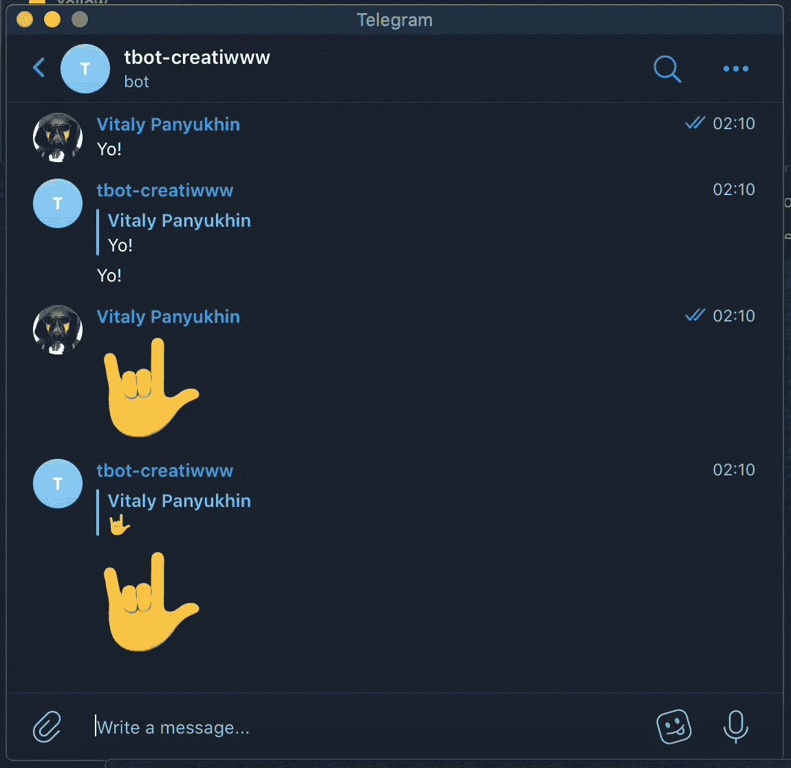

# 电报机器人(快速入门手册)

> 原文：<https://medium.com/analytics-vidhya/telegram-bot-quick-start-manual-8339a1d19765?source=collection_archive---------7----------------------->

# Flask (Python)，python-telegram-bot 库，webhooks，部署到 Heroku


应用组件之间的流程

Telegram 超级爽！不仅仅是因为聚集在他周围的社区，也是因为机器人的功能。总的来说——当你不想关心客户端应用程序开发，不想激励人们下载你的应用程序并保持更新时，机器人是有用的。是的，在 2020 年，每个人都不想在手机屏幕上多一个图标，所以使用电报作为沟通和用户互动的渠道可能是一个好主意。

不幸的是，就像 2020 年的大多数东西一样，你不能只开始编码业务逻辑，即使是简单的休闲应用。这本手册将展示如何使用简单和免费的积木来样板你的应用程序。

我们将使用 Heroku 作为我们的应用程序运行的平台。这对于小项目是绝对免费的，作为 PaaS 解决方案，它完全关心如何设置 web 服务器、SSL 和其他基础设施。

# 所以我们来编码吧！


打开电报，在聊天搜索中找到 BotFather，发送/newbot 命令。以某种方式命名新机器人。作为回复，您将获得令牌和链接到机器人。

```
Use this token to access the HTTP API:
1214342961:ACGCc7nACifIsyr1ZSxGiLNPIszbWqkDNNo
---
Done! Congratulations on your new bot. You will find it at t.me/test_creatiww_bot.
```

现在，我们需要创建几个项目文件，其结构如下。为了简单起见，它将尽可能平坦。根据文件夹和文件的层次结构来放置带有逻辑的 Python 包要好得多，但是因为我们只有一个文件，所以它将与项目中的所有其他文件一起位于一个根文件夹中。

```
$ tree -a -L 1
.
├── .git               
├── .gitignore       <--we don't want to commit venv folder
├── Procfile         <--instructions for Heroku how to run the app
├── app.py           <--business logic is here
├── requirements.txt <--libraries required by app
└── venv             <--virtual environment files
```

为此，请在终端中输入以下命令:

```
# create project folder
$ mkdir tbot; cd tbot# activate Python virtual environment
$ python3 -m venv ./venv    
$ source venv/bin/activate# install required libraries
$ pip install python-telegram-bot flask gunicorn# freeze requirements into the file
$ pip freeze > requirements.txt# create file with instructions for Heroku how to run the app
$ echo "web: gunicorn app:app" > Procfile# let's exclude virtual environment file from the repository
$ echo "venv/" > .gitignore# initiate git repository
$ git init# create file
$ touch app.py
```

然后将代码粘贴到 setup.py 中，我们将使用 [Flask](https://flask.palletsprojects.com/en/1.1.x/) web 框架和 [python-telegram-bot](https://github.com/python-telegram-bot/python-telegram-bot) 库。

**app.py**

```
from flask import Flask, request
import telegram
import os
import jsonTOKEN = os.environ['TOKEN']
bot = telegram.Bot(token=TOKEN)app = Flask(__name__)[@app](http://twitter.com/app).route('/{}'.format(TOKEN), methods=['POST'])
def respond():
    update = telegram.Update.de_json(request.get_json(force=True), bot)
    chat_id = update.message.chat.id
    msg_id = update.message.message_id
    msg = update.message.text.encode('utf-8').decode()
    bot.sendMessage(chat_id=chat_id, text=msg, reply_to_message_id=msg_id)
    return 'ok'[@app](http://twitter.com/app).route('/', methods=['POST'])
def index():
    return 'ok'if __name__ == '__main__':
    app.run(threaded=True)
```

在 [Heroku](https://id.heroku.com/) 和新应用程序上创建账户。以某种方式命名它，在我们的例子中名称是“*tbot-creation www*”。在我们部署代码之前，我们需要用 BotFather 给我们的令牌设置环境变量。令牌用于对电报后端的所有 API 调用。

```
$ heroku config:set TOKEN="1214342961:ACGCc7nACifIsyr1ZSxGiLNPIszbWqkDNNo"
```

并且设置 Webhook 让 Telegram 了解我们的 App 在哪里。

```
# set
$ curl [https://api.telegram.org/bot$(heroku](https://api.telegram.org/bot$(heroku) config:get TOKEN)/setWebhook\?url=$(heroku apps:info -s  | grep web_url | cut -d= -f2)$(heroku config:get TOKEN)# test
$ curl [https://api.telegram.org/bot$(heroku](https://api.telegram.org/bot$(heroku) config:get TOKEN)/getWebhookInfo
```

最后，我们准备部署代码。

```
# add files to repository and push it to Heroku
$ heroku git:remote -a tbot-creatiwww
$ git add .
$ git commit -am "make it better"
$ git push heroku master
```

就是这样！

Heroku 将通过汇集依赖项来开始构建项目，并将提供所需的服务。我们可以通过运行以下命令来跟踪错误和其他日志:

```
$ heroku logs --tail  --app tbot-creatiwww
```

最后一步是测试我们的机器人。

只要通过电报客户端找到我们的新机器人(机器人父亲应该在创建时提供链接)并给他发送一些消息。如果一切正常，您应该会收到相同的回复消息。



所有的项目文件都可以在这里找到:[https://github.com/Creatiwww/tbot](https://github.com/Creatiwww/tbot)