# 一位数据科学家的睡眠日记

> 原文：<https://medium.com/analytics-vidhya/tell-me-your-dreams-365b86d1da3?source=collection_archive---------21----------------------->

## 对我的梦的数据驱动分析

嗨！我的名字是 Hargun Oberoi，我是印度的一名数学毕业生，曾在科技行业工作过，像世界上数百万人一样，我正在努力应对我只能称之为我们这个世纪最大的挑战:睡个好觉。

虽然我一直相当积极地参加[体育](https://timesofindia.indiatimes.com/city/goa/Maths-or-match-Hargun-is-game/articleshow/31757602.cms)，但过去几年我的健康一直很困难，因为我毕业后搬到了一个新的城市，那里交通拥挤，污染严重，所有健康的肺部都会生病。

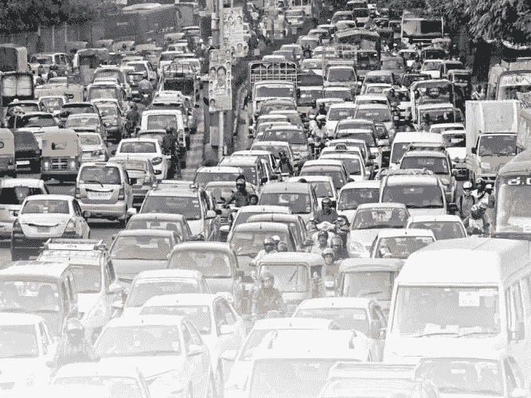

班加罗尔市“正常”的一天

这导致了一系列呼吸困难，并在 2018 年达到顶峰。

这让我意识到我们对生活中最简单的事情是多么的习以为常！除了顿悟之外，最大的副作用就是我的睡眠，每天晚上我会花几个小时；往好里说，就是扭来扭去，往坏里说，就是喘着气。

医生似乎对这种地方病没有太多的答案，通常的处方是抗组胺药(或类固醇)。

这种恶性循环对我的健康产生了螺旋式的影响；睡眠不足意味着定期服药，这影响了我的自然睡眠周期，导致剂量更大。这种情况持续了一段时间，然后我意识到我必须做些什么。

就在那时我开始了 *'* ***日出前起床*** *'* 项目:
一份四个简单睡眠相关问题的问卷，几乎要在睡醒后立即回答。

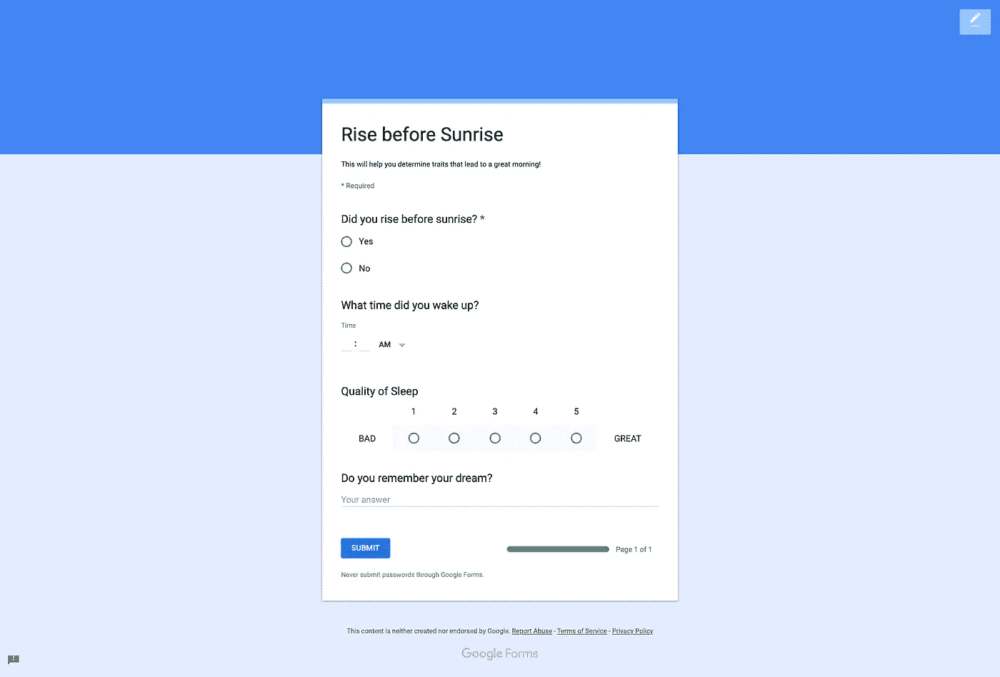

谷歌表单

***这有什么用？***
如果我不能改变我的睡眠周期，我至少可以试着看看哪里出了问题，我的烦恼是否越来越严重；一种我睡觉用的温度计。

快进到 2019 年底，我已经积累了近两年的梦想数据！有了一点时间和足够的数据，我决定研究一下。下面是一些更有趣的发现。

# 石蕊试验

我捕获的基本数据包含以下字段:

1.  我在日出前起床了吗？(是/否)
2.  我什么时候醒来的？
3.  我会给我的睡眠打多少分？
4.  我能从梦中记起的东西的描述

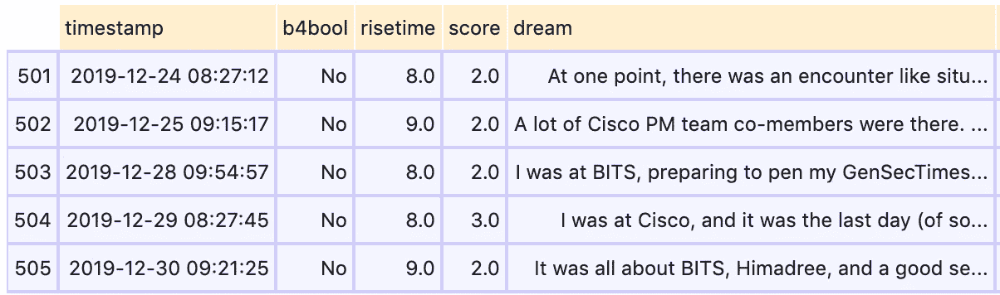

原始数据

我*主观上知道自己的挣扎和挑战，以及因为一些生活方式的改变而改变的睡眠模式，但数据会反映这种知识吗？我决定从几个基本问题开始验证。*

## *Q1。我在 2018 年和 2019 年的醒来时间会有什么不同？*

*我'*知道*'在 2019 年，由于一些生活方式的改变，我醒来的时候没有 2018 年那么不规律。所以我们先来画一个起床时间的图。*

*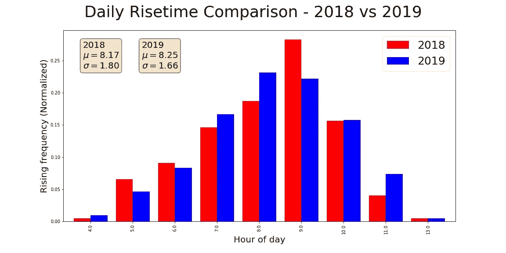*

*上图是一个条形图，x 轴显示了起床时间，y 轴显示了我在那个时间醒来的天数百分比。*

*上图显示，与 2018 年相比，2019 年的 sigma 值较低(统计上表示数据的变化)。
确认 2019 唤醒时间的 ***方差*** 小于 2018。*

*到目前为止一切顺利！下一题。*

## *2019 年 8 月前后的唤醒时间呢？*

*2019 年 8 月，我决定搬出之前的工作。自从那次改变后，如果我觉得没有休息好，我可以睡得晚一点。
***这在代表我后续上升时间的数据中是否明显？让我们看看。****

*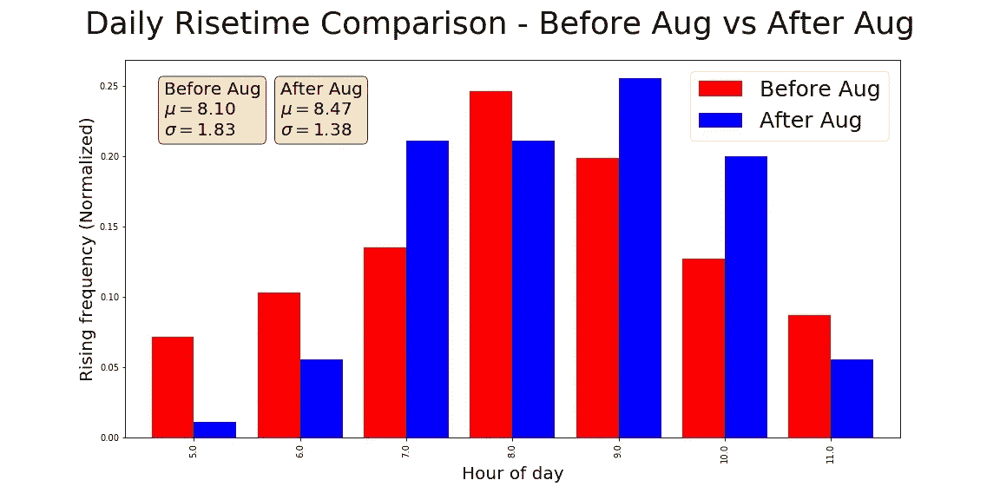*

*哇！这更能说明问题。快速浏览一下统计数据可以发现，虽然我的平均起床时间要长得多，但差异还是小得多。*

*这是有意义的，因为我有意识地试图建立一个早晨的时间表，即使在我最糟糕的日子里，我起床也不会太痛苦。第二次测试也通过了！*

## *Q3。但是八月前后的周末呢？*

*工作日的数据可能不是一个人“实际”醒来时间的真实表现。让任何一个被迫在早上 6 点起床的孩子去赶校车吧！*

*但是周末经常让我们中的许多人按照自己的意愿或方便起床。
八月后，生活方式发生了一些变化，我自信地认为我会更加持续地自然起床，不会有闹钟或妈妈在我耳边尖叫。
***那么剧情是怎么说的呢？****

**

*是啊！平均起床时间相当一致，但是八月前后的周末有整整一个小时的差异！数据有道理。*

> *如果统计数据不清楚，看看两个最大的红色条内的两个最大的蓝色条，证实我对睡眠周期变化的感受。八月以后，我越来越坚持起床，甚至在周末。*

# *梦的回忆*

*是时候问更多有趣的问题了。我的梦的实际内容呢？*

*我注意到，在某些日子里，我记得很多我的梦，而在其他日子里，几乎什么都不记得了。我的睡眠等级(我给 5 分)和梦的回忆量之间有联系吗？*

*我画了一个简单的回归图来看两者之间的联系，y 轴是文字量，x 轴是梦的分数。*

*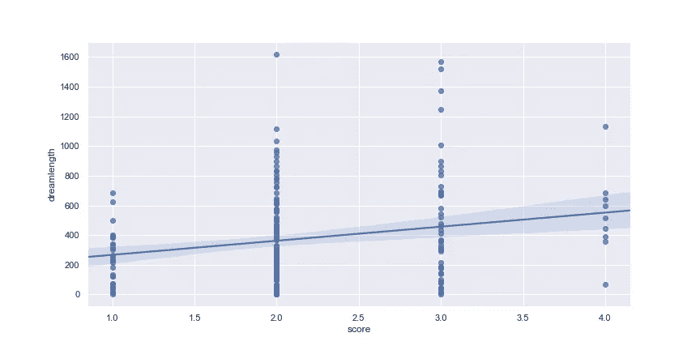*

*事实上，梦的分数与回忆的数量有一定的相关性。*

*为了形象化得更清楚，我决定制作一个 ***小提琴剧情*** 。这是一个很好的可视化，让您也可以想象给定 y 值的点的分布。即，如果对于给定的 y 值，它有一个大肚子，那么许多点是相同的。*

*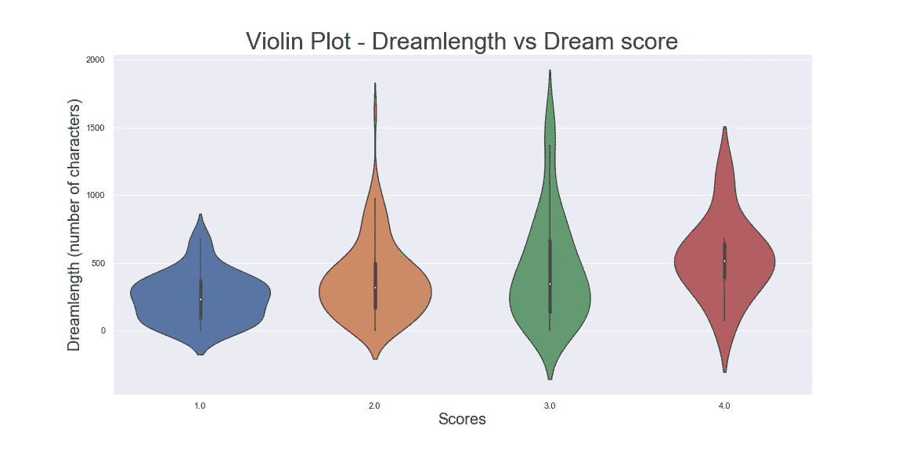*

*瞧啊！你能猜出分数和回忆量之间的关系吗？*

> *看起来，虽然高分与高回忆没有明显的联系，但低分似乎与低回忆有很大的联系。*

*我决定寻找一项比较梦的回忆和睡眠质量的研究，谷歌上的第一个结果是 2011 年进行的这项研究。*

*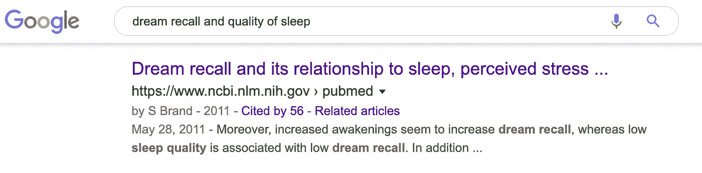*

*是不是很神奇！我的睡眠质量在某种程度上与我对梦的记忆有多好有关。*

# *梦情感分析*

*到目前为止，我只看了梦的客观特征，即。醒来时间、睡眠评分、回忆量，虽然所有这些指标都很重要，但我认为是梦的主观内容让梦如此迷人。*

*这种主题分析的挑战在于，我有 500 多条睡眠记录要查看。为了解决这个问题，我有了一个主意。*

*让我们把每个梦想象成一部 ***电影*** ，比如说《星球大战:梦之战》！并把梦的参赛作品当做那部电影的 ***回顾*** 。
然后，我可以使用自然语言模型将 ***的*** 的梦 ***的电影评论*** 归类为积极情绪或消极情绪。*

*我该怎么做呢？
幸运的是，有工具可以完成这项任务，比如自然语言工具包库( [nltk](/datadriveninvestor/python-data-science-getting-started-tutorial-nltk-2d8842fedfdd) )。NLTK 有一个 IMDB 数据集，其中充满了带标签的电影评论和一些非常好的分类器，这些分类器可以分析文本并预测特定评论的情绪是积极还是消极。*

*为了探索这个想法，我采用了一个简单的分类器([nave Bayes](https://www.nltk.org/_modules/nltk/classify/naivebayes.html))并在 IMDB 数据集上训练它。然后，我试着预测一个梦的情绪。下面是输出的一个例子。*

*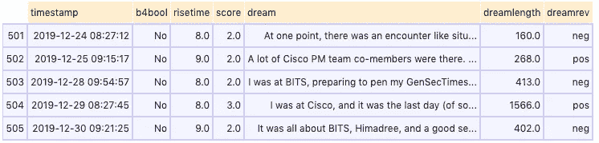**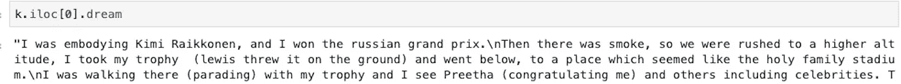*

*一个令人捧腹的积极梦想的例子——我想我看了很多 f1 比赛*

*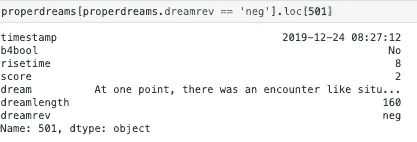*

*消极的梦有一个类似警察遭遇的情况——可怕！*

*在我做出任何结论之前，我必须承认这种“梦情分析”的方法有很大的误导性，原因如下:*

1.  *分类器选择不当
    我使用的分类器(朴素贝叶斯)在推导句子意思方面做得很差。它没有句子结构、语言模型或词义的信息。它对电影评论很有效，因为某些词往往被用来描述特定的情感。*
2.  ****不合适的训练例子***
    即使我有一个好的分类器，也不会有那么大的区别，因为它不是在合适的数据上训练的。
    训练必须在对实际测试案例有一定代表性的数据上进行，但 IMDB 电影评论和我的梦想之间似乎没有明显的联系。*
3.  *梦里的“善良”到底是什么意思？
    这是一个更广泛的问题。假设你有一个超级分类器，一个巨大的“梦数据”语料库，完全像电影评论一样。你能相信它仅仅根据你对事件的文字描述来给一个梦分类吗？*

*与电影不同，电影可以有一些确定的衡量标准，如表演质量、电影节奏和故事情节，梦似乎更多的是关于*“感觉”*，我们思考梦的方式很大程度上取决于个人的解释。*

*尽管如此，为了好玩，下面是一个用梦的预测情绪描述我醒来时间的情节。*

*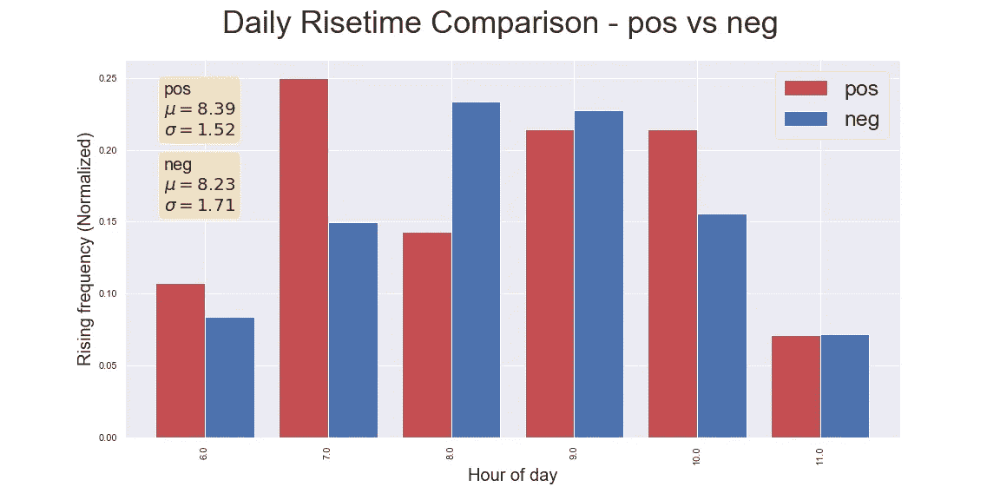*

*“积极的”梦让我平均多睡了一会儿*

*似乎我的积极的梦让我平均多睡了一会儿。也许额外的 10 分钟给我的梦想带来了快乐的结局？*

*我最喜欢的情节，《小提琴》给了我更多的洞察力。在较短的梦境回忆中,“消极”梦境的腹部显得特别大，而积极的梦境则更加均匀地分布在不同长度的梦境中。*

*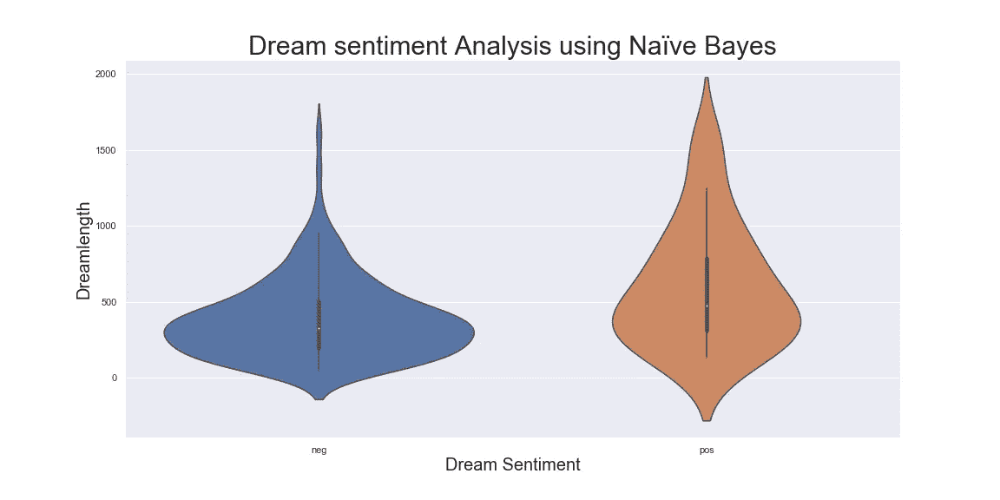*

> *也许，“消极的”情绪让我想少回忆一些梦，而“积极的”情绪让我多写一些*

*与其做出疯狂的、未经证实的结论，不如让我以三个超现实的发现来结束我的分析，这三个发现让我觉得这项工作非常值得。*

1.  *去年九月，我姐姐生下了她的第一个孩子，一个女儿。但是我在姐姐的女儿出生前差不多两个月，就梦想着和她一起玩。(不知道孩子的性别)*
2.  *快速搜索 2019 年我梦里所有的' [*命名实体*](https://www.nltk.org/book/ch07.html) '，几乎有我生命中每一个重要的人和地方。
    我的大脑似乎有一组人和地点，每天晚上它会用一个相当新的主题来洗牌，让我开心！*
3.  *下面是我 2019 年梦想条目中使用频率最高的单词云。除了常用词之外，像 ***【梦】******【锯】*** & ***【记住】******【妈妈】*** & ***【爸爸】*** 都排在榜单前列。*

*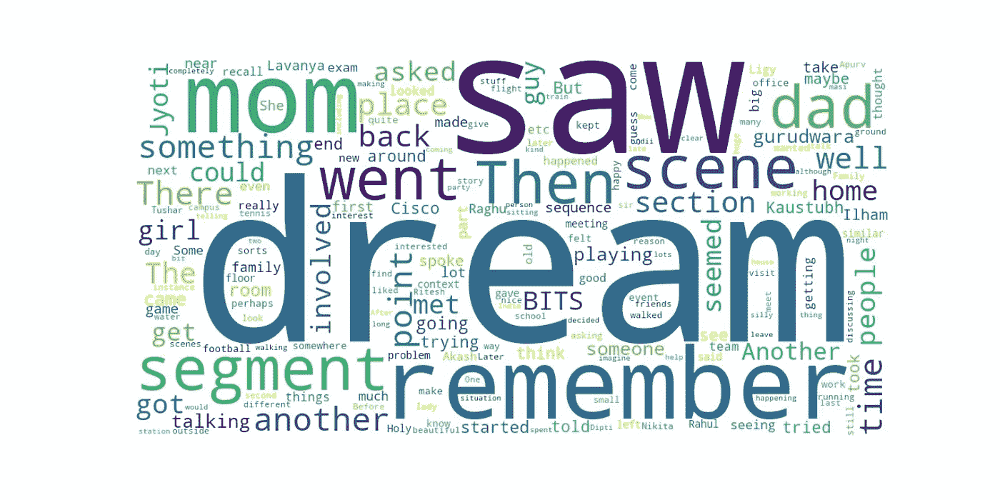*

*2019 梦想云*

**如果你有任何问题，请随时联系我 hargun3045@gmail.com**

*感谢您的阅读，并祝您在新的一年里做个好梦。*

*Github 上的*项目代码—**