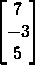
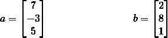
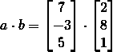
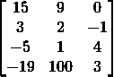
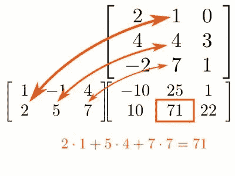
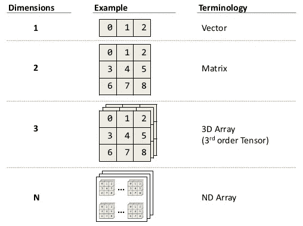
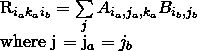
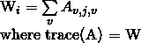
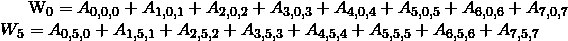

# 张量网络的线性代数

> 原文：<https://medium.com/analytics-vidhya/tensor-networks-intro-5bfb2c770f85?source=collection_archive---------8----------------------->

在这个系列中，我们的主要焦点是张量网络。您将了解张量网络如何工作，以及如何在 [TensorNetworks](https://github.com/google/TensorNetwork) 中为自己的应用实现自己的网络。

在开始学习张量之前，我们复习一下线性代数技巧是很重要的。

## 缩放器

标量是一个单一的数字，例如 5 或 11。

## 向量

向量是数字的集合。例如

大小为 3 的简单向量

**点积**

两个向量之间的点积是通过对两个向量的相应项的乘积求和来给出的。

例如 Let，

因此两个向量之间的点积由下式给出:

两个向量之间的点积

点积然后给我们，

(7 * 2) + (-3 * 8) + (5 * 1) = 14 + -42 + 5 = -23

请注意，点积返回一个标量。

另外，请注意，两个向量的大小需要相同。在这种情况下，他们都是 3 号。

## [数]矩阵

矩阵是所有大小相同的向量的集合。

例如

一个 4 乘 3 矩阵的例子

上面的矩阵是 4 乘 3，因为有 4 行和 3 条边。

**矩阵运算**

**矩阵乘法**

矩阵乘法返回一个矩阵，将一个矩阵列与其他矩阵行的乘积相加。这又返回了一个新的矩阵。

有关矩阵乘法的更多详细信息，请访问以下链接:

 [## 如何乘矩阵

### 一个矩阵是一个数字的数组:一个矩阵(这个有 2 行 3 列)乘以一个单一的数字…

www.mathsisfun.com](https://www.mathsisfun.com/algebra/matrix-multiplying.html) 

对于那些喜欢矩阵乘法的直观意义的人，请参见下面由 3blue1brown 制作的视频:

**矩阵转置**

转置矩阵包括在主对角线上翻转矩阵。这意味着元素(5，3)现在将位于位置(3，5)，元素(4，9)将位于位置(9，4)，依此类推。请注意，主对角线中的元素将保持不变。

有关矩阵转置的更多信息，请参见:

 [## 矩阵

### 矩阵是一组数字:一个矩阵(这个有 2 行 3 列)我们谈论一个矩阵，或者几个…

www.mathsisfun.com](https://www.mathsisfun.com/algebra/matrix-introduction.html) 

## 张量

张量只是标量、向量和矩阵的推广。标量是 0 阶张量，向量被称为 1 阶张量，矩阵是 2 阶张量，而三维数字集合是 3 阶张量。

**张量收缩**

张量收缩本质上是矩阵乘法的推广。因为张量可以有任意多个维度，我们实际上可以对任意两个维度的乘积求和。但是，请注意，在对特定维度的乘积求和时，两个维度的长度必须相等。

考虑维度为 4x3x7 的张量 A，进一步考虑维度为 9x3 的张量 B。我们看到两个张量有相同的第二维度。因为两个张量都有相等的第二维度(都是 3 维)，我们可以在那个特定的维度上应用张量收缩。

现在，因为我们只在一个维度上求和，我们现在将有 3 个“自由的”，可以自由变化的维度。因此，最终结果 R 将是 4×7×9 维的三阶张量。

例如，为了获得新矩阵中的第一个元素(1，1，1 ),我们对两个张量(即张量 A 中的(1，I，1)和张量 B 中的(1，I ))沿第二维的乘积求和，这意味着:

非正式地，这意味着要找到位置(I，j，k)处 R 的值，我们将需要对 A 的项(I，v，k)和 B 的项(k，v)的乘积求和，并且只改变 v。

**张量轨迹**

与矩阵迹非常相似，张量迹意味着沿两个独立的维度对角求和。这意味着一旦轨迹完成，我们就把张量的阶减少了 2。这就是为什么矩阵的迹返回一个标量，因为矩阵的阶减 2 返回一个 0 阶张量，即一个标量。

计算张量的轨迹需要大小相等的二维空间。

例如，考虑维度为(3，8，3)的三阶张量 A。

我们可以只沿着第一和第三个维度计算这个张量的轨迹，因为它们大小相等。

然后，迹线，一阶张量(一个向量)，让我们称之为 W，一旦迹线被计算，将有维度(8)。

用数学术语来说，A 的迹可以写成:

因此，向量的第 1 和第 4 个元素由下式给出:

请注意，索引从 0 开始，而不是从 1 开始。

**张量转置**

最后，以我们想要的任何方式交换或打乱维度，就可以转置张量。

例如，给定一个维度为(7，4，8，5)的张量 A，其中(I，j，k，l)表示每个维度内的索引，我们可以通过设置 i=j=k=l=0 找到张量中的第一个元素，这将给出张量中的(0，0，0，0)项。

另一方面，转置一个张量，将会交换我们原始张量的索引。

例如，将索引为(I，j，k，l)的张量 A 转置为(I，k，l，j)将导致我们现在以不同的方式引用原始张量中的相同元素。例如，来自原始张量 A 的元素(1，3，2，0)现在需要从具有新索引(1，2，0，3)的转置张量中访问。

这是因为 j，k，l 轴被调换了。

在[的下一个系列](/@aamirsoni1551/penroses-graphical-notation-fe4c2f24cf3b)中，我们将看到张量是如何在张量网络中表示的。