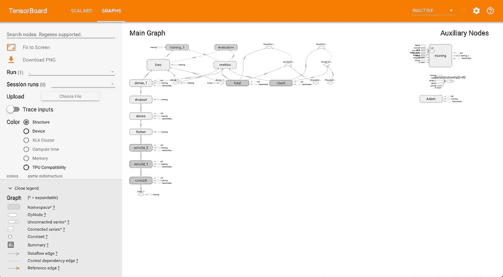
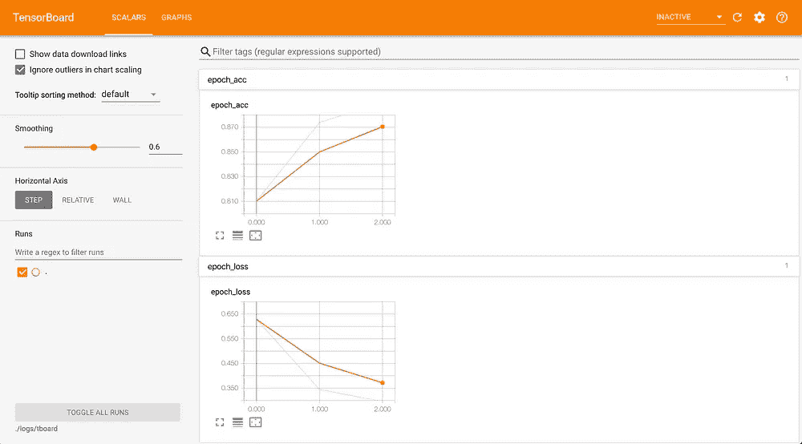

# 使用时尚 MNIST 数据集的张量板演示

> 原文：<https://medium.com/analytics-vidhya/tensorboard-demonstration-using-fashion-mnist-b978d4c55583?source=collection_archive---------13----------------------->

TensorBoard 是 Tensorflow 的可视化工具包，提供了一种简单的方法来查看您的模型的图形，并查看损失、准确性等方面的改进。本教程使用 keras 建立和训练模型，tensorflow 1.13。

让我们从导入必要的库开始:

```
from tensorflow.keras.layers import Input, Dense, Conv2D, Flatten, Dropout
from tensorflow.keras.datasets import fashion_mnist
from tensorflow.keras.optimizers import Adam
from tensorflow.keras.models import Model
from tensorflow.keras.callbacks import TensorBoard
import numpy as np
import tensorflow as tf
```

现在，我们必须获取数据集，并将其分类为训练组和测试组。幸运的是，keras 可以为我们做到这一点。之后，我们必须为我们的标签执行一次热编码。

```
(x_train, y_train), (x_test, y_test) = fashion_mnist.load_data()def one_hot(targets, nb_classes=10):
    res = np.eye(nb_classes)[np.array(targets).reshape(-1)]
    return res.reshape(list(targets.shape)+[nb_classes])y_train = one_hot(y_train)
y_test = one_hot(y_test)
x_train = np.reshape(np.expand_dims(x_train, axis=1), (60000, 28, 28, 1)) #reshaping for it to be compatible with model
x_test = np.reshape(np.expand_dims(x_test, axis=1), (10000, 28, 28, 1))
```

现在，我们将定义模型架构。这里，有 3 个卷积层和 2 个密集层。请随意使用您自己的架构。模型也在这一步编译。

```
input = Input(shape=(28, 28, 1))
x = Conv2D(4, (5, 5), strides=1, activation="relu", padding="same")(input)
x = Conv2D(8, (5, 5), strides=2, activation="relu", padding="same")(x)
x = Conv2D(12, (4, 4), strides=2, activation="relu", padding="same")(x)
x = Flatten()(x)
x = Dense(200, activation="relu")(x)
x = Dropout(0.1)(x)
output = Dense(10, activation="softmax")(x)
model = Model(inputs=input, outputs=output)
model.compile(loss="categorical_crossentropy",
              optimizer=Adam(),
              metrics=["accuracy"])
```

在训练我们的模型时，我们可以提供对它的回调，检查进度，提前停止训练，等等。在这里，我们定义一个 tensorboard 回调，训练和评估我们的模型。

```
tensorboard = TensorBoard(log_dir="./logs/tboard")
model.fit(x_train, y_train, batch_size=64, epochs=3, callbacks=[tensorboard])
print(model.evaluate(x_test, y_test))
```

TensorBoard 将日志写入您选择的目录中的文件，通常是。/logs/。我们必须定义作者。

```
writer = tf.summary.FileWriter("/path/to/your/directory", tf.get_default_graph())
```

最后，我们可以从命令行启动 tensorboard。它将在本地主机上运行。

```
$tensorboard --logdir=./path/to/your/directory --port=6006
```

在浏览器中打开 localhost:6006。您可以查看随时间变化的损失和精确度的图表，也可以查看模型的计算图表。



张量板上的计算图、精度图和损失图

我们还可以将我们的图表上传到 TensorBoard.dev，这将为我们提供一个任何人都可以查看的公共共享链接(这对每个人都是公开的，所以不要共享敏感信息)。

```
tensorboard dev upload --logdir ./path/to/your/directory
```