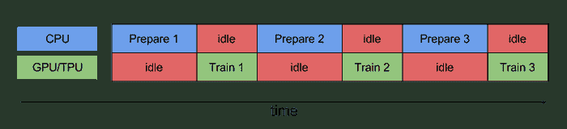
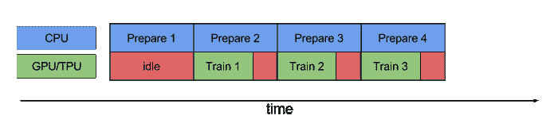

# TensorFlow 2.0: tf.data API

> 原文：<https://medium.com/analytics-vidhya/tensorflow-2-0-tf-data-api-eaa9889186cc?source=collection_archive---------5----------------------->


ETL 过程

如果您还记得 TensorFlow 1.x 中只有队列可用作 **ETL** 管道(提取/转换/加载)的数据结构，以及有时管理一些约束和隐含陷阱是多么困难。但是现在有一个非常成功的模块组织了整个 **ETL** 管道: **tf.data** 。

我想简单介绍一下 tf.data API 的介绍和用法。

tf.data 处理不同类型的输入数据:

1.  战斗支援车
2.  NumPy
3.  文本
4.  形象
5.  熊猫。数据帧
6.  TF。文本
7.  统一码
8.  tfRecord 和 TF。例子

每种类型都有自己的类和方法来处理它们。

tf.data 中的两个重要阶段:

1.  创建存储输入数据的**数据存储器**。所有数据元素都变成了张量对象:

```
dataset = tf.data.Dataset.from_tensor_slices()dataset = tf.data.Dataset.from_tensors()
```

2.定义**转换**并将链**操作**应用于数据集:

```
dataset.map()dataset.batch()
    ... 
```

对于**数字**示例:

```
dataset = tf.data.Dataset.from_tensor_slices((x_train, y_train))
dataset = dataset.map(map_func=preprocess, num_parallel_calls=tf.data.experimental.AUTOTUNE)
dataset = dataset.batch(batch_size=batch_size).prefetch(buffer_size=prefetch_buffer_size)
```

正如你所看到的，这是一个有趣的时刻:这个连锁经营由哪些部分组成？

让我们考虑一下最有用的函数。

1.  **映射:**将给定的变换函数应用于输入数据。允许并行处理该过程。

```
dataset.map(map_func=preprocess,
                      num_parallel_calls=tf.data.experimental.AUTOTUNE)
```

*num_parallel_calls* 应该等于可用于转换的进程数。

*TF . data . experimental . auto tune*定义适当数量的空闲工作进程。

2.**批处理:**将数据集分割成给定大小的子集。

```
dataset.batch(batch_size=batch_size)
```

3.**重复:**多次重复数据集。当数据结束并且训练过程应该继续时，这是有用的，然后*重复*功能从最开始开始并且训练继续*计数*次。

```
dataset = dataset.repeat(count=NROF_REPETITIONS)
```

4. **shuffle:** 训练数据输入管道非常重要的功能。但是这种混洗需要**缓冲器 siz** e，它负责将要混洗的元素的数量。

```
dataset = dataset.shuffle(buffer_size=len(IMAGE_PATHS))
```

每次需要数据时，它都会从缓冲区中获取数据。之后，缓冲区被最新的元素填充到给定的缓冲区大小。

5.**缓存:**允许缓存数据集的元素以备将来重用。缓存数据将存储在内存(默认)或文件中。

```
dataset = dataset.cache(filename=CACHE_PATH)
```

6.**预取:** TensorFlow 从时间和内存效率上非常清晰的展示了如何获取火车流水线。

那是以前:



现在:



**预取**不允许 CPU 空闲。当模型正在训练时*预取*在 GPU 忙碌时继续准备数据。

```
dataset = dataset.prefetch(buffer_size=tf.data.experimental.AUTOTUNE)
```

7.**交错:**从不同的文件中读取数据，并行化这个过程。

```
dataset = dataset.interleave(map_func=parse_files, cycle_length=NROF_READERS, block_length=1,
num_parallel_calls=tf.data.experimental.AUTOTUNE)
```

*parse_files* —从给定文件中读取输入数据；

*cycle_length* —将同时处理的输入元素数量；

block _ length 在循环到另一个输入元素之前，从每个输入元素产生的连续元素的数量。

## 最佳实践

1.  **地图**和**批次**的顺序在性能上是有道理的。

*   使用**地图**然后**批量**当地图是昂贵的功能时。每个批次都将由数据集中显示顺序的元素构成。但是，如果在 map 中使用了 *num_parallel_calls* ，则不会保证给定数据集中呈现的元素顺序。
*   使用**批量**然后**映射**当映射是廉价功能时。在这种情况下，**矢量化**地图功能并同时处理整批元素是有意义的。 *num_parallel_calls* 不会影响元素顺序。

2.使用数据输入管道末端的**预取**来防止 CPU 闲置。但是如果 *map_func* 增加输出数据的数量**预取**，**混洗**和**重复**应该在最开始使用以节省内存。

3.使用**缓存**缓存数据，目的是不要花费时间进行数据预处理。

4.不要忘记在方法中使用 *num_parallel_calls* ，如果它有这样的属性。