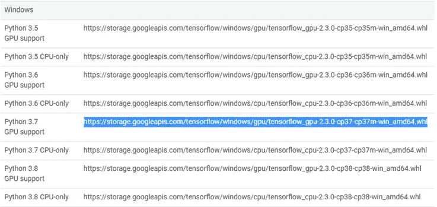
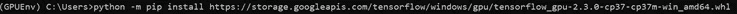

# 在 Windows 10 上使用 NVIDIA 显卡启用 TensorFlow-gpu

> 原文：<https://medium.com/analytics-vidhya/tensorflow-2-3-0-with-gpu-support-on-windows-10-f975a552ea7c?source=collection_archive---------0----------------------->

几天前，我不得不决定把我用了 7 年的双核 I5 笔记本电脑放在一边，买一台新的。在与朋友核实后，我做了自己的研究，我登陆了“联想军团 5i”。

出于对深度学习领域的兴趣，我开始研究 TensorFlow 和 Keras。如你所知，CPU 上的模型训练需要时间，GPU 使它更好地减少了至少 1/6 的 CPU 时间。要在 GPU 上运行 TensorFlow，我们需要安装 NVIDIA 图形驱动(如果没有预装)、CUDA Toolkit、cuDNN 库。问题是经常发布的版本，很少有不兼容的。我和你们中的一些人一样，最终陷入了 DLL 错误的循环。


由于不正确的安装/兼容性问题导致的 DLL 错误

军团 5i 运行在这个配置上——CPU:I7 第 10 代| GPU:NVIDIA GEFORCE gtx 1650 ti | OS:Windows 10 Home，64 位。要使用 Keras，TensorFlow 需要更新到 2.2 或更高版本。TensorFlow-GPU v2.2 尚未与 Anaconda for Windows OS 一起发布。


tensor flow | Keras | Anaconda tensor flow-GPU 版本

浏览其他博客，堆栈溢出问题，文章，CUDA，cuDNN 文档，并通过谷歌搜索，以下步骤有助于解决我的需求。

# **第一步:安装蟒蛇**

从他们的[官方网站](https://www.anaconda.com/products/individual)下载 Anaconda 个人版 V3.8(写这篇博客时的最新版本)。运行 Anaconda 安装程序，接受默认设置。这也将在系统变量中设置 python 路径。下载链接:【https://www.anaconda.com/products/individual 


Anaconda 安装程序和设置

# **第二步:安装微软 Visual C++编译器**


MS Visual Studio 安装程序

CUDA Toolkit 使用 MS Visual C++编译器，更简单的安装方法是通过 Microsoft Visual Studio。从 https://visualstudio.microsoft.com/vs/community[下载微软 Visual studio 社区版](https://visualstudio.microsoft.com/vs/community/)

# **第三步:安装 CUDA 工具包**

虽然最新的 CUDA Toolkit 版本在 2020 年 9 月更新到 11.1.0，但是这个安装给出了我无法调试的 DLL 错误。我试过其他版本，**CUDA Toolkit 10.2【2019 年 11 月】**确实工作没有错误。


CUDA 工具包—传统版本

从[https://developer.nvidia.com/cuda-downloads](https://developer.nvidia.com/cuda-downloads)下载 CUDA 工具包。如果您正在寻找存档版本，请点击“旧版本”继续默认的安装过程，因为它在环境变量中设置路径，不会给我们带来麻烦。


CUDA 工具包 10.2 及安装

# **第四步:cuDNN 库**

cuDNN 是一个 GPU 加速库，用于深度神经网络的高度优化实现。下载 cuDNN 需要 NVIDIA 开发者计划会员。不要担心；这是一个主要的注册，一旦邮件验证完成，将提供下载访问。

从 https://developer.nvidia.com/rdp/cudnn-download 的[为 CUDA 10.2 下载 cud nn v 8 . 0 . 4(2020 年 9 月 28 日)。记住，我们之前选择的是 CUDA toolkit 10.2，这里选择的是兼容的 cuDNN v8.0.4。](https://developer.nvidia.com/rdp/cudnn-download)


为 CUDA 10.2 下载 cuDNN v8.0.4

cuDNN 是一个压缩文件。Unzip 给出 3 个文件夹——Bin、Include 和 Lib。我们需要将每个文件夹中的文件复制到 CUDA 安装文件夹中。更多详情请访问[https://docs . NVIDIA . com/deep learning/cud nn/install-guide/index . html](https://docs.nvidia.com/deeplearning/cudnn/install-guide/index.html)


将文件从**\ Downloads \ cud nn 10.2 \ CUDA \ bin**复制到
**C:\ Program Files \ NVIDIA GPU Computing Toolkit \ CUDA \ v 10.2 \ bin**


将文件从**\ Downloads \ cud nn 10.2 \ CUDA \ include**复制到
**C:\ Program Files \ NVIDIA GPU Computing Toolkit \ CUDA \ v 10.2 \ include**


将文件从**\ Downloads \ cud nn 10.2 \ CUDA \ lib \ x64**复制到
**C:\ Program Files \ NVIDIA GPU Computing Toolkit \ CUDA \ v 10.2 \ lib \ x64**

在继续之前，导航到系统属性(按 Windows + R >键入 sysdm.cpl 并按 enter)。单击环境变量，检查系统变量区域中的“Path”变量是否更新为以下路径。如果没有，请手动添加它们。

**C:\Program Files\NVIDIA GPU 计算工具包\ CUDA \ v 10.2 \ bin
C:\ Program Files \ NVIDIA GPU 计算工具包\CUDA\v10.2\libnvvp**


验证 CUDA 路径的环境变量

# **第五步:创建一个新的 Python 环境**

当开始一个新项目时，创建一个新的环境是一个好的实践；这样，基础环境不会受到影响。在开始菜单中，搜索并运行“ **Anaconda 提示**”。

使用以下命令创建环境:

```
conda create --name GPUEnv python=3.7
conda activate GPUEnv
```


创建一个名为“GPUEnv”的新 python 环境，python 版本为 3.7


激活 GPUEnv

```
pip install ipykernel
python -m ipykernel install --user --name GPUEnv --display-name "GPUEnv"
```


在 GPUEnv 环境中创建 python 内核


使用提到的名称安装内核—该命令返回已安装的 Kernelspec 作为确认。

```
pip install jupyter notebook
```


在 GPUEnv 中安装 Jupyter 笔记本

# **步骤 6:在我们的环境中安装 tensor flow**

TensorFlow pip 包为我们提供了安装带 GPU /不带 GPU 的 TensorFlow 的选项。由于我们在环境中安装了 Python 3.7，我们可以选择 Python 3.7 GPU 支持，突出显示并复制 URL。旁边是 whl 分机。套餐网址将在 https://www.tensorflow.org/install/pip#package-location[提供](https://www.tensorflow.org/install/pip%23package-location)



Python 3.7 GPU 支持—张量流文件

```
python -m pip install <wheel_url>
```

使用命令将<wheel_url>替换为复制的 URL。</wheel_url>



TensorFlow GPU 安装

# **步骤 7:验证 TensorFlow 安装**

转到 Python 命令行界面，在下面一行输入:

```
python 
#In the interface, enter the following commands in sequence.import tensorflow as tf
print(tf.test.is_built_with_cuda())
print(tf.config.list_physical_devices('GPU')) 
exit()
```

语句**print(TF . test . is _ build _ with _ cuda())**应返回' **True** '
语句**print(TF . config . list _ physical _ devices(' GPU '))**应返回 **GPU 物理设备名称和设备类型**


TensorFlow 检测到 GPU

# **第八步:通过 GPU 运行神经网络**

进入朱庇特笔记本命令。在您的默认浏览器上，您将看到 python 笔记本打开。


打开 Jupyter 笔记本


用我们之前创建的 GPUEnv 创建一个新的笔记本。\

复制下面这段代码，并在 Jupyter 笔记本上运行。

```
import tensorflow as tf
tf.__version__
```

出局:“2.3.0”

```
from distutils.version import LooseVersion
import warnings
import tensorflow as tfif not tf.test.gpu_device_name(): 
    warnings.warn('No GPU found')
else: 
    print('Default GPU device: {}' .format(tf.test.gpu_device_name()))
```

Out:默认 GPU 设备:/device: GPU: 0

```
# Import all required libraries
import numpy as np
from tensorflow import keras
from tensorflow.keras import layers
from datetime import datetime
# Split MNIST Train and Test data
(x_train, y_train), (x_test, y_test) = keras.datasets.mnist.load_data()# Divide train set by 255
x_train, x_test = x_train.astype("float32") / 255, x_test.astype("float32") / 255
x_train, x_test = np.expand_dims(x_train, -1), np.expand_dims(x_test, -1)# convert class vectors to binary class matrices
y_train, y_test = keras.utils.to_categorical(y_train, num_classes=10), keras.utils.to_categorical(y_test, num_classes=10)# Build the model
model = keras.Sequential(
    [
        keras.Input(shape=(28,28,1)),
        layers.Conv2D(32, kernel_size=(3, 3), activation="relu"),
        layers.MaxPooling2D(pool_size=(2, 2)),
        layers.Conv2D(64, kernel_size=(3, 3), activation="relu"),
        layers.MaxPooling2D(pool_size=(2, 2)),
        layers.Conv2D(128, kernel_size=(3, 3), activation="relu"),
        layers.MaxPooling2D(pool_size=(1, 1)),
        layers.Flatten(),
        layers.Dropout(0.5),
        layers.Dense(10, activation="softmax"),
    ]
)# Model summary and Evaluation
model.summary()
model.compile(loss="categorical_crossentropy", optimizer="adam", metrics=["accuracy"])
start = datetime.now()
model.fit(x_train, y_train, batch_size=128, epochs=5, validation_split=0.1)
stop = datetime.now()
print("Time taken to execute:" + str(stop - start))
```

该模型耗时接近 10 秒，具有 5 个历元，在 GTX 1650Ti 上的训练准确率为 98.77%。


在 GPU 上运行

同样一段代码，在 I7 处理器的 CPU 上运行，耗时 76 秒，准确率 98.68%。


在 CPU 上运行

如果您正在创建一个需要 TensorFlow 2.3.0 在 windows 操作系统上提供 GPU 支持的新 python 环境，请将此清单放在手边

第一步:安装 Anaconda
第二步:安装 Microsoft Visual C++编译器
第三步:CUDA 工具包安装
第四步:cuDNN 库
第五步:创建一个新的 Python 环境
第六步:在我们的环境中安装 TensorFlow
第七步:验证 tensor flow 安装
第八步:通过 GPU 运行一个神经网络

参考资料:

[](https://www.thehardwareguy.co.uk/install-tensorflow-gpu) [## 如何安装 Tensorflow-GPU | thehardwareguy

### 如果你对机器学习很认真，你真的想尽可能多地利用你的机器的处理能力…

www.thehardwareguy.co.uk](https://www.thehardwareguy.co.uk/install-tensorflow-gpu) [](https://shawnhymel.com/1961/how-to-install-tensorflow-with-gpu-support-on-windows/) [## 如何在 Windows 上安装支持 GPU 的 tensor flow-Shawn Hymel

### 本教程将向您展示如何在 Windows 上安装支持 GPU 的 TensorFlow。你需要一个 NVIDIA 显卡…

shawnhymel.com](https://shawnhymel.com/1961/how-to-install-tensorflow-with-gpu-support-on-windows/) [](https://stackoverflow.com/questions/41117740/tensorflow-crashes-with-cublas-status-alloc-failed) [## Tensorflow 因 CUBLAS_STATUS_ALLOC_FAILED 而崩溃

### 我用一个简单的 MINST 神经网络程序在 Windows 10 上运行 tensorflow-gpu。当它想跑的时候，它…

stackoverflow.com](https://stackoverflow.com/questions/41117740/tensorflow-crashes-with-cublas-status-alloc-failed) [](https://github.com/tensorflow/tensorflow/issues/41146) [## 未知错误:无法获取卷积算法。这可能是因为 cuDNN 未能…

### 解散 GitHub 是超过 5000 万开发者的家园，他们一起工作来托管和审查代码，管理项目，以及…

github.com](https://github.com/tensorflow/tensorflow/issues/41146) [](/@andriylazorenko/tensorflow-performance-test-cpu-vs-gpu-79fcd39170c) [## TensorFlow 性能测试:CPU 与 GPU

### 在购买了一台用于远程进行深度学习的新超极本后，我问自己:

medium.com](/@andriylazorenko/tensorflow-performance-test-cpu-vs-gpu-79fcd39170c)