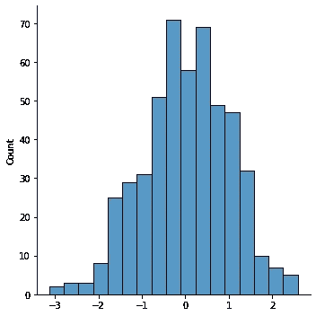
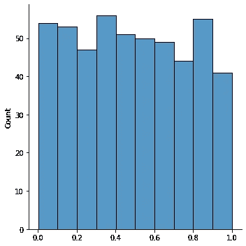
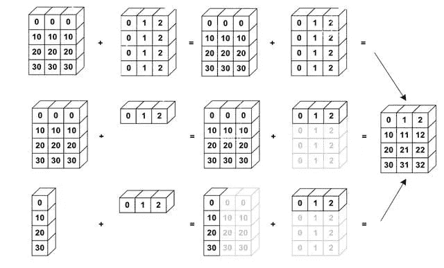

# 张量流 2-常见函数

> 原文：<https://medium.com/analytics-vidhya/tensorflow-2-common-functions-4f538fd9b995?source=collection_archive---------15----------------------->


*注意:所有代码文件将在*[*【https://github.com/ashwinhprasad/Tensorflow-2.0】*](https://github.com/ashwinhprasad/Tensorflow-2.0)提供。这篇博文将涵盖 tensorflow 2 中会重复使用的一些基本函数。

# 随意

random.normal 生成给定形状的随机值，这些值遵循正态分布
，random.uniform 生成随机值的方式使得从随机束中选择任意数字的概率几乎是一致的

```
#normal distribution
x1 = tf.random.normal(shape=(5,5),mean=0,stddev=1) 
#normal distribution
print(x1)**output:** tf.Tensor(
[[-1.1473149e+00  5.1616412e-01 -2.8656033e-01 -1.4161720e-03
  -6.7782238e-02]
 [ 1.5549400e-01 -1.8609362e+00  7.8299832e-01 -7.3712116e-01
  -3.0330741e-01]
 [ 5.6524660e-02  1.0138390e-01  1.2218195e+00  1.2505690e+00
   3.0457941e-01]
 [ 3.6436683e-01 -8.6699528e-01  1.5152076e+00  7.8330201e-01
  -1.4127023e+00]
 [-1.2999429e+00  1.3505920e+00  1.0376108e+00 -1.5029492e+00
   9.7778231e-01]], shape=(5, 5), dtype=float32) #visualize normal distribution
x1 = tf.random.normal(shape=(500,))
sns.displot(x1)
```



```
#uniform distribution
x2 = tf.random.uniform(shape=(5,4))
print(x2)**output :** tf.Tensor(
[[0.65285194 0.42846894 0.12264287 0.10860097]
 [0.93370414 0.5431448  0.68363917 0.649168  ]
 [0.03916836 0.13292682 0.83300996 0.78246915]
 [0.82530236 0.58112395 0.5084605  0.7217077 ]
 [0.6427095  0.8807986  0.2582872  0.00343001]], shape=(5, 4), dtype=float32) #visualize uniform distribution
x2 = tf.random.uniform(shape=(500,))
sns.displot(x2)
```



# 整形、堆叠、连接和 Argsort



*   整形顾名思义，是用来整形张量的。
*   concatenate 基本上将第二个张量附加在第一个张量的底部。
*   stack 类似于 concatenate，但是它用一个张量堆叠另一个张量，就像添加一个额外的列。
*   argsort 按升序对张量进行排序，并返回索引

```
#reshape
x3 = tf.random.normal(shape=(64,))
print(x3)**output:**tf.Tensor(
[ 0.42399088 -0.80428976  0.04625189  0.12766832 -1.1452513  -1.132444
 -1.5954331  -0.7658271   0.23830678  0.87359303 -1.1955462   0.60085934
 -0.16850014  0.23895513 -0.79428434  0.5901934   0.7201891  -0.88731915
  0.416003    0.36231613 -0.9967045   0.25209612  0.7464547  -0.5838859
  0.81082785  1.1345944  -0.13218845 -1.1947349  -0.15193698 -0.15605085
 -0.22355284  0.22670309 -0.09245801 -0.47463486 -0.0844338   0.395378
  1.7628212   1.1505485   0.4349458  -1.070593    0.9156709  -0.09126403
 -1.127492   -0.7092636  -1.0289346  -0.06610456  1.199735   -0.07397708
 -0.19952694 -0.10441776 -0.99892586 -0.3821481   0.34758636  0.53041816
 -0.53391504 -1.2965931   1.4620845  -0.02443436  0.14388773  0.2543015
 -0.7513509  -0.18593496  1.0581148   0.18503264], shape=(64,), dtype=float32)#reshaping to a 32x2 tensor
tf.reshape(x3,shape=(32,2))**output:** <tf.Tensor: shape=(32, 2), dtype=float32, numpy=
array([[ 0.42399088, -0.80428976],
       [ 0.04625189,  0.12766832],
       [-1.1452513 , -1.132444  ],
       [-1.5954331 , -0.7658271 ],
       [ 0.23830678,  0.87359303],
       [-1.1955462 ,  0.60085934],
       [-0.16850014,  0.23895513],
       [-0.79428434,  0.5901934 ],
       [ 0.7201891 , -0.88731915],
       [ 0.416003  ,  0.36231613],
       [-0.9967045 ,  0.25209612],
       [ 0.7464547 , -0.5838859 ],
       [ 0.81082785,  1.1345944 ],
       [-0.13218845, -1.1947349 ],
       [-0.15193698, -0.15605085],
       [-0.22355284,  0.22670309],
       [-0.09245801, -0.47463486],
       [-0.0844338 ,  0.395378  ],
       [ 1.7628212 ,  1.1505485 ],
       [ 0.4349458 , -1.070593  ],
       [ 0.9156709 , -0.09126403],
       [-1.127492  , -0.7092636 ],
       [-1.0289346 , -0.06610456],
       [ 1.199735  , -0.07397708],
       [-0.19952694, -0.10441776],
       [-0.99892586, -0.3821481 ],
       [ 0.34758636,  0.53041816],
       [-0.53391504, -1.2965931 ],
       [ 1.4620845 , -0.02443436],
       [ 0.14388773,  0.2543015 ],
       [-0.7513509 , -0.18593496],
       [ 1.0581148 ,  0.18503264]], dtype=float32)># reshaping into 16 x 4 tensor
tf.reshape(x3,shape=(-1,4))**output:** 
<tf.Tensor: shape=(16, 4), dtype=float32, numpy=
array([[ 0.42399088, -0.80428976,  0.04625189,  0.12766832],
       [-1.1452513 , -1.132444  , -1.5954331 , -0.7658271 ],
       [ 0.23830678,  0.87359303, -1.1955462 ,  0.60085934],
       [-0.16850014,  0.23895513, -0.79428434,  0.5901934 ],
       [ 0.7201891 , -0.88731915,  0.416003  ,  0.36231613],
       [-0.9967045 ,  0.25209612,  0.7464547 , -0.5838859 ],
       [ 0.81082785,  1.1345944 , -0.13218845, -1.1947349 ],
       [-0.15193698, -0.15605085, -0.22355284,  0.22670309],
       [-0.09245801, -0.47463486, -0.0844338 ,  0.395378  ],
       [ 1.7628212 ,  1.1505485 ,  0.4349458 , -1.070593  ],
       [ 0.9156709 , -0.09126403, -1.127492  , -0.7092636 ],
       [-1.0289346 , -0.06610456,  1.199735  , -0.07397708],
       [-0.19952694, -0.10441776, -0.99892586, -0.3821481 ],
       [ 0.34758636,  0.53041816, -0.53391504, -1.2965931 ],
       [ 1.4620845 , -0.02443436,  0.14388773,  0.2543015 ],
       [-0.7513509 , -0.18593496,  1.0581148 ,  0.18503264]],
      dtype=float32)>#argsort
arr1 = tf.constant([2,41,1,2,5,82,12,32])
tf.argsort(arr1,direction="ASCENDING")**output:** 
<tf.Tensor: shape=(8,), dtype=int32, numpy=array([2, 0, 3, 4, 6, 7, 1, 5], dtype=int32)>#concatenate and shape
x4 = tf.random.normal(shape=(5,))
x5 = tf.random.normal(shape=(6,))
x6 = tf.concat([x4,x5],axis=0)print("Tensor 1: ",x4.numpy(),"\nTensor 2: ",x5.numpy(),"\nTensor 3: ",x6.numpy())
print("Shape of Tensor 3: ",x6.shape)**output:**Tensor 1:  [ 0.8083252  -0.33577648 -0.08235504  0.54277456  0.14716475] 
Tensor 2:  [ 1.0126716  1.2005072  1.4773481  1.1552964 -1.7687838 -0.5394377] 
Tensor 3:  [ 0.8083252  -0.33577648 -0.08235504  0.54277456  0.14716475  1.0126716
  1.2005072   1.4773481   1.1552964  -1.7687838  -0.5394377 ]
Shape of Tensor 3:  (11,)
```

# 结论

tensorflow 中经常使用一些重要的函数，如 Random、Reshape、Argsort、Stack 和 Concatenate。
Github 回购:[https://github.com/ashwinhprasad/Tensorflow-2.0](https://github.com/ashwinhprasad/Tensorflow-2.0)

# 谢谢你