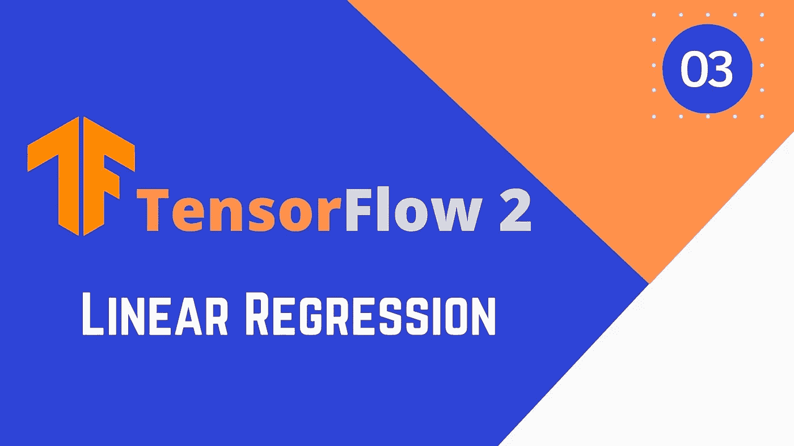
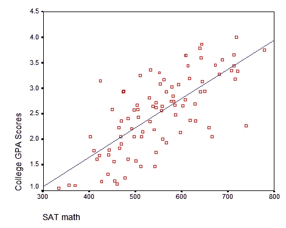
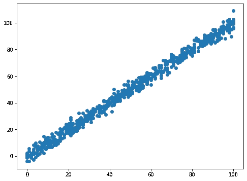
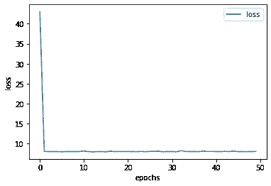
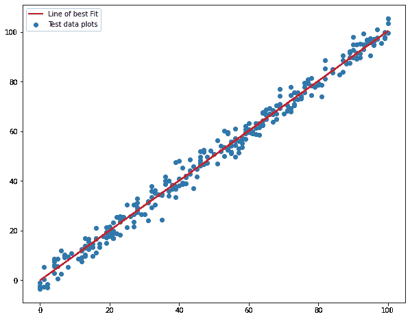

# 用于深度学习的 tensor flow 2-线性回归

> 原文：<https://medium.com/analytics-vidhya/tensorflow-2-for-deep-learning-linear-regression-bb1c3735ffa4?source=collection_archive---------13----------------------->



*代码文件将在:*[*【https://github.com/ashwinhprasad/Tensorflow-2.0】*](https://github.com/ashwinhprasad/Tensorflow-2.0)获得

# 什么是线性回归？

线性回归基本上是用一条线的一个方程，找出 2 个变量之间的线性关系。通过找到线性关系，我的意思是找到参数(斜率和截距)。

**y = m*x + c
y:因变量
x:自变量
m:斜率
c:截距**



两个变量之间的线性关系示例

在上图中，SAT 数学是独立变量，大学 GPA 分数是因变量，很明显这两个变量之间存在线性关系。因此，一旦我们找到斜率和截距，我们可以用一条线来预测大学新生的大学 gpa 分数。

# 使用 Tensorflow 2 进行线性回归

## **1。导入所需的库**

```
*#importing the libraries* **import** **tensorflow** **as** **tf
import** **pandas** **as** **pd
import** **numpy** **as** **np
import** **matplotlib.pyplot** **as** **plt
import** **seaborn** **as** **sns**
```

## **2。导入数据集**

导入数据集。这个数据集是来自 sklearn 的一个简单数据集。您可以使用自变量和因变量具有线性关系的任何数据集

```
*#data preprocessing*
*#train set*
data_train = pd.read_csv('train.csv')
data_test = pd.read_csv('test.csv')

*#removing null values*
data_train = data_train.dropna(axis=0,how='any')
```

## **3。列车试运行**

将数据分为训练集和测试集

```
*#xtrain, x_test , y_train, y_test* x_train = data_train['x']
y_train = data_train['y']
x_test = data_test['x']
y_test = data_test['y']
```

## **4。绘制数据**

```
plt.figure(figsize=(8,6)) plt.scatter(x_train,y_train)
```



数据:x 与 y

## **5。将数据转换成数字**

```
*#converting to numpy*
x_train = np.array(x_train).reshape(-1,1)
y_train = np.array(y_train)
print(x_train.shape,y_train.shape)**output:** 
(699, 1) (699,)
```

## 6。使用 TF2 创建序列模型

顺序层允许将一层堆叠在另一层之上，使数据能够在其中流动

有两种方法可以做到这一点，如下面的单元格所示

```
**from** **tensorflow.keras.models** **import** Sequential
**from** **tensorflow.keras.layers** **import** Dense

model = Sequential()
model.add(Dense(1))

*"""*
*(Alternative way for dedfining a sequential model)*
*model = Sequential([*
 *Dense(1)*
*])"""*
```

## 7.优化器和梯度下降

我们在这里使用小批量梯度下降优化器。这个问题的均方损失

```
**from** **tensorflow.keras.optimizers** **import** SGD
**from** **tensorflow.keras.losses** **import** mse
model.compile(optimizer=SGD(learning_rate=0.0001),loss=mse)
train = model.fit(x_train,y_train,epochs=50)
```

## 8.技术性能分析

损失随着时间的推移而减少，模型的拟合线似乎最适合下面的数据

```
*#loss over time*
plt.plot(train.history['loss'],label='loss')
plt.xlabel('epochs')
plt.ylabel('loss')
plt.legend()
```



随着时间的推移而损失

## 9.在测试集上测试模型

```
*#testing the model*
y_pred = model.predict(np.array(x_test).reshape(-1,1))
plt.figure(figsize=(10,8))
plt.plot(x_test,y_pred,color='red',linewidth=2,label='Line of best Fit')
plt.scatter(x_test,y_test,label='Test data plots')
plt.legend()
```



最佳拟合线

# 结论

该模型从一种称为梯度下降的算法中学习这些参数(斜率和偏差)。要了解梯度下降如何工作，请查看:[https://medium . com/analytics-vid hya/linear-regression-with-gradient-descent-derivation-c 10685 ddf 0 f 4](/analytics-vidhya/linear-regression-with-gradient-descent-derivation-c10685ddf0f4)。
因此，最佳拟合直线的参数应使得直线上的点与垂直远离直线的数据点之和之间的差异最小。这可以通过梯度下降博客帖子更好地理解。

一旦我们得到这条新线的方程，我们就可以预测 x 的新值。