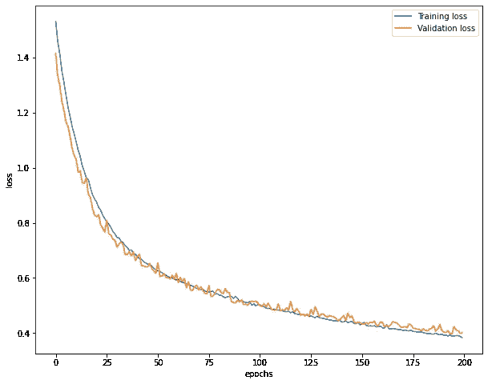
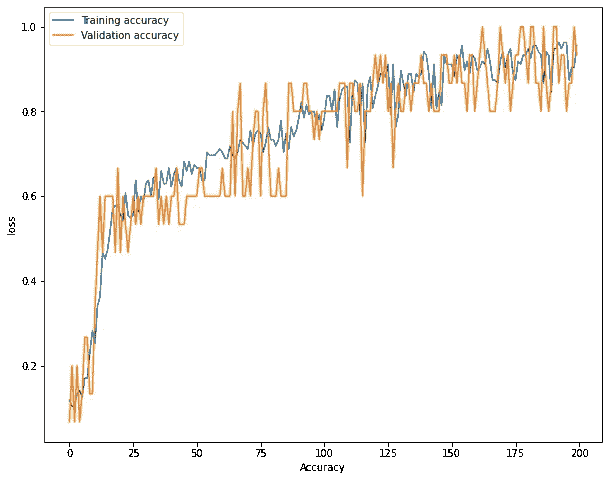

# 用于深度学习的 tensor flow 2—逻辑回归(Softmax)

> 原文：<https://medium.com/analytics-vidhya/tensorflow-2-for-deep-learning-logistic-regression-softmax-bebf4f7e997c?source=collection_archive---------23----------------------->


*注:tensorflow 2 的程序文件可以在-*[*【https://github.com/ashwinhprasad/Tensorflow-2.0】*](https://github.com/ashwinhprasad/Tensorflow-2.0)找到

逻辑回归用于分类任务，本博客将带您通过 Tensorflow 2 实现逻辑回归。这篇博文不会涉及逻辑回归的理论，理论是前提。

# **让我们跳到代码部分:**

## 1.导入数据集

> 本例中使用的数据集是 sklearn 库中的 iris 数据集。
> 我们正在导入数据集，并以熊猫数据帧的形式存储它

```
#importing the libraries
import numpy as np
import tensorflow as tf
import pandas as pd
import matplotlib.pyplot as plt
import seaborn as sns#importing the dataset
from sklearn.datasets import load_iris
data = load_iris()
x = data['data']
y = data['target']dataset = pd.DataFrame(data=np.concatenate((x,y.reshape(-1,1)),axis=1),columns=['sepal length','sepal width','petal length','petal width','target'])
```

## 2.列车测试分离

> 将数据集拆分为训练集和测试集，用于模型的未来分析

```
#train, test split
from sklearn.model_selection import train_test_split
x_train,x_test,y_train,y_test = train_test_split(x,y,test_size=0.1,shuffle=True)
```

## 3.使用 keras functional API 的模型架构和培训

> Keras Functional API 是顺序 API 的更好替代方案。它可以用于创建具有多个输入和多个输入以及复杂操作的模型。
> 对于逻辑回归，我们可以使用 softmax 或 sigmoid 激活函数作为最终层。我使用了 softmax，因为输出只能是 3 种植物中的任何一种。
> 
> 注意:这不是纯粹的逻辑回归，因为我们在最后一层使用 softmax 激活。最后一层用 sigmoid 代替 softmax 可以实现逻辑回归。结果不会有太大的不同

```
#model (Keras - Fuctional API)
i = tf.keras.layers.Input(shape=(4))
X = tf.keras.layers.Dense(3,activation=tf.keras.activations.softmax)(i)
model = tf.keras.models.Model(i,X)#compile and fit the model
model.compile(optimizer=tf.keras.optimizers.SGD(learning_rate=0.01),loss=tf.keras.losses.sparse_categorical_crossentropy,metrics=['accuracy'])
train = model.fit(x_train,y_train.reshape(-1),validation_data=(x_test,y_test.reshape(-1)),epochs=200)
```

## 4.模型性能

> 使用图来分析模型的性能。该模型的精确度非常高

```
#plotting loss over epochs
plt.figure(figsize=(10,8))
plt.plot(train.history['loss'],label='Training loss')
plt.plot(train.history['val_loss'],label='Validation loss')
plt.xlabel('epochs')
plt.ylabel('loss')
plt.legend()#plotting accuracy over epochs
plt.figure(figsize=(10,8))
plt.plot(train.history['accuracy'],label='Training accuracy')
plt.plot(train.history['val_accuracy'],label='Validation accuracy')
plt.xlabel('Accuracy')
plt.ylabel('loss')
plt.legend()
```



# 结论

从上面的可视化来看。我们可以断定我们的模型是有效的。
逻辑回归是我们可以用于分类的强大工具，这就是如何使用 tensorflow 2 实施逻辑回归。