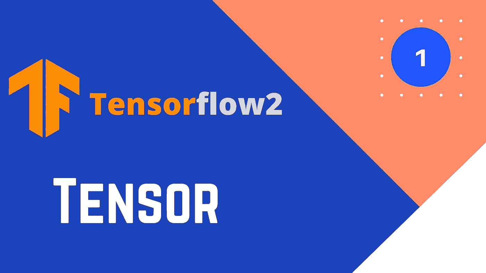

# 用于深度学习的 Tensor flow 2—张量基础知识

> 原文：<https://medium.com/analytics-vidhya/tensorflow-2-for-deep-learning-tensor-basics-9b38bf899929?source=collection_archive---------8----------------------->



# 什么是张量流？

Tensorflow 是一个深度学习库，它有许多内置的类和函数，允许您轻松执行这些复杂的深度学习矩阵乘法和梯度计算。tensorflow 背后的主要目标是使开发机器学习模型更容易，并将其用于生产环境。

# Tensorflow 2 相对于第一版的优势

众所周知，tensorflow 的更新版本允许用户轻松地创建模型，而 tensorflow 的第一个版本则非常困难。

# 装置

你可以直接使用 google colab 的 tensorflow(我更喜欢这个),或者为 windows 用户输入
“pip install tensor flow ”,为 linux 用户输入
“pip 3 install tensor flow 2”

# 张量基础

张量就是简单的 n 维数组。矩阵、向量、标量都属于术语**“张量”。**

1.  **导入张量流**

```
#importing the libraries
import tensorflow as tf
import numpy as np
```

每个 python 库的第一件事就是导入它

**2。标量、矢量和矩阵**

标量是 0 维张量，向量是 1 维张量，矩阵是多维张量。标量、向量和矩阵可以用函数 constant 在 tensorflow 中创建。

```
#scalars in tensorflow
a = tf.constant(1)
print(a.numpy())#vectors in tensorflow
list1 = [1,2,3,4,5]
arr1 = np.array([6,7,82,4,7])
tensor1 = tf.constant(list1,dtype=tf.int64)
tensor2 = tf.constant(arr1,tf.int64)
print(tensor1.numpy(),"\n",tensor2.numpy())**output:
1** [1 2 3 4 5] 
[ 6  7 82  4  7]
```

如上所示，普通的 python 整数或列表可以用来创建张量流标量或向量。

```
#matrices in tensorflow
mat1 = tf.constant([[1,2,3],
                    [4,5,6],
                    [7,8,9]])
mat1.numpy()**output:** array([[1, 2, 3],
       [4, 5, 6],
       [7, 8, 9]], dtype=int32)
```

要在 tensorflow 中定义矩阵张量，只需使用如上所示的 2 维 python 列表

**3。张量上的算术运算**

```
#tensor operations
print((tensor1 + tensor2).numpy())
print((tensor1 - tensor2).numpy())
print((tensor1 * tensor2).numpy())
print((tensor1 / tensor2).numpy())**output:** [ 7  9 85  8 12]
[ -5  -5 -79   0  -2]
[  6  14 246  16  35]
[0.16666667 0.28571429 0.03658537 1\. 0.71428571]
```

*注:。张量末尾的 numpy()将张量转换为 numpy 数组*

**tensor flow 中的广播** 广播允许多个大小的张量之间的交互。
有关广播的更多详情，请参考我在 Medium 上的 Pytorch 博客

```
#broadcasting 
print(mat1 + 5,"\n\n")
print(mat1 + [2,3,4])**output:** 
tf.Tensor(
[[ 6  7  8]
 [ 9 10 11]
 [12 13 14]], shape=(3, 3), dtype=int32) 

tf.Tensor(
[[ 3  5  7]
 [ 6  8 10]
 [ 9 11 13]], shape=(3, 3), dtype=int32)
```

# 结论

因此，TensorFlow 是一个高级库，它使深度学习变得更容易，以上是 tensorflow 的一些基础知识。关于广播的更多细节，请参考 PyTorch 上的前几篇博文。

# 谢谢你