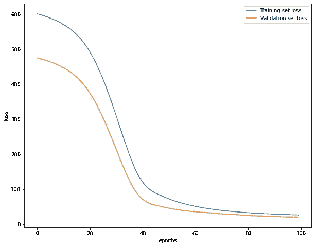

# 用于深度学习的 tensor flow 2-人工神经网络

> 原文：<https://medium.com/analytics-vidhya/tensorflow-2-for-deeplearning-artificial-neural-networks-8ec72b36f493?source=collection_archive---------14----------------------->


*注:代码文件将在:*[*https://github . com/ashwinhprasad/tensor flow-2.0/blob/master/TF2-(4)-安/TF2-安斯. ipynb*](https://github.com/ashwinhprasad/Tensorflow-2.0/blob/master/TF2-(4)-ANN/TF2-ANNs.ipynb) 获得

# 介绍

人工神经网络是传统的神经网络，这意味着在输入和输出层之间有多于或等于一层。这允许模型适应非线性并形成复杂的函数，这使得它在现实生活中有用。

这篇博文不仅仅涉及 tensorflow 2 的前馈或人工神经网络的实现，也不涉及人工神经网络的理论部分。


# 跳到代码

最好看看人工神经网络在现实生活中是如何使用的，以便更好地理解它

## 1.准备数据集

> 我们将使用来自 sklearn 的波士顿房价数据集。导入数据集后，我将它转换为 pandas 数据框架，并删除一些似乎不必要的列，以创建一个能很好地概括该数据的模型。我删除了 Tax 和 Dis 专栏，因为我已经做了一些数据分析，这对于这篇博文是不必要的

```
*#importing the libraries* **import** **tensorflow** **as** **tf
import** **numpy** **as** **np
import** **pandas** **as** **pd
import** **seaborn** **as** **sns
import** **matplotlib.pyplot** **as** **plt***#importing the dataset* 
**from** **sklearn.datasets** **import** load_boston
dataset = load_boston()# Converting to Pandas DataFrame
data = pd.DataFrame(dataset['data'],columns=['CRIM', 'ZN', 'INDUS', 'CHAS', 'NOX', 'RM', 'AGE', 'DIS', 'RAD',
        'TAX', 'PTRATIO', 'B', 'LSTAT'])
target = pd.Series(dataset['target'],name='price')
data = pd.concat([data,target],axis=1)
data.head()# dropping unnecessary values
*#removing unwanted columns*
data.drop(['TAX','DIS'],axis=1,inplace=**True**)
```

## 2.列车测试分离

> 将数据集分成训练集和测试集总是有用的，以便在新的不熟悉的数据上测试模型的性能。

```
*#splitting into training and test set* **from** **sklearn.model_selection** **import** train_test_split
x_train, x_test, y_train, y_test = train_test_split(data.drop(['price'],axis=1),data['price'],test_size=0.15)*#converting to numpy* 
x_train = np.array(x_train)
y_train = np.array(y_train)
x_test = np.array(x_test)
y_test = np.array(y_test)*#normlizing the inputs*
**from** **sklearn.preprocessing** **import** StandardScaler
sc = StandardScaler()
x_train = sc.fit_transform(x_train)
x_test = sc.transform(x_test
```

## 3.Keras 功能 API

> 在线性回归笔记本中，我使用了功能有限的顺序层，实际上我绝不会将它用于大多数事情，而是始终坚持使用 keras Functional API，它允许定义复杂的模型


> 以下是如何使用 Keras Functional API 创建模型。
> 在这里，我们基本上定义了所需层的类型，并且我们定义了每一层用“()”括起来的层的输入。这个模型有 3 个隐藏层。
> **密集**是指普通的一层，有一堆神经元。您可以在 Dense 中指定该层的神经元数量和激活函数。

```
*#creating the model*
i = tf.keras.layers.Input(shape=(x_train.shape[1]))
fc1 = tf.keras.layers.Dense(10,activation=tf.keras.activations.relu)(i)
fc2 = tf.keras.layers.Dense(12,activation=tf.keras.activations.relu)(fc1)
fc3 = tf.keras.layers.Dense(20,activation=tf.keras.activations.relu)(fc2)
out = tf.keras.layers.Dense(1)(fc3)

model = tf.keras.models.Model(i,out)
```

## 4.训练神经网络

> 由于这是一个回归问题，我将适当的损失函数定义为均方误差，将优化器定义为 ADAM 和 AM 在训练集上训练模型，并通过测试集作为验证数据。

```
*#optimizers and loss function*
model.compile(optimizer=tf.keras.optimizers.Adam(learning_rate=0.001),loss=tf.keras.losses.mse)*#fitting the model to the data* train = model.fit(x_train,y_train,validation_data=(x_test,y_test),epochs=100,batch_size=128)
```

## 5.模型分析



> 绘制训练集损失和测试集损失，以检查模型是否有任何偏差或差异

```
*#loss over epochs*
plt.figure(figsize=(10,8))
plt.plot(train.history['loss'],label="Training set loss")
plt.plot(train.history['val_loss'],label="Validation set loss")
plt.xlabel('epochs')
plt.ylabel('loss')
plt.legend()*#predictions vs actual*
plt.figure(figsize=(10,8))
plt.plot(y_test,label="original targets")
plt.plot(y_pred,label="predicted targets")
plt.legend()
plt.xlabel('examples')
plt.ylabel('predictions')
```


# 结论

从上面的图中可以明显看出，该模型很好地适应了训练集，并且具有很好的泛化能力。这就是你如何用 tensorflow 2 实现一个常规的人工神经网络。

## 谢谢你