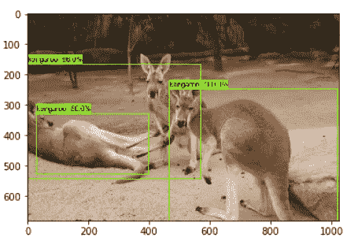

# 使用自定义数据集的 TensorFlow 2 对象检测 API

> 原文：<https://medium.com/analytics-vidhya/tensorflow-2-object-detection-api-using-custom-dataset-745f30278446?source=collection_archive---------1----------------------->

## 关于在自定义数据集上使用 TF2 对象检测 API 的所有知识，包括面临的常见问题及其解决方案

***在这里，您将一步一步地使用 TF2 对象检测 API 在自定义数据集上执行对象检测，以及一些问题和解决方案。***

在[袋鼠数据集](https://www.kaggle.com/astaroth88/kangaroo-detection4)上使用 TF2 对象检测 API 进行对象检测