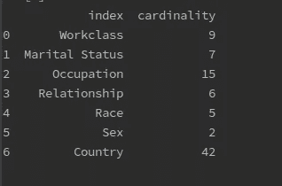

# Tensorflow 2.0 分类特征嵌入教程

> 原文：<https://medium.com/analytics-vidhya/tensorflow-2-tutorial-on-categorical-features-embedding-93dd81027ea9?source=collection_archive---------2----------------------->

## 分类特征嵌入综合指南


## 简介:

众所周知，数据准备可能占交付真实 ML 产品所需时间的 80%。此外，处理分类特征是一件有点棘手且耗时的事情，尤其是在基数较高的情况下。当您拥有超过 1000 个类别的要素，并且需要在此基础上构建模型时，每个数据科学家都需要选择最佳方法来将这些分类要素呈现给模型。举几个常见的例子:

*   因子分解，其中每个唯一的类别被分配一个唯一的标签。
*   一个热编码，这个方法产生一个长度等于数据集中类别数的向量。如果一个数据点属于第 *i* 类，那么你会在第 *i* 类中找到 1，而在其他地方找到 0(这会让你处于高维数据的情况)
*   目标编码(有点棘手，因为它可能会导致过度拟合)，包括用目标变量的平均值对每个值进行编码(必须在交叉验证方案中完成)

在本教程中，我们将学习另一种非常有效的处理分类特征的方法(特别是在高基数的情况下),为此我们将使用 Tensorflow 2.0 所以一定要升级才能跟进。

数据集:我们将致力于一个真实世界的人口普查收入数据集，也称为*成人数据集*，可在 *UCI ML 知识库*中获得，在那里我们将预测人们的潜在收入是否超过 5 万美元/年。

## 分类特征嵌入:

如果你以前从事过 NLP 项目，那么你很可能会熟悉单词 Embedding。如果不是，我来解释一下:

> 嵌入意味着用一个向量，一个投影来表示一些东西。

就这么简单，但问题是，我们如何得到这个向量？这就是深度神经网络派上用场的地方。

说够了，现在让我们说代码:

1 —首先，我们将加载数据(我们不必下载数据，只需安装 [shap](https://pypi.org/project/shap/) 包，即可从中访问数据) :

```
import shap

data,labels = shap.datasets.adult(display=True)
```

2 —接下来，让我们通过运行这行代码来检查我们的分类特征:

```
data.select_dtypes('category').columns
```

所以，我们的分类特征是:“工作阶级”、“婚姻状况”、“职业”、“关系”、“种族”、“性别”、“国家”。

2.1 —出于好奇，让我们也通过运行以下代码来检查我们的数字特征:

```
data.select_dtypes('number').columns
```

输出是:“年龄”、“教育人数”、“资本收益”、“资本损失”、“每周小时数”。

3-现在，让我们检查分类特征的基数(每个特征包含多少个唯一值) :

```
data[data.select_dtypes('category').columns].nunique().reset_index(n
ame='cardinality')
```



功能基数

因此，我们似乎没有一个非常高的基本特征(超过 100 个类别)，但我们有 42 个类别的“国家”，还有 15 个类别的“职业”。

然而，本教程适用于任何数量。

4-现在让我们开始构建我们的模型:正如之前强调的，该项目是关于根据一系列特征预测一个人将获得多于还是少于 5 万美元，为此我们将在 Tensorflow 2.0 中构建一个神经网络，使用分类和数字特征。

## 我们将做什么:

我们要做的是建立一个多输入的神经网络，每个分类特征有一个输入，至于数字特征，所有这些都来自一个单一的输入。让我进一步解释一下:

我上面说的意思是这样的:

*   首先我们需要嵌入分类特征(用向量表示分类特征的每个唯一值)，
*   为此，我们将为每个分类特征定义一个嵌入模型(它是一个输入层加上一个嵌入层)，
*   至于其他数字特征，我们将把它们输入到我们的模型中，就像我们通常从最后一个输入层对任何常规深度学习网络所做的那样。

所以总共将有数量 _ 分类 _ 特征+1 个模型(数量 _ 分类 _ 特征嵌入模型+一个身份模型)。

一旦我们定义了这些模型，由于我们最后需要一个模型，我们将把它们连接成一个层。

再说一遍，说够了，让我们说代码:

1 —首先，我们将构建这个小函数，它将分解我们的分类特征，因为 deepnet 需要数字而不是字符串:

```
def prepar_data_set(data_df):
    categoy_features = data_df.select_dtypes('category').columns
    numerique_features = data_df.select_dtypes('number').columns
    for col in categoy_features:
        encoder = LabelEncoder()
        data_df[col] = encoder.fit_transform(data_df[col])
    return data_df,categoy_features,numerique_features
```

该函数将获取分类特征，并将它们逐个编码为整数，并将返回 3 个内容:(I)编码的数据，(ii)分类特征列表，以及(iii)数字特征列表。

2 —现在我们已经准备好了训练数据和标签，让我们构建模型的架构:

让我们打破上面代码平静:

2.1 —如您所见，对于我们分类特征中的每个类别，我们定义了一个接受形状 1 输入的输入层(因为我们的输入将是类别的值，它只是一个数字)。

2.2 —我们给它一个名字，这样我们就可以正确地向它发送正确的数据(非常实用的做法，我推荐)。

2.3 —然后我们定义我们的嵌入层，它基本上是一个具有许多行和列的矩阵。

2 . 3 . 1-行数将是分类特征的基数(有多少唯一值)，

2 . 3 . 2-列数将是代表这些唯一值(即要调整的参数)的向量的借项。对于本教程，我们选择 200(一个非常常见的数字开始)。

2.3.2 —注意我们将层设置为可训练。因为我们已经用对我们没有价值的随机数初始化了它，我们需要它在训练期间保持更新(反向传播)。

2.3.3 —最后，我们必须将输出整形为一个一维数组，它基本上具有嵌入向量的 lent 的形状。

因此，这就是我们将如何定义我们的 number _ of _ categorical _ feature 嵌入模型(在这种情况下，7 个分类特征意味着 7 个嵌入模型)。

2.4 —至于我们的数字特征，将像我们通常做的那样，从它们自己的输入层提供给它们，就像这样:

```
num_input = tf.keras.layers.Input(shape=(len(num_features)),\
                                  name='input_number_features')# append this model to the list of models
models.append(num_input)
# keep track of the input, we are going to feed them later to the #final model
inputs.append(num_input)
```

2.5 —现在我们有 8 个模型(7 个嵌入模型和 1 个身份模型)，并且我们都将它们附加到一个名为模型的列表中，让我们将它们连接到一个层中:

```
merge_models= tf.keras.layers.concatenate(models)
```

2.6 —现在我们有了一个层，我们可以在其上堆叠一个完全连接的层列表:

如您所见，我们在合并的模型上构建了两个完全连接的层，每个层有 1000 个单元。之后，我们添加了预测层，这些预测层将返回一个人拥有多于或少于 50K 美元的概率，最后，我们编译了我们的模型，以使用 **adam optimizer** 最小化交叉熵，并将准确性作为评估函数。

2.7 —现在，最后一件事是将数据输入到我们的模型中。

由于我们使用了多输入神经网络，因此最好将训练数据作为字典输入，其中键是输入层的名称，值是每个层的预期值。所以让我们这样做，这样你就能明白我的意思:

```
input_dict= {
    'input_Workclass':train["Workclass"],
    "input_Marital_Status":train["Marital Status"],
    "input_Occupation":train["Occupation"],
    "input_Relationship":train["Relationship"],
    "input_Race":train["Race"],
    "input_Sex":train["Sex"],
    "input_Country":train["Country"],
    "input_number_features": train[num_featture]
}
```

如您所见，像这样，我们 100 %确定我们正在向正确的模型发送正确的数据。

2.8 —就这样，让我们来拟合我们的模型:

```
model.fit(input_dict,labels,epochs=50,batch_size=64)
```

瞧，我们到了本教程的结尾，我希望它足够清晰和实用。

PS:关于训练的最后一点意见:神经网络对具有大数字的特征高度敏感，就像在这个数据集的情况下，如果保持原样，它将不会学习任何东西，您将必须使用以下代码在-1 和 1 之间缩放您的数字特征:

```
from sklearn.preprocessing import StandardScaler
scaler = StandardScaler()
train[num_featture] = scaler.fit_transform(train[num_featture])
```

我希望你喜欢这个教程，更多的即将到来，敬请期待。

完整代码回购链接:[https://github . com/oussamaErra/TF-2-教程-分类-特征-嵌入](https://github.com/oussamaErra/tf-2-tutorial-categorical-features-embedding)

如果你觉得这个教程很好很实用，一定要去 [**关注我**](/@errabia.oussama) 关于 Medium 的更多实用数据科学和人工智能的好东西。

如果你对我有任何问题，你可以直接通过 Linkedin 或 gmail 联系我

# 关于我

我是首席数据科学家@ Clever Ecommerce Inc，我们利用基于人工智能的强大技术，帮助企业创建和管理谷歌广告活动。

你可以通过 Linkedin 或 Gmail:errabia.oussama@gmail.com 联系我。