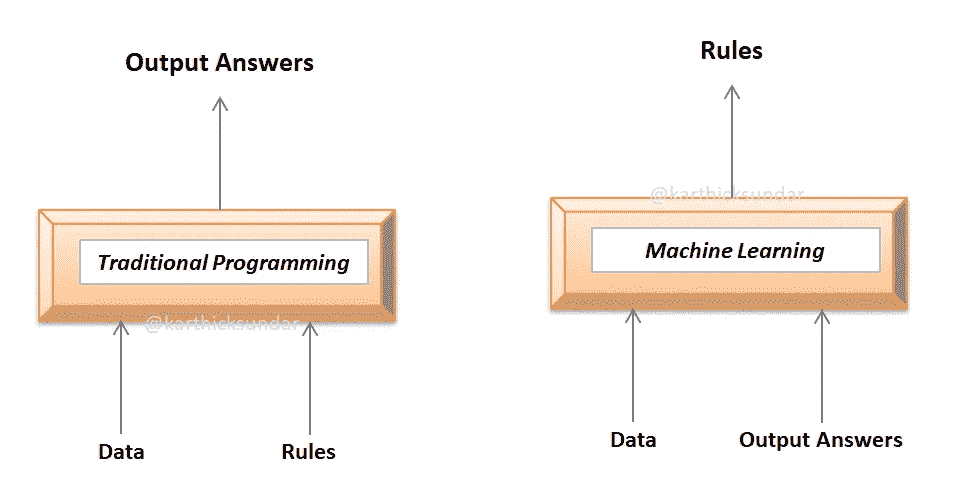

# TensorFlow 基础到精通系列第 1 部分

> 原文：<https://medium.com/analytics-vidhya/tensorflow-basics-to-mastery-series-part-1-bea59468f937?source=collection_archive---------19----------------------->

> 本系列将掌握您使用 google 的 TensorFlow 框架构建神经网络的技巧

深度学习(DL)所能做的所有令人惊叹的工作都是在相当长的一段时间内创造所有它能创造的空气，让人们疯狂。让我们停止谈论所有愚蠢的令人瞠目结舌的场景，我们做的每一个 DL 突破性新闻滚动。是时候用这块蛋糕弄脏我们的手，体验它的味道，让它在卡片上物有所值了

让我们首先列出一些流行的深度学习工具/框架

研究人员通过在一些 DL 框架上构建一些高级包装器来构建神经网络，即使对其细微差别的了解很少，也使我们的生活变得简单

这个系列将在 TensorFlow 上从基础一直到精通水平。手指交叉，期待一些令人兴奋的学习，没有任何进一步的行动，让我们开始这个新的范例。

## 快速回到编程历史(传统编程与机器学习编程):

**传统编程**是指我们试图通过编纂关于数据的规则(已知:规则和数据，未知:输出答案)来解决问题并获得未知结果

**机器学习**是我们让系统通过输入数据和答案(已知:输出答案和数据，未知:规则)来找出规则

上图展示了传统编程和机器学习的对比

现在让我们来看看传统编程的优缺点

优点——为每一个独特的场景建立基于观察的手工规则

缺点——当你不得不为每一个可能的场景制定规则时，这变得非常困难和混乱(在解决任何现实世界的问题时通常会有很多规则)

相反，我们使用**机器学习**方法，教给机器每一种可能的场景，让它用数据和相应的标签找出所有可能的规则。

***快速走进机器学习的基础知识..***

机器学习学习和理解数据中的模式，并试图在没有任何显式编码的情况下提出规则。这是这个全新范例中最激动人心的部分。

一旦从提供的数据中学习了**假设函数**(规则)。例如:如果 y = 5x + 10 是学习到的假设函数，那么我们必须评估假设函数有多好，它转换了模型的优良因子。在此基础上，我们可以决定是坚持相同的假设函数，还是对其进行调整，以减少之前公式化的假设函数所造成的误差。

**损失函数**帮助我们评估假设函数的拟合优度。这个损失函数是在我们从数据中得到的实际输出 *Y* 和我们的假设函数产生的 *Yhat* 之间测量的。一些损失函数是

—均方误差(MSE)

—均方根误差(RMSE)

—平均绝对误差(MAE)

—平均绝对百分比误差(MAPE)

利用上述方法之一(根据我们试图解决的问题类型适当选择)来计算公式化假设函数的损失/误差。一旦我们计算出损失/误差，我们就需要想办法减少它。这是在一个叫做**梯度下降**的功能的帮助下完成的。同样，有各种利用梯度下降来减少误差的方法，我们将在本系列中讨论这些方法。

**机器学习&深度学习:**

深度学习是机器学习的一个子集。在深度学习中，我们试图复制人类大脑与神经元合作的方式。因此我们建立的模型称为 ***神经网络*** *。*

区别传统机器学习模型和深度学习模型的一个主要因素是特征选择。在经典的机器学习方法中，我们选择要训练的特征，假设函数为我们挑选的每个特征制定重要性。但是在深度学习神经网络方法的情况下，没有特征选择层，并且整个数据被消耗。这使得它们有了一个昵称*黑匣子。*

该图显示了所谓的神经网络黑盒中的组件，如层、神经元和权重(箭头)

现在让我们快速看看神经网络的基本单元，从基本的 Keras 实现开始

—神经元:输入/计算值的占位符

—层:特定层级中的一组神经元

—权重:定义神经元在预测中帮助接近实际数据的重要性

—损失:实际数据输出和模型/网络输出之间的差异

—优化器:减少损失/错误的方法或功能

## “Keras”——tensor flow 的高级 API

如前所述，Keras 是一个高级包装器或 API，以 TensorFlow/Theano/CNTK 作为其粒度级别来构建神经网络

> 神经网络只不过是按逻辑排列的一组功能，它可以学习嵌入数据中的模式。

安装 TensorFlow，然后安装其 API Keras

在 Keras 中，机器学习模型中发生的所有数学运算都可以作为函数(由研究人员编写的优化代码)使用。

让我们使用 TensorFlow 和 Keras API 构建一个简单的模型

x 和 y 分别是输入和输出标签。如果我们通过观察 x 和 y 之间的关系做一个简单的数学运算

***y = 3x+1***

现在，我们将尝试将生物大脑中发生的数学运算复制到人工神经网络中。首先让我们铺设网络结构

1.  首先导入 TensorFlow 和 Numpy 库。

2.Keras **顺序**调用被定义为一个接一个地创建神经网络层。

3.接下来，我们定义**密集**层，它成为我们的第一个只有一个神经元的层，因为我们每个数据点的输入长度是 1。

4.我们定义**损失函数**为 MSE

5.“随机梯度下降”**优化器**被初始化以减少损失

现在，我们的架构(层、损失函数、优化器等)都设置好了，可以根据我们的数据(x & y)进行训练

6.Model.fit 方法调用将开始为我们的模型训练 300 个时期

现在让我们看看我们的网络从我们的数据中学到了多少

尝试预测一个新的数据点，比如说 5 应该产生 16(即 3*5 +1)。

该模型输出 15.98，非常接近 16。就是这样！！我们已经尝试并复制了人类系统外神经元的生物行为:)

我们将很快在本系列的第 2 部分再见，在那之前继续努力吧！！！！