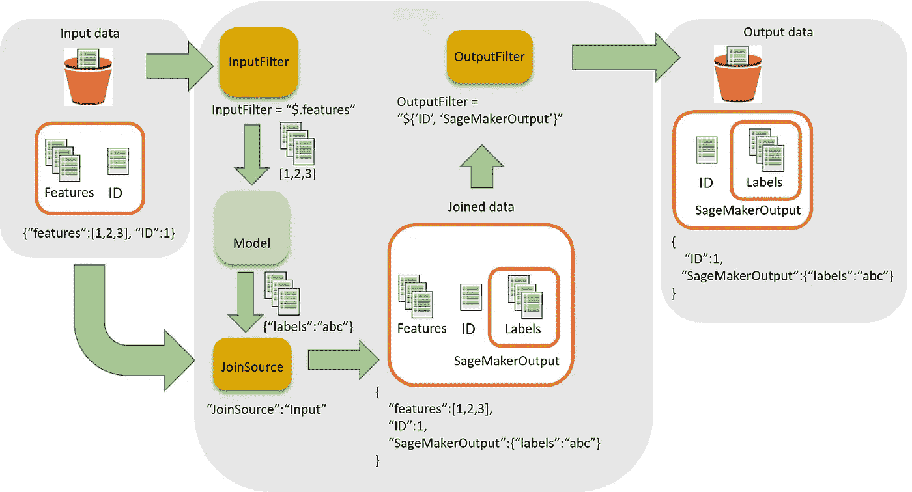

# 使用 sagemaker-spark-sdk 的 TensorFlow 批量推理

> 原文：<https://medium.com/analytics-vidhya/tensorflow-batch-inference-using-sagemaker-spark-sdk-6ccb01f2e29c?source=collection_archive---------14----------------------->

[](https://github.com/aws/sagemaker-spark) [## aws/sagemaker-spark

### SageMaker Spark 是亚马逊 SageMaker 的开源 Spark 库。使用 SageMaker Spark，您可以构建 Spark ML…

github.com](https://github.com/aws/sagemaker-spark) 

我最近试图使用 sagemaker 的 [spark-sdk](https://github.com/aws/sagemaker-spark) 对其进行批量推理。这样做的好处是，它允许直接在 spark 数据帧上执行推理，因此我们可以将推理与同一作业中的其他转换任务结合起来。

为了实现这一点，我们必须创建一个定制的[序列化器](https://github.com/aws/sagemaker-spark/tree/master/sagemaker-spark-sdk/src/main/scala/com/amazonaws/services/sagemaker/sparksdk/transformation/serializers)来将输入行序列化为推理容器所期望的格式，然后[反序列化](https://github.com/aws/sagemaker-spark/tree/master/sagemaker-spark-sdk/src/main/scala/com/amazonaws/services/sagemaker/sparksdk/transformation/deserializers)从预测中得到的响应。

我很惊讶，因为我找不到任何简单的解决方案或指南来说明如何为非常简单的推理工作编写这个定制的序列化器和反序列化器(从这里开始的 SerDe)。此外，sagemaker 不提供开箱即用。

这篇博客将试图介绍 sagemaker-spark-sdk 的实现和我所了解的东西。

对于我的实现，我试图从预先训练的 tensorflow 模型中创建一个 [SageMakerModel](https://aws.github.io/sagemaker-spark/index.html#com.amazonaws.services.sagemaker.sparksdk.SageMakerModel$) 。我决定使用 sagemaker 提供的[推理容器。](https://github.com/aws/sagemaker-tensorflow-serving-container)

提供推理的数据框是一个简单的二维数字数据框，其中每一行对应一个特征向量。

创建 SageMakerModel

现在的问题是，如何为数据帧编写 SerDe。

从 SerDe 的特点中，我们可以看到几个有用的方面:

[RequestRowSerializer](https://github.com/aws/sagemaker-spark/blob/master/sagemaker-spark-sdk/src/main/scala/com/amazonaws/services/sagemaker/sparksdk/transformation/RequestRowSerializer.scala) :在实现时要注意的主要部分是定义 **contentType** (服务容器在执行推理时期望的格式)和 **serializeRow()** (它接受每一行并将其转换为以字节为单位的 contentType 的单个实体)。

[ResponseRowDeserializer](https://github.com/aws/sagemaker-spark/blob/master/sagemaker-spark-sdk/src/main/scala/com/amazonaws/services/sagemaker/sparksdk/transformation/ResponseRowDeserializer.scala) :这里要实现的主要部分是**模式**(放入数据帧时推理的预期输出格式)；**接受**(服务容器应该返回得分值的内容类型)和**反序列化响应()**(将得分值转换为 Row 对象上的迭代器的方法，其中每行包含单个特征向量的输出得分)

contentType 和 accepts 的限制是从 serving container 应用的，它可以通过编写我们自己的推理容器来扩展(可能在另一篇文章中)。

这里需要注意的是，sagemaker-spark-sdk 会自动创建一个 RequestBatchIterator，并使用序列化程序在一次操作中序列化多个请求。查看请求批处理迭代器，我们可以看到它使用 serialize 创建了单个[请求体](https://github.com/aws/sagemaker-spark/blob/master/sagemaker-spark-sdk/src/main/scala/com/amazonaws/services/sagemaker/sparksdk/transformation/util/RequestBatchIterator.scala#L107-L125)，在反序列化时，[它尝试获取 row 对象的迭代器，其中每一行都是给定输入特性](https://github.com/aws/sagemaker-spark/blob/master/sagemaker-spark-sdk/src/main/scala/com/amazonaws/services/sagemaker/sparksdk/transformation/util/RequestBatchIterator.scala#L135-L158)的预测值

考虑到这些因素，我们可以如下实现 SerDe:

1.  Serialize:我们正在创建一个长度为(# input features)的特征向量，并将第一个“input feature”值以双精度形式放入该向量。然后我们将它转换成 CSV 字符串。这里需要注意的重要一点是，在结尾有一个“\n”。鉴于请求将被批处理，这是必需的。然后我们把它转换成字节数组。内容类型设置为 CSV，因为 tensorflow 服务容器接受该格式。
2.  反序列化:唯一的响应格式是 json 和 jsonlines。对于这个例子，我们使用 json。给定输入格式，响应将类似于`{ "predictions": [[1],[2],[3]...] }`,因此我们迭代外部序列，并将内部序列转换为一行(DoubleType ),这是我们的**模式所期望的。**最后将序列转换成可迭代的。

这就完成了实现，我们的模型对象将看起来像这样:

要对输入数据帧进行评分，我们只需:

```
val scoredDF: DataFrame = model.transform(inputDF)
```

一旦我们完成了评分，我们就可以销毁创建的资源:

```
val sagemakerClient = AmazonSageMakerClientBuilder.defaultClient
val cleanup = new SageMakerResourceCleanup(sagemakerClient)
cleanup.deleteResources(model.getCreatedResources)
```

这就完成了使用 tensorflow 的自定义 SerDe 的模型评分。