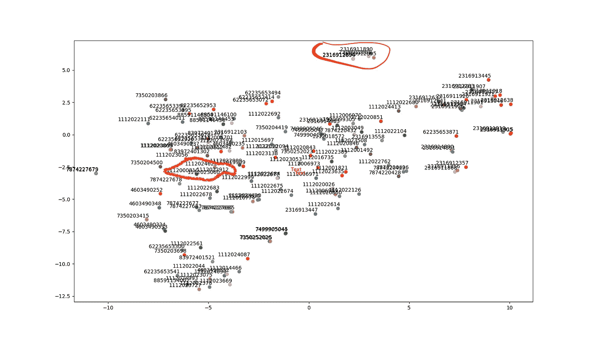

# 张量流嵌入

> 原文：<https://medium.com/analytics-vidhya/tensorflow-embedding-36ec186dbeb6?source=collection_archive---------24----------------------->


萨法尔·萨法罗夫在 [Unsplash](https://unsplash.com?utm_source=medium&utm_medium=referral) 上拍摄的照片

感恩节假期即将到来(下周四)！我想在网上给我买双鞋。我想到了一个问题:网上商店是如何将相似的商品组合在一起的？也许用了一些机器学习的方法？我决定去探索…！

经过一些研究，我认为句子 2 vec 可能是解释项目相似性的一个好选择。https://tfhub.dev/google/universal-sentence-encoder/1 和 t-SNE 可视化将有助于显示项目的相似性。

我从网上得到一些吸尘器的物品/upc 描述。我的代码如下:

```
**from** absl **import** logging

**import** tensorflow **as** tf
**import** tensorflow_hub **as** hub
**import** matplotlib.pyplot **as** plt
**import** numpy **as** np
**import** os
**import** pandas **as** pd
**import** re
**import** seaborn **as** sns
**import** nltk
**from** sklearn.manifold **import** TSNE
**import** os
os.environ[**'KMP_DUPLICATE_LIB_OK'**]=**'True'** df= pd.read_csv(**"vacumn_upcs_desc.csv"**, encoding=**"ISO-8859-1"**)
print(df.shape)
df = df.drop_duplicates(subset=**'upc_nbr'**, keep=**"first"**)
df = df.reset_index(drop=**True**)
print(df.shape)
print(df.columns)

print(df.head(3))

print(df.iloc[ 3, :][**'upc_nbr'**])
print(**"index="**, df.loc[df[**'upc_nbr'**] == 1112000810].index)

*# print(type(df['value'].tolist()))* print(**"here 1"**)
module_url = **"https://tfhub.dev/google/universal-sentence-encoder/2?tf-hub-format=compressed"** *#@param ["https://tfhub.dev/google/universal-sentence-encoder/2", "https://tfhub.dev/google/universal-sentence-encoder-large/3"]
# Import the Universal Sentence Encoder's TF Hub module* embed = hub.Module(module_url)
print(**"here 2"**)

messages = df[**'value'**].tolist()
**with** tf.Session() **as** session:
  session.run([tf.global_variables_initializer(), tf.tables_initializer()])
  message_embeddings = session.run(embed(messages))
  print(**"correlation of messages:"**)
  print(np.inner(message_embeddings, message_embeddings))

  **for** i, message_embedding **in** enumerate(np.array(message_embeddings).tolist()):
    print(df.iloc[i,:])
    print(**"Message: {}"**.format(messages[i]))
    print(**"Embedding size: {}"**.format(len(message_embedding)))
    message_embedding_snippet = **", "**.join(
        (str(x) **for** x **in** message_embedding[:3]))
    print(**"Embedding: [{}, ...]\n"**.format(message_embedding_snippet))

**def** get_features(texts):
    **if** type(texts) **is** str:
        texts = [texts]
    **with** tf.Session() **as** sess:
        sess.run([tf.global_variables_initializer(), tf.tables_initializer()])
        **return** sess.run(embed(texts))

print(**"embedded..."**)
*#print(get_features(df.iloc[ 3, :]['value']))

# # pre-process/clean up texts* **def** remove_stopwords(stop_words, tokens):
    res = []
    **for** token **in** tokens:
        **if not** token **in** stop_words:
            res.append(token)
    **return** res

**def** process_text(text):
    text = text.encode(**'ascii'**, errors=**'ignore'**).decode()
    text = text.lower()
    text = re.sub(**r'http\S+'**, **' '**, text)
    text = re.sub(**r'#+'**, **' '**, text )
    text = re.sub(**r'@[A-Za-z0-9]+'**, **' '**, text)
    text = re.sub(**r"([A-Za-z]+)'s"**, **r"\1 is"**, text)
    *#text = re.sub(r"\'s", " ", text)* text = re.sub(**r"\'ve"**, **" have "**, text)
    text = re.sub(**r"won't"**, **"will not "**, text)
    text = re.sub(**r"isn't"**, **"is not "**, text)
    text = re.sub(**r"can't"**, **"can not "**, text)
    text = re.sub(**r"n't"**, **" not "**, text)
    text = re.sub(**r"i'm"**, **"i am "**, text)
    text = re.sub(**r"\'re"**, **" are "**, text)
    text = re.sub(**r"\'d"**, **" would "**, text)
    text = re.sub(**r"\'ll"**, **" will "**, text)
    text = re.sub(**'\W'**, **' '**, text)
    text = re.sub(**r'\d+'**, **' '**, text)
    text = re.sub(**'\s+'**, **' '**, text)
    text = re.sub(**r"li"**, **""**, text)
    text = re.sub(**r"br"**, **""**, text)
    text = re.sub(**r"ul"**, **""**, text)
    text = text.strip()
    **return** text
print(**"processed text..."**)
print(process_text(df.iloc[ 3, :][**'value'**]))

data_processed = list(map(process_text, df[**'value'**].values))
len(data_processed)

similarity_vectors = get_features(data_processed)

**def** cosine_similarity(v1, v2):
    mag1 = np.linalg.norm(v1)
    mag2 = np.linalg.norm(v2)
    **if** (**not** mag1) **or** (**not** mag2):
        **return** 0
    **return** np.dot(v1, v2) / (mag1 * mag2)

**def** test_similiarity(text1, text2):
    vec1 = get_features(text1)[0]
    vec2 = get_features(text2)[0]
    print(vec1.shape)
    **return** cosine_similarity(vec1, vec2)

print(**'test similarity ....'**)
print(test_similiarity(data_processed[0], data_processed[2]))

**def** semantic_search(query, data, vectors, df):
    query = process_text(query)
    print(**"Extracting features..."**)
    query_vec = get_features(query)[0].ravel()
    res = []
    **for** i, d **in** enumerate(data):
        qvec = vectors[i].ravel()
        sim = cosine_similarity(query_vec, qvec)
        res.append((sim, d[:100], i, df.iloc[ i, :][**'upc_nbr'**]))
    **return** sorted(res, key=**lambda** x : x[0], reverse=**True**)[0:4]

print(**"similarity-search..."**)

print(semantic_search(data_processed[102], data_processed, BASE_VECTORS,df))
*#67, 108, 133* **def** tsne_plot(base_vectors, upc_list):
    *"Creates and TSNE model and plots it"* labels = []
    tokens = []

    **for** i **in** range(len(upc_list)):
        tokens.append(base_vectors[i])
        labels.append(upc_list[i])

    tsne_model = TSNE(perplexity=40, n_components=2, init=**'pca'**, n_iter=2500, random_state=23)
    new_values = tsne_model.fit_transform(tokens)

    x = []
    y = []
    **for** value **in** new_values:
        x.append(value[0])
        y.append(value[1])

    plt.figure(figsize=(16, 16))
    **for** i **in** range(len(x)):
        plt.scatter(x[i], y[i])
        plt.annotate(labels[i],
                     xy=(x[i], y[i]),
                     xytext=(5, 2),
                     textcoords=**'offset points'**,
                     ha=**'right'**,
                     va=**'bottom'**)
    plt.show()

tsne_plot(similarity_vectors, df.upc_nbr)
```



我从 Bissell 挑选了一个 upc(编号= 1112023060 ),显示在左中位置的红色高亮圆圈中。相似 UPC 前 2 名分别是:1112024622 和 1112019909。为了验证，

*   1112023060 的描述是:比塞尔动力螺旋涡轮倒带无袋真空，1797:伟大的地毯，室内装潢和更多。螺旋分离系统。多气旋。自动软线倒带。涡轮刷工具:15 英寸宽的清洁路径，25 英寸的电源线 5 高度调节；大容量污物容器；螺旋污物分离系统；帮助过滤掉过敏原；型号# 1797。

1112024622 和 1112019909 的 upc 描述分别为:

*   BISSELL PowerForce Helix 无袋立式真空吸尘器，2191U:独家 Helix 性能系统；大容量污物罐；可清洗的过滤器；比塞尔无袋立式吸尘器包括除尘刷、缝隙工具和加长杆；仅重 12 磅；清洁路径宽度:13”；5 表面高度设置；
*   Bissell PowerForce Helix 无袋立式真空吸尘器，多种颜色:非常适合地毯、室内装潢等，5 种高度调节，Bissell PowerForce 立式真空吸尘器有一个大容量的灰尘容器，可清洗的过滤器，无袋立式真空吸尘器有各种颜色可供选择；独有的灰尘分离系统捕获更多细小灰尘；螺旋灰尘分离系统有助于扩展吸力和清洁性能。

在右上角红色突出显示的圆圈中，它显示 UPC 是 Hoover 品牌。

所以 sentence2vec 可以从文本描述中给我展示有效的相似条目。下一步，我将为每个 upc 添加更多的特性来生成精细的嵌入。