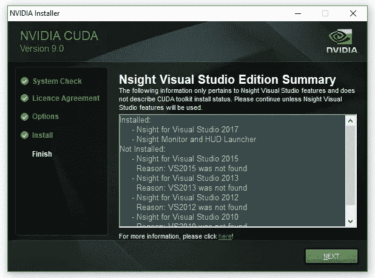

# tensor flow-使用 CUDA 和 CuDNN 安装 GPU

> 原文：<https://medium.com/analytics-vidhya/tensorflow-gpu-installation-with-cuda-cudnn-40fbd4477e7?source=collection_archive---------0----------------------->

来源:互联网

# 什么是张量流？

Tensorflow 是一个软件库或框架，由谷歌团队设计，以最简单的方式实现机器学习和深度学习概念。它结合了优化技术的计算代数，便于许多数学表达式的计算。

这是 TensorFlow 的官方网站:[www.tensorflow.org](https://www.tensorflow.org/)

现在让我们考虑张量流的以下重要特征:

*   它包括的一个功能，可以借助称为张量的多维数组轻松定义、优化和计算数学表达式。
*   它包括深度神经网络和机器学习技术的编程支持。
*   它包括对各种数据集的高度可扩展的计算特性。
*   TensorFlow 使用 GPU 计算，自动化管理。它还包括优化相同内存和所用数据的独特功能。

# TensorFlow 为什么这么受欢迎？

TensorFlow 是有据可查的，包括大量的机器学习库。它为此提供了一些重要的功能和方法。

TensorFlow 也被称为“谷歌”产品。它包括各种机器学习和深度学习算法。TensorFlow 可以训练和运行深度神经网络，用于手写数字分类、图像识别、单词嵌入和各种序列模型的创建。

# TensorFlow GPU 安装:

 [## 兼容性检查|张量流

检查 www.tensorflow.org](https://www.tensorflow.org/install/source) 

> **第一步:安装 Anaconda 框架**

在安装 TensorFlow 之前，我们需要在系统中安装 [Anaconda 框架](https://www.anaconda.com/products/individual)。

成功安装 anaconda 后，通过“conda”命令检查命令提示符。然后执行下面的命令创建一个虚拟环境，通过 anaconda 提示符安装 TensorFlow。环境设置成功后，激活 TensorFlow 模块非常重要。

conda create-name tensor flow python = 3 . 6 . 9(python 版本应高于 3.5)

康达激活张量流

下面这篇文章假设你已经在你的电脑上安装了一个兼容 CUDA 的 GPU

> **第二步:检查你需要安装的软件**

假设您的电脑上已经安装了 Windows，您将在这些步骤中安装的其他软件包括:-

*   Microsoft Visual Studio
*   NVIDIA CUDA 工具包
*   NVIDIA cuDNN
*   Tensorflow(有 GPU 支持)

> **第三步:下载微软 Visual Studio 2017**

Visual Studio 是 CUDA Toolkit 的先决条件，因为从中我们获得了所有的先决条件 C++库(用 C++进行桌面开发，用 C++进行移动开发)。visual studio 代码有不同的版本，但我们必须下载 [Visual Studio 社区版本 2017](https://visualstudio.microsoft.com/vs/older-downloads/) 。

安装 Microsoft visual studio 后，您将获得这种类型的界面，您必须选择几个 C++库并进行安装。

如果您试图在没有安装 Visual Studio 的情况下下载并安装 CUDA Toolkit for Windows，您会得到如图所示的消息。

> **第四步:下载适用于 Windows 的 CUDA 工具包**

这些 CUDA 安装步骤大致基于[Nvidia CUDA windows 安装指南](https://docs.nvidia.com/cuda/cuda-installation-guide-microsoft-windows/index.html)。CUDA 工具包(免费)可以从 Nvidia 网站[这里](http://developer.nvidia.com/cuda-downloads)下载。

在撰写本文时，CUDA 工具包的默认版本是 11.1。但是，您应该检查您的系统支持哪个版本的 CUDA Toolkit(只需在您的命令提示符 navidia-smi 中运行)。当你上 [Tensorflow 网站](https://www.tensorflow.org/install/gpu)时，Tensorflow 的最新版本需要的是 CUDA 10.2，而不是 CUDA 11.1。

CUDA 网站会显示最新的(目前是 v11.1)下载。请确保 Tensorflow 需要 CUDA 10.2。你可以从[这里](https://developer.nvidia.com/rdp/assets/cudnn-8.0-windows10-x64-v5.0-ga-zip)下载 CUDA 10.2。你需要注册下载旧版本。

用 exe[local]就行了

CUDA 安装程序解压到您的电脑上，完成后，NVIDIA CUDA Toolkit 安装将开始；你会收到一条大意如此的信息。整个安装过程中产生的 NVIDIA 安装程序窗口如图所示。

在上图所示的窗口中按下“下一步”,出现最终的安装窗口，如下图 13 所示，其中 NVIDIA 安装程序被标记为完成。

> **第五步:下载并安装 cuDNN**

安装了 CUDA 10.2 基础安装程序及其四个补丁后，下一步是找到 CuDNN 的兼容版本。根据 Tensorflow 网站上的信息，支持 GPU 的 Tensorflow 需要 8.0.4 版本的 cuDNN。

**1。正在下载 cuDNN**

为了[下载 CuDNN](https://developer.nvidia.com/cudnn) ，你必须注册成为 NVIDIA 开发者计划的成员(这是免费的)。

Fig 创建免费会员帐户以下载 cuDNN

当您创建一个帐户时，登录并填写一些关于您为什么使用该帐户的其他必需的详细信息，您会看到如图所示的下载页面。

由于我下载的是 CUDA 10.2，cuDNN 对应的版本是 8.0.4 版。选择 cud nn 8 . 0 . 4 版可下载如下名称的 zip 文件:

cud nn-10.2-windows 10-x64-V7 . zip

**2。解压 cuDNN 文件并复制到 CUDA 文件夹**

英伟达的[提供对 windows cuDNN 安装的支持，Tensorflow 网站上的说明也是如此；基于我对这些指令的实现，我以提炼的形式复制了这些指令。就我而言，我下载了 cuDNN。zip 文件。](https://docs.nvidia.com/deeplearning/sdk/cudnn-install/index.html#install-windows)

“把 cuDNN 拉开。zip”文件，因此包含所需 cuDNN 文件的解压缩文件夹结构现在是:-

解压缩后的 cuDNN 文件夹子目录中有三个文件，它们将被复制到 CUDA Toolkit 目录中。它们是 cudnn64_7.dll、cudnn.h 和:

***1。cudnn64_7.dll***

cudnn64_7.dll 可以在下载的 cudnn 文件的以下路径中找到:

<downloadpath>\ cud nn-10.2-windows 10-x64-v 7 . 5 . 0 . 56 \ cuda \ bin \ cud nn 64 _ 7 . dll</downloadpath>

假设您将 CUDA 10.2 安装到其默认路径，即以下默认路径:

C:\Program Files\NVIDA GPU 计算工具包\CUDA\v10.2

可以将 cudnn64_7.dll 文件直接复制到 CUDA 文件夹的 bin 文件夹路径中(注意:不需要新建任何子文件夹):

C:\Program Files\NVIDIA GPU 计算工具包\CUDA\v10.2\bin\

***2。cud nn . h***

与上面的 cudnn64_7.dll 文件一样，下载并解压缩 cudnn 文件夹后，可以在以下路径中找到头文件 cudnn64.h:

<downloadpath>\ cud nn-10.2-windows 10-x64-v 7 . 5 . 0 . 56 \ cuda \ include \ cud nn . h</downloadpath>

同样，假设您将 CUDA 10.2 安装到默认路径中，将 cudnn.h 直接复制到 CUDA 文件夹中，路径如下(不需要新建子文件夹):

C:\Program Files\NVIDIA GPU 计算工具包\CUDA\v10.2\include\

***3。cud nn . lib***

的。lib 文件 cudnn.lib 可以在下载的 cudnn 路径中找到:

<downloadpath>\ cud nn-10.2-windows 10-x64-v 7 . 5 . 0 . 56 \ cuda \ lib \ x64 \ cud nn . lib</downloadpath>

将 cudnn.lib 直接复制到 CUDA 文件夹中，路径如下:

C:\Program Files\NVIDIA GPU 计算工具包\CUDA\v10.2\lib\x64\

步骤 5.3:检查在 Windows 中设置了 CUDA 环境变量

最后，Nvidia 的[指令指示您确保 CUDA 环境变量已经预先设置好，如下所示:](https://docs.nvidia.com/deeplearning/sdk/cudnn-install/index.html#install-windows)

变量名:CUDA_PATH
变量值:C:\Program Files\NVIDIA GPU 计算工具包\CUDA\v10.2

在 Windows 10 中，可以通过选择以下选项找到环境变量:

控制面板->系统和安全->系统->高级系统设置。

这将打开一个名为“系统属性”的窗口(图 17)，此时应该选择“环境变量”按钮。

用于设置和检查 CUDA 路径的环境变量按钮(在系统属性窗口中)

当环境变量窗口出现时，在“系统变量”中(在窗口的下半部分)，点击“路径”并选择按钮“编辑”。将出现一个新窗口，名为“编辑环境变量”，如下图所示。

在检查环境变量时，我发现确定 CUDA 安装路径的安装过程已经向 CUDA 添加了两条路径。这些路径如下图所示，所以我发现我不需要再添加一个 CUDA 路径。

> **第六步:安装带 GPU 支持的 Tensorflow】**

要安装 tensorflow 的 gpu 版本，只需在您的 anaconda 提示符下(在虚拟环境中)键入 pip install tensorflow-gpu(在我的例子中，我使用了 tensorflow-gpu==2.0.0 vesion)命令，即在我们的例子中为 tensorflow(如您所见的步骤 1)。

> **第七步:测试 TensorFlow 的安装及其对 GPU 的访问**

要检查 tensorflow 安装，只需在 Anaconda 命令提示符下输入 importing tensor flow package
import tensor flow as TF。

另外，请运行以下命令来检查是否安装了 GPU。

 [## 笔记本-验证

### 看看这个 Jupyter 笔记本！

nbviewer.jupyter.org](https://nbviewer.jupyter.org/github/grajpal123/GPU_TESTING/blob/main/GPU%20-%20TEST.ipynb)