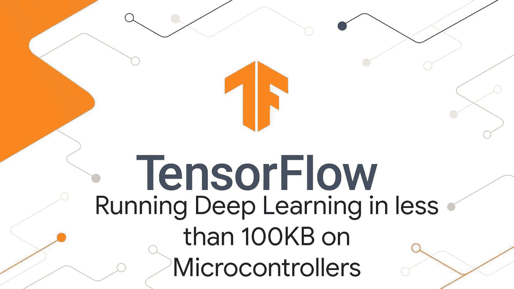

# Tensorflow Lite 模型推断快速和精益！！

> 原文：<https://medium.com/analytics-vidhya/tensorflow-lite-model-inferencing-fast-and-lean-c59a19d02daa?source=collection_archive---------6----------------------->

本文旨在更多地讨论 TFLite 如何以快速、简洁的方式在所有不同类型的边缘设备上实现推理。

我们有一套不同的边缘设备，如物联网设备、移动设备、嵌入式设备等。TFLite 如何无缝优雅地进行推理。为了理解这一点，让我们投入进去。