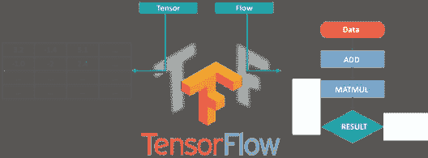
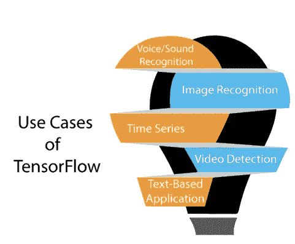
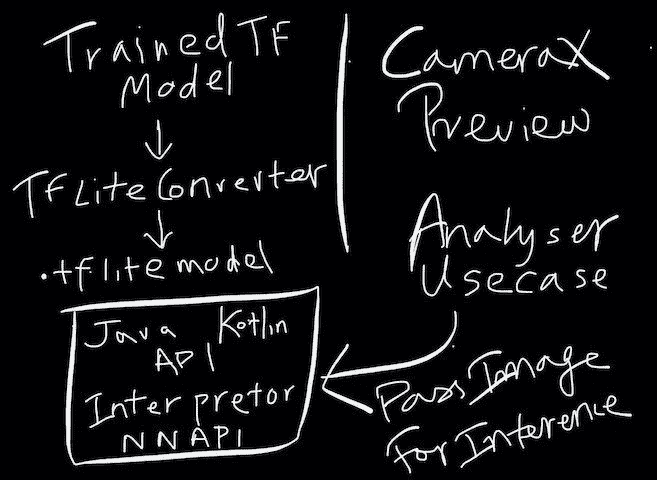

# TensorFlow Lite Android 示例[初学者]

> 原文：<https://medium.com/analytics-vidhya/tensorflow-lite-on-android-2f57267f7297?source=collection_archive---------0----------------------->


在 [Unsplash](https://unsplash.com?utm_source=medium&utm_medium=referral) 上由 [Franck V.](https://unsplash.com/@franckinjapan?utm_source=medium&utm_medium=referral) 拍摄的照片

[**TensorFlow**](https://www.tensorflow.org/lite/guide/android) 是谷歌的开源机器学习框架，用于跨一系列任务的数据流编程。图中的节点表示数学运算，而图边表示它们之间通信的多维数据数组。



张量流图

张量只是多维数组，是二维表向更高维数据的扩展。TensorFlow 有许多功能，这使它适合深度学习，它的核心开源库可以帮助您开发和训练 ML 模型。

# 张量流的用例



张量流用例

# 什么是图像分类？

图像分类的目的是将数字图像中的所有像素归入几个土地覆盖类别或主题之一。然后，这种分类数据可用于制作图像中的土地覆盖专题地图。


张量流图像分类

因此，不浪费任何时间，让我们进入张量流图像分类。

我们可以通过 5 个步骤**为 android 构建 TensorFlow Lite 模型**，

*   在 Colab 上安装 TensorFlow 2.0 alpha
*   数据集准备
*   构建迁移学习模型
*   编译和训练模型
*   将 Keras 模型转换为 TFLITE 格式

# 1.在 Colab 上安装 TensorFlow 2.0 alpha

[**谷歌合作实验室**](https://www.google.com/url?sa=t&rct=j&q=&esrc=s&source=web&cd=&cad=rja&uact=8&ved=2ahUKEwip7oqGs67qAhX4zDgGHZVpAG8QFjAAegQIAxAC&url=https%3A%2F%2Fcolab.research.google.com%2F&usg=AOvVaw3A5aPK2kLFzKOzb6sOckVw) 让在云中设置 Python 笔记本变得非常容易。由于每次可以免费访问 GPU 长达 12 小时，Colab 很快成为我进行机器学习实验的首选平台。

让我们通过 pip 在一台 Colab 笔记本上安装 TensorFlow 2.0 alpha 版本(GPU 版)。

```
!pip install tensorflow-gpu==2.0.0-alpha0
```

要验证其安装是否正确:

```
import tensorflow as tf 
print(tf.__version) 
# Output: 2.0.0-alpha0
```

# 2.数据集准备

我们可以使用 Keras ImageDataGenerator 类和 flow_from_directory() API 逐步加载图像。这执行起来会比较慢，但是可以在更多的机器上运行。

这个 API 喜欢将数据划分到单独的 train/和 test/目录中，并且在每个目录下为每个类创建一个子目录。

然后图像被组织在子目录下。

现在我们需要在 Google Drive 上上传训练和测试文件。将数据导入 Google Colab 环境还有其他方法(链接),但是，我们选择这种方法是因为它易于使用。现在让我们看看这是如何工作的。

一旦您上传了训练和测试文件，第一步是将您的驱动器文件夹挂载到 Colab 环境中:

```
from google.colab import drive
drive.mount('/content/drive')
train_dir = '/content/drive/My Drive/tensorflow/document/Train'
validation_dir = '/content/drive/My Drive/tensorflow/document/Test'
image_size = 128
batch_size = 32
train_datagen = tf.keras.preprocessing.image.ImageDataGenerator()
train_generator = train_datagen.flow_from_directory(directory=train_dir, target_size=(image_size, image_size), batch_size=batch_size)
validation_datagen = tf.keras.preprocessing.image.ImageDataGenerator()
validation_generator = validation_datagen.flow_from_directory(directory=validation_dir, target_size=(image_size, image_size), batch_size=batch_size)
```

# 3.构建迁移学习模型

让我们使用 TensorFlow 2.0 的高级 Keras API 来快速构建我们的图像分类模型。对于迁移学习，我们可以使用预训练的 MobileNetV2 模型作为特征检测器。

MobileNetV2 是 Google 发布的 MobileNet 的第二个迭代，目标是比 ResNet 和 Inception 等模型更小、更轻，以便在移动设备上运行。

让我们加载在 ImageNet 上预训练的没有顶层的 MobileNetV2 模型，冻结其权重，并添加新的分类头。

```
IMG_SHAPE = (image_size, image_size, 3)
base_model = tf.keras.applications.MobileNet(input_shape=IMG_SHAPE, include_top=False)
base_model.trainable = False
model = tf.keras.Sequential([
 base_model,
 tf.keras.layers.GlobalAveragePooling2D(),
 tf.keras.layers.Dense(3, activation='softmax')
])
model.summary()
```

# 4.编译和训练模型

一旦我们定义了神经网络架构，我们现在将编译它并训练模型，以检查它在验证集上的性能:

```
model.compile(optimizer=tf.keras.optimizers.Adam(),
 loss='categorical_crossentropy',
 metrics=['accuracy'])
epochs = 25
steps_per_epoch = numpy.asarray(train_generator.n / batch_size)
validation_steps = numpy.asarray(validation_generator.n / batch_size)
history = model.fit_generator(generator=train_generator,
 steps_per_epoch=steps_per_epoch,
 epochs=epochs,
 validation_data=validation_generator,
 validation_steps=validation_steps)
```

我鼓励你这样做:

*   不断增长的时代
*   使用更多层

这将帮助您在验证集上获得更好的分数。

# 5.将 Keras 模型转换为 TFLITE 格式

**什么是 TensorFlow Lite？**

TensorFlow Lite 是专为移动平台和嵌入式设备设计的轻量级版本。它为移动设备提供低延迟和小二进制大小的机器学习解决方案。

TensorFlow Lite 支持一组针对移动平台进行了调整的核心运营商。它还支持模型中的自定义操作。

TensorFlow Lite 基于 FlatBuffers 定义了一种新的文件格式，这是一个开源平台序列化库。它包括一个新的移动解释器，用于保持应用程序小而快。

**TensorFlow Lite 由两个主要组件组成:**

**TensorFlow Lite 解释器**，它在许多不同的硬件类型上运行特别优化的模型，包括手机、嵌入式 Linux 设备和微控制器。

**TensorFlow Lite 转换器**，它将 TensorFlow 模型转换为解释器使用的有效形式，并可以引入优化来提高二进制大小和性能。

磁盘上训练好的 TensorFlow 模型会转换成 TensorFlow Lite 文件格式(**)。tflite** )使用 TensorFlow Lite 转换器。然后，我们可以在移动应用程序中使用转换后的文件。

**将 Keras 模型导出为 TFLITE 格式**

```
saved_model_dir = '/content/drive/My Drive/tensorflow/sample 3/TFLite/assets'
tf.saved_model.save(model, saved_model_dir)
converter = tf.lite.TFLiteConverter.from_saved_model(saved_model_dir)
tflite_model = converter.convert()
with open('model17.tflite', 'wb') as f:
 f.write(tflite_model)
labels = '\n'.join(sorted(train_generator.class_indices.keys()))
with open('labels17.txt', 'w') as f:
 f.write(labels)
```

现在，我们已经训练了自己的 TensorFlow Lite 模型。

# 如何从 tensorflow lite 模型进行图像分类

流程真的很简单。我们将位图图像从 CameraX 中的分析用例传递给 TensorFlow 解释器，后者使用 MobileNet 模型和标签类对图像进行推理。下面是 CameraX 和 TensorFlow Lite 如何相互交互的图示。



图像分类

下面的将详细解释这个流程。

# android 中使用 tensorflow lite 模型进行图像分类的 7 个步骤

1.  设置 android 依赖项
2.  添加受过训练的。tflite 和 lables.txt 文件
3.  生成模型 ByteBuffer。
4.  阅读 label.txt
5.  通过缓冲器生成捕获的图像。
6.  带翻译运行。
7.  解析结果。

# 1.设置 android 依赖项

启动一个新的 Android Studio Kotlin 项目，并在应用程序的 **build.gradle** 文件中添加以下依赖项。

```
implementation ‘org.tensorflow:tensorflow-lite:+’
```

此外，您需要通过在 **build.gradle** 文件中设置以下选项来确保模型没有被压缩:

```
android{
aaptOptions {
noCompress “tflite”
noCompress “lite”
}
```

在您的 **AndroidManifest.xml** 文件中为摄像机添加必要的权限:

```
<uses-permission android:name=”android.permission.CAMERA” />
```

# 2 .添加经过培训的。tflite 和 lables.txt 文件

接下来，添加 MVP 文件、**标签和。您的**资产**目录下的 tflite 模型文件**。

# 3 .通过缓冲区生成模型

让我们为模型使用 **tf.lite.Interpreter** 接口。

你可以用很多方法设置一个解释器，TF 网站上推荐的一个是利用 MappedByteBuffer。

```
@Throws(IOException::class) 
private fun getModelByteBuffer(assetManager: AssetManager, modelPath: String): MappedByteBuffer { 
 val fileDescriptor = assetManager.openFd(modelPath) 
 val inputStream = FileInputStream(fileDescriptor.fileDescriptor) 
 val fileChannel = inputStream.channel 
 val startOffset = fileDescriptor.startOffset 
 val declaredLength = fileDescriptor.declaredLength 
 return fileChannel.map(FileChannel.MapMode.READ_ONLY, startOffset, declaredLength) 
}
```

# 4.阅读 label.txt

下一步是读取带有标签的文件。您可以通过以下方式轻松获得它们:

```
@Throws(IOException::class) 
private fun getLabels(assetManager: AssetManager, labelPath: String): List<String> { 
 val labels = ArrayList<String>() 
 val reader = BufferedReader(InputStreamReader(assetManager.open(labelPath))) 
 while (true) {
 val label = reader.readLine() ?: break
 labels.add(label)
 } 
 reader.close() 
 return labels 
}
```

# 5 .通过缓冲器生成捕获的图像

最后一件事是创建一个方法，该方法将一个图像作为参数，并返回一个标签列表，这些标签具有分配给它们的概率。

因为我们的模型期望精确的输入形状(128×128 像素),所以我们需要重新缩放交付的位图以适应这些约束。

```
fun recognize(bitmap: Bitmap): List<Recognition>{
 val scaledBitmap = Bitmap.createScaledBitmap(bitmap, MODEL_INPUT_SIZE, MODEL_INPUT_SIZE, false)
```

接下来，我们需要创建适当大小的 byteBuffer，它将作为参数传递给模型。

并将图像数据作为浮点数加载到 byteByffer 中。为了解码位图中每个像素的颜色(忽略 alpha ),我们需要屏蔽最低有效的 8 位及其倍数。

```
val pixelValues = IntArray(MODEL_INPUT_SIZE * MODEL_INPUT_SIZE) 
 bitmap.getPixels(pixelValues, 0, bitmap.width, 0, 0, bitmap.width, bitmap.height) 

 var pixel = 0
 for (i in 0 until MODEL_INPUT_SIZE) { 
 for (j in 0 until MODEL_INPUT_SIZE) { 
 val pixelValue = pixelValues[pixel++] 
 byteBuffer.putFloat((pixelValue shr 16 and 0xFF) / 255f) 
 byteBuffer.putFloat((pixelValue shr 8 and 0xFF) / 255f) 
 byteBuffer.putFloat((pixelValue and 0xFF) / 255f) 
 } 
 }
```

# 6.用解释器运行

最后，我们可以将 byteBuffer 传递给模型。解释器期望结果的第二个参数容器，它是浮点数组的数组(每个图像的数组，每个图像将包含概率的浮点数组)。

```
val results = Array(BATCH_SIZE) { FloatArray(labels.size) }
 model.run(byteBuffer, results)
 return parseResults(results)
}
```

# 7.解析结果

最后一步是将概率与适当的类绑定。

```
private fun parseResults(result: Array<FloatArray>): List<Recognition> { 
 val recognitions = mutableListOf<Recognition>() 
 labels.forEachIndexed { index, label -> 
 val probability = result[0][index] 
 recognitions.add(Recognition(label, probability)) 
 } 

 return recognitions.sortedByDescending { it.probability } 
}
```

其中识别是我们的结果数据类。

```
data class Recognition( 
 val name: String, 
 val probability: Float 
) { 
 override fun toString() = 
 "$name : ${probability}%"
}
```

就是这样。我们构建了 tensorflow lite 模型，并部署在 android 应用程序中。

Tensorflow lite android 示例演示

从 [**github**](https://github.com/velmurugan35/Android-Example/tree/master/tflite) 中检查示例。

**结论**

谢谢你的阅读。这是 tensorflow lite 的基本图像分类。您可以尝试不同的数据集和模型组合。

请在下面提供您的意见。