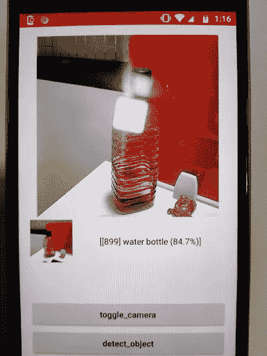

# Android 上的 TensorFlow Lite

> 原文：<https://medium.com/analytics-vidhya/tensorflow-lite-on-android-4ba47742a67f?source=collection_archive---------17----------------------->

# TensorFlow Lite？

TensorFlow Lite 是一套帮助开发人员在移动、嵌入式和物联网设备上运行 TensorFlow 模型的工具。它支持设备上的机器学习推理，具有低延迟和小二进制大小。

它目前通过 C++ API 在 Android 和 iOS 上得到支持，并为 Android 开发者提供了一个 Java 包装器。此外，在支持它的 Android 设备上，解释器也可以使用 Android 神经网络 API 进行硬件加速，否则它将默认由 CPU 执行。在本文中，我将重点介绍如何在 Android 应用程序中使用它。

**TensorFlow Lite 由两个主要组件组成:**

*   [TensorFlow Lite 解释器](https://www.tensorflow.org/lite/guide/inference)，它在许多不同的硬件类型上运行特别优化的模型，包括手机、嵌入式 Linux 设备和微控制器。
*   [TensorFlow Lite converter](https://www.tensorflow.org/lite/convert/index) ，它将 TensorFlow 模型转换成高效的形式供解释器使用，并可以引入优化来提高二进制大小和性能。

这些是关于缩写的细节

*   *延迟:*没有到服务器的往返
*   *隐私:*没有数据需要离开设备
*   *连接:*不需要互联网连接
*   *功耗:*网络连接非常耗电

下面我将分享如何在 Android 项目中实现和使用**tensor flow**s**library lite**。

**注意→在阅读下面的代码之前，你可以查看 github 链接**[**https://github . com/amitshekharitbhu/Android-TensorFlow-Lite-Example**](https://github.com/amitshekhariitbhu/Android-TensorFlow-Lite-Example)**关于 tensor flow 的 Lite 实现，我也关注了他的链接。这是 github 中一个最好的维护项目。**



**步骤一。添加依赖关系**

```
dependencies {
    implementation 'org.tensorflow:tensorflow-lite:0.0.0-nightly'
}
```

**第二步。**(可选)为了实现`x86`、`x86_64`和`arm32` ABIs，在你的 gradle 中添加下面的依赖项。

```
android {
    defaultConfig {
        ndk {
            abiFilters 'armeabi-v7a', 'arm64-v8a'
        }
    }
}
```

**步骤 3 - >** 为摄像机视图创建布局*activity _*tensor flow*。xml*

```
<?xml version="1.0" encoding="utf-8"?>
<FrameLayout xmlns:android="http://schemas.android.com/apk/res/android"
    xmlns:tools="http://schemas.android.com/tools"
    android:id="@+id/activity_main"
    android:layout_width="match_parent"
    android:layout_height="match_parent"
    android:paddingBottom="@dimen/activity_vertical_margin"
    android:paddingLeft="@dimen/activity_horizontal_margin"
    android:paddingRight="@dimen/activity_horizontal_margin"
    android:paddingTop="@dimen/activity_vertical_margin"
    tools:context="com.example.myapp.tancerflow.TenserFlowActivity">

    <com.wonderkiln.camerakit.CameraView
        android:id="@+id/cameraView"
        android:layout_width="300dp"
        android:layout_height="300dp"
        android:layout_gravity="center|top" />

    <LinearLayout
        android:layout_width="match_parent"
        android:layout_height="80dp"
        android:layout_gravity="center|top"
        android:layout_marginTop="300dp"
        android:gravity="center"
        android:orientation="horizontal">

        <ImageView
            android:id="@+id/imageViewResult"
            android:layout_width="75dp"
            android:layout_height="75dp"
            android:padding="2dp" />

        <TextView
            android:id="@+id/textViewResult"
            android:layout_width="match_parent"
            android:layout_height="80dp"
            android:fadeScrollbars="false"
            android:gravity="center"
            android:maxLines="15"
            android:scrollbars="vertical"
            android:textColor="@android:color/black" />

    </LinearLayout>

    <Button
        android:id="@+id/btnToggleCamera"
        android:layout_width="match_parent"
        android:layout_height="48dp"
        android:layout_gravity="bottom|center"
        android:layout_marginBottom="50dp"
        android:text="toggle_camera"
        android:textAllCaps="false"
        android:textColor="@android:color/black" />

    <Button
        android:id="@+id/btnDetectObject"
        android:layout_width="match_parent"
        android:layout_height="48dp"
        android:layout_gravity="bottom|center"
        android:text="detect_object"
        android:textAllCaps="false"
        android:textColor="@android:color/black"
        android:visibility="gone" />

</FrameLayout>
```

**注** →在你的项目中实现 gradle 的从属摄像机视图

```
implementation 'com.wonderkiln:camerakit:0.13.1'
```

**步骤 4 →** 在你的 assets 文件夹中添加*mobilenet _ quant _ v1 _ 224 . tflite 文件。*

要下载文件，请查看 github[https://github . com/amitshekharitbhu/Android-tensor flow-Lite-Example/tree/master/app/src/main/assets](https://github.com/amitshekhariitbhu/Android-TensorFlow-Lite-Example/tree/master/app/src/main/assets)

**第五步→** 创建一个 **TensorFlowActivity.class** 并在 modelPath 处给出 tflite 文件的正确路径。

下面全班应该是这样的

```
public class **TensorFlowActivity** extends AppCompatActivity {

    private static final String *MODEL_PATH* = "mobilenet_quant_v1_224.tflite";
    private static final boolean *QUANT* = true;
    private static final String *LABEL_PATH* = "labels.txt";
    private static final int *INPUT_SIZE* = 224;

    private Classifier classifier;

    private Executor executor = Executors.*newSingleThreadExecutor*();
    private TextView textViewResult;
    private Button btnDetectObject, btnToggleCamera;
    private ImageView imageViewResult;
    private CameraView cameraView;

    @Override
    protected void onCreate(Bundle savedInstanceState) {
        super.onCreate(savedInstanceState);
        setContentView(R.layout.*activity_tesnsorflow*);
        cameraView = findViewById(R.id.*cameraView*);
        imageViewResult = findViewById(R.id.*imageViewResult*);
        textViewResult = findViewById(R.id.*textViewResult*);
        textViewResult.setMovementMethod(new ScrollingMovementMethod());

        btnToggleCamera = findViewById(R.id.*btnToggleCamera*);
        btnDetectObject = findViewById(R.id.*btnDetectObject*);

        cameraView.addCameraKitListener(new CameraKitEventListener() {
            @Override
            public void onEvent(CameraKitEvent cameraKitEvent) {

            }

            @Override
            public void onError(CameraKitError cameraKitError) {

            }

            @Override
            public void onImage(CameraKitImage cameraKitImage) {

                Bitmap bitmap = cameraKitImage.getBitmap();

                bitmap = Bitmap.*createScaledBitmap*(bitmap, *INPUT_SIZE*, *INPUT_SIZE*, false);

                imageViewResult.setImageBitmap(bitmap);

                final List<Classifier.Recognition> results = classifier.recognizeImage(bitmap);

                textViewResult.setText(results.toString());

            }

            @Override
            public void onVideo(CameraKitVideo cameraKitVideo) {

            }
        });

        btnToggleCamera.setOnClickListener(new View.OnClickListener() {
            @Override
            public void onClick(View v) {
                cameraView.toggleFacing();
            }
        });

        btnDetectObject.setOnClickListener(new View.OnClickListener() {
            @Override
            public void onClick(View v) {
                cameraView.captureImage();
            }
        });

        initTensorFlowAndLoadModel();
    }

    @Override
    protected void onResume() {
        super.onResume();
        cameraView.start();
    }

    @Override
    protected void onPause() {
        cameraView.stop();
        super.onPause();
    }

    @Override
    protected void onDestroy() {
        super.onDestroy();
        executor.execute(new Runnable() {
            @Override
            public void run() {
                classifier.close();
            }
        });
    }

    private void initTensorFlowAndLoadModel() {
        executor.execute(new Runnable() {
            @Override
            public void run() {
                try {
                    classifier = TensorFlowImageClassifier.*create*(
                            getAssets(),
                            *MODEL_PATH*,
                            *LABEL_PATH*,
                            *INPUT_SIZE*,
                            *QUANT*);
                    makeButtonVisible();
                } catch (final Exception e) {
                    throw new RuntimeException("Error initializing TensorFlow!", e);
                }
            }
        });
    }

    private void makeButtonVisible() {
        runOnUiThread(new Runnable() {
            @Override
            public void run() {
                btnDetectObject.setVisibility(View.*VISIBLE*);
            }
        });
    }
}
```

**步骤 6 →** 创建一个类 TensorFlowImageClassifier.class 进行图像处理，获取图像的信息。

注意-要获得关于图像的信息，你只需要调用 Interpeter 的 run 方法，并传递图像数据和标签数组。

```
interpreter.run(byteBuffer, result);
```

下面是完整的代码。

```
public class TensorFlowImageClassifier implements Classifier {

    private static final int *MAX_RESULTS* = 3;
    private static final int *BATCH_SIZE* = 1;
    private static final int *PIXEL_SIZE* = 3;
    private static final float *THRESHOLD* = 0.1f;

    private static final int *IMAGE_MEAN* = 128;
    private static final float *IMAGE_STD* = 128.0f;

    private Interpreter interpreter;
    private int inputSize;
    private List<String> labelList;
    private boolean quant;

    private TensorFlowImageClassifier() {

    }

    static Classifier create(AssetManager assetManager,
                             String modelPath,
                             String labelPath,
                             int inputSize,
                             boolean quant) throws IOException {

        TensorFlowImageClassifier classifier = new TensorFlowImageClassifier();
        classifier.interpreter = new Interpreter(classifier.loadModelFile(assetManager, modelPath), new Interpreter.Options());
        classifier.labelList = classifier.loadLabelList(assetManager, labelPath);
        classifier.inputSize = inputSize;
        classifier.quant = quant;

        return classifier;
    }

    @Override
    public List<Recognition> recognizeImage(Bitmap bitmap) {
        ByteBuffer byteBuffer = convertBitmapToByteBuffer(bitmap);
        if (quant) {
            byte[][] result = new byte[1][labelList.size()];
            interpreter.run(byteBuffer, result);
            return getSortedResultByte(result);
        } else {
            float[][] result = new float[1][labelList.size()];
            interpreter.run(byteBuffer, result);
            return getSortedResultFloat(result);
        }

    }

    @Override
    public void close() {
        interpreter.close();
        interpreter = null;
    }

    private MappedByteBuffer loadModelFile(AssetManager assetManager, String modelPath) throws IOException {
        AssetFileDescriptor fileDescriptor = assetManager.openFd(modelPath);
        FileInputStream inputStream = new FileInputStream(fileDescriptor.getFileDescriptor());
        FileChannel fileChannel = inputStream.getChannel();
        long startOffset = fileDescriptor.getStartOffset();
        long declaredLength = fileDescriptor.getDeclaredLength();
        return fileChannel.map(FileChannel.MapMode.*READ_ONLY*, startOffset, declaredLength);
    }

    private List<String> loadLabelList(AssetManager assetManager, String labelPath) throws IOException {
        List<String> labelList = new ArrayList<>();
        BufferedReader reader = new BufferedReader(new InputStreamReader(assetManager.open(labelPath)));
        String line;
        while ((line = reader.readLine()) != null) {
            labelList.add(line);
        }
        reader.close();
        return labelList;
    }

    private ByteBuffer convertBitmapToByteBuffer(Bitmap bitmap) {
        ByteBuffer byteBuffer;

        if (quant) {
            byteBuffer = ByteBuffer.*allocateDirect*(*BATCH_SIZE* * inputSize * inputSize * *PIXEL_SIZE*);
        } else {
            byteBuffer = ByteBuffer.*allocateDirect*(4 * *BATCH_SIZE* * inputSize * inputSize * *PIXEL_SIZE*);
        }

        byteBuffer.order(ByteOrder.*nativeOrder*());
        int[] intValues = new int[inputSize * inputSize];
        bitmap.getPixels(intValues, 0, bitmap.getWidth(), 0, 0, bitmap.getWidth(), bitmap.getHeight());
        int pixel = 0;
        for (int i = 0; i < inputSize; ++i) {
            for (int j = 0; j < inputSize; ++j) {
                final int val = intValues[pixel++];
                if (quant) {
                    byteBuffer.put((byte) ((val >> 16) & 0xFF));
                    byteBuffer.put((byte) ((val >> 8) & 0xFF));
                    byteBuffer.put((byte) (val & 0xFF));
                } else {
                    byteBuffer.putFloat((((val >> 16) & 0xFF) - *IMAGE_MEAN*) / *IMAGE_STD*);
                    byteBuffer.putFloat((((val >> 8) & 0xFF) - *IMAGE_MEAN*) / *IMAGE_STD*);
                    byteBuffer.putFloat((((val) & 0xFF) - *IMAGE_MEAN*) / *IMAGE_STD*);
                }

            }
        }
        return byteBuffer;
    }

    @SuppressLint("DefaultLocale")
    private List<Recognition> getSortedResultByte(byte[][] labelProbArray) {

        PriorityQueue<Recognition> pq =
                new PriorityQueue<>(
                        *MAX_RESULTS*,
                        new Comparator<Recognition>() {
                            @Override
                            public int compare(Recognition lhs, Recognition rhs) {
                                return Float.*compare*(rhs.getConfidence(), lhs.getConfidence());
                            }
                        });

        for (int i = 0; i < labelList.size(); ++i) {
            float confidence = (labelProbArray[0][i] & 0xff) / 255.0f;
            if (confidence > *THRESHOLD*) {
                pq.add(new Recognition("" + i,
                        labelList.size() > i ? labelList.get(i) : "unknown",
                        confidence, quant));
            }
        }

        final ArrayList<Recognition> recognitions = new ArrayList<>();
        int recognitionsSize = Math.*min*(pq.size(), *MAX_RESULTS*);
        for (int i = 0; i < recognitionsSize; ++i) {
            recognitions.add(pq.poll());
        }

        return recognitions;
    }

    @SuppressLint("DefaultLocale")
    private List<Recognition> getSortedResultFloat(float[][] labelProbArray) {

        PriorityQueue<Recognition> pq =
                new PriorityQueue<>(
                        *MAX_RESULTS*,
                        new Comparator<Recognition>() {
                            @Override
                            public int compare(Recognition lhs, Recognition rhs) {
                                return Float.*compare*(rhs.getConfidence(), lhs.getConfidence());
                            }
                        });

        for (int i = 0; i < labelList.size(); ++i) {
            float confidence = labelProbArray[0][i];
            if (confidence > *THRESHOLD*) {
                pq.add(new Recognition("" + i,
                        labelList.size() > i ? labelList.get(i) : "unknown",
                        confidence, quant));
            }
        }

        final ArrayList<Recognition> recognitions = new ArrayList<>();
        int recognitionsSize = Math.*min*(pq.size(), *MAX_RESULTS*);
        for (int i = 0; i < recognitionsSize; ++i) {
            recognitions.add(pq.poll());
        }

        return recognitions;
    }

}
```

步骤 7 →创建接口 Classifier.class 以获取活动中图像的信息。

```
public interface Classifier {

    class Recognition {
        */**
         * A unique identifier for what has been recognized. Specific to the class, not the instance of
         * the object.
         */* private final String id;

        */**
         * Display name for the recognition.
         */* private final String title;

        */**
         * Whether or not the model features quantized or float weights.
         */* private final boolean quant;

        */**
         * A sortable score for how good the recognition is relative to others. Higher should be better.
         */* private final Float confidence;

        public Recognition(
                final String id, final String title, final Float confidence, final boolean quant) {
            this.id = id;
            this.title = title;
            this.confidence = confidence;
            this.quant = quant;
        }

        public String getId() {
            return id;
        }

        public String getTitle() {
            return title;
        }

        public Float getConfidence() {
            return confidence;
        }

        @Override
        public String toString() {
            String resultString = "";
            if (id != null) {
                resultString += "[" + id + "] ";
            }

            if (title != null) {
                resultString += title + " ";
            }

            if (confidence != null) {
                resultString += String.*format*("(%.1f%%) ", confidence * 100.0f);
            }

            return resultString.trim();
        }
    }

    List<Recognition> recognizeImage(Bitmap bitmap);

    void close();
}
```

结论

所以这些就是在你的 android 项目中实现 TensorFlow 的 lite 的步骤。