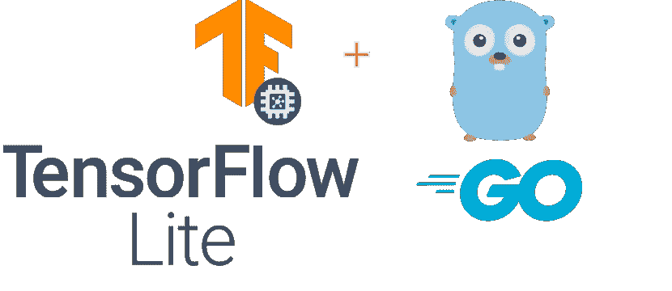

# 带 Golang 的 Tensorflow Lite(TFLite)

> 原文：<https://medium.com/analytics-vidhya/tensorflow-lite-tflite-with-golang-37a326c089ff?source=collection_archive---------4----------------------->



[Tensorflow Lite](https://www.tensorflow.org/lite) 俗称 TFLite，用于在移动和物联网(边缘)设备上生成和推断机器学习模型。TFLite 使得多种设备架构的设备上(离线)推断更加容易，比如 Android、iOS、Raspberry pi 甚至后端服务器。使用 TFLite，您可以使用任何编程语言和轻量级模型来构建基于轻量级服务器的推理应用程序，而不是使用笨重的 Tensorflow 模型。

作为开发人员，我们可以简单地使用现有的优化研究[模型](https://www.tensorflow.org/lite/models)或将现有的 Tensorflow 模型转换为 TFLite。在您的移动、物联网或服务器应用中，有多种方式使用 TFLite。

*   使用 TFLite 提供的[标准库、SDK](https://www.tensorflow.org/lite/guide/get_started#3_run_inference_with_the_model)实现不同架构(Android、iOS 等)的推理。
*   使用 [TFLite C API](https://github.com/tensorflow/tensorflow/blob/master/tensorflow/lite/c/README.md) 进行推理，同时使用独立于平台的编程语言，如 [Golang](https://golang.org/) 。并且**为 Android、iOS 等平台交叉编译**...

在这篇文章中，我将展示使用平台无关语言 Golang 和交叉编译共享库的 TFLite 推理应用程序的实现。然后可以被 Android、iOS 等使用…

首先感谢 [mattn](https://github.com/mattn) 创建了 TFLite Go 绑定，你可以在这里找到 repo [。我们将开始实现一个简单的 Golang 应用程序，用于 TFLite 推断(您可以在这里找到示例](https://github.com/mattn/go-tflite))。在这里，我使用一个简单的文本分类器，它将分类为“积极”或“消极”。

这是 classifier.go，它有 go 函数，并被**导出**供 C 代码使用。

**Build() :** 函数将初始化 go 运行时环境中的所有对象引用，并返回内存指针以备将来使用。

**Classify(appPointer 不安全。Pointer，word *C.char) :** 函数会接受 Build()函数返回的 appPointer 和 word a C 字符串的输入。

**//export :** 用于导出要在 C 代码中使用的 Go 函数。

更多关于 cgo 的信息你可以在这里找到。

现在我们已经在 classifier.go 中实现了文本分类的 Golang。下一个大挑战是将上述文本分类器的**交叉编译**到一个共享库。在 Golang 中，您可以构建针对特定操作系统和架构的应用程序。我们示例中使用的重要 Go 命令。

```
GOARCH      - target architecture
GOOS        - target operating system
buildmode   - which kind of object file is to be built. More info [here](https://golang.org/cmd/go/#hdr-Build_modes)
CGO_ENABLED - Whether the cgo command is supported. In this case it's 1
```

你可以在这里找到支持的 GOOS 和 GOARCH 信息[或者你可以通过运行下面的命令得到它。](https://gist.github.com/asukakenji/f15ba7e588ac42795f421b48b8aede63)

```
go tool dist list | column -c 75 | column -tOutput :aix/ppc64        freebsd/amd64   linux/mipsle   openbsd/386
android/386      freebsd/arm     linux/ppc64    openbsd/amd64
android/amd64    illumos/amd64   linux/ppc64le  openbsd/arm
android/arm      js/wasm         linux/s390x    openbsd/arm64
android/arm64    linux/386       nacl/386       plan9/386
darwin/386       linux/amd64     nacl/amd64p32  plan9/amd64
darwin/amd64     linux/arm       nacl/arm       plan9/arm
darwin/arm       linux/arm64     netbsd/386     solaris/amd64
darwin/arm64     linux/mips      netbsd/amd64   windows/386
dragonfly/amd64  linux/mips64    netbsd/arm     windows/amd64
freebsd/386      linux/mips64le  netbsd/arm64   windows/arm
```

下面是我为生成 Linux、Macos、Android 和 iOS 的共享库而创建的 Makefile。

最后，您可以使用上面生成的共享库(。所以还是。a)在 Android 和 iOS 中。在 Android 中，你可以通过 JNI(Java Native Interface)使用共享库，在 iOS 中，你可以将它用作框架模块。对于 flutter，你也可以使用 dart:ffi(外部函数接口)。

可以找到文本分类器[的实现 https://github . com/dula dissa/go-TF lite/blob/cross _ compilation _ support/_ example/cross _ complie](https://github.com/duladissa/go-tflite/blob/cross_compilation_support/_example/cross_complie)